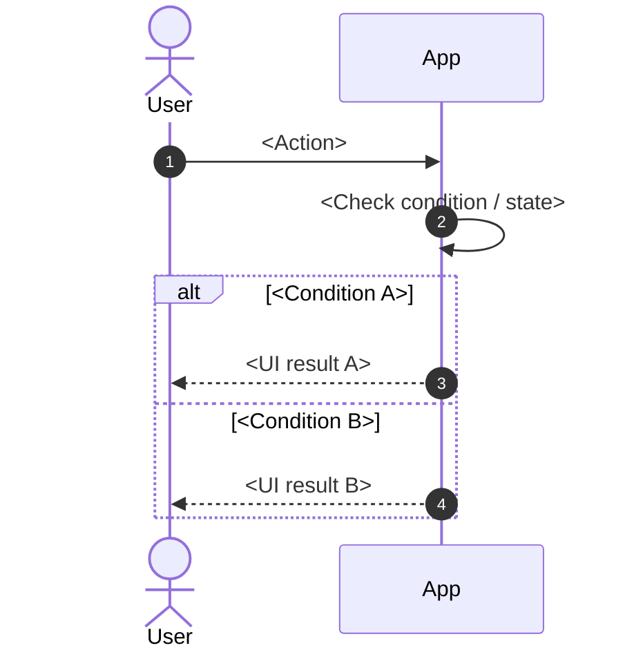

# <Feature Name> — Functional Requirements

> Project: FPTPlay
> Epic: <Large-Feature>
> Feature: <Sub-Feature>
> Audience: Product, BA, FE, BE, QA
> Status: Final implementation handoff
> Source: Rewritten from lightweight docs / accepted assumptions
> Writing style: Caveman Vietnam — ít chữ, dễ đọc, đúng ý, không low-level
> Last updated: YYYY-MM-DD

---

## 1. Description

<Feature làm gì, cho ai, giải quyết intent gì. Viết ngắn, rõ, giống Live Activity style.>

- Epic: <Large-Feature>
- Feature: <Sub-Feature>
- Main user: <Actor>
- Main platform: <iOS / Android / Web / TV>
- Main surfaces: <Screens / surfaces>
- Main intent: <Intent>

---

## 2. Document History

| Version | Date | Updated By | Notes | Approved By |
|---|---|---|---|---|
| v1.0 | YYYY-MM-DD | Dylan | Created final functional requirements from accepted lightweight docs. | Pending |

---

## 3. Overview

### 3.1 Goal

<User muốn gì. App/System giúp gì.>

### 3.2 Platform scope

| Platform | Scope | Notes |
|---|---|---|
| iOS | In / Out | <Notes> |
| Android | In / Out | <Notes> |
| Web | In / Out | <Notes> |
| SmartTV / Box | In / Out | <Notes> |

### 3.3 Platform behavior

- <Rule hành vi theo platform/surface>
- <Không ép OS/client hoạt động giống nhau nếu có constraint>

### 3.4 User scope

| User type | Scope | Notes |
|---|---|---|
| Logged-in User | In scope | Main actor. |
| <Actor> | Out of scope | <Note> |

### 3.5 In scope

- <Scope item>

### 3.6 Out of scope

- <Out-of-scope item>

---

## 4. Entry Points

| # | Entry Point | User action / System trigger | Surface | Expected result |
|---:|---|---|---|---|
| 1 | <Entry point> | <Action/trigger> | <Surface> | <Expected result> |

---

## 5. Use Case Summary

Do not force a fixed UC count. Derive UCs from real user goals, meaningful branches, and error/recovery cases.

| Use Case ID | Use Case | Primary Actor | Trigger | Outcome |
|---|---|---|---|---|
| <CODE>-UC-001 | <Use case name> | <Actor> | <Trigger> | <Outcome> |
| <CODE>-UC-002 | <Use case name> | <Actor> | <Trigger> | <Outcome> |

Note:
- User Flows may be 1:1 with UCs or merged when multiple UCs are part of one coherent journey.
- If flows are merged, the flow table must list all **Covered UCs**.

---

## 6. Business Rules

### Global Business Rules

#### <Rule group name>

1. <Rule viết ngắn, rõ, giống Live Activity style>.
2. <Rule tiếp theo>.
3. <Rule tiếp theo>.

#### Platform-specific rules — if needed

1. iOS: <Rule / note>.
2. Android: <Rule / note>.
3. Web: <Rule / note>.

Notes:
- Hạn chế dùng table trong Business Rules. Ưu tiên numbered list + subheading giống Live Activity.
- Chỉ dùng table nếu rule thật sự cần so sánh matrix nhiều cột.
- Fold integration/state/measurement/test expectations vào đây khi cần, không tạo section riêng.
- Actor/diagram style theo Live Activity: ưu tiên `Logged-in User` + `App`; chỉ thêm Server/API/CMS khi thật sự cần hiểu flow.

---

## 7. Functional Requirements

### <CODE>-US-001 — <User story / capability name>

- <User need 1>
- <User need 2>
- <User need 3>

**Description:**
<Mô tả ngắn capability.>

#### <CODE>-UC-001 — <Flow name>

**Activity Flows:**



| Field | Details |
|---|---|
| Covered UCs | <CODE>-UC-001, <CODE>-UC-002 |
| Description | <Flow mô tả gì> |
| Actor | Logged-in User, App |
| Triggers | <User action hoặc system trigger> |
| Pre-condition | <Điều kiện trước khi flow chạy> |
| Basic Path | 1. <Step 1>.<br>2. <Step 2>.<br>3. <Step 3>. |
| Post-condition | <Kết quả sau flow> |
| Alternative Path | 1. <Nhánh khác>.<br>2. <Nhánh khác>. |
| Exception Handling | 1. <Lỗi/fallback>.<br>2. <Lỗi/fallback>. |
| Business Rules Applied | 1. <Rule áp dụng>.<br>2. <Rule áp dụng>. |

---

## 8. Screen Element Specification

### 8.1 Figma / Design Reference

| Item | Link / Note |
|---|---|
| Final Figma | TBD |
| Wireframe reference | `features/lightweight/.../design/wireframe-suggestion-<feature>.md` |
| Mockup reference | Optional; create only when user explicitly asks. |

### 8.2 Information Architecture

```text
<Screen / Surface group>
└── <Surface 1>
    ├── <Element>
    └── <Element>
└── <Surface 2>
    ├── <Element>
    └── <Element>
```

### 8.4 Surface Details by Surface

Use this as the single place for all surface-level UI details. Do not split surface inventory, status matrix, or placement rules into separate 8.3 / 8.5 / 8.6 sections.

Create one block per meaningful surface/location. Each surface block should include:

1. **Surface details** — location, platform, when shown, related UC/Flow, placement notes.
2. **Sketching wireframe / Text-Based Wireframing** — layout by text.
3. **Surface elements table** — element states, format/copy, rules.
4. **Surface behavior notes** — only when the surface changes by status/state; keep it as bullets or short notes inside the same surface block.

Do not create separate standalone sections for Surface Inventory, State Model, API / Integration Contract, Analytics / Observability, or QA Acceptance Matrix in the final functional requirements file. Put reusable state/API/measurement/test expectations into Business Rules, Activity Flow tables, Surface details, Error Handling, and Handoff Checklist.

Do not force all surfaces into one generic table when the feature has many statuses, placements, or platforms.

#### SURF-001 — <Surface name>

**Surface details:**

| Field | Details |
|---|---|
| Surface / Location | <Surface name / app location> |
| Platform | iOS / Android / Web / TV |
| When shown | <Condition> |
| Related UC / Flow | <UC / Flow> |
| Placement notes | <Where it appears; repeat rules if any> |

**Sketching wireframe / Text-Based Wireframing:**

```text
<Surface name>
┌────────────────────────────────────┐
│ <Header / Status / Context>        │
├────────────────────────────────────┤
│ <Primary content area>             │
│ - <Main value / message>           │
│ - <Supporting metadata>            │
├────────────────────────────────────┤
│ [Primary button] [Secondary]       │
└────────────────────────────────────┘
```

**Surface elements:**

| # | Element | States | Format / Copy | Rules / Notes |
|---:|---|---|---|---|
| 1 | <Element> | default, loading, error | <Format/copy> | <Rule> |
| 2 | <Element> | visible, hidden, disabled | <Format/copy> | <Rule> |

**Surface behavior notes:**

- Default: <copy/visual/actions>.
- Loading: <copy/visual/actions>.
- Empty/error/unavailable: <copy/visual/actions/recovery>.

**Surface-specific notes:**

- <Note>

#### SURF-002 — <Surface name>

**Surface details:**

| Field | Details |
|---|---|
| Surface / Location | <Surface name / app location> |
| Platform | iOS / Android / Web / TV |
| When shown | <Condition> |
| Related UC / Flow | <UC / Flow> |
| Placement notes | <Where it appears; repeat rules if any> |

**Sketching wireframe / Text-Based Wireframing:**

```text
<Surface name>
┌────────────────────────────────────┐
│ <Compact / alternate layout>       │
│ <Element A>   <Element B>          │
└────────────────────────────────────┘
```

**Surface elements:**

| # | Element | States | Format / Copy | Rules / Notes |
|---:|---|---|---|---|
| 1 | <Element> | default, selected, unavailable | <Format/copy> | <Rule> |

**Surface behavior notes:**

- Default: <copy/visual/actions>.
- Unavailable: <copy/visual/actions/recovery>.

**Surface-specific notes:**

- <Note>

---

## 9. Error Handling & User-Facing Messages

| Case | User-facing message | Behavior |
|---|---|---|
| <Case> | <Message> | <Behavior> |

## 10. References

| Item | Path / Link |
|---|---|
| Lightweight SRS | `features/lightweight/...` |
| API draft | `features/lightweight/...` |
| Wireframe | `features/lightweight/...` |

---

## 11. Handoff Checklist

- [ ] Use Case Summary derives from actual goals/branches, not fixed count.
- [ ] Activity Flows cover all UCs, either dedicated or merged with Covered UCs listed.
- [ ] Each flow has diagram + Field/Details table.
- [ ] Each meaningful surface has text-based wireframe + surface elements table.
- [ ] Surface behavior is covered inside each surface block when relevant.
- [ ] Integration/API expectations are covered as business rules or flow preconditions, not as a standalone section.
- [ ] Main and edge cases are covered by use cases, flows, rules, and error messages.
- [ ] No critical open questions remain, or accepted assumptions are explicit.
