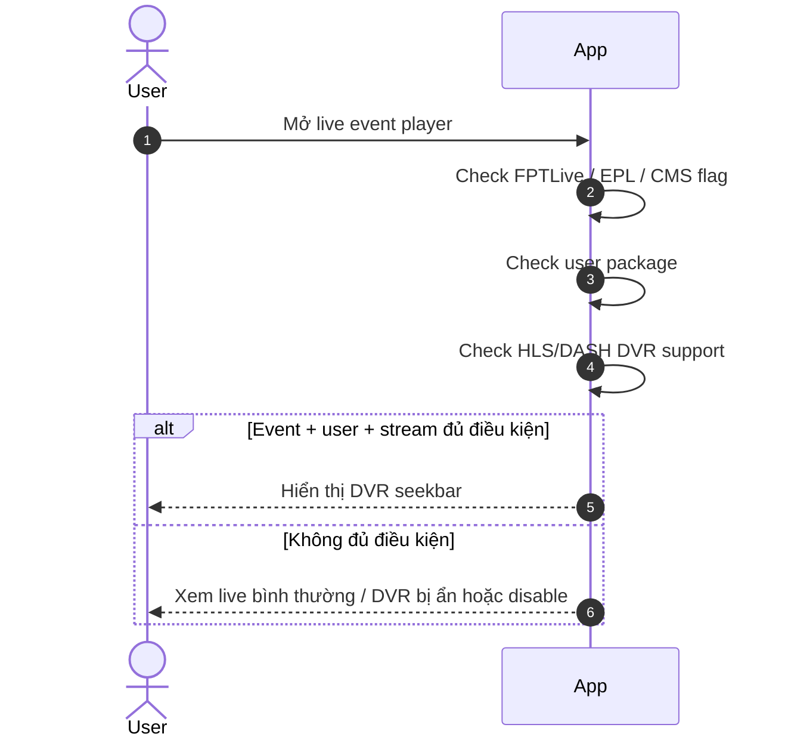
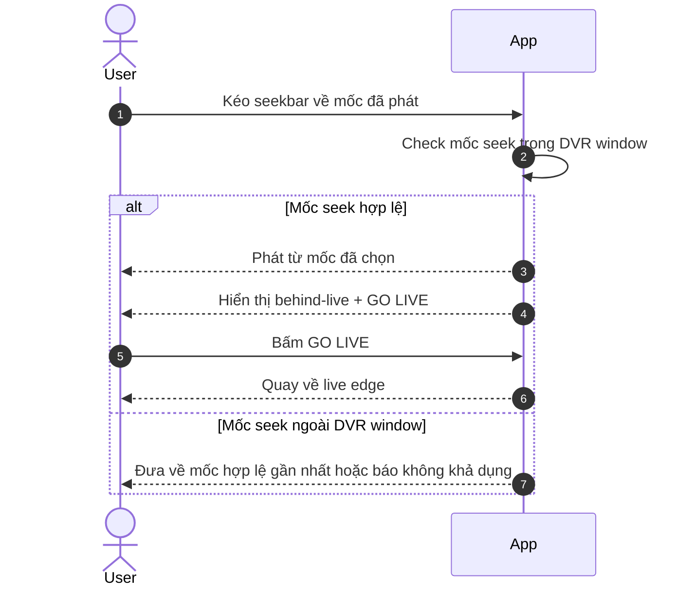
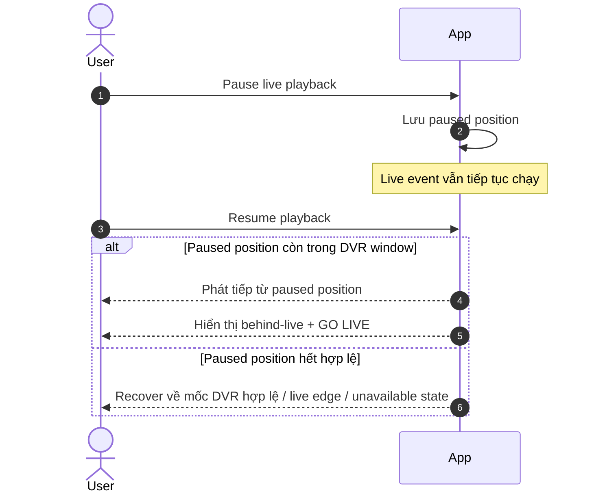
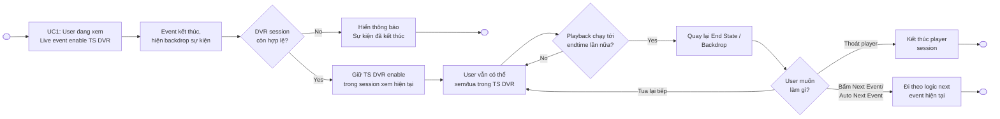
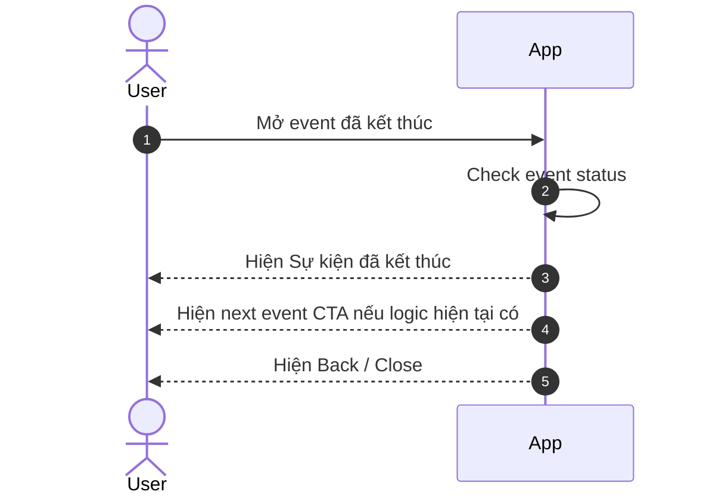

# Timeshift Seek — Functional Requirements

> Project: FPTPlay
> Epic: Event
> Feature: Timeshift Seek
> Audience: Product, BA, FE, BE, QA
> Status: Final implementation handoff
> Writing style: Caveman Vietnam — ít chữ, dễ đọc, đúng ý, không low-level
> Last updated: 2026-06-23

---

## 1. Description

Timeshift Seek giúp user đang xem **sự kiện live FPTLive** tua lại nội dung đã phát trong DVR window tối đa **8 tiếng**. User có thể xem lại đoạn đã qua, pause/resume, hoặc bấm **GO LIVE** để quay về live edge.

Feature này **không áp dụng cho EPL**. User cần có gói hợp lệ. Event cần được bật cờ DVR qua CMS.

Khi event kết thúc, App không tự nhảy sang next event và không thay đổi logic next event hiện có. DVR sau event end chỉ giữ trong active player session nếu user đã ở trong player trước khi event end và DVR còn hợp lệ. Nếu user từ ngoài mở event đã kết thúc, App chỉ hiện **Sự kiện đã kết thúc** rồi end flow.

---

## 2. Document History

| Version | Date | Updated By | Notes | Approved By |
|---|---|---|---|---|
| v1.0 | 2026-06-16 | Dylan | Initial split docs: full-event DVR and legacy post-event behavior. | Pending |
| v2.0 | 2026-06-22 | Dylan | Rewrite theo requirement mới: DVR 8 giờ, chỉ FPTLive, loại EPL, có entitlement gate, CMS flag, không thumbnail, DVR sau event end theo active session và không auto next. | Pending |
| v2.1 | 2026-06-23 | Dylan | Làm rõ DVR window bằng mô tả nghiệp vụ thay vì công thức; rà QA handoff. | Pending |

---

## 3. Overview

### 3.1 Goal

User đang xem live event có thể tua lại nội dung đã phát, tạm dừng/xem tiếp, rồi quay về live edge khi muốn.

### 3.2 Platform scope

| Platform | Scope | Notes |
|---|---|---|
| iOS | In | App hỗ trợ DVR seek cho HLS/DASH nếu platform/player cho phép. |
| Android | In | App hỗ trợ DVR seek cho HLS/DASH nếu platform/player cho phép. |
| Web | In | Web hỗ trợ DVR seek cho HLS/DASH nếu có; không có thumbnail preview. |
| SmartTV / Box | In | TV/Box giữ seek đơn giản, dùng được bằng remote/D-pad; không có thumbnail preview. |

### 3.3 Event scope

| Event type/source | Scope | Rule |
|---|---|---|
| FPTLive event | In scope | DVR bật theo CMS flag nếu stream hỗ trợ DVR và user có entitlement. |
| EPL event | Out of scope | Không bật DVR/start-over, kể cả khi config chung có DVR. |
| Non-FPTLive event | Out of scope by default | Chỉ bật nếu sau này có requirement rõ. |
| User đang trong player khi event end | In scope | Có thể giữ DVR replay trong active player session nếu DVR còn hợp lệ; không auto next. |

### 3.4 User scope

| User type | Scope | Notes |
|---|---|---|
| User có package hợp lệ | In scope | Hệ thống có thể bật DVR khi tất cả gate pass. |
| User không có package hợp lệ | Limited | Hệ thống không expose DVR playback; App ẩn/disable DVR seek. |
| Anonymous / guest | Limited | Không có DVR access trừ khi entitlement rule cho phép rõ. |
| Admin/CMS operator | Supporting actor | Bật/tắt DVR flag theo từng event trong CMS. |

### 3.5 In scope

- Start over / DVR seek cho FPTLive event đủ điều kiện.
- DVR window tối đa 8 giờ.
- Hỗ trợ HLS và DASH DVR stream khi có.
- CMS flag để bật/tắt DVR theo từng event.
- Check entitlement trước khi trả DVR link.
- Không có seek thumbnail preview.
- Session-bound DVR replay sau event end cho user đang ở trong active player session.

### 3.6 Out of scope

- EPL DVR/start-over.
- Auto-jumping sang next event.
- Seek thumbnail sprite/VTT.
- Offline download.
- Chi tiết CMS UI ngoài flag/field cần thiết.

---

## 4. Entry Points

| # | Entry Point | User action / System trigger | Surface | Expected result |
|---:|---|---|---|---|
| 1 | Event detail → Watch | User mở live FPTLive event | Player | Player load live stream; DVR seek active nếu tất cả gate pass. |
| 2 | Player seekbar | User drags/clicks/D-pad seeks backward | Player controls | Playback starts from selected DVR position. |
| 3 | Pause / Resume | User pause live playback rồi resume | Player controls | Playback resume từ paused position nếu còn trong DVR window; user thành behind live. |
| 4 | GO LIVE | User taps GO LIVE while behind live | Player controls | Player jumps to live edge. |
| 5 | Event end khi user còn trong player | Stream/status báo event ended | Player | Hiện ended/backdrop theo logic hiện tại; giữ DVR session nếu còn hợp lệ. |
| 6 | User mở event đã kết thúc từ ngoài | User mở event sau khi event đã End | Event/player entry | Hiện **Sự kiện đã kết thúc** rồi end flow; không mở DVR session mới; không auto next. |
| 7 | CMS flag changed | Admin bật/tắt DVR trên event | CMS/API | Playback response sau đó phản ánh DVR availability mới. |

---

## 5. Use Case Summary

Use case lấy từ goal/branch thật. Không ép số lượng cố định.

| Use Case ID | Use Case | Primary Actor | Trigger | Outcome |
|---|---|---|---|---|
| TS-UC-001 | Mở FPTLive event có DVR | Logged-in User | User mở live event | Player hiển thị DVR seek nếu event/user/stream đủ điều kiện. |
| TS-UC-002 | Tua lại trong DVR window | Logged-in User | User chọn mốc trước đó trên seekbar | Player phát từ mốc đã chọn trong giới hạn 8 giờ. |
| TS-UC-003 | Pause / Resume live event | Logged-in User | User pause rồi resume | Player phát tiếp từ vị trí đã pause nếu còn hợp lệ; user chuyển sang behind live. |
| TS-UC-004 | Quay về live edge | Logged-in User | User bấm GO LIVE | Player nhảy về live edge. |
| TS-UC-005 | DVR không khả dụng | Logged-in User, App | Event/user/stream không đủ điều kiện | App ẩn hoặc disable DVR seek. |
| TS-UC-006 | Event end khi user còn trong player | Logged-in User, App | Event kết thúc trong lúc user đang xem | DVR replay có thể tiếp tục trong active session nếu còn hợp lệ; next event chỉ là CTA theo logic hiện tại. |
| TS-UC-007 | User mở event đã kết thúc từ ngoài | Logged-in User | User mở ended event | App hiện **Sự kiện đã kết thúc** rồi end flow; không mở DVR session mới; không auto next. |
| TS-UC-008 | CMS bật/tắt DVR flag | Admin/CMS User | DVR flag thay đổi | DVR availability đổi theo cấu hình mới. |

User flow có thể merge nhiều UC nếu cùng một hành trình. Nếu merge, flow table phải list rõ Covered UCs.

---

## 6. Business Rules

### 6.1 Điều kiện bật DVR

1. DVR chỉ bật cho **FPTLive event** đủ điều kiện.
2. EPL event không bật DVR / start-over.
3. Event phải được bật DVR bằng CMS flag.
4. User phải có package/entitlement hợp lệ.
5. Stream phải hỗ trợ DVR playback trên protocol được dùng.
6. Nếu thiếu bất kỳ điều kiện nào, App chạy live playback bình thường và không hiện thanh tua DVR.
7. App chỉ hiển thị thanh tua DVR khi hệ thống xác nhận event này được phép tua lại.

### 6.2 Cách tua DVR

1. User chỉ tua lại được trong phần nội dung đã phát, tối đa **8 giờ gần nhất**.
2. Nếu event mới live chưa đủ 8 giờ, user có thể tua về từ đầu event.
3. User không được seek trước phần DVR cho phép hoặc sau live edge.
4. Seek không có thumbnail. Tooltip chỉ cần hiển thị timestamp nếu cần.
5. Khi user đang ở live edge, GO LIVE ẩn.
6. Khi user đang xem chậm hơn live, App hiện GO LIVE.
7. Nếu user pause live playback, App resume từ paused position nếu vị trí đó còn trong DVR window.
8. Nếu paused position đã hết hạn, App recover về mốc DVR hợp lệ gần nhất, live edge, hoặc unavailable state tùy player capability.

### 6.3 Khi event kết thúc

1. Khi event vừa end, App có thể giữ backdrop / next-event prompt hiện tại.
2. Nếu user đang watch/seek/pause trong player lúc event end, App không tự chuyển sang next event.
3. Next event nếu có thì chỉ là CTA thủ công; Timeshift không can thiệp rule chọn next event.
4. DVR replay sau event end chỉ giữ trong active player session nếu user đã ở trong player trước khi event end.
5. DVR replay sau event end vẫn phải đủ điều kiện: entitlement, CMS flag, stream availability, và DVR window.
6. Nếu user từ ngoài mở event đã kết thúc, App chỉ hiện **Sự kiện đã kết thúc** rồi end flow; không mở DVR session mới.
7. Nếu DVR expired hoặc không khả dụng trong active session, App ẩn DVR controls và giữ safe ended/unavailable state.
8. Khi playback trong TS DVR chạy tới endtime lần nữa, App quay lại End State/Backdrop; không tự replay loop.
9. Next Event/Auto Next Event đi theo logic hiện tại; Timeshift không can thiệp rule chọn next event.

---

## 7. Functional Requirements

### TS-US-001 — User mở live FPTLive event có DVR

- User mở một sự kiện FPTLive đang live.
- User muốn xem live bình thường, nhưng có thể tua lại nếu đủ điều kiện.
- App chỉ bật DVR seek khi event/user/stream hợp lệ.

**Description:**
User mở player. App check event, gói user, CMS flag và stream support. Nếu đủ điều kiện, App hiển thị DVR seek. Nếu không đủ, user vẫn xem live theo khả năng hiện tại.

#### TS-UC-001 — Mở event → Check DVR availability

**Activity Flows:**



| Field | Details |
|---|---|
| Covered UCs | TS-UC-001, TS-UC-005, TS-UC-008 |
| Description | Player mở event. App quyết định DVR có khả dụng không. |
| Actor | Logged-in User, App |
| Triggers | User mở live event player. |
| Pre-condition | Event tồn tại. User có quyền mở player. |
| Basic Path | 1. User mở event player.<br>2. App check event có phải FPTLive và không phải EPL.<br>3. App check CMS flag, package của user và stream DVR support.<br>4. Đủ điều kiện → App hiển thị DVR seekbar.<br>5. Không đủ điều kiện → App ẩn/disable DVR seek, user vẫn xem live nếu stream live khả dụng. |
| Post-condition | Player mở thành công. DVR enabled hoặc disabled theo điều kiện thực tế. |
| Alternative Path | CMS flag OFF / event là EPL / user không có gói / stream không hỗ trợ DVR → không hiển thị DVR seek. |
| Exception Handling | Check DVR lỗi → App fallback live-only nếu live stream còn xem được; nếu không thì hiện lỗi playback phù hợp. |
| Business Rules Applied | 1. DVR chỉ bật khi CMS flag ON.<br>2. Chỉ áp dụng cho FPTLive đủ điều kiện, không áp dụng EPL.<br>3. User phải có gói hợp lệ.<br>4. Stream phải hỗ trợ DVR HLS/DASH.<br>5. App chỉ hiển thị DVR seek khi hệ thống xác nhận DVR khả dụng. |

### TS-US-002 — User tua lại trong DVR window

- User đang xem live event có DVR.
- User muốn tua lại đoạn đã phát.
- User có thể quay về live edge bằng **GO LIVE**.

**Description:**
User kéo seekbar về mốc trước đó. App chỉ cho tua trong DVR window tối đa 8 giờ. Khi user đang behind live, App hiển thị trạng thái phù hợp và nút **GO LIVE**.

#### TS-UC-002 — Seek behind live / GO LIVE

**Activity Flows:**



| Field | Details |
|---|---|
| Covered UCs | TS-UC-002, TS-UC-004 |
| Description | User tua trong DVR range và có thể quay lại live edge. |
| Actor | Logged-in User, App |
| Triggers | User kéo/click/D-pad seekbar. |
| Pre-condition | DVR đang khả dụng. Event đang live hoặc DVR sau event end trong active session vẫn còn hợp lệ. |
| Basic Path | 1. User chọn mốc đã phát.<br>2. App check mốc đó còn trong DVR window.<br>3. App phát từ mốc đã chọn.<br>4. App hiển thị behind-live state.<br>5. User bấm **GO LIVE**.<br>6. App đưa playback về live edge nếu event còn live. |
| Post-condition | User xem mốc DVR đã chọn hoặc quay lại live edge. |
| Alternative Path | Nếu event đã End trong active session, GO LIVE ẩn; user chỉ seek trong DVR range còn lại của session đó. |
| Exception Handling | Segment lỗi/mạng lỗi → hiện buffering/error; giữ vị trí hợp lệ gần nhất. |
| Business Rules Applied | 1. DVR window tối đa 8 giờ.<br>2. User không seek trước DVR start hoặc sau live edge.<br>3. Seek không có thumbnail; tooltip chỉ cần timestamp nếu cần.<br>4. Khi behind live, App hiển thị GO LIVE. |

### TS-US-003 — User pause / resume live event

- User đang xem live event có DVR.
- User tạm dừng playback.
- Khi resume, user xem tiếp từ vị trí đã pause nếu vị trí đó còn hợp lệ.

**Description:**
Pause live làm user bị lệch khỏi live edge. Khi user resume, App phát tiếp từ paused position nếu còn trong DVR window. User có thể tiếp tục xem lại hoặc bấm **GO LIVE**.

#### TS-UC-003 — Pause live → Resume behind live

**Activity Flows:**



| Field | Details |
|---|---|
| Covered UCs | TS-UC-003, TS-UC-004 |
| Description | User pause live playback rồi resume từ điểm pause nếu còn hợp lệ. |
| Actor | Logged-in User, App |
| Triggers | User bấm pause, sau đó bấm play/resume. |
| Pre-condition | DVR đang khả dụng. Event đang live. Paused position có thể nằm trong DVR window. |
| Basic Path | 1. User pause live playback.<br>2. Event vẫn chạy theo thời gian thật.<br>3. User resume.<br>4. App phát tiếp từ paused position nếu còn hợp lệ.<br>5. App hiển thị behind-live state và **GO LIVE**. |
| Post-condition | User xem behind live hoặc tự quay về live edge. |
| Alternative Path | Nếu paused position không còn trong DVR window, App recover về mốc DVR hợp lệ gần nhất, live edge, hoặc unavailable state theo player capability. |
| Exception Handling | Nếu DVR bị tắt khi đang pause hoặc stream không còn khả dụng, App hiện safe playback/unavailable state. |
| Business Rules Applied | 1. Pause live tạo behind-live position khi resume.<br>2. Resume từ paused position nếu còn trong DVR window.<br>3. Nếu paused position hết hợp lệ, App recover về mốc DVR hợp lệ / live edge / unavailable state. |

### TS-US-004 — Event end khi user còn trong player

- Event kết thúc trong lúc user đang xem.
- App có thể hiện backdrop / next event CTA.
- App không tự nhảy sang next event và không thay đổi logic next event hiện có.

**Description:**
Khi event end, App giữ user trong player session hiện tại. Nếu DVR còn hợp lệ, user vẫn có thể xem lại trong session đó. Next event nếu có thì vẫn theo logic hiện tại và chỉ là CTA thủ công.

#### TS-UC-006 — Event end → Giữ DVR session nếu còn hợp lệ

**Activity Flows:**



| Field | Details |
|---|---|
| Actor | Logged-in User, App |
| Triggers | Event chuyển End hoặc stream báo kết thúc. |
| Pre-condition | User đang ở trong player trước khi event kết thúc. |
| Basic Path | 1. User đang xem live event enable TS DVR.<br>2. Event kết thúc, App hiện backdrop sự kiện.<br>3. Nếu DVR session còn hợp lệ, App giữ TS DVR enable trong session xem hiện tại.<br>4. User vẫn có thể xem/tua trong TS DVR.<br>5. Khi playback trong TS DVR chạy tới endtime lần nữa, App quay lại End State/Backdrop.<br>6. Từ End State/Backdrop, user có thể tua lại tiếp, thoát player, hoặc đi theo Next Event/Auto Next Event nếu logic hiện tại hỗ trợ. |
| Post-condition | User tiếp tục xem/tua trong TS DVR, thoát player, hoặc chuyển sang next event theo logic hiện tại. |
| Alternative Path | Nếu DVR session không còn hợp lệ, App hiển thị **Sự kiện đã kết thúc** và end flow. |
| Exception Handling | Stream hard-stop khi user đang xem lại trong TS DVR → App giữ vị trí hợp lệ gần nhất nếu player còn phát được; nếu không thì hiện unavailable message. |

### TS-US-005 — User mở event đã kết thúc từ ngoài

- User mở event đã kết thúc.
- App hiện **Sự kiện đã kết thúc**.
- Flow kết thúc tại ended state; Timeshift không mở DVR session mới.

**Description:**
Nếu user từ ngoài mở event đã End, App chỉ hiện ended state theo behavior hiện tại. Timeshift Seek không mở DVR replay mới và không auto next.

#### TS-UC-007 — Open ended event → Show ended state

**Activity Flows:**



| Field | Details |
|---|---|
| Covered UCs | TS-UC-007 |
| Description | User từ ngoài mở event đã kết thúc. App hiện ended state và kết thúc flow. |
| Actor | Logged-in User, App |
| Triggers | User mở event sau khi event đã kết thúc. |
| Pre-condition | Event đã End trước khi user vào player. |
| Basic Path | 1. User mở ended event từ ngoài.<br>2. App check event status.<br>3. App hiện **Sự kiện đã kết thúc**.<br>4. App giữ next event CTA theo logic hiện tại nếu có.<br>5. User bấm Back/Close hoặc tự chọn next event CTA nếu CTA đang có. |
| Post-condition | User thấy ended state. Không có DVR session mới. Next event chỉ mở nếu user tự bấm CTA hiện có. |
| Alternative Path | Nếu không có next event CTA, chỉ hiện ended state và Back/Close. |
| Exception Handling | Không check được event status → App hiện safe unavailable/ended state; không đoán DVR availability. |
| Business Rules Applied | 1. User mở ended event từ ngoài → hiện **Sự kiện đã kết thúc** rồi end flow.<br>2. Timeshift không mở DVR session mới sau event End.<br>3. Không auto-jump sang next event.<br>4. Next event CTA nếu có thì theo logic hiện tại. |

---

## 8. Screen Element Specification

### 8.1 Figma / Design Reference

| Item | Link / Note |
|---|---|
| Final Figma | Chưa có link Figma final trong scope hiện tại; QA dùng text wireframe và surface elements trong tài liệu này để verify behavior. |
| Existing design docs | `features/final-docs/Event/Timeshift-Seek/design/design-specification.md` is legacy and superseded by this file for changed behavior. |
| Mockup | Không auto-create. Chỉ tạo khi user yêu cầu rõ. |

### 8.2 Information Architecture

```text
Event Player
└── Playback Area
    ├── Video surface
    ├── Event-ended overlay / backdrop
    └── Optional next-event CTA
└── Player Controls
    ├── LIVE badge / behind-live indicator
    ├── Seekbar without thumbnail
    ├── Time tooltip only
    ├── GO LIVE button
    └── Error / entitlement messages
```

### 8.4 Surface Details by Surface

Dùng 8.4 làm nơi duy nhất chứa UI detail theo surface. Không tách surface inventory, status matrix, hoặc placement rules thành 8.3 / 8.5 / 8.6 riêng.

#### SURF-001 — Live Player có DVR enabled

**Surface details:**

| Field | Details |
|---|---|
| Surface / Location | Event player controls |
| Platform | iOS / Android / Web / TV |
| When shown | Event đang live và `dvr_enabled=true`. |
| Related UC / Flow | TS-UC-001, TS-UC-002, TS-UC-003 |
| Placement notes | Seekbar nằm trong player control area; TV dùng focus thân thiện với D-pad. |

**Sketching wireframe / Text-Based Wireframing:**

```text
Live Event Player — DVR enabled
┌──────────────────────────────────────────┐
│                Video Surface             │
│                                  [LIVE]  │
│                                          │
├──────────────────────────────────────────┤
│  18:30 ━━━━━●━━━━━━━━━━━━━━ LIVE 20:15   │
│        tooltip: 19:05 only, no thumbnail │
│  [Play/Pause] [GO LIVE khi behind]       │
└──────────────────────────────────────────┘
```

**Surface elements:**

| # | Element | States | Format / Copy | Rules / Notes |
|---:|---|---|---|---|
| 1 | Seekbar track | active, buffering, disabled | Time range | Active chỉ khi DVR enabled. Max range 8h. |
| 2 | Seek thumb | at live edge, behind live, dragging/focused | Position | Không kéo ra ngoài DVR window. |
| 3 | Time tooltip | visible khi hover/focus/drag | `HH:mm` hoặc `mm:ss` | Không có thumbnail preview. |
| 4 | LIVE badge | live edge, behind live, hidden after end | `LIVE` | Dim/behind state khi user behind live. |
| 5 | Play/Pause button | playing, paused, buffering | Standard player control | Pause tạo behind-live position khi resume. |
| 6 | GO LIVE button | visible, hidden, disabled | `GO LIVE` / `Trực tiếp` | Chỉ hiện khi event còn live và user đang behind live. |
| 7 | Error/toast | hidden, visible | Localized copy | Cho case segment unavailable, entitlement, expired window. |

**Surface behavior notes:**

- Ở live edge: hiện `LIVE`; GO LIVE ẩn; user có thể seek backward hoặc pause.
- Paused live: hiện paused control; resume từ paused position nếu còn hợp lệ.
- Behind live: dim/behind treatment; cho seek, play/pause, và GO LIVE.
- Buffering: hiện loading treatment và giữ target position.
- DVR không khả dụng/no entitlement: ẩn hoặc disable DVR controls; chỉ hiện message/CTA đã approve khi product support.

**Surface-specific notes:**

- No thumbnail preview on any platform.
- If event duration > 8h, left edge is rolling 8h start, not event start.

#### SURF-002 — Event ended while user is inside player

**Surface details:**

| Field | Details |
|---|---|
| Surface / Location | Player overlay/backdrop after event end |
| Platform | iOS / Android / Web / TV |
| When shown | User đã ở trong player trước khi event kết thúc. |
| Related UC / Flow | TS-UC-006 |
| Placement notes | Backdrop/next-event prompt hiện tại có thể xuất hiện; next event chỉ là CTA khi DVR session active. |

**Sketching wireframe / Text-Based Wireframing:**

```text
Event Ended — Current DVR Session
┌──────────────────────────────────────────┐
│          Sự kiện đã kết thúc             │
│  Bạn có thể tiếp tục xem lại trong phiên │
│  hiện tại nếu nội dung còn khả dụng.     │
│                                          │
│  [Xem sự kiện tiếp theo]   [Thoát]       │
├──────────────────────────────────────────┤
│  18:30 ━━━━━●━━━━━━━━━━━━━━ END 20:15    │
│  no LIVE badge, no GO LIVE, no thumbnail │
└──────────────────────────────────────────┘
```

**Surface elements:**

| # | Element | States | Format / Copy | Rules / Notes |
|---:|---|---|---|---|
| 1 | Ended title | visible | `Sự kiện đã kết thúc` | Hiện khi event ended. |
| 2 | DVR session message | visible/hidden | Short copy | Hiện nếu current session còn replay DVR được. |
| 3 | Seekbar | active, disabled | Final DVR range | Active chỉ cho current session và DVR hợp lệ. |
| 4 | LIVE badge | hidden | — | Không có LIVE sau event end. |
| 5 | GO LIVE button | hidden | — | Không có live edge sau event end. |
| 6 | Next event CTA | visible/hidden | `Xem sự kiện tiếp theo` | Optional; theo logic hiện tại; không forced auto-jump khi DVR session active. |
| 7 | Exit button | visible | `Thoát` / Back | Thoát sẽ kết thúc current DVR session. |

**Surface behavior notes:**

- Ended session có DVR hợp lệ: hiện ended overlay và giữ final DVR seekbar active.
- Ended session không có DVR hợp lệ: hiện ended overlay/backdrop và ẩn DVR controls.
- Next event: chỉ hiện như manual action; không auto-jump khi user còn trong DVR session.

**Surface-specific notes:**

- Thời điểm event vừa End có thể dùng lại backdrop và next-event prompt hiện tại.
- Nếu user đang seek/watch/pause trong DVR, không interrupt bằng forced next-event transition.

#### SURF-003 — User mở event đã kết thúc từ ngoài

**Surface details:**

| Field | Details |
|---|---|
| Surface / Location | Event/player entry cho ended event |
| Platform | iOS / Android / Web / TV |
| When shown | Event đã End trước khi user mở từ ngoài. |
| Related UC / Flow | TS-UC-007 |
| Placement notes | Đây là ended state flow; Timeshift không mở DVR session mới. |

**Sketching wireframe / Text-Based Wireframing:**

```text
Ended Event Entry
┌──────────────────────────────────────────┐
│              Backdrop / Poster           │
│                                          │
│          Sự kiện đã kết thúc             │
│                                          │
│ [Xem sự kiện tiếp theo]                 │
│ [Quay lại]                              │
└──────────────────────────────────────────┘
```

**Surface elements:**

| # | Element | States | Format / Copy | Rules / Notes |
|---:|---|---|---|---|
| 1 | Backdrop/poster | visible | Event image | Dùng backdrop của ended event hiện tại. |
| 2 | Ended message | visible | `Sự kiện đã kết thúc` | Bắt buộc. |
| 3 | Next event CTA | visible/hidden | `Xem sự kiện tiếp theo` | Optional; theo logic hiện tại; user tự bấm nếu muốn. |
| 4 | Back/Close CTA | visible | `Quay lại` / Back | Đưa user về màn trước. |

**Surface behavior notes:**

- User từ ngoài mở event đã End: hiện **Sự kiện đã kết thúc** rồi end flow.
- Next event CTA nếu có thì theo logic hiện tại và là manual action.
- Error state: hiện safe error/retry; không đoán DVR availability.

**Surface-specific notes:**

- Ended event entry không mở DVR session mới. DVR after end chỉ giữ cho active player session đã mở trước khi event End.

---

## 9. Error Handling & User-Facing Messages

| Case | User-facing message | Behavior |
|---|---|---|
| DVR không khả dụng | `Tua lại không khả dụng cho sự kiện này.` | Ẩn/disable seekbar. |
| User thiếu package | `Nội dung tua lại yêu cầu gói phù hợp.` | Ẩn DVR seek; chỉ hiện package CTA nếu product support. |
| Seek ngoài window | `Không thể tua đến thời điểm này.` | Đưa user về mốc hợp lệ gần nhất hoặc giữ vị trí trước đó. |
| Segment unavailable | `Nội dung tua lại đang tạm thời không khả dụng.` | Retry/buffer; giữ vị trí hợp lệ trước đó. |
| Event ended trong session | `Sự kiện đã kết thúc.` | Giữ session DVR nếu còn hợp lệ; next event CTA optional theo logic hiện tại. |
| User mở ended event từ ngoài | `Sự kiện đã kết thúc.` | End flow; không mở DVR session mới; không auto next. |
| API error | `Không thể tải thông tin sự kiện. Vui lòng thử lại.` | Thử lại hoặc quay lại. |

---

## 10. References

| Item | Path / Link |
|---|---|
| Legacy product spec | `features/final-docs/Event/Timeshift-Seek/product/functional-specification.md` |
| Legacy userflow spec | `features/final-docs/Event/Timeshift-Seek/product/timeshift-seek-user-flows-functional-requirements.md` |
| Legacy API spec | `features/final-docs/Event/Timeshift-Seek/api/api-specification.md` |
| Legacy design spec | `features/final-docs/Event/Timeshift-Seek/design/design-specification.md` |
| Domain wiki | `sdlc-agent/wiki/Global/Domain/MediaStreaming/OTT/FPTPlay/DOM-MEDIASTREAMING-FPTPLAY-001.md` |

---

## 11. Handoff Checklist

- [x] Use Case Summary lấy từ goal/branch thật, không ép số lượng cố định.
- [x] Activity Flows cover đủ UC và có liệt kê Covered UCs.
- [x] Mỗi flow có diagram + bảng Field/Details.
- [x] Surface details gom chung trong mục 8.4.
- [x] Mỗi surface chính có text-based wireframe + surface elements table.
- [x] Surface behavior nằm trong từng surface block.
- [x] Integration expectations nằm trong Business Rules.
- [x] Main và edge cases đã cover bằng use cases, flows, rules, và error messages.
- [ ] BE confirm endpoint/field name thực tế theo implementation.
- [ ] CMS confirm flag name và event source/competition fields thực tế.
