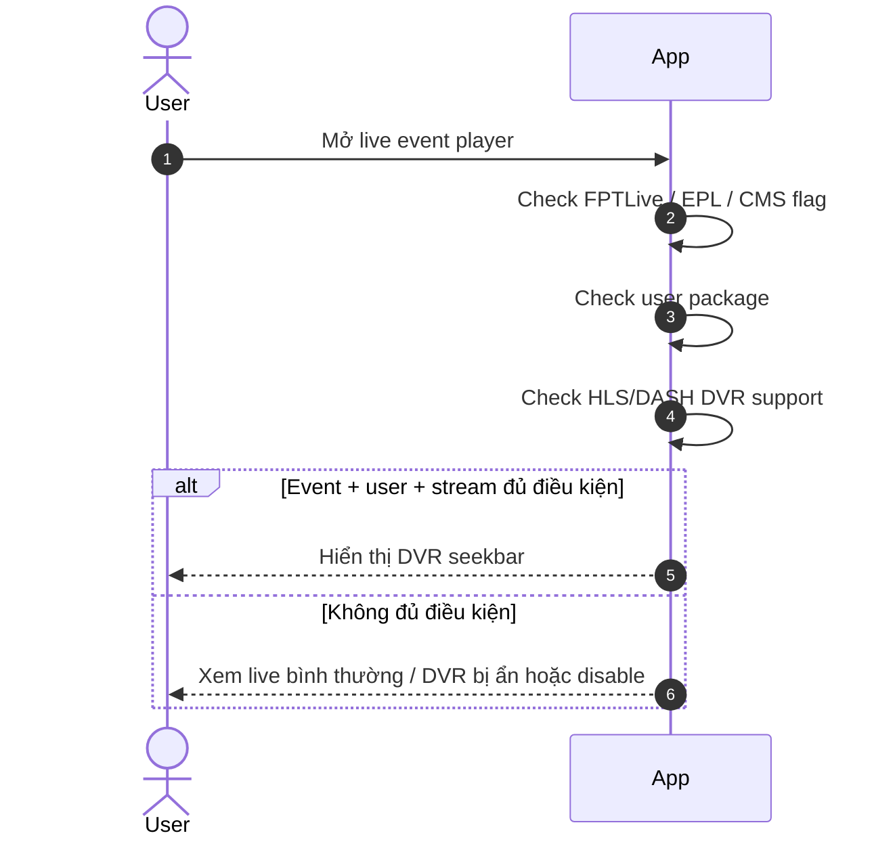
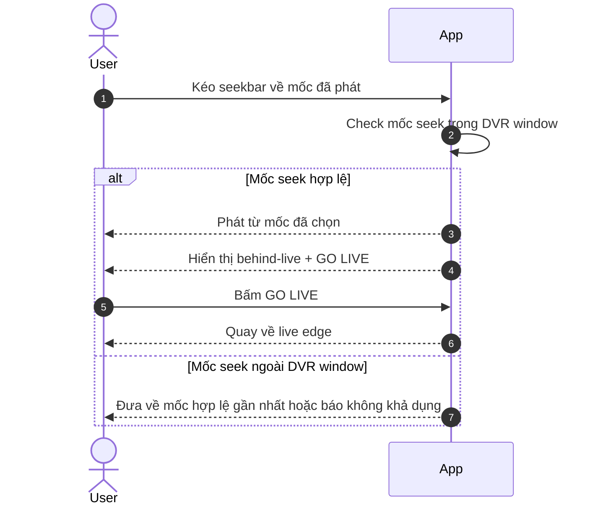
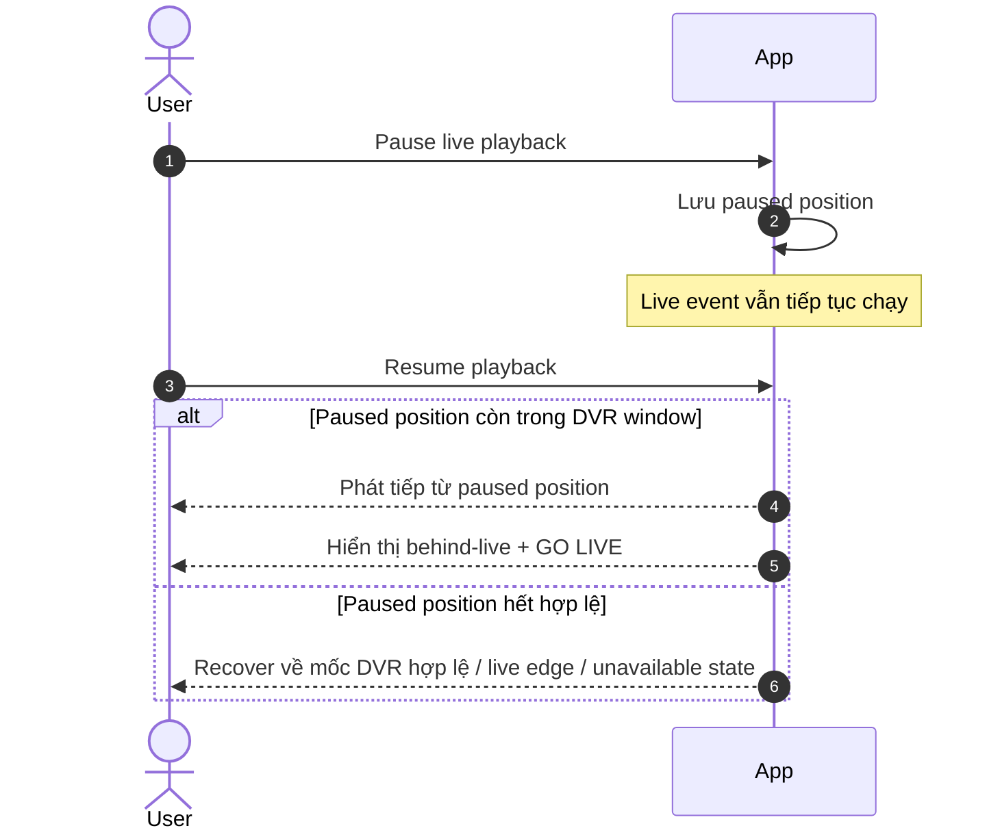
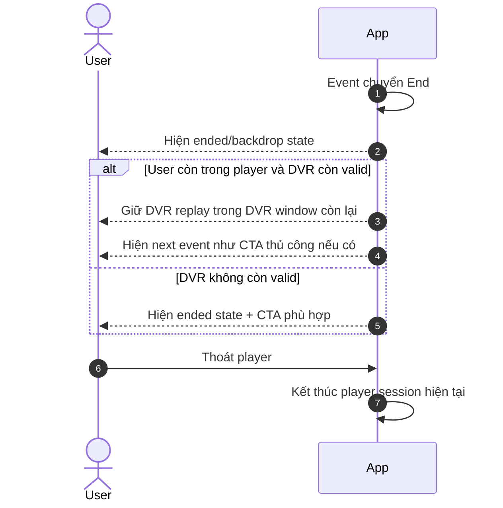
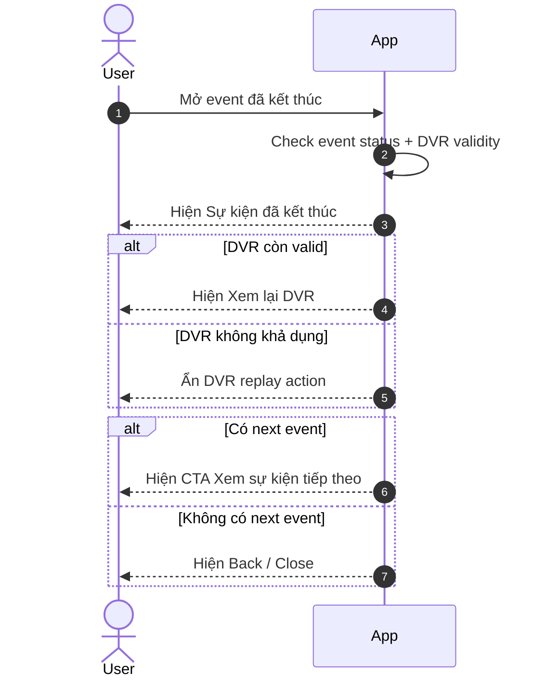

# Timeshift Seek — Functional Requirements

> Project: FPTPlay
> Epic: Event
> Feature: Timeshift Seek
> Audience: Product, BA, FE, BE, QA
> Status: Final implementation handoff
> Writing style: Caveman Vietnam — ít chữ, dễ đọc, đúng ý, không low-level
> Last updated: 2026-06-22

---

## 1. Description

Timeshift Seek giúp user đang xem **sự kiện live FPTLive** tua lại nội dung đã phát trong DVR window tối đa **8 tiếng**. User có thể xem lại đoạn đã qua, pause/resume, hoặc bấm **GO LIVE** để quay về live edge.

Feature này **không áp dụng cho EPL**. User cần có gói hợp lệ. Event cần được bật cờ DVR qua CMS.

Khi event kết thúc, App không tự nhảy sang next event. Nếu DVR còn hợp lệ, user vẫn có thể xem lại DVR từ màn **Sự kiện đã kết thúc**.

---

## 2. Document History

| Version | Date | Updated By | Notes | Approved By |
|---|---|---|---|---|
| v1.0 | 2026-06-16 | Dylan | Initial split docs: full-event DVR and legacy post-event behavior. | Pending |
| v2.0 | 2026-06-22 | Dylan | Rewritten from new requirements: 8-hour DVR, FPTLive only, EPL excluded, entitlement gate, CMS flag, no seek thumbnail, post-end DVR and no-auto-next behavior. | Pending |

---

## 3. Overview

### 3.1 Goal

User đang xem live event có thể tua lại nội dung đã phát, tạm dừng/xem tiếp, rồi quay về live edge khi muốn.

### 3.2 Platform scope

| Platform | Scope | Notes |
|---|---|---|
| iOS | In | App should support DVR seek for HLS/DASH where platform/player capability allows. |
| Android | In | App should support DVR seek for HLS/DASH where platform/player capability allows. |
| Web | In | Web should support DVR seek for HLS/DASH where available; no thumbnail preview. |
| SmartTV / Box | In | TV/Box should keep seek behavior simple and usable by remote/D-pad; no thumbnail preview. |

### 3.3 Event scope

| Event type/source | Scope | Rule |
|---|---|---|
| FPTLive event | In scope | DVR can be enabled by CMS flag if stream supports DVR and user has entitlement. |
| EPL event | Out of scope | Must not enable DVR/start-over even if generic DVR config exists. |
| Non-FPTLive event | Out of scope by default | Only enable if future requirement explicitly allows it. |
| Ended event re-entry | In scope when DVR is still valid | Show Event Ended state; DVR replay may still be available; do not auto next. |

### 3.4 User scope

| User type | Scope | Notes |
|---|---|---|
| User with valid package | In scope | System may make DVR available when all gates pass. |
| User without valid package | Limited | System should not make DVR playback available; app hides/disables DVR seek. |
| Anonymous / guest | Limited | No DVR access unless entitlement rules explicitly allow. |
| Admin/CMS operator | Supporting actor | Enables/disables DVR flag per event in CMS. |

### 3.5 In scope

- Start over / DVR seek for eligible FPTLive events.
- DVR window max 8 hours.
- HLS and DASH DVR stream support when available.
- CMS flag to enable/disable DVR per event.
- Entitlement gate before returning DVR link.
- No seek thumbnail preview.
- Session-bound DVR replay after event end.

### 3.6 Out of scope

- EPL DVR/start-over.
- Auto-jumping to next event after user exits/re-enters ended event.
- Seek thumbnail sprite/VTT.
- Offline download.
- Editing CMS UI details beyond required flag/fields.

---

## 4. Entry Points

| # | Entry Point | User action / System trigger | Surface | Expected result |
|---:|---|---|---|---|
| 1 | Event detail → Watch | User opens live FPTLive event | Player | Player loads live stream; DVR seek active if all gates pass. |
| 2 | Player seekbar | User drags/clicks/D-pad seeks backward | Player controls | Playback starts from selected DVR position. |
| 3 | Pause / Resume | User pauses live playback, then resumes | Player controls | Playback resumes from paused position if still inside DVR window; user becomes behind live. |
| 4 | GO LIVE | User taps GO LIVE while behind live | Player controls | Player jumps to live edge. |
| 5 | Event end while inside player | Stream/status indicates event ended | Player | Show ended/backdrop/next-event prompt as optional; keep current DVR session if applicable. |
| 6 | Re-enter ended event | User opens event after leaving/after event already ended | Event/player entry | Show Event Ended state; keep DVR available if still valid; no auto next event. |
| 7 | CMS flag changed | Admin enables/disables DVR on event | CMS/API | Future stream response reflects new DVR availability. |

---

## 5. Use Case Summary

Use cases are derived from actual goals/branches. Do not force a fixed count.

| Use Case ID | Use Case | Primary Actor | Trigger | Outcome |
|---|---|---|---|---|
| TS-UC-001 | Mở FPTLive event có DVR | Logged-in User | User mở live event | Player hiển thị DVR seek nếu event/user/stream đủ điều kiện. |
| TS-UC-002 | Tua lại trong DVR window | Logged-in User | User chọn mốc trước đó trên seekbar | Player phát từ mốc đã chọn trong giới hạn 8 giờ. |
| TS-UC-003 | Pause / Resume live event | Logged-in User | User pause rồi resume | Player phát tiếp từ vị trí đã pause nếu còn hợp lệ; user chuyển sang behind live. |
| TS-UC-004 | Quay về live edge | Logged-in User | User bấm GO LIVE | Player nhảy về live edge. |
| TS-UC-005 | DVR không khả dụng | Logged-in User, App | Event/user/stream không đủ điều kiện | App ẩn hoặc disable DVR seek. |
| TS-UC-006 | Event end khi user còn trong player | Logged-in User, App | Event kết thúc trong lúc user đang xem | DVR replay có thể tiếp tục nếu còn hợp lệ; next event chỉ là CTA. |
| TS-UC-007 | User vào lại event đã kết thúc | Logged-in User | User mở ended event | App hiện **Sự kiện đã kết thúc**; DVR vẫn có nếu còn valid; không auto next. |
| TS-UC-008 | CMS bật/tắt DVR flag | Admin/CMS User | DVR flag thay đổi | DVR availability đổi theo cấu hình mới. |

User flows may merge UCs when they are one coherent journey. Merged flows must list Covered UCs.

---

## 6. Business Rules

### Global Business Rules

#### Eligibility / gating rules

1. DVR chỉ bật khi CMS flag của event đang ON.
2. DVR chỉ bật cho FPTLive event đủ điều kiện.
3. EPL event không bật DVR / start-over.
4. User phải có package/entitlement hợp lệ trước khi hệ thống expose DVR playback.
5. Stream/packager phải có DVR manifest hợp lệ cho protocol được dùng.
6. Nếu bất kỳ gate nào fail, hệ thống báo DVR unavailable và không expose DVR stream URL.
7. App không hiển thị interactive DVR seek nếu hệ thống chưa xác nhận DVR available.

#### DVR window rules

1. DVR max window là **8 giờ**.
2. Live DVR range = từ `max(event_start_time, live_edge - 8h)` đến `live_edge`.
3. Nếu event duration nhỏ hơn 8 giờ, DVR có thể start từ event start.
4. User không được seek trước DVR start hoặc sau live edge.
5. Seek không có thumbnail. Tooltip chỉ cần hiển thị timestamp nếu cần.
6. Nếu user pause live playback khi DVR enabled, resume từ paused position nếu vị trí đó còn nằm trong DVR window.
7. Nếu paused position đã rơi khỏi DVR window, app recover về nearest valid DVR position, live edge, hoặc unavailable state tùy player capability.

#### Event end and re-entry rules

1. Khi event vừa end, app có thể giữ backdrop / next-event prompt hiện tại.
2. Nếu user đang watch/seek/pause trong player lúc event end, không force auto-transition sang next event.
3. Next event chỉ là CTA thủ công khi DVR session còn active.
4. DVR replay sau event end vẫn theo điều kiện hợp lệ bình thường: entitlement, CMS flag, stream availability, và DVR window.
5. Nếu user enter/re-enter ended event, app show **Sự kiện đã kết thúc** trước. Nếu DVR vẫn valid thì cho user mở DVR replay.
6. Ended event re-entry không được auto-jump sang next event.

#### Protocol rules

1. Hệ thống có thể cung cấp HLS và/hoặc DASH DVR playback tùy platform capability.
2. App/player chọn protocol theo playback policy hiện tại của từng platform.
3. Nếu protocol không có DVR playback hợp lệ, hệ thống disable DVR cho context đó hoặc fallback sang protocol được support.

#### Integration / system expectation rules

1. App cần playback/event status để biết event đang scheduled, live, ended, và có DVR-capable hay không.
2. App cần entitlement result trước khi expose DVR replay.
3. App cần CMS DVR flag và stream availability trước khi enable DVR controls.
4. Hệ thống nên trả được DVR availability, DVR window start/end, protocol availability, và unavailable reason ở mức product.
5. Nếu DVR unavailable, app map reason sang user-facing behavior trong Section 9.

#### Product behavior rules

1. Khi DVR gates fail, player chạy như normal live playback, không có interactive DVR seek.
2. Khi DVR enabled và user ở live edge, seekbar active và GO LIVE hidden.
3. Khi user behind live, show behind-live treatment và GO LIVE action.
4. Seek/resume nên cho cảm giác responsive trong điều kiện mạng bình thường; buffering state được phép khi segment chậm.
5. Khi event ended và DVR vẫn valid, ended overlay có thể giữ final DVR seek controls.
6. Khi user re-enter ended event, show ended state trước; DVR replay action chỉ hiện nếu DVR vẫn valid.
7. Nếu DVR expired hoặc unavailable, hide DVR replay action và giữ safe ended/unavailable state.

#### Measurement notes — if product requires

1. Nếu cần analytics, đo DVR availability, unavailable reason, seek start/success/failure, pause/resume, GO LIVE, event-end DVR session, ended re-entry, và next-event click.
2. Analytics không được expose private package/user data ngoài tracking properties đã được approve.

---

## 7. Functional Requirements

### TS-US-001 — User mở live FPTLive event có DVR

- User mở một sự kiện FPTLive đang live.
- User muốn xem live bình thường, nhưng có thể tua lại nếu đủ điều kiện.
- App chỉ bật DVR seek khi event/user/stream hợp lệ.

**Description:**
User mở player. App check event, gói user, CMS flag và stream support. Nếu đủ điều kiện, App hiển thị DVR seek. Nếu không đủ, user vẫn xem live theo khả năng hiện tại.

#### TS-UC-001 — Mở event → Check DVR availability

**Activity Flows:**



| Field | Details |
|---|---|
| Covered UCs | TS-UC-001, TS-UC-005, TS-UC-008 |
| Description | Player loads and the system determines whether DVR is available. |
| Actor | Logged-in User, App |
| Triggers | User mở live event player. |
| Pre-condition | Event tồn tại. User có quyền mở player. |
| Basic Path | 1. User mở event player.<br>2. App check event có phải FPTLive và không phải EPL.<br>3. App check CMS flag, package của user và stream DVR support.<br>4. Đủ điều kiện → App hiển thị DVR seekbar.<br>5. Không đủ điều kiện → App ẩn/disable DVR seek, user vẫn xem live nếu stream live khả dụng. |
| Post-condition | Player mở thành công. DVR enabled hoặc disabled theo điều kiện thực tế. |
| Alternative Path | CMS flag OFF / event là EPL / user không có gói / stream không hỗ trợ DVR → không hiển thị DVR seek. |
| Exception Handling | Check DVR lỗi → App fallback live-only nếu live stream còn xem được; nếu không thì hiện lỗi playback phù hợp. |
| Business Rules Applied | 1. DVR chỉ bật khi CMS flag ON.<br>2. Chỉ áp dụng cho FPTLive đủ điều kiện, không áp dụng EPL.<br>3. User phải có gói hợp lệ.<br>4. Stream phải hỗ trợ DVR HLS/DASH.<br>5. App chỉ hiển thị DVR seek khi hệ thống xác nhận DVR available. |

### TS-US-002 — User tua lại trong DVR window

- User đang xem live event có DVR.
- User muốn tua lại đoạn đã phát.
- User có thể quay về live edge bằng **GO LIVE**.

**Description:**
User kéo seekbar về mốc trước đó. App chỉ cho tua trong DVR window tối đa 8 giờ. Khi user đang behind live, App hiển thị trạng thái phù hợp và nút **GO LIVE**.

#### TS-UC-002 — Seek behind live / GO LIVE

**Activity Flows:**



| Field | Details |
|---|---|
| Covered UCs | TS-UC-002, TS-UC-004 |
| Description | User seeks within DVR range and may jump back to live edge. |
| Actor | Logged-in User, App |
| Triggers | User kéo/click/D-pad seekbar. |
| Pre-condition | DVR đang available. Event đang live hoặc DVR sau event end vẫn còn valid. |
| Basic Path | 1. User chọn mốc đã phát.<br>2. App check mốc đó còn trong DVR window.<br>3. App phát từ mốc đã chọn.<br>4. App hiển thị behind-live state.<br>5. User bấm **GO LIVE**.<br>6. App đưa playback về live edge nếu event còn live. |
| Post-condition | User watches selected DVR position or returns to live edge. |
| Alternative Path | If event already ended, GO LIVE is hidden; user can seek only within session-bound ended DVR range. |
| Exception Handling | Segment missing/network error → show buffering/error; keep last valid position. |
| Business Rules Applied | 1. DVR window tối đa 8 giờ.<br>2. User không seek trước DVR start hoặc sau live edge.<br>3. Seek không có thumbnail; tooltip chỉ cần timestamp nếu cần.<br>4. Khi behind live, App hiển thị GO LIVE. |

### TS-US-003 — User pause / resume live event

- User đang xem live event có DVR.
- User tạm dừng playback.
- Khi resume, user xem tiếp từ vị trí đã pause nếu vị trí đó còn hợp lệ.

**Description:**
Pause live làm user bị lệch khỏi live edge. Khi user resume, App phát tiếp từ paused position nếu còn trong DVR window. User có thể tiếp tục xem lại hoặc bấm **GO LIVE**.

#### TS-UC-003 — Pause live → Resume behind live

**Activity Flows:**



| Field | Details |
|---|---|
| Covered UCs | TS-UC-003, TS-UC-004 |
| Description | User pauses live playback and resumes from the paused point when possible. |
| Actor | Logged-in User, App |
| Triggers | User bấm pause, sau đó bấm play/resume. |
| Pre-condition | DVR đang available. Event đang live. Paused position có thể nằm trong DVR window. |
| Basic Path | 1. User pause live playback.<br>2. Event vẫn chạy theo thời gian thật.<br>3. User resume.<br>4. App phát tiếp từ paused position nếu còn hợp lệ.<br>5. App hiển thị behind-live state và **GO LIVE**. |
| Post-condition | User watches behind live or returns to live edge manually. |
| Alternative Path | If paused position is no longer inside DVR window, app recovers to nearest valid DVR point, live edge, or unavailable state based on player capability. |
| Exception Handling | If DVR is disabled while paused or stream becomes unavailable, show safe playback/unavailable state. |
| Business Rules Applied | 1. Pause live tạo behind-live position khi resume.<br>2. Resume từ paused position nếu còn trong DVR window.<br>3. Nếu paused position hết hợp lệ, App recover về mốc DVR hợp lệ / live edge / unavailable state. |

### TS-US-004 — Event end khi user còn trong player

- Event kết thúc trong lúc user đang xem.
- App có thể hiện backdrop / next event CTA.
- App không tự nhảy sang next event.

**Description:**
Khi event end, App giữ user trong ngữ cảnh hiện tại. Nếu DVR còn hợp lệ, user vẫn có thể xem lại trong DVR session. Next event chỉ là CTA thủ công.

#### TS-UC-006 — Event end → Keep DVR session if valid

**Activity Flows:**



| Field | Details |
|---|---|
| Covered UCs | TS-UC-006 |
| Description | Event end khi user đang ở trong player. DVR replay tiếp tục nếu còn valid. |
| Actor | Logged-in User, App |
| Triggers | Event chuyển End hoặc stream báo kết thúc. |
| Pre-condition | User đang ở trong player trước khi event kết thúc. |
| Basic Path | 1. Event kết thúc.<br>2. App hiện ended/backdrop state.<br>3. Nếu DVR còn valid, user tiếp tục xem/seek trong DVR window còn lại.<br>4. App có thể hiện next event CTA, nhưng chỉ là lựa chọn thủ công.<br>5. User thoát player → kết thúc player session hiện tại. |
| Post-condition | User tiếp tục DVR replay nếu còn valid, hoặc thoát player. |
| Alternative Path | Nếu DVR không còn valid/expired, App hiện ended state và CTA phù hợp. |
| Exception Handling | Stream hard-stop khi user đang behind live → App giữ vị trí hợp lệ gần nhất nếu player còn phát được; nếu không thì hiện unavailable message. |
| Business Rules Applied | 1. Event end không force auto-transition sang next event.<br>2. Next event chỉ là CTA thủ công.<br>3. DVR replay sau event end vẫn theo entitlement, CMS flag, stream và DVR window. |

### TS-US-005 — User vào lại event đã kết thúc

- User mở event đã kết thúc.
- App hiện **Sự kiện đã kết thúc** trước.
- Nếu DVR còn hợp lệ, user vẫn có thể bấm xem lại DVR.

**Description:**
Ended event re-entry không được auto next. App hiện ended state. DVR replay vẫn được mở nếu còn valid theo entitlement, CMS flag, stream và DVR window.

#### TS-UC-007 — Re-enter ended event → Show ended state / DVR if valid

**Activity Flows:**



| Field | Details |
|---|---|
| Covered UCs | TS-UC-007 |
| Description | User vào event đã kết thúc. App hiện ended state trước, DVR replay hiện nếu còn valid. |
| Actor | Logged-in User, App |
| Triggers | User mở event sau khi event đã kết thúc. |
| Pre-condition | Event đã End trước khi user vào player. |
| Basic Path | 1. User mở ended event.<br>2. App check event status và DVR validity.<br>3. App hiện **Sự kiện đã kết thúc**.<br>4. Nếu DVR còn valid, App hiện **Xem lại DVR**.<br>5. Nếu có next event, App hiện CTA thủ công.<br>6. User chọn DVR, next CTA, hoặc thoát. |
| Post-condition | User vẫn ở context của ended event. DVR chạy nếu còn valid. Next event chỉ mở khi user tự bấm CTA. |
| Alternative Path | Nếu không có next event, chỉ hiện DVR nếu valid và Back/Close. |
| Exception Handling | Không check được DVR validity → App hiện safe ended/unavailable state; không đoán DVR availability. |
| Business Rules Applied | 1. Re-enter ended event phải hiện **Sự kiện đã kết thúc** trước.<br>2. DVR replay vẫn hiện nếu còn valid.<br>3. Không auto-jump sang next event. |

---

## 8. Screen Element Specification

### 8.1 Figma / Design Reference

| Item | Link / Note |
|---|---|
| Final Figma | TBD |
| Existing design docs | `features/final-docs/Event/Timeshift-Seek/design/design-specification.md` is legacy and superseded by this file for changed behavior. |
| Mockup | Not auto-created. Create only if explicitly requested. |

### 8.2 Information Architecture

```text
Event Player
└── Playback Area
    ├── Video surface
    ├── Event-ended overlay / backdrop
    └── Optional next-event CTA
└── Player Controls
    ├── LIVE badge / behind-live indicator
    ├── Seekbar without thumbnail
    ├── Time tooltip only
    ├── GO LIVE button
    └── Error / entitlement messages
```

### 8.4 Surface Details by Surface

Use this as the single place for all surface-level UI details. Do not split surface inventory, status matrix, or placement rules into separate 8.3 / 8.5 / 8.6 sections.

#### SURF-001 — Live Player with DVR enabled

**Surface details:**

| Field | Details |
|---|---|
| Surface / Location | Event player controls |
| Platform | iOS / Android / Web / TV |
| When shown | Event is live and `dvr_enabled=true`. |
| Related UC / Flow | TS-UC-001, TS-UC-002, TS-UC-003, TS-UC-001, TS-UC-002, TS-UC-003 |
| Placement notes | Seekbar in player control area; TV uses D-pad friendly focus. |

**Sketching wireframe / Text-Based Wireframing:**

```text
Live Event Player — DVR enabled
┌──────────────────────────────────────────┐
│                Video Surface             │
│                                  [LIVE]  │
│                                          │
├──────────────────────────────────────────┤
│  18:30 ━━━━━●━━━━━━━━━━━━━━ LIVE 20:15   │
│        tooltip: 19:05 only, no thumbnail │
│  [Play/Pause] [GO LIVE when behind]      │
└──────────────────────────────────────────┘
```

**Surface elements:**

| # | Element | States | Format / Copy | Rules / Notes |
|---:|---|---|---|---|
| 1 | Seekbar track | active, buffering, disabled | Time range | Active only when DVR enabled. Max range 8h. |
| 2 | Seek thumb | at live edge, behind live, dragging/focused | Position | Cannot move outside DVR window. |
| 3 | Time tooltip | visible on hover/focus/drag | `HH:mm` or `mm:ss` | No thumbnail preview. |
| 4 | LIVE badge | live edge, behind live, hidden after end | `LIVE` | Dimmed/behind state when user is behind live. |
| 5 | Play/Pause button | playing, paused, buffering | Standard player control | Pause creates behind-live position when resumed. |
| 6 | GO LIVE button | visible, hidden, disabled | `GO LIVE` / `Trực tiếp` | Visible only while event live and user behind live. |
| 7 | Error/toast | hidden, visible | Localized copy | For unavailable segment, entitlement, expired window. |

**Surface behavior notes:**

- At live edge: show `LIVE`; GO LIVE hidden; user may seek backward or pause.
- Paused live: show paused control; resume from paused position if still valid.
- Behind live: dim/behind treatment; allow seek, play/pause, and GO LIVE.
- Buffering: show loading treatment and keep target position.
- DVR unavailable/no entitlement: hide or disable DVR controls; show approved message/CTA only when product supports it.

**Surface-specific notes:**

- No thumbnail preview on any platform.
- If event duration > 8h, left edge is rolling 8h start, not event start.

#### SURF-002 — Event ended while user is inside player

**Surface details:**

| Field | Details |
|---|---|
| Surface / Location | Player overlay/backdrop after event end |
| Platform | iOS / Android / Web / TV |
| When shown | User was already inside player when event ended. |
| Related UC / Flow | TS-UC-006, TS-UC-006 |
| Placement notes | Existing backdrop/next-event prompt may appear once, but next event is CTA only when DVR session is active. |

**Sketching wireframe / Text-Based Wireframing:**

```text
Event Ended — Current DVR Session
┌──────────────────────────────────────────┐
│          Sự kiện đã kết thúc             │
│  Bạn có thể tiếp tục xem lại trong phiên │
│  hiện tại nếu nội dung còn khả dụng.     │
│                                          │
│  [Xem sự kiện tiếp theo]   [Thoát]       │
├──────────────────────────────────────────┤
│  18:30 ━━━━━●━━━━━━━━━━━━━━ END 20:15    │
│  no LIVE badge, no GO LIVE, no thumbnail │
└──────────────────────────────────────────┘
```

**Surface elements:**

| # | Element | States | Format / Copy | Rules / Notes |
|---:|---|---|---|---|
| 1 | Ended title | visible | `Sự kiện đã kết thúc` | Show when event ended. |
| 2 | DVR session message | visible/hidden | Short copy | Visible if current session can still replay DVR. |
| 3 | Seekbar | active, disabled | Final DVR range | Active only for current session and valid DVR. |
| 4 | LIVE badge | hidden | — | No LIVE after event end. |
| 5 | GO LIVE button | hidden | — | No live edge after event end. |
| 6 | Next event CTA | visible/hidden | `Xem sự kiện tiếp theo` | Optional; never forced auto-jump when DVR session active. |
| 7 | Exit button | visible | `Thoát` / Back | Exiting ends current DVR session. |

**Surface behavior notes:**

- Ended session with valid DVR: show ended overlay and keep final DVR seekbar active.
- Ended session without valid DVR: show ended overlay/backdrop and hide DVR controls.
- Next event: show as manual action only; never auto-jump while user is in DVR session.

**Surface-specific notes:**

- First event-end moment may reuse existing backdrop and next-event prompt.
- If user is actively seeking/watching/paused in DVR, do not interrupt them with forced next-event transition.

#### SURF-003 — Re-enter ended event

**Surface details:**

| Field | Details |
|---|---|
| Surface / Location | Event/player entry for ended event |
| Platform | iOS / Android / Web / TV |
| When shown | Event is already ended before user enters, or user exited and re-enters. |
| Related UC / Flow | TS-UC-007, TS-UC-007 |
| Placement notes | This is an ended state first; DVR replay entry can be shown when still valid. |

**Sketching wireframe / Text-Based Wireframing:**

```text
Ended Event Entry
┌──────────────────────────────────────────┐
│              Backdrop / Poster           │
│                                          │
│          Sự kiện đã kết thúc             │
│                                          │
│ [Xem lại DVR] [Xem sự kiện tiếp theo]   │
│ [Quay lại]                              │
└──────────────────────────────────────────┘
```

**Surface elements:**

| # | Element | States | Format / Copy | Rules / Notes |
|---:|---|---|---|---|
| 1 | Backdrop/poster | visible | Event image | Use current ended event backdrop. |
| 2 | Ended message | visible | `Sự kiện đã kết thúc` | Required. |
| 3 | DVR replay CTA/control | visible if valid | `Xem lại DVR` | Allows replay when DVR is still valid. |
| 4 | Next event CTA | visible/hidden | `Xem sự kiện tiếp theo` | Optional manual CTA only. |
| 5 | Back/Close CTA | visible | `Quay lại` / Back | Returns user to previous screen. |

**Surface behavior notes:**

- Ended with valid DVR + next event: show DVR replay and next-event actions; next event is manual only.
- Ended with valid DVR only: show DVR replay and back action.
- API/error state: show safe error/retry; do not guess DVR availability.

**Surface-specific notes:**

- Re-entry is not an auto-next flow. DVR replay remains controlled by entitlement, CMS flag, and DVR window validity.

---

## 9. Error Handling & User-Facing Messages

| Case | User-facing message | Behavior |
|---|---|---|
| DVR unavailable generic | `Tua lại không khả dụng cho sự kiện này.` | Hide/disable seekbar. |
| User lacks package | `Nội dung tua lại yêu cầu gói phù hợp.` | Hide DVR seek; show package CTA only if product supports. |
| Seek outside window | `Không thể tua đến thời điểm này.` | Clamp to valid range or restore previous position. |
| Segment unavailable | `Nội dung tua lại đang tạm thời không khả dụng.` | Retry/buffer; keep previous valid position. |
| Event ended in session | `Sự kiện đã kết thúc.` | Keep session DVR if valid; next event CTA optional. |
| Ended event re-entry | `Sự kiện đã kết thúc.` | DVR available if still valid; no auto next. |
| API error | `Không thể tải thông tin sự kiện. Vui lòng thử lại.` | Retry/back. |

---

## 10. References

| Item | Path / Link |
|---|---|
| Legacy product spec | `features/final-docs/Event/Timeshift-Seek/product/functional-specification.md` |
| Legacy userflow spec | `features/final-docs/Event/Timeshift-Seek/product/timeshift-seek-user-flows-functional-requirements.md` |
| Legacy API spec | `features/final-docs/Event/Timeshift-Seek/api/api-specification.md` |
| Legacy design spec | `features/final-docs/Event/Timeshift-Seek/design/design-specification.md` |
| Domain wiki | `sdlc-agent/wiki/Global/Domain/MediaStreaming/OTT/FPTPlay/DOM-MEDIASTREAMING-FPTPLAY-001.md` |

---

## 11. Handoff Checklist

- [x] Use Case Summary derives from actual goals/branches, not fixed count.
- [x] Activity Flows cover all UCs, with Covered UCs listed.
- [x] Each flow has diagram + Field/Details table.
- [x] Surface details are consolidated in 8.4.
- [x] Each meaningful surface has text-based wireframe + surface elements table.
- [x] Surface behavior is covered inside each surface block.
- [x] Integration expectations are covered in business rules.
- [x] Main and edge cases are covered by use cases, flows, rules, and error messages.
- [ ] BE confirms exact endpoint/field names against implementation.
- [ ] CMS confirms exact flag name and event source/competition fields.
