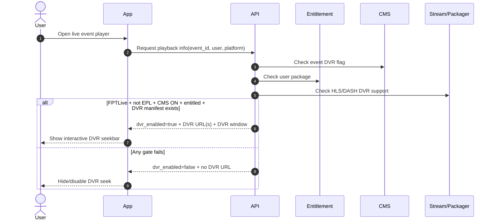
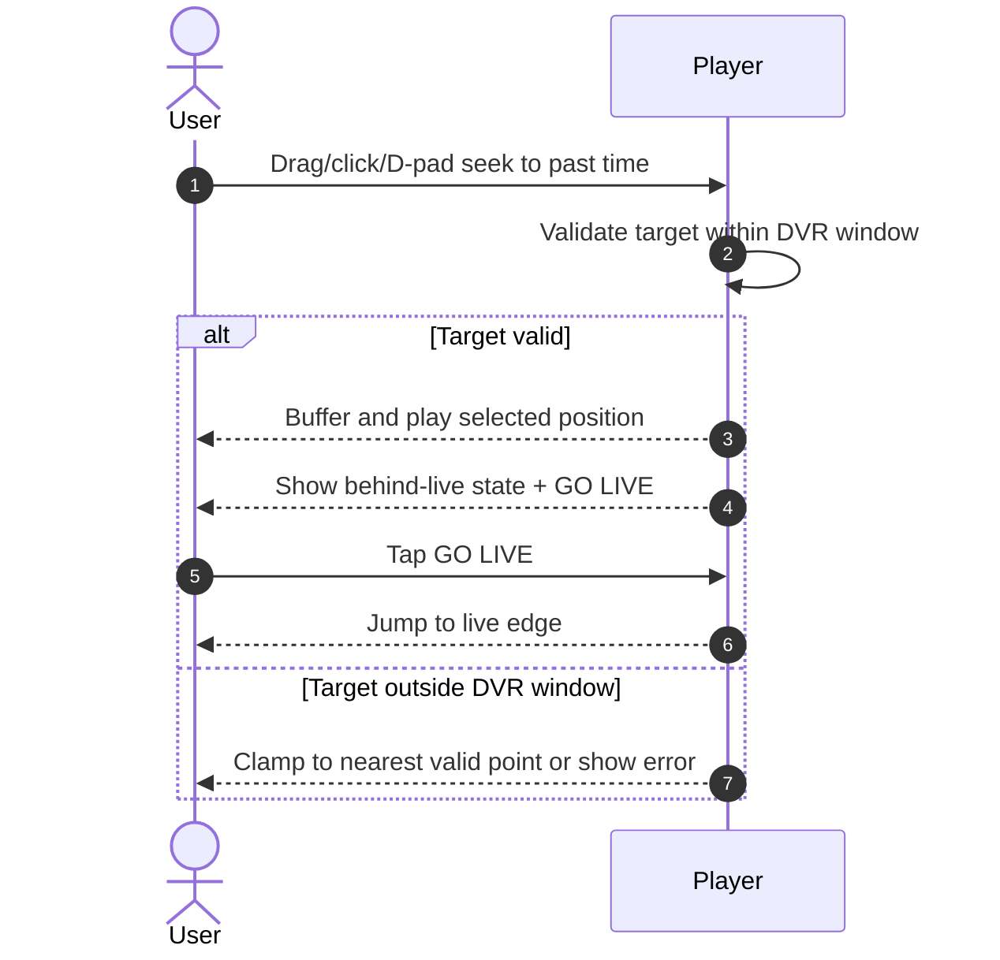
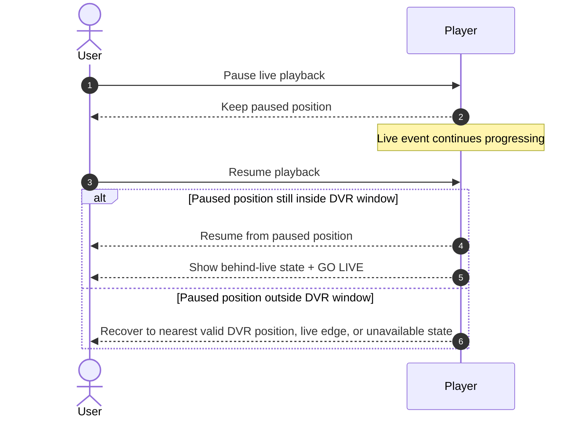
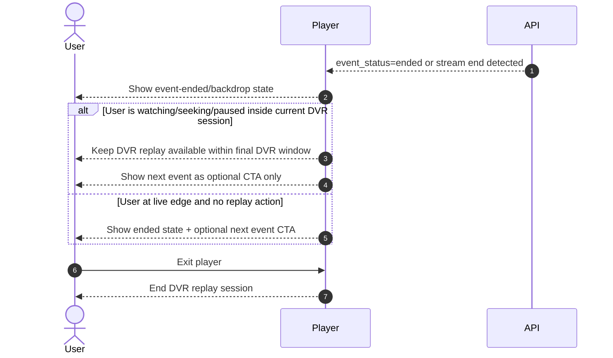
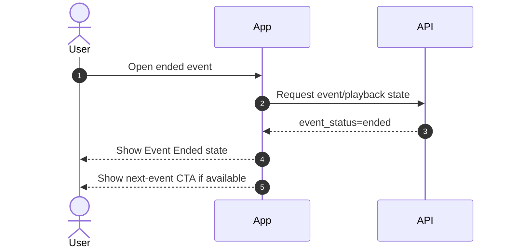

# Timeshift Seek — Functional Requirements

> Project: FPTPlay
> Epic: Event
> Feature: Timeshift Seek
> Audience: Product, BA, FE, BE, QA
> Status: Final product requirements handoff
> Writing style: High-level product language — ngắn, rõ, đủ cho BA/FE/BE/QA align; không khóa implementation detail quá sớm
> Last updated: 2026-06-22

---

## 1. Description

Timeshift Seek cho phép user đang xem **sự kiện live FPTLive** tua lại nội dung đã phát trong DVR window tối đa **8 tiếng** và bấm về live edge khi cần.

Feature này **không áp dụng cho EPL**. DVR link chỉ được trả khi user có gói hợp lệ và sự kiện được bật cờ DVR qua CMS.

Sau khi sự kiện kết thúc, player giữ trải nghiệm DVR theo điều kiện hợp lệ. Nếu user đang ở trong player tại thời điểm event end, user được giữ trong DVR replay session hiện tại. Nếu user thoát player hoặc vào lại event đã kết thúc, app báo **Sự kiện đã kết thúc** nhưng vẫn có thể cho DVR replay nếu DVR còn hợp lệ; không tự động nhảy sang next event.

---

## 2. Document History

| Version | Date | Updated By | Notes | Approved By |
|---|---|---|---|---|
| v1.0 | 2026-06-16 | Dylan | Initial split docs: full-event DVR and legacy post-event behavior. | Pending |
| v2.0 | 2026-06-22 | Dylan | Rewritten from new requirements: 8-hour DVR, FPTLive only, EPL excluded, entitlement gate, CMS flag, no seek thumbnail, post-end DVR and no-auto-next behavior. | Pending |

---

## 3. Overview

### 3.1 Goal

User đang xem live event có thể tua lại nội dung đã phát trong giới hạn cho phép, rồi quay về live edge.

### 3.2 Platform scope

| Platform | Scope | Notes |
|---|---|---|
| iOS | In | App should support DVR seek for HLS/DASH where platform/player capability allows. |
| Android | In | App should support DVR seek for HLS/DASH where platform/player capability allows. |
| Web | In | Web should support DVR seek for HLS/DASH where available; no thumbnail preview. |
| SmartTV / Box | In | TV/Box should keep seek behavior simple and usable by remote/D-pad; no thumbnail preview. |

### 3.3 Event scope

| Event type/source | Scope | Rule |
|---|---|---|
| FPTLive event | In scope | DVR can be enabled by CMS flag if stream supports DVR and user has entitlement. |
| EPL event | Out of scope | Must not enable DVR/start-over even if generic DVR config exists. |
| Non-FPTLive event | Out of scope by default | Only enable if future requirement explicitly allows it. |
| Ended event re-entry | In scope when DVR is still valid | Show Event Ended state; DVR replay may still be available; do not auto next. |

### 3.4 User scope

| User type | Scope | Notes |
|---|---|---|
| User with valid package | In scope | System may make DVR available when all gates pass. |
| User without valid package | Limited | System should not make DVR playback available; app hides/disables DVR seek. |
| Anonymous / guest | Limited | No DVR access unless entitlement rules explicitly allow. |
| Admin/CMS operator | Supporting actor | Enables/disables DVR flag per event in CMS. |

### 3.5 In scope

- Start over / DVR seek for eligible FPTLive events.
- DVR window max 8 hours.
- HLS and DASH DVR stream support when available.
- CMS flag to enable/disable DVR per event.
- Entitlement gate before returning DVR link.
- No seek thumbnail preview.
- Session-bound DVR replay after event end.

### 3.6 Out of scope

- EPL DVR/start-over.
- Auto-jumping to next event after user exits/re-enters ended event.
- Seek thumbnail sprite/VTT.
- Offline download.
- Editing CMS UI details beyond required flag/fields.

### 3.7 Non-functional requirements

| ID | Requirement | Notes |
|---|---|---|
| TS-NFR-001 | Seek should feel responsive under normal network conditions. | Buffering state allowed when segment is slow. |
| TS-NFR-002 | DVR availability must be decided server-side. | DVR availability should come from system/API, not client-side guesswork. |
| TS-NFR-003 | System must not expose DVR playback to users without valid package. | Entitlement gate is mandatory. |
| TS-NFR-004 | DVR range must never exceed 8 hours. | Even if event is longer. |
| TS-NFR-005 | Seek preview should not depend on thumbnail assets. | Time tooltip only. |

---

## 4. Entry Points

| # | Entry Point | User action / System trigger | Surface | Expected result |
|---:|---|---|---|---|
| 1 | Event detail → Watch | User opens live FPTLive event | Player | Player loads live stream; DVR seek active if all gates pass. |
| 2 | Player seekbar | User drags/clicks/D-pad seeks backward | Player controls | Playback starts from selected DVR position. |
| 3 | Pause / Resume | User pauses live playback, then resumes | Player controls | Playback resumes from paused position if still inside DVR window; user becomes behind live. |
| 4 | GO LIVE | User taps GO LIVE while behind live | Player controls | Player jumps to live edge. |
| 5 | Event end while inside player | Stream/status indicates event ended | Player | Show ended/backdrop/next-event prompt as optional; keep current DVR session if applicable. |
| 6 | Re-enter ended event | User opens event after leaving/after event already ended | Event/player entry | Show Event Ended state; keep DVR available if still valid; no auto next event. |
| 7 | CMS flag changed | Admin enables/disables DVR on event | CMS/API | Future stream response reflects new DVR availability. |

---

## 5. Use Case Summary

Use cases are derived from actual goals/branches. Do not force a fixed count.

| Use Case ID | Use Case | Primary Actor | Trigger | Outcome |
|---|---|---|---|---|
| TS-UC-001 | Load eligible FPTLive event with DVR | User | Opens live event | Player shows DVR seek if CMS flag, entitlement, event source, and stream support pass. |
| TS-UC-002 | Seek within DVR window | User | Selects earlier point on seekbar | Player plays selected point within max 8h DVR range. |
| TS-UC-003 | Pause and resume live event | User | Pauses live playback, then resumes | Playback resumes from paused position if still valid; user becomes behind live. |
| TS-UC-004 | Return to live edge | User | Taps GO LIVE | Playback jumps to live edge; behind-live UI clears. |
| TS-UC-005 | DVR unavailable due to gates | User/System | Event/user fails one or more gates | System does not expose DVR playback; app hides/disables DVR seek. |
| TS-UC-006 | Event ends while user is inside player | System/User | Event ends during playback | session-bound DVR replay can continue; next event is optional CTA only. |
| TS-UC-007 | User enters ended event after exit/re-entry | User | Opens ended event | App shows Event Ended state; DVR replay may remain available if valid; no auto next event. |
| TS-UC-008 | CMS toggles DVR flag | Admin/CMS | Flag changes | DVR availability changes for future playback responses. |

User flows may merge UCs when they are one coherent journey. Merged flows must list Covered UCs.

---

## 6. Business Rules

### 6.1 Eligibility / gating rules

| Rule ID | Rule | Applies to |
|---|---|---|
| TS-BR-001 | DVR is enabled only when CMS flag for the event is ON. | BE/CMS/API |
| TS-BR-002 | DVR is enabled only for allowed FPTLive events. | BE/API |
| TS-BR-003 | EPL events must not enable DVR/start-over. | BE/API/FE |
| TS-BR-004 | User must have valid package/entitlement before server returns DVR link. | BE/API |
| TS-BR-005 | Stream/packager must support DVR manifest for requested protocol. | BE/API/Infra |
| TS-BR-006 | If any gate fails, System reports DVR unavailable and does not expose DVR stream URL. | BE/API |
| TS-BR-007 | App should not show interactive DVR seek unless system says DVR is available. | FE |

### 6.2 DVR window rules

| Rule ID | Rule | Applies to |
|---|---|---|
| TS-BR-008 | DVR max window is 8 hours. | BE/FE/Player |
| TS-BR-009 | Live DVR range is `[max(event_start_time, live_edge - 8h), live_edge]`. | BE/FE/Player |
| TS-BR-010 | If event duration is less than 8h, DVR can start at event start. | BE/FE/Player |
| TS-BR-011 | User cannot seek before DVR start or after live edge. | Player |
| TS-BR-012 | No seek thumbnail is shown. Tooltip may show timestamp only. | FE/Design |
| TS-BR-013 | If user pauses live playback while DVR is enabled, resume should continue from the paused position while it remains inside the DVR window. | FE/Player |
| TS-BR-014 | If paused position falls outside the DVR window, app should recover to nearest valid DVR position, live edge, or an unavailable state based on player capability. | FE/Player |

### 6.3 Event end and re-entry rules

| Rule ID | Rule | Applies to |
|---|---|---|
| TS-BR-015 | First event-end moment may show existing backdrop and next-event prompt. | FE/Player |
| TS-BR-016 | If user is currently watching/seeking/paused in the player when event ends, do not force auto-transition to next event. | FE/Player |
| TS-BR-017 | Next event after event end is optional CTA only when DVR session is active. | FE/Player |
| TS-BR-018 | DVR replay after event end depends on normal DVR validity: entitlement, CMS flag, stream availability, and DVR window. | FE/Player/API |
| TS-BR-019 | If user enters/re-enters the ended event after exit or after event already ended, show Event Ended state first, then allow DVR replay if DVR is still valid. | FE/Player |
| TS-BR-020 | Ended event re-entry must not auto-jump to next event. DVR replay remains allowed when entitlement, CMS flag, and DVR window are still valid. | FE/Player |

### 6.4 Protocol rules

| Rule ID | Rule | Applies to |
|---|---|---|
| TS-BR-021 | System may provide HLS and/or DASH DVR playback depending on platform capability. | BE/API |
| TS-BR-022 | App/player follows existing platform playback policy for protocol selection. | FE/Player |
| TS-BR-023 | If a protocol has no valid DVR playback, system should either disable DVR for that context or use a supported protocol. | BE/API/Player |

---

## 7. Functional Requirements

### TS-US-001 — Load live FPTLive event with DVR eligibility

User opens a live event. System checks event type, CMS flag, entitlement, and stream support before enabling DVR seek.

#### TS-FLOW-001 — Load player and decide DVR availability



| Field | Details |
|---|---|
| Covered UCs | TS-UC-001, TS-UC-005, TS-UC-008 |
| Description | Player loads and the system determines whether DVR is available. |
| Actor | User, App, API, CMS, Entitlement, Stream/Packager |
| Triggers | User opens a live event player. |
| Pre-condition | Event exists; playback API is reachable. |
| Basic Path | 1. User opens event player.<br>2. App requests playback info.<br>3. API checks CMS DVR flag, event source, EPL exclusion, entitlement, and stream support.<br>4. If all gates pass, API returns DVR-enabled response.<br>5. Player shows interactive DVR seekbar. |
| Post-condition | Player is live with DVR enabled or live with DVR disabled/read-only. |
| Alternative Path | CMS flag OFF / event is EPL / user has no package / no DVR manifest → `dvr_enabled=false`; no DVR URL. |
| Exception Handling | System error → player shows normal playback error or live-only fallback if live playback is still available. |
| Business Rules Applied | TS-BR-001 to TS-BR-007, TS-BR-021 to TS-BR-023. |

### TS-US-002 — Seek within max 8-hour DVR window

User can seek backward only inside the allowed DVR window.

#### TS-FLOW-002 — User seeks behind live and returns to live



| Field | Details |
|---|---|
| Covered UCs | TS-UC-002, TS-UC-004 |
| Description | User seeks within DVR range and may jump back to live edge. |
| Actor | User, Player |
| Triggers | User interacts with seekbar. |
| Pre-condition | `dvr_enabled=true`; valid DVR URL; event is live or session-bound post-end DVR is still active. |
| Basic Path | 1. User selects a past point.<br>2. Player validates point within DVR window.<br>3. Player seeks and buffers.<br>4. Player shows behind-live state.<br>5. User taps GO LIVE.<br>6. Player jumps to live edge if event is still live. |
| Post-condition | User watches selected DVR position or returns to live edge. |
| Alternative Path | If event already ended, GO LIVE is hidden; user can seek only within session-bound ended DVR range. |
| Exception Handling | Segment missing/network error → show buffering/error; keep last valid position. |
| Business Rules Applied | TS-BR-008 to TS-BR-012. |

### TS-US-003 — Pause and resume live playback

User can pause an eligible live event and resume from the paused position. After resume, user is behind live and can continue watching, seek within DVR window, or go back to live edge.

#### TS-FLOW-003 — User pauses live and resumes behind live



| Field | Details |
|---|---|
| Covered UCs | TS-UC-003, TS-UC-004 |
| Description | User pauses live playback and resumes from the paused point when possible. |
| Actor | User, Player |
| Triggers | User taps pause, then play/resume. |
| Pre-condition | `dvr_enabled=true`; event is live; paused position can be represented in DVR window. |
| Basic Path | 1. User pauses live playback.<br>2. Live event continues in real time.<br>3. User resumes.<br>4. Player resumes from paused position if still valid.<br>5. Player shows behind-live state and GO LIVE option. |
| Post-condition | User watches behind live or returns to live edge manually. |
| Alternative Path | If paused position is no longer inside DVR window, app recovers to nearest valid DVR point, live edge, or unavailable state based on player capability. |
| Exception Handling | If DVR is disabled while paused or stream becomes unavailable, show safe playback/unavailable state. |
| Business Rules Applied | TS-BR-008 to TS-BR-014. |

### TS-US-004 — Event end with session-bound DVR replay

When event ends, user can keep DVR replay when the DVR session remains valid. Next event is optional CTA only; do not force auto-transition.

#### TS-FLOW-004 — Event ends while user is inside player



| Field | Details |
|---|---|
| Covered UCs | TS-UC-006 |
| Description | Event ends while user is already in player. DVR replay remains only for current session. |
| Actor | User, Player, API/System |
| Triggers | Stream end, `event_status=ended`, event schedule end, or polling update. |
| Pre-condition | User is inside player before event ends. |
| Basic Path | 1. Player detects event end.<br>3. Player may show existing backdrop/end overlay.<br>4. If DVR is valid, current session can continue seeking within final DVR window.<br>5. Next event appears only as optional CTA.<br>6. User exits player → DVR replay session ends. |
| Post-condition | User either continues session-bound DVR replay or exits. |
| Alternative Path | If DVR is not valid/expired, show ended state and optional next event CTA. |
| Exception Handling | Stream hard-stops while user is behind live → show ended state and preserve latest valid seek position if player can continue from buffered/DVR manifest; otherwise show unavailable message. |
| Business Rules Applied | TS-BR-015 to TS-BR-018. |

### TS-US-005 — Re-enter ended event

User entering an already ended event sees the ended state first. If DVR is still valid, user can continue/open DVR replay from the ended event context. App must not auto-jump to next event.

#### TS-FLOW-005 — User enters/re-enters ended event



| Field | Details |
|---|---|
| Covered UCs | TS-UC-007 |
| Description | Ended event entry shows ended state first, with DVR replay available if still valid. |
| Actor | User, App, API |
| Triggers | User opens event after it ended or after exiting ended player session. |
| Pre-condition | Event status is ended before player entry. |
| Basic Path | 1. User opens ended event.<br>2. App/API confirms event ended.<br>3. App shows “Sự kiện đã kết thúc”.<br>4. If DVR is still valid, user can start/continue DVR replay.<br>5. If next event exists, show CTA only; do not auto-jump.<br>6. User chooses DVR, next CTA, or exits. |
| Post-condition | User stays on ended event context; DVR may play if valid; next event only starts by manual CTA. |
| Alternative Path | If next event unavailable, show Back/Close only. |
| Exception Handling | API unavailable → show safe ended/unavailable state; do not guess DVR URL. |
| Business Rules Applied | TS-BR-019, TS-BR-020. |

---

## 8. Screen Element Specification

### 8.1 Figma / Design Reference

| Item | Link / Note |
|---|---|
| Final Figma | TBD |
| Existing design docs | `features/final-docs/Event/Timeshift-Seek/design/design-specification.md` is legacy and superseded by this file for changed behavior. |
| Mockup | Not auto-created. Create only if explicitly requested. |

### 8.2 Information Architecture

```text
Event Player
└── Playback Area
    ├── Video surface
    ├── Event-ended overlay / backdrop
    └── Optional next-event CTA
└── Player Controls
    ├── LIVE badge / behind-live indicator
    ├── Seekbar without thumbnail
    ├── Time tooltip only
    ├── GO LIVE button
    └── Error / entitlement messages
```

### 8.4 Surface Details by Surface

Use this as the single place for all surface-level UI details. Do not split surface inventory, status matrix, or placement rules into separate 8.3 / 8.5 / 8.6 sections.

#### SURF-001 — Live Player with DVR enabled

**Surface summary:**

| Field | Details |
|---|---|
| Surface / Location | Event player controls |
| Platform | iOS / Android / Web / TV |
| When shown | Event is live and `dvr_enabled=true`. |
| Related UC / Flow | TS-UC-001, TS-UC-002, TS-UC-003, TS-FLOW-001, TS-FLOW-002, TS-FLOW-003 |
| Placement notes | Seekbar in player control area; TV uses D-pad friendly focus. |

**Sketching wireframe / Text-Based Wireframing:**

```text
Live Event Player — DVR enabled
┌──────────────────────────────────────────┐
│                Video Surface             │
│                                  [LIVE]  │
│                                          │
├──────────────────────────────────────────┤
│  18:30 ━━━━━●━━━━━━━━━━━━━━ LIVE 20:15   │
│        tooltip: 19:05 only, no thumbnail │
│  [Play/Pause] [GO LIVE when behind]      │
└──────────────────────────────────────────┘
```

**Surface elements:**

| # | Element | States | Format / Copy | Rules / Notes |
|---:|---|---|---|---|
| 1 | Seekbar track | active, buffering, disabled | Time range | Active only when DVR enabled. Max range 8h. |
| 2 | Seek thumb | at live edge, behind live, dragging/focused | Position | Cannot move outside DVR window. |
| 3 | Time tooltip | visible on hover/focus/drag | `HH:mm` or `mm:ss` | No thumbnail preview. |
| 4 | LIVE badge | live edge, behind live, hidden after end | `LIVE` | Dimmed/behind state when user is behind live. |
| 5 | Play/Pause button | playing, paused, buffering | Standard player control | Pause creates behind-live position when resumed. |
| 6 | GO LIVE button | visible, hidden, disabled | `GO LIVE` / `Trực tiếp` | Visible only while event live and user behind live. |
| 7 | Error/toast | hidden, visible | Localized copy | For unavailable segment, entitlement, expired window. |

**Status / state behavior for this surface:**

| Status / State | User-facing copy | Visual treatment | Allowed actions | Notes |
|---|---|---|---|---|
| live_at_edge | LIVE | Red/live badge | Seek backward, pause | GO LIVE hidden. |
| paused_live | Tạm dừng | Paused control state | Resume/play | Live keeps progressing; resume becomes behind-live if still valid. |
| behind_live | Đang xem lại | Dim LIVE/behind indicator | Seek, play/pause, GO LIVE | User remains behind until manual GO LIVE or seek to edge. |
| buffering | Đang tải... | Spinner/skeleton on controls | Cancel/back optional | Keep target position. |
| dvr_unavailable | Tua lại không khả dụng cho sự kiện này. | Disabled/hidden seekbar | Watch live only | Any gate failed. |
| no_entitlement | Nội dung tua lại yêu cầu gói phù hợp. | CTA/package message if product wants | Buy/login if supported | API must not return DVR URL. |

**Surface-specific notes:**

- No thumbnail preview on any platform.
- If event duration > 8h, left edge is rolling 8h start, not event start.

#### SURF-002 — Event ended while user is inside player

**Surface summary:**

| Field | Details |
|---|---|
| Surface / Location | Player overlay/backdrop after event end |
| Platform | iOS / Android / Web / TV |
| When shown | User was already inside player when event ended. |
| Related UC / Flow | TS-UC-006, TS-FLOW-004 |
| Placement notes | Existing backdrop/next-event prompt may appear once, but next event is CTA only when DVR session is active. |

**Sketching wireframe / Text-Based Wireframing:**

```text
Event Ended — Current DVR Session
┌──────────────────────────────────────────┐
│          Sự kiện đã kết thúc             │
│  Bạn có thể tiếp tục xem lại trong phiên │
│  hiện tại nếu nội dung còn khả dụng.     │
│                                          │
│  [Xem sự kiện tiếp theo]   [Thoát]       │
├──────────────────────────────────────────┤
│  18:30 ━━━━━●━━━━━━━━━━━━━━ END 20:15    │
│  no LIVE badge, no GO LIVE, no thumbnail │
└──────────────────────────────────────────┘
```

**Surface elements:**

| # | Element | States | Format / Copy | Rules / Notes |
|---:|---|---|---|---|
| 1 | Ended title | visible | `Sự kiện đã kết thúc` | Show when event ended. |
| 2 | DVR session message | visible/hidden | Short copy | Visible if current session can still replay DVR. |
| 3 | Seekbar | active, disabled | Final DVR range | Active only for current session and valid DVR. |
| 4 | LIVE badge | hidden | — | No LIVE after event end. |
| 5 | GO LIVE button | hidden | — | No live edge after event end. |
| 6 | Next event CTA | visible/hidden | `Xem sự kiện tiếp theo` | Optional; never forced auto-jump when DVR session active. |
| 7 | Exit button | visible | `Thoát` / Back | Exiting ends current DVR session. |

**Status / state behavior for this surface:**

| Status / State | User-facing copy | Visual treatment | Allowed actions | Notes |
|---|---|---|---|---|
| ended_session_replay | Sự kiện đã kết thúc | Overlay + active final DVR seekbar | Seek current session, next CTA, exit | DVR remains available while valid. |
| ended_session_no_dvr | Sự kiện đã kết thúc | Overlay/backdrop | Next CTA, exit | If DVR invalid/expired. |
| next_event_available | Xem sự kiện tiếp theo | CTA/button | User taps manually | No auto jump after user is in DVR session. |

**Surface-specific notes:**

- First event-end moment may reuse existing backdrop and next-event prompt.
- If user is actively seeking/watching/paused in DVR, do not interrupt them with forced next-event transition.

#### SURF-003 — Re-enter ended event

**Surface summary:**

| Field | Details |
|---|---|
| Surface / Location | Event/player entry for ended event |
| Platform | iOS / Android / Web / TV |
| When shown | Event is already ended before user enters, or user exited and re-enters. |
| Related UC / Flow | TS-UC-007, TS-FLOW-005 |
| Placement notes | This is an ended state first; DVR replay entry can be shown when still valid. |

**Sketching wireframe / Text-Based Wireframing:**

```text
Ended Event Entry
┌──────────────────────────────────────────┐
│              Backdrop / Poster           │
│                                          │
│          Sự kiện đã kết thúc             │
│                                          │
│ [Xem lại DVR] [Xem sự kiện tiếp theo]   │
│ [Quay lại]                              │
└──────────────────────────────────────────┘
```

**Surface elements:**

| # | Element | States | Format / Copy | Rules / Notes |
|---:|---|---|---|---|
| 1 | Backdrop/poster | visible | Event image | Use current ended event backdrop. |
| 2 | Ended message | visible | `Sự kiện đã kết thúc` | Required. |
| 3 | DVR replay CTA/control | visible if valid | `Xem lại DVR` | Allows replay when DVR is still valid. |
| 4 | Next event CTA | visible/hidden | `Xem sự kiện tiếp theo` | Optional manual CTA only. |
| 5 | Back/Close CTA | visible | `Quay lại` / Back | Returns user to previous screen. |

**Status / state behavior for this surface:**

| Status / State | User-facing copy | Visual treatment | Allowed actions | Notes |
|---|---|---|---|---|
| ended_with_dvr_next | Sự kiện đã kết thúc | Backdrop + DVR CTA + next CTA | DVR replay, next event, back | No auto next event. |
| ended_with_dvr | Sự kiện đã kết thúc | Backdrop + DVR CTA + back | DVR replay, back | DVR only if still valid. |
| api_error | Không thể tải thông tin sự kiện. | Error overlay | Retry/back | Do not guess DVR URL. |

**Surface-specific notes:**

- Re-entry after exit is not eligible for session-bound DVR replay.
- DVR replay remains controlled by entitlement, CMS flag, and DVR window validity.

---

## 9. API / Integration Expectations

This section is product-level guidance, not a locked API schema. Exact endpoint names, field names, CMS config names, and response format must be confirmed with BE/API.

### 9.1 System dependencies

| Dependency | Purpose | Required? | Notes |
|---|---|---:|---|
| Playback / stream info API | Tell app whether live/DVR playback is available. | Yes | Should include event status and DVR availability. |
| Entitlement / package service | Check whether user can access DVR. | Yes | User without valid package must not get DVR playback. |
| CMS event config | Read DVR on/off flag for event. | Yes | Required for feature rollout/control. |
| Stream/packager metadata | Confirm HLS/DASH DVR playback exists. | Yes | Required before enabling DVR UI. |

### 9.2 Product-level response expectations

System should be able to tell the app:

- current event status: scheduled / live / ended;
- whether the event is eligible for DVR;
- whether CMS flag is ON/OFF;
- whether user has package entitlement;
- whether DVR playback is available;
- DVR window start/end, capped at 8 hours;
- available playback protocol: HLS and/or DASH;
- why DVR is unavailable, if unavailable;
- whether a next event exists for optional CTA;
- no thumbnail preview requirement.

### 9.3 Unavailable reasons

| Reason | Meaning | App behavior |
|---|---|---|
| CMS disabled | Event DVR flag is OFF. | Hide/disable DVR seek. |
| Event not supported | Event is not eligible FPTLive. | Hide/disable DVR seek. |
| EPL excluded | Event belongs to EPL. | Hide/disable DVR seek. |
| No package | User lacks valid package. | Hide DVR seek; show package CTA only if product wants. |
| DVR playback unavailable | HLS/DASH DVR stream is not available. | Watch live only if live stream exists. |
| Ended re-entry | User enters event after it ended or after exiting ended session. | Show Event Ended state; expose DVR replay if still valid; no auto next. |
| DVR expired | DVR session/window no longer valid. | Show ended/unavailable state. |

---

## 10. Product State Model

### 10.1 Player states

| State | Trigger | UI behavior | Allowed actions |
|---|---|---|---|
| `LIVE_NO_DVR` | DVR gates fail | Normal live player; no interactive DVR seek | Play/pause live. |
| `LIVE_DVR_AT_EDGE` | DVR enabled; user at live edge | Seekbar active; LIVE badge | Seek backward. |
| `LIVE_DVR_PAUSED` | User pauses live while DVR is enabled | Paused control state | Resume/play, exit. |
| `LIVE_DVR_BEHIND` | User seeks behind live or resumes after pause | Behind-live indicator; GO LIVE visible | Seek, play/pause, GO LIVE. |
| `ENDED_SESSION_DVR` | Event ends while user inside player and DVR session valid | Ended overlay; final DVR seek range; no LIVE/GO LIVE | Seek current session, exit, optional next CTA. |
| `ENDED_SESSION_NO_DVR` | Event ends but DVR invalid | Ended overlay/backdrop | Exit, optional next CTA. |
| `ENDED_REENTRY` | User enters ended event after exit/end | Event Ended state | DVR replay if valid, back, optional next CTA only. |
| `ERROR` | API/player failure | Error overlay | Retry/back. |

### 10.2 DVR eligibility states

| Eligibility state | Meaning | Product behavior |
|---|---|---|
| `eligible` | FPTLive + not EPL + CMS ON + entitled + DVR manifest exists | Return DVR link; show seek. |
| `cms_disabled` | CMS flag OFF | No DVR link. |
| `excluded_event` | EPL or unsupported source | No DVR link. |
| `no_package` | User lacks package | No DVR link. |
| `manifest_missing` | Stream does not support DVR URL | No DVR link. |
| `ended_reentry_dvr_valid` | Ended event opened while DVR is still valid | DVR replay available; no auto next. |
| `dvr_expired` | DVR window/session no longer valid | Hide DVR replay action; keep ended state. |

---

## 11. Error Handling & User-Facing Messages

| Case | User-facing message | Behavior |
|---|---|---|
| DVR unavailable generic | `Tua lại không khả dụng cho sự kiện này.` | Hide/disable seekbar. |
| User lacks package | `Nội dung tua lại yêu cầu gói phù hợp.` | Hide DVR seek; show package CTA only if product supports. |
| Seek outside window | `Không thể tua đến thời điểm này.` | Clamp to valid range or restore previous position. |
| Segment unavailable | `Nội dung tua lại đang tạm thời không khả dụng.` | Retry/buffer; keep previous valid position. |
| Event ended in session | `Sự kiện đã kết thúc.` | Keep session DVR if valid; next event CTA optional. |
| Ended event re-entry | `Sự kiện đã kết thúc.` | DVR available if still valid; no auto next. |
| API error | `Không thể tải thông tin sự kiện. Vui lòng thử lại.` | Retry/back. |

---

## 12. Analytics / Observability — If applicable

| Event / Metric | Trigger | Properties | Required? |
|---|---|---|---:|
| `timeshift_dvr_available` | API/player determines DVR availability | `event_id`, `platform`, `protocol`, `window_sec` | Yes |
| `timeshift_dvr_unavailable` | DVR gate fails | `event_id`, `reason`, `platform` | Yes |
| `timeshift_seek_start` | User starts seeking | `event_id`, `from_position_sec`, `target_position_sec`, `platform` | Yes |
| `timeshift_seek_success` | Playback starts after seek | `event_id`, `target_position_sec`, `latency_ms` | Yes |
| `timeshift_seek_failed` | Seek fails | `event_id`, `reason`, `platform` | Yes |
| `timeshift_pause` | User pauses live playback | `event_id`, `position_sec`, `platform` | Yes |
| `timeshift_resume` | User resumes after pause | `event_id`, `paused_duration_sec`, `resume_position_sec`, `platform` | Yes |
| `timeshift_go_live` | User taps GO LIVE | `event_id`, `offset_sec`, `platform` | Yes |
| `timeshift_event_end_session_dvr` | Event ends while user stays in DVR session | `event_id`, `position_sec`, `next_event_available` | Yes |
| `timeshift_ended_reentry` | User opens ended event | `event_id`, `dvr_available`, `next_event_available` | Yes |
| `timeshift_next_event_click` | User manually opens next event CTA | `event_id`, `next_event_id`, `source_state` | Yes |

---

## 13. Product Acceptance Matrix

| ID | Scenario | Given | When | Then |
|---|---|---|---|---|
| QA-001 | Eligible FPTLive event | CMS ON, not EPL, user has package, DVR HLS exists | User opens player | API returns `dvr_enabled=true`; seekbar active. |
| QA-002 | EPL event excluded | Event is EPL | User opens player | `dvr_enabled=false`; no DVR URL; seek disabled. |
| QA-003 | CMS flag OFF | FPTLive event, entitled user, CMS OFF | User opens player | `dvr_enabled=false`; no DVR URL. |
| QA-004 | No package | FPTLive, CMS ON, DVR manifest exists, user lacks package | User opens player | No DVR URL; FE hides/disables DVR seek. |
| QA-005 | HLS DVR support | Eligible event has HLS DVR | Web/iOS requests playback | HLS DVR URL returned/played. |
| QA-006 | DASH DVR support | Eligible event has DASH DVR | Android/Web requests playback | DASH DVR URL returned/played if platform policy selects DASH. |
| QA-007 | 8h max window | Event duration > 8h | User opens player | DVR start = `live_edge - 8h`, not event start. |
| QA-008 | Short event window | Event duration < 8h | User opens player | DVR start = event start. |
| QA-009 | Seek valid point | DVR enabled | User seeks inside window | Playback starts at selected point. |
| QA-010 | Seek before window | DVR enabled | User seeks before DVR start | Player clamps/rejects; no crash. |
| QA-011 | No thumbnail | DVR enabled on Web | User hovers seekbar | Time tooltip appears; no thumbnail request/preview. |
| QA-012 | Pause live with DVR | DVR enabled and event is live | User pauses then resumes within DVR window | Player resumes from paused position; user is behind live. |
| QA-013 | Pause exceeds DVR window | DVR enabled and event is live | User resumes after paused position is outside DVR window | App recovers to nearest valid DVR point, live edge, or unavailable state. |
| QA-014 | GO LIVE while live | User is behind live | User taps GO LIVE | Player jumps to live edge. |
| QA-015 | Event ends at live edge | User in player when event ends | System detects ended | ended/backdrop shown; next event CTA optional. |
| QA-016 | Event ends while behind live | User is watching DVR behind live | Event ends | User is not forced to next event; session DVR can continue if valid. |
| QA-017 | Exit ends DVR session | User in ended-session DVR | User exits player | Session ends. |
| QA-018 | Re-enter ended event with valid DVR | Event ended and DVR still valid | App loads event | Show “Sự kiện đã kết thúc”; DVR replay available; no auto next. |
| QA-019 | Next event CTA only | Ended event has next event | User enters ended state | CTA visible; no auto jump; DVR remains available if valid. |
| QA-020 | DVR playback unavailable when disabled | Any gate fails | App receives playback state | User cannot start DVR playback. |
| QA-021 | CMS flag toggled | Admin turns flag OFF | User reloads player | DVR becomes unavailable in new response. |

---

## 14. References

| Item | Path / Link |
|---|---|
| Legacy product spec | `features/final-docs/Event/Timeshift-Seek/product/functional-specification.md` |
| Legacy userflow spec | `features/final-docs/Event/Timeshift-Seek/product/timeshift-seek-user-flows-functional-requirements.md` |
| Legacy API spec | `features/final-docs/Event/Timeshift-Seek/api/api-specification.md` |
| Legacy design spec | `features/final-docs/Event/Timeshift-Seek/design/design-specification.md` |
| Domain wiki | `sdlc-agent/wiki/Global/Domain/MediaStreaming/OTT/FPTPlay/DOM-MEDIASTREAMING-FPTPLAY-001.md` |

---

## 15. Handoff Checklist

- [x] Use Case Summary derives from actual goals/branches, not fixed count.
- [x] Activity Flows cover all UCs, with Covered UCs listed.
- [x] Each flow has diagram + Field/Details table.
- [x] Surface details are consolidated in 8.4.
- [x] Each meaningful surface has text-based wireframe + surface elements table.
- [x] Status/state behavior is testable per surface.
- [x] API dependencies and error behavior are clear.
- [x] QA acceptance matrix covers main and edge cases.
- [ ] BE confirms exact endpoint/field names against implementation.
- [ ] CMS confirms exact flag name and event source/competition fields.
