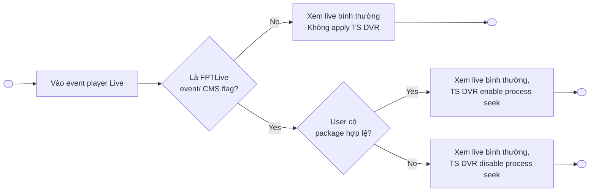
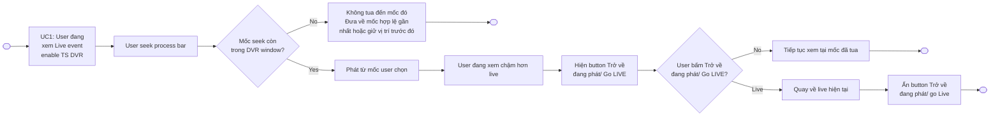
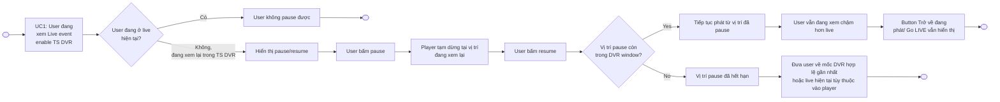

# Timeshift Seek — Functional Requirements

> Project: FPTPlay
> Epic: Event
> Feature: Timeshift Seek
> Audience: Product, BA, FE, BE, QA
> Status: Final implementation handoff
> Writing style: Caveman Vietnam — ít chữ, dễ đọc, đúng ý, không low-level
> Last updated: 2026-06-23

---

## 1. Description

Timeshift Seek giúp user đang xem **sự kiện live FPTLive** tua lại nội dung đã phát trong DVR window tối đa **8 tiếng**. User có thể xem lại đoạn đã qua, pause/resume khi đang xem lại trong TS DVR, hoặc bấm **GO LIVE** để quay về live edge.

Feature này **không áp dụng cho EPL**. User cần có gói hợp lệ. Event cần được bật cờ DVR qua CMS.

Khi event kết thúc, hệ thống không tự nhảy sang next event và không thay đổi logic next event hiện có. Sau event end, user vẫn có thể xem/tua lại trong phiên player hiện tại nếu TS DVR còn khả dụng.

---

## 2. Document History

| Version | Date | Updated By | Notes | Approved By |
|---|---|---|---|---|
| v1.0 | 2026-06-16 | Dylan | Initial split docs: full-event DVR and legacy post-event behavior. | Pending |
| v2.0 | 2026-06-22 | Dylan | Rewrite theo requirement mới: DVR 8 giờ, chỉ FPTLive, loại EPL, có entitlement gate, CMS flag, không thumbnail, DVR sau event end trong phiên player hiện tại và không auto next. | Pending |
| v2.1 | 2026-06-23 | Dylan | Làm rõ DVR window bằng mô tả nghiệp vụ thay vì công thức; rà QA handoff. | Pending |
| v2.2 | 2026-06-23 | Dylan | Align docs về 4 UC chính; bỏ ended-event entry UC khỏi scope Timeshift Seek; đồng bộ wording hệ thống. | Pending |

---

## 3. Overview

### 3.1 Goal

User đang xem live event có thể tua lại nội dung đã phát, tạm dừng/xem tiếp khi đang xem lại trong TS DVR, rồi quay về live edge khi muốn.

### 3.2 Platform scope

| Platform | Scope | Notes |
|---|---|---|
| iOS | In | hệ thống hỗ trợ DVR seek cho HLS/DASH nếu platform/player cho phép. |
| Android | In | hệ thống hỗ trợ DVR seek cho HLS/DASH nếu platform/player cho phép. |
| Web | In | Web hỗ trợ DVR seek cho HLS/DASH nếu có; không có thumbnail preview. |
| SmartTV / Box | In | TV/Box giữ seek đơn giản, dùng được bằng remote/D-pad; không có thumbnail preview. |

### 3.3 Event scope

| Event type/source | Scope | Rule |
|---|---|---|
| FPTLive event | In scope | DVR bật theo CMS flag nếu stream hỗ trợ DVR và user có entitlement. |
| EPL event | Out of scope | Không bật DVR/start-over, kể cả khi config chung có DVR. |
| Non-FPTLive event | Out of scope by default | Chỉ bật nếu sau này có requirement rõ. |
| User đang trong player khi event end | In scope | Có thể tiếp tục xem/tua lại trong phiên player hiện tại nếu TS DVR còn khả dụng; không auto next. |

### 3.4 User scope

| User type | Scope | Notes |
|---|---|---|
| User có package hợp lệ | In scope | Hệ thống có thể bật DVR khi tất cả gate pass. |
| User không có package hợp lệ | Limited | Hệ thống không expose DVR playback; hệ thống ẩn/disable DVR seek. |
| Anonymous / guest | Limited | Không có DVR access trừ khi entitlement rule cho phép rõ. |
| Admin/CMS operator | Supporting actor | Bật/tắt DVR flag theo từng event trong CMS. |

### 3.5 In scope

- Start over / DVR seek cho FPTLive event đủ điều kiện.
- DVR window tối đa 8 giờ.
- Hỗ trợ HLS và DASH DVR stream khi có.
- CMS flag để bật/tắt DVR theo từng event.
- Check entitlement trước khi trả DVR link.
- Không có seek thumbnail preview.
- Sau event end, user vẫn có thể xem/tua lại trong phiên player hiện tại nếu TS DVR còn khả dụng.

### 3.6 Out of scope

- EPL DVR/start-over.
- Auto-jumping sang next event.
- Seek thumbnail sprite/VTT.
- Offline download.
- Chi tiết CMS UI ngoài flag/field cần thiết.

---

## 4. Entry Points

| # | Entry Point | User action / System trigger | Surface | Expected result |
|---:|---|---|---|---|
| 1 | Event detail → Watch | User mở live FPTLive event | Player | Player load live stream; DVR seek active nếu tất cả gate pass. |
| 2 | Player seekbar | User drags/clicks/D-pad seeks backward | Player controls | Playback starts from selected DVR position. |
| 3 | Pause / Resume trong TS DVR | User đang xem lại trong TS DVR và bấm pause/resume | Player controls | Playback resume từ paused position nếu còn trong DVR window. |
| 4 | Event end khi user còn trong player | Stream/status báo event ended | Player | Hiện ended/backdrop theo logic hiện tại; giữ DVR session nếu còn hợp lệ. |

---

## 5. Use Case Summary

Use case lấy từ goal/branch thật. Không ép số lượng cố định.

| Use Case ID | Use Case | Primary Actor | Trigger | Outcome |
|---|---|---|---|---|
| TS-UC-001 | Mở FPTLive event có DVR | Logged-in User | User mở live event | User xem live bình thường; TS DVR enabled/disabled theo điều kiện thực tế. |
| TS-UC-002 | Tua lại trong DVR window / GO LIVE | Logged-in User | User seek process bar | User xem từ mốc đã tua hoặc quay về live hiện tại bằng **Trở về đang phát / GO LIVE**. |
| TS-UC-003 | Pause / Resume trong TS DVR | Logged-in User | User đang xem lại trong TS DVR và bấm pause/resume | User tiếp tục phát từ vị trí pause nếu còn trong DVR window. |
| TS-UC-004 | Event end khi user còn trong player | Logged-in User, hệ thống | Event kết thúc trong lúc user đang xem | TS DVR có thể tiếp tục trong active session nếu còn hợp lệ; next event theo logic hiện tại. |

User flow hiện tại gồm 4 UC chính. Các nhánh như DVR không khả dụng, CMS flag, package, GO LIVE được cover trong UC tương ứng; không tách thành UC riêng.

---

## 6. Business Rules

### 6.1 Điều kiện bật DVR

1. DVR chỉ bật khi event thỏa đủ các điều kiện: là **FPTLive event**, không phải EPL, CMS flag DVR đang bật, user có package/entitlement hợp lệ, và stream hỗ trợ DVR playback.
2. Nếu thiếu bất kỳ điều kiện nào, hệ thống chạy live playback bình thường và không hiện thanh tua DVR.
3. Hệ thống chỉ hiển thị thanh tua DVR khi hệ thống xác nhận event này được phép tua lại.

### 6.2 Cách tua DVR

1. User chỉ tua lại được trong phần nội dung đã phát, tối đa **8 giờ gần nhất**.
2. Nếu event mới live chưa đủ 8 giờ, user có thể tua về từ đầu event.
3. User không được seek trước phần DVR cho phép hoặc sau live edge.
4. Seek không có thumbnail. Tooltip chỉ cần hiển thị timestamp nếu cần.
5. Khi user đang ở live edge, GO LIVE ẩn.
6. Khi user đang xem chậm hơn live, hệ thống hiện GO LIVE.
7. Pause/resume chỉ hiển thị khi user đang xem lại trong TS DVR. Khi user đang ở live hiện tại, user không pause được.
8. Nếu paused position còn trong DVR window, hệ thống tiếp tục phát từ vị trí đã pause.
9. Nếu paused position đã hết hạn, hệ thống đưa user về mốc DVR hợp lệ gần nhất hoặc live hiện tại tùy thuộc vào player.

### 6.3 Khi event kết thúc

1. Khi event vừa end, hệ thống có thể giữ backdrop / next-event prompt hiện tại.
2. Nếu user đang watch/seek/pause trong player lúc event end, hệ thống không tự chuyển sang next event.
3. Next event nếu có thì chỉ là CTA thủ công; Timeshift không can thiệp rule chọn next event.
4. Sau event end, user vẫn có thể xem/tua lại trong phiên player hiện tại nếu user đã ở trong player trước khi event end.
5. TS DVR sau event end vẫn phải đủ điều kiện: entitlement, CMS flag, stream availability, và DVR window.
6. Nếu DVR expired hoặc không khả dụng trong phiên player hiện tại, hệ thống ẩn DVR controls và giữ safe ended/unavailable state.
7. Khi playback trong TS DVR chạy tới endtime lần nữa, hệ thống quay lại End State/Backdrop; không tự replay loop.
8. Next Event/Auto Next Event đi theo logic hiện tại; Timeshift không can thiệp rule chọn next event.

---

## 7. Functional Requirements

### TS-US-001 — User mở live FPTLive event có DVR

- User mở một sự kiện FPTLive đang live.
- User muốn xem live bình thường, nhưng có thể tua lại nếu đủ điều kiện.
- Hệ thống chỉ bật DVR seek khi event/user/stream hợp lệ.

**Description:**
User mở player. Hệ thống check event, gói user, CMS flag và stream support. Nếu đủ điều kiện, hệ thống hiển thị DVR seek. Nếu không đủ, user vẫn xem live theo khả năng hiện tại.

#### TS-UC-001 — Mở event → Check DVR availability

**Activity Flows:**



| Field | Details |
|---|---|
| Actor | Logged-in User, hệ thống |
| Triggers | User mở live event player. |
| Pre-condition | Event tồn tại. User có quyền mở player. |
| Basic Path | 1. User vào event player Live.<br>2. Hệ thống check event có phải FPTLive và CMS flag có bật không.<br>3. Nếu không thỏa điều kiện, user xem live bình thường và không apply TS DVR.<br>4. Nếu thỏa điều kiện, hệ thống check package của user.<br>5. Nếu user có package hợp lệ, user xem live bình thường và TS DVR enable process seek.<br>6. Nếu user không có package hợp lệ, user xem live bình thường và TS DVR disable process seek. |
| Post-condition | Player mở thành công. User luôn xem live bình thường; TS DVR enabled hoặc disabled theo điều kiện thực tế. |
| Alternative Path | Không có. Các nhánh điều kiện đã được thể hiện trong Basic Path. |
| Exception Handling | Nếu hệ thống không check được điều kiện TS DVR, user vẫn xem live bình thường và TS DVR không được bật. |

### TS-US-002 — User tua lại trong DVR window

- User đang xem live event có DVR.
- User muốn tua lại đoạn đã phát.
- User có thể quay về live edge bằng **GO LIVE**.

**Description:**
User kéo seekbar về mốc trước đó. Hệ thống chỉ cho tua trong DVR window tối đa 8 giờ. Khi user đang behind live, hệ thống hiển thị trạng thái phù hợp và nút **GO LIVE**.

#### TS-UC-002 — Seek behind live / GO LIVE

**Activity Flows:**



| Field | Details |
|---|---|
| Actor | Logged-in User, hệ thống |
| Triggers | User seek process bar. |
| Pre-condition | User đang xem live event enable TS DVR. |
| Basic Path | 1. User seek process bar.<br>2. Hệ thống check mốc seek còn trong DVR window không.<br>3. Nếu mốc seek còn trong DVR window, hệ thống phát từ mốc user chọn.<br>4. User đang xem chậm hơn live.<br>5. Hệ thống hiện button **Trở về đang phát / Go LIVE**.<br>6. Nếu user bấm **Trở về đang phát / Go LIVE**, hệ thống quay về live hiện tại và ẩn button này.<br>7. Nếu user không bấm, user tiếp tục xem tại mốc đã tua. |
| Post-condition | User tiếp tục xem tại mốc đã tua hoặc quay về live hiện tại. |
| Alternative Path | Nếu mốc seek không còn trong DVR window, hệ thống không tua đến mốc đó và đưa user về mốc hợp lệ gần nhất hoặc giữ vị trí trước đó. |
| Exception Handling | Nếu hệ thống không xử lý được seek, user giữ vị trí xem trước đó và TS DVR không chuyển sang mốc lỗi. |

### TS-US-003 — User pause / resume trong TS DVR

- Pause/resume chỉ hiển thị khi user đang xem lại trong TS DVR.
- Khi user đang ở live hiện tại, user không pause được.
- Khi resume, user xem tiếp từ vị trí đã pause nếu vị trí đó còn trong DVR window.

**Description:**
User chỉ pause/resume sau khi đã tua lại và đang xem trong TS DVR. Nếu user đang ở live hiện tại, hệ thống không hiển thị pause/resume nên user không pause được.

#### TS-UC-003 — Pause / resume trong TS DVR

**Activity Flows:**



| Field | Details |
|---|---|
| Actor | Logged-in User, hệ thống |
| Triggers | User đang xem lại trong TS DVR và bấm pause/resume. |
| Pre-condition | User đang xem live event enable TS DVR. |
| Basic Path | 1. Hệ thống kiểm tra user đang ở live hiện tại hay đang xem lại trong TS DVR.<br>2. Nếu user đang ở live hiện tại, user không pause được.<br>3. Nếu user đang xem lại trong TS DVR, hệ thống hiển thị pause/resume.<br>4. User bấm pause, Player tạm dừng tại vị trí đang xem lại.<br>5. User bấm resume.<br>6. Nếu vị trí pause còn trong DVR window, hệ thống tiếp tục phát từ vị trí đã pause.<br>7. User vẫn đang xem chậm hơn live và button **Trở về đang phát / Go LIVE** vẫn hiển thị. |
| Post-condition | User tiếp tục xem chậm hơn live trong TS DVR, hoặc được đưa về mốc DVR hợp lệ gần nhất / live hiện tại tùy thuộc vào player. |
| Alternative Path | Nếu vị trí pause đã hết hạn, hệ thống đưa user về mốc DVR hợp lệ gần nhất hoặc live hiện tại tùy thuộc vào player. |
| Exception Handling | Nếu hệ thống không xử lý được resume, user không chuyển sang mốc lỗi; hệ thống giữ trạng thái xem an toàn theo player. |

### TS-US-004 — Event end khi user còn trong player

- Event kết thúc trong lúc user đang xem.
- Hệ thống có thể hiện backdrop / next event CTA.
- Hệ thống không tự nhảy sang next event và không thay đổi logic next event hiện có.

**Description:**
Khi event end, hệ thống giữ user trong player session hiện tại. Nếu DVR còn hợp lệ, user vẫn có thể xem lại trong session đó. Next event nếu có thì vẫn theo logic hiện tại và chỉ là CTA thủ công.

#### TS-UC-004 — Event end → Giữ DVR session nếu còn hợp lệ

**Activity Flows:**


| Field | Details |
|---|---|
| Actor | Logged-in User, hệ thống |
| Triggers | Event chuyển End hoặc stream báo kết thúc. |
| Pre-condition | User đang ở trong player trước khi event kết thúc. |
| Basic Path | 1. User đang xem live event enable TS DVR.<br>2. Event kết thúc, hệ thống hiện backdrop sự kiện.<br>3. Nếu DVR session còn hợp lệ, hệ thống giữ TS DVR enable trong session xem hiện tại.<br>4. User vẫn có thể xem/tua trong TS DVR.<br>5. Khi playback trong TS DVR chạy tới endtime lần nữa, hệ thống quay lại End State/Backdrop.<br>6. Từ End State/Backdrop, user có thể tua lại tiếp, thoát player, hoặc đi theo Next Event/Auto Next Event nếu logic hiện tại hỗ trợ. |
| Post-condition | User tiếp tục xem/tua trong TS DVR, thoát player, hoặc chuyển sang next event theo logic hiện tại. |
| Alternative Path | Nếu DVR session không còn hợp lệ, hệ thống hiển thị **Sự kiện đã kết thúc** và end flow. |
| Exception Handling | Nếu hệ thống không thể tiếp tục phát TS DVR trong session hiện tại, hệ thống hiển thị **Sự kiện đã kết thúc** và không mở DVR session mới. |

## 8. Screen Element Specification

### 8.1 Figma / Design Reference

| Item | Link / Note |
|---|---|
| Final Figma | Chưa có link Figma final trong scope hiện tại; QA dùng text wireframe và surface elements trong tài liệu này để verify behavior. |
| Existing design docs | `features/final-docs/Event/Timeshift-Seek/design/design-specification.md` is legacy and superseded by this file for changed behavior. |
| Mockup | Không auto-create. Chỉ tạo khi user yêu cầu rõ. |

### 8.2 Information Architecture

```text
Event Player
└── Playback Area
    ├── Video surface
    ├── Event-ended overlay / backdrop
    └── Optional next-event CTA
└── Player Controls
    ├── LIVE badge / behind-live indicator
    ├── Seekbar without thumbnail
    ├── Time tooltip only
    ├── GO LIVE button
    └── Error / entitlement messages
```

### 8.4 Surface Details by Surface

Dùng 8.4 làm nơi duy nhất chứa UI detail theo surface. Không tách surface inventory, status matrix, hoặc placement rules thành 8.3 / 8.5 / 8.6 riêng.

#### SURF-001 — Live Player có DVR enabled

**Surface details:**

| Field | Details |
|---|---|
| Surface / Location | Event player controls |
| Platform | iOS / Android / Web / TV |
| When shown | Event đang live và `dvr_enabled=true`. |
| Related UC / Flow | TS-UC-001, TS-UC-002, TS-UC-003 |
| Placement notes | Seekbar nằm trong player control area; TV dùng focus thân thiện với D-pad. |

**Sketching wireframe / Text-Based Wireframing:**

```text
Live Event Player — DVR enabled
┌──────────────────────────────────────────┐
│                Video Surface             │
│                                  [LIVE]  │
│                                          │
├──────────────────────────────────────────┤
│  18:30 ━━━━━●━━━━━━━━━━━━━━ LIVE 20:15   │
│        tooltip: 19:05 only, no thumbnail │
│  [Pause/Resume khi TS DVR] [GO LIVE]     │
└──────────────────────────────────────────┘
```

**Surface elements:**

| # | Element | States | Format / Copy | Rules / Notes |
|---:|---|---|---|---|
| 1 | Seekbar track | active, buffering, disabled | Time range | Active chỉ khi DVR enabled. Max range 8h. |
| 2 | Seek thumb | at live edge, behind live, dragging/focused | Position | Không kéo ra ngoài DVR window. |
| 3 | Time tooltip | visible khi hover/focus/drag | `HH:mm` hoặc `mm:ss` | Không có thumbnail preview. |
| 4 | LIVE badge | live edge, behind live, hidden after end | `LIVE` | Dim/behind state khi user behind live. |
| 5 | Pause/Resume button | visible, hidden, playing, paused | Standard player control | Chỉ hiển thị khi user đang xem lại trong TS DVR. |
| 6 | GO LIVE button | visible, hidden, disabled | `GO LIVE` / `Trực tiếp` | Chỉ hiện khi event còn live và user đang xem chậm hơn live. |
| 7 | Error/toast | hidden, visible | Localized copy | Cho case segment unavailable, entitlement, expired window. |

**Surface behavior notes:**

- Ở live edge: hiện `LIVE`; GO LIVE ẩn; user có thể seek backward nhưng không pause.
- Pause/resume chỉ hiển thị khi user đang xem lại trong TS DVR.
- Behind live: dim/behind treatment; cho seek, play/pause, và GO LIVE.
- Buffering: hiện loading treatment và giữ target position.
- DVR không khả dụng/no entitlement: ẩn hoặc disable DVR controls; chỉ hiện message/CTA đã approve khi product support.

**Surface-specific notes:**

- No thumbnail preview on any platform.
- If event duration > 8h, left edge is rolling 8h start, not event start.

#### SURF-002 — Event ended while user is inside player

**Surface details:**

| Field | Details |
|---|---|
| Surface / Location | Player overlay/backdrop after event end |
| Platform | iOS / Android / Web / TV |
| When shown | User đã ở trong player trước khi event kết thúc. |
| Related UC / Flow | TS-UC-004 |
| Placement notes | Backdrop/next-event prompt hiện tại có thể xuất hiện; next event chỉ là CTA khi DVR session active. |

**Sketching wireframe / Text-Based Wireframing:**

```text
Event Ended — Current DVR Session
┌──────────────────────────────────────────┐
│          Sự kiện đã kết thúc             │
│  Bạn có thể tiếp tục xem lại trong phiên │
│  hiện tại nếu nội dung còn khả dụng.     │
│                                          │
│  [Xem sự kiện tiếp theo]   [Thoát]       │
├──────────────────────────────────────────┤
│  18:30 ━━━━━●━━━━━━━━━━━━━━ END 20:15    │
│  no LIVE badge, no GO LIVE, no thumbnail │
└──────────────────────────────────────────┘
```

**Surface elements:**

| # | Element | States | Format / Copy | Rules / Notes |
|---:|---|---|---|---|
| 1 | Ended title | visible | `Sự kiện đã kết thúc` | Hiện khi event ended. |
| 2 | DVR session message | visible/hidden | Short copy | Hiện nếu current session còn replay DVR được. |
| 3 | Seekbar | active, disabled | Final DVR range | Active chỉ cho current session và DVR hợp lệ. |
| 4 | LIVE badge | hidden | — | Không có LIVE sau event end. |
| 5 | GO LIVE button | hidden | — | Không có live edge sau event end. |
| 6 | Next event CTA | visible/hidden | `Xem sự kiện tiếp theo` | Optional; theo logic hiện tại; không forced auto-jump khi DVR session active. |
| 7 | Exit button | visible | `Thoát` / Back | Thoát sẽ kết thúc current DVR session. |

**Surface behavior notes:**

- Ended session có DVR hợp lệ: hiện ended overlay và giữ final DVR seekbar active.
- Ended session không có DVR hợp lệ: hiện ended overlay/backdrop và ẩn DVR controls.
- Next event: chỉ hiện như manual action; không auto-jump khi user còn trong DVR session.

**Surface-specific notes:**

- Thời điểm event vừa End có thể dùng lại backdrop và next-event prompt hiện tại.
- Nếu user đang seek/watch/pause trong DVR, không interrupt bằng forced next-event transition.

## 9. Error Handling & User-Facing Messages

| Case | User-facing message | Behavior |
|---|---|---|
| DVR không khả dụng | `Tua lại không khả dụng cho sự kiện này.` | Ẩn/disable seekbar. |
| User thiếu package | `Nội dung tua lại yêu cầu gói phù hợp.` | Ẩn DVR seek; chỉ hiện package CTA nếu product support. |
| Seek ngoài window | `Không thể tua đến thời điểm này.` | Đưa user về mốc hợp lệ gần nhất hoặc giữ vị trí trước đó. |
| Segment unavailable | `Nội dung tua lại đang tạm thời không khả dụng.` | Retry/buffer; giữ vị trí hợp lệ trước đó. |
| Event ended trong session | `Sự kiện đã kết thúc.` | Giữ TS DVR trong active session nếu còn hợp lệ; next event CTA optional theo logic hiện tại. |
| API error | `Không thể tải thông tin sự kiện. Vui lòng thử lại.` | Thử lại hoặc quay lại. |

---

## 10. References

| Item | Path / Link |
|---|---|
| Legacy product spec | `features/final-docs/Event/Timeshift-Seek/product/functional-specification.md` |
| Legacy userflow spec | `features/final-docs/Event/Timeshift-Seek/product/timeshift-seek-user-flows-functional-requirements.md` |
| Legacy API spec | `features/final-docs/Event/Timeshift-Seek/api/api-specification.md` |
| Legacy design spec | `features/final-docs/Event/Timeshift-Seek/design/design-specification.md` |
| Domain wiki | `sdlc-agent/wiki/Global/Domain/MediaStreaming/OTT/FPTPlay/DOM-MEDIASTREAMING-FPTPLAY-001.md` |

---

## 11. Handoff Checklist

- [x] Use Case Summary lấy từ goal/branch thật, không ép số lượng cố định.
- [x] Activity Flows cover đủ 4 UC hiện tại.
- [x] Mỗi flow có diagram + bảng Field/Details.
- [x] Surface details gom chung trong mục 8.4.
- [x] Mỗi surface chính có text-based wireframe + surface elements table.
- [x] Surface behavior nằm trong từng surface block.
- [x] Integration expectations nằm trong Business Rules.
- [x] Main và edge cases đã cover bằng use cases, flows, rules, và error messages.
- [ ] BE confirm endpoint/field name thực tế theo implementation.
- [ ] CMS confirm flag name và event source/competition fields thực tế.
