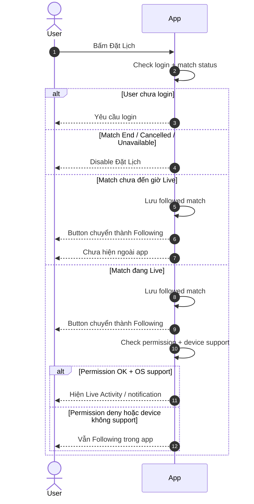
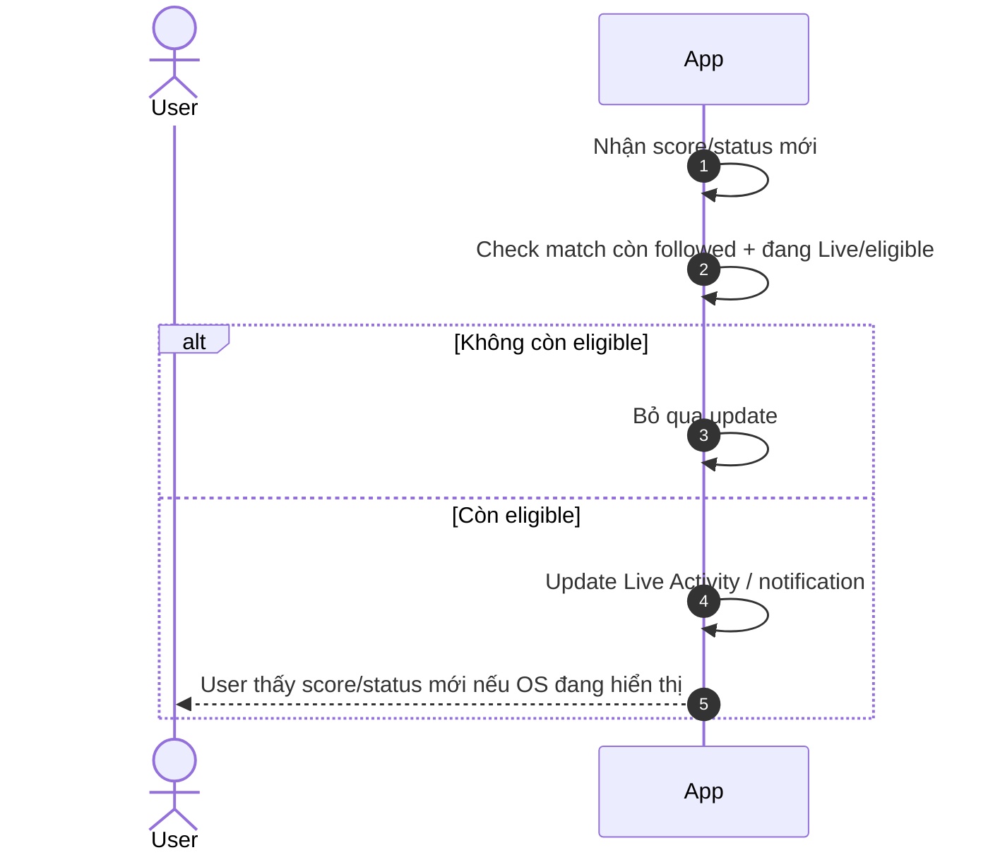
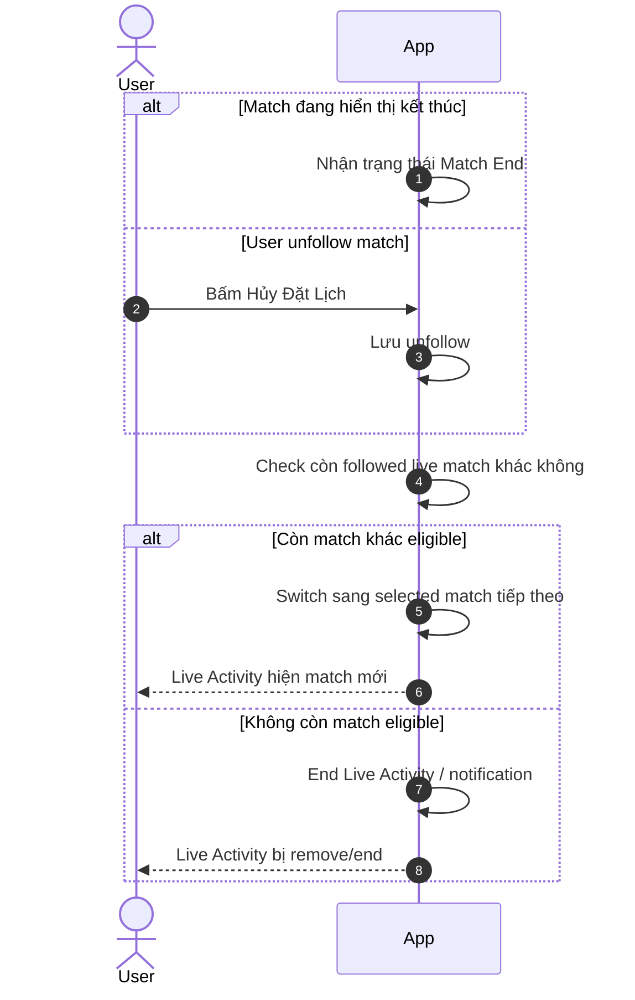
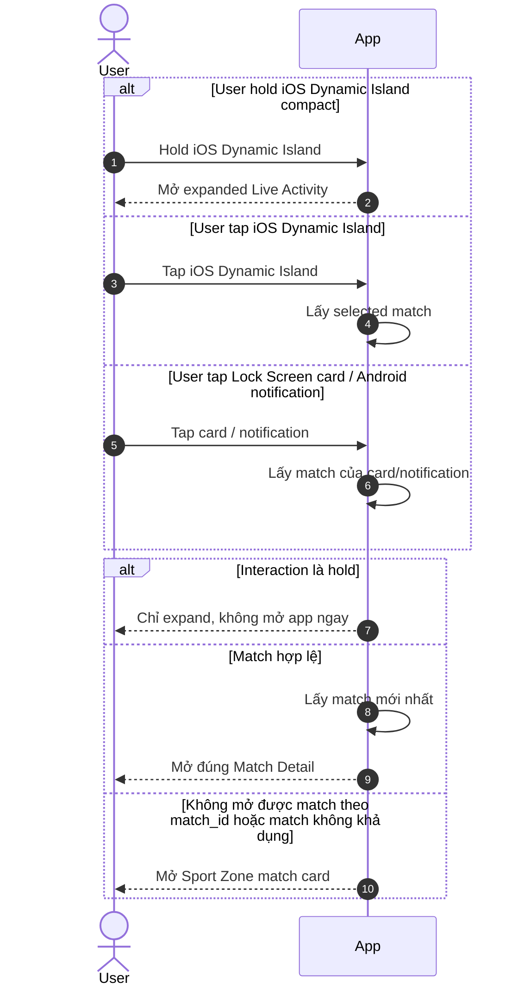

# Live Activity — Single Source-of-Truth Spec

> Project: FPTPlay
> Epic: Sport Zone
> Feature: Live Activity
> Audience: Product, BA, FE, BE, QA, iOS, Android
> Status: Final implementation handoff
> Base document: rewritten from `live-activity-user-flows.md` following Functional Requirements / Use Case format
> Writing style: Caveman Vietnam — ít chữ, dễ đọc, đúng ý, không low-level
> Last updated: 2026-08-18
> Consolidation note (2026-08-18): single source-of-truth spec per sub-feature. Merged from legacy split contracts: `product/functional-specification.md` (system functional requirements, state model, analytics, QA), `api/technical-contract.md` (Section 11 — API & Technical Contract), `design/design-contract.md` (Section 10 — UX & Design Contract), and `product/live-activity-user-flows.md` (Section 12 — Wireframes). Source PDF: `product/LiveAct.pdf` (read-only reference).

---

## 1. Description

Live Activity giúp user theo dõi trận đang live ngay trên **iOS Lock Screen**, **iOS Dynamic Island** và **Android ongoing notification**.

User có thể kích hoạt Live Activity qua **3 nguồn follow**:
- **Đặt Lịch** (`content_event_match`): follow trực tiếp 1 trận cụ thể.
- **Theo dõi Đội bóng** (`sport_team`): follow đội bóng; hệ thống resolve tất cả trận đang live của đội đó.
- **Theo dõi Mùa giải** (`sport_league`): follow mùa giải; hệ thống resolve tất cả trận đang live trong mùa giải đó.

Cả 3 nguồn đều tạo ra match subscriptions và đưa vào cùng 1 priority pipeline. Live Activity chỉ bật khi có trận đang live — không bật ngay lúc follow nếu chưa có trận live.

Live Activity complements the Notifications & Alert feature but has a separate lifecycle. It behaves like a **Notification + Widget** hybrid: server-side match events are delivered through iOS APNS/Live Activity update mechanisms, while the UI is rendered inside OS-constrained Dynamic Island/lock-screen templates.

- Epic: Sport Zone
- Feature: Live Activity
- Main user: Logged-in User
- Main platform: Mobile iOS, Mobile Android
- Main surfaces: iOS Dynamic Island, iOS Lock Screen Live Activity, Android ongoing notification
- Main intent: Follow trận/đội/mùa giải để xem live score/status nhanh khi trận đang Live
- Follow sources: Đặt Lịch (per-match), Theo dõi Đội bóng (team), Theo dõi Mùa giải (season)

### Success signals

| Signal | Target behavior |
|---|---|
| Start reliability | Eligible followed live matches create/update Live Activity on supported iOS devices. |
| Relevance | Live Activity represents the default first followed match, then a live/eligible priority followed match when multiple matches are followed. |
| Return-to-live | Users tap Live Activity and deeplink into the selected match. |
| Match state visibility | Score/status stay updated during the selected match and end correctly. |
| Quality | No stale activity after match end; no duplicate activity for same user/device/selected match. |

---

## 2. Document History

| Version | Date | Updated By | Notes | Approved By |
|---|---|---|---|---|
| v1.0 | 2026-06-04 | Dylan | Created from `live-activity-user-flows.md` using Functional Requirements / Use Case format. | Pending |
| v1.1 | 2026-06-05 | Dylan | Reworded to Caveman Vietnam. Simplified wording. Removed `Priority` and `Status` fields. Actor changed to Logged-in User. | Pending |
| v1.2 | 2026-06-05 | Dylan | Added template sections: Description, Document History, Overview, Non-functional Requirements, Design Specifications, References. | Pending |
| v1.3 | 2026-06-05 | Dylan | Clarified mobile iOS + mobile Android scope and minimum OS versions. | Pending |
| v1.4 | 2026-06-05 | Dylan | Mapped Global Business Rules into each Use Case using Caveman Vietnam wording. | Pending |
| v1.5 | 2026-06-05 | Dylan | Earlier draft considered Android Live Updates for Samsung-like surfaces. Superseded by v3.9 scope. | Pending |
| v1.6 | 2026-06-05 | Dylan | Shortened Platform scope and removed Website/TV rows. | Pending |
| v1.7 | 2026-06-05 | Dylan | Shortened In scope list. | Pending |
| v1.8 | 2026-06-05 | Dylan | Shortened Out of scope list. | Pending |
| v1.9 | 2026-06-05 | Dylan | Added permission cases: allow, deny, re-enable. | Pending |
| v2.0 | 2026-06-05 | Dylan | Added UI organization rules for text, score, logo, state, and event priority. | Pending |
| v2.1 | 2026-06-05 | Dylan | Changed Flow 1 diagram to Mermaid stateDiagram-v2. | Pending |
| v2.2 | 2026-06-07 | Dylan | Shortened Business Rules Applied in each Use Case to flow-specific rules only. Kept shared rules in Global Business Rules. | Pending |
| v2.3 | 2026-06-08 | Dylan | Restructured document into 9-section functional requirements outline. Moved UI Organization Rules into Screen Element Specification. Added error/message table. | Pending |
| v2.4 | 2026-06-08 | Dylan | Changed Business Rules back from table format to list format. | Pending |
| v2.5 | 2026-06-08 | Dylan | Restored Business Rules to table format. | Pending |
| v2.6 | 2026-06-08 | Dylan | Rewrote Business Rules into numbered list style with subheadings. | Pending |
| v2.7 | 2026-06-08 | Dylan | Restructured Screen Element Specification into Figma link, Information Architecture, and separate surface tables with rules/format columns. | Pending |
| v2.8 | 2026-06-08 | Dylan | Tightened Screen Element Specification wording in Caveman Vietnam style and clarified subtle brand/icon usage on Lock Screen. | Pending |
| v2.9 | 2026-06-08 | Dylan | Simplified Information Architecture into tree format. | Pending |
| v3.0 | 2026-06-08 | Dylan | Added Dynamic Island minimal surface. | Pending |
| v3.1 | 2026-06-08 | Dylan | Merged UI organization and surface format rules into Surface elements. | Pending |
| v3.2 | 2026-06-08 | Dylan | Simplified flow diagrams to use only User and App for non-technical readability. | Pending |
| v3.3 | 2026-06-08 | Dylan | Clarified Platform scope with OS/device/app version applicability. | Pending |
| v3.4 | 2026-06-08 | Dylan | Changed Platform scope from table to short bullet format. | Pending |
| v3.5 | 2026-06-08 | Dylan | Added logo field to Dynamic Island surfaces and hide icon when logo is missing. | Pending |
| v3.6 | 2026-06-08 | Dylan | Removed Dynamic Island status field and set score styling to tabular/monospace. | Pending |
| v3.7 | 2026-06-08 | Dylan | Clarified Dynamic Island Minimal as left-side score only; right side may belong to another app. | Pending |
| v3.8 | 2026-06-08 | Dylan | Aligned Dynamic Island Expanded fields with expanded match UI layout. | Pending |
| v3.9 | 2026-06-09 | Dylan | Clarified Android uses ongoing notification; Lock Screen visibility depends on OS/user settings. Removed Android Dynamic Island / Live Updates / Samsung Now Bar-like scope. | Pending |
| v4.0 | 2026-06-09 | Dylan | Reworded Android surface to ongoing notification and clarified Lock Screen visibility depends on OS/user settings. | Pending |
| v4.1 | 2026-06-09 | Dylan | Clarified match eligibility: Upcoming and Live can Đặt Lịch; only Live shows outside app; End disables button but keeps user history. | Pending |
| v4.2 | 2026-06-09 | Dylan | Moved permission behavior from Overview into Business Rules as Permission rules. | Pending |
| v4.3 | 2026-06-09 | Dylan | Clarified simultaneous event behavior: when multiple new events arrive together, display the latest event. | Pending |
| v4.4 | 2026-06-09 | Dylan | Clarified deeplink route fallback and added global Routing rules. | Pending |
| v4.5 | 2026-06-09 | Dylan | Tightened routing wording: visible cards route by match_id; fallback only when match_id is missing/corrupted or match cannot be opened. | Pending |
| v4.6 | 2026-06-09 | Dylan | Drift audit cleanup: aligned Đặt Lịch wording and clarified Upcoming only saves follow, Live starts outside-app surface. | Pending |
| v4.7 | 2026-06-09 | Dylan | Replaced route/match context wording with direct match_id routing to reduce ambiguity. | Pending |
| v4.8 | 2026-06-09 | Dylan | Changed route fallback destination from Followed Matches / Live Matches to Sport Zone match card. | Pending |
| v4.9 | 2026-07-17 | Dylan | Updated Dynamic Island Expanded: added latest_event row (full event type priority list, rescinded handling), expanded match clock/period states to include extra_time/penalties (ET, PSO), added shootout score display rule. Updated Lock Screen Expanded: expanded match clock/period states, replaced generic latest_event with full event type label mapping (goal/own_goal/penalty/missed_penalty/yellow_card/red_card/yellow_red_card/var/pen_shootout_goal/pen_shootout_miss/rescinded), added shootout score display rule. substitution excluded from both surfaces. | Pending |
| v5.0 | 2026-07-17 | Dylan | Added substitution event to both DI Expanded and Lock Screen Expanded latest_event display. Label: `🔄 Thay người · {relatedPlayerName} ▶ {playerName}`. Priority: lowest (after all other event types). | Pending |
| v5.1 | 2026-07-17 | Dylan | Expanded follow trigger sources: added Theo dõi Đội bóng (`sport_team`) and Theo dõi Mùa giải (`sport_league`) as valid Live Activity triggers alongside Đặt Lịch (`content_event_match`). Updated Description, Overview, User scope, In scope, Entry Points, UC-001, Business Rules (follow sources, eligibility, unfollow isolation rules). | Pending |
| v6.0 | 2026-08-18 | Dylan | Consolidated into single source-of-truth spec `product/Live-Activity.md`: merged functional-specification (system requirements, state model, analytics, QA), technical-contract (API section), design-contract (design section), user-flows wireframes. Legacy split files removed. | Pending |
| v6.1 | 2026-08-18 | PD update | Thêm display states (Section 8.4): default = progress bar realtime + event icons; event mới = text ~6s rồi về default; match end = 3 stat chính so sánh 2 đội (Phạt góc, Kiểm soát bóng, Thẻ vàng). Resolve conflict còn sót: key event không trigger auto-switch selected match (F-002, 10.5, 10.7). | Pending |
| v6.2 | 2026-08-18 | PD confirm | Chốt liên kết với Notifications & Alert: event trên Live Activity không config per-event; toggle Live feed = off → dừng update, giữ trạng thái cuối, không tự remove; không đồng bộ 2 chiều với OS Settings. | Pending |

---

## 3. Overview

### 3.1 Goal

User follow trận/đội bóng/mùa giải. Nếu có trận đang Live, App hiển thị live score/status ngoài app. User xem nhanh. User không cần mở app liên tục.

### 3.2 Platform scope

- **iOS:** apply từ **iOS 16.1+**.
  - **Dynamic Island:** chỉ iPhone có Dynamic Island.
  - **Lock Screen Live Activity:** chỉ iPhone hỗ trợ Live Activity.
- **Android:** apply từ **Android 8.0+ / API 26+**.
  - **Android 13+ / API 33+:** cần user cho phép notification.
  - **Android ongoing notification:** dùng ongoing notification. Notification có thể hiện trên Lock Screen nếu OS/user settings cho.
  - **Android Dynamic Island / Live Updates / Samsung Now Bar-like:** out of scope cho phase này. Không fake Dynamic Island.
- **FPT Play app version:** TBD theo release plan.
- **Website / TV:** out of scope.

### 3.3 Platform behavior

- iOS dùng tên **Live Activity**.
- Android dùng tên **ongoing notification** trong product scope.
- Product intent giống nhau: user xem score/status ngoài app.
- UI surface khác nhau theo OS. App không ép OS hiển thị giống nhau.
- Android phase này chỉ làm ongoing notification. Notification có thể hiện trên Lock Screen nếu OS/user settings cho. Không làm Dynamic Island / Live Updates / Samsung Now Bar-like surface.

### 3.4 User scope

| User type | Scope | Notes |
|---|---|---|
| Logged-in User | In scope | Main actor. |
| Guest | Limited | Phải login trước khi Đặt Lịch. |
| User Đặt Lịch 1 trận | In scope | Nếu trận đang Live, iOS Dynamic Island hiển thị selected match đó nếu device hỗ trợ. Android hiển thị qua ongoing notification. Notification có thể hiện trên Lock Screen nếu OS/user settings cho. |
| User Theo dõi Đội bóng | In scope | Hệ thống resolve tất cả trận live của đội đó thành implicit match subscriptions. Feeds vào priority pipeline. |
| User Theo dõi Mùa giải | In scope | Hệ thống resolve tất cả trận live trong mùa giải đó thành implicit match subscriptions. Feeds vào priority pipeline. |
| User Đặt Lịch nhiều trận / follow nhiều nguồn | In scope | iOS Dynamic Island chọn 1 selected match đang Live theo priority rule; Lock Screen có thể hiện nhiều trận đang Live nếu OS cho. Android dùng ongoing notification. |
| Admin/CMS user | Out of scope | Không thuộc feature này. |

### 3.5 In scope

- Đặt Lịch / Hủy Đặt Lịch match (per-match follow).
- Theo dõi Đội bóng / Hủy Theo dõi Đội bóng (team follow → implicit match subscriptions).
- Theo dõi Mùa giải / Hủy Theo dõi Mùa giải (season follow → implicit match subscriptions).
- Hiển thị score/status ngoài app trên iOS Live Activity hoặc Android ongoing notification.
- Update score/status cho match được resolve từ bất kỳ follow source nào đang Live.
- Tap để mở đúng Match Detail.
- Hold iOS Dynamic Island để xem expanded view.
- Match End/Unfollow (any source) thì switch hoặc end.
- PiP có thể chạy song song nếu OS cho phép.
- Analytics/performance instrumentation for exposure, tap, update delivery, staleness, priority selection, and failures.

### 3.6 Out of scope

- Active Match Detail/Player screen as a mandatory eligibility gate.
- App ép OS hiện Live Activity theo layout riêng.
- Multi-match list trong iOS Dynamic Island expanded (app-controlled multi-match list/`+N` aggregation).
- App-controlled override of OS multi-activity presentation on Lock Screen.
- Android Dynamic Island / Live Updates / Samsung Now Bar-like support trong phase này.
- Fake Dynamic Island trên Android.
- Normal push notification copy/rules (owned by `Sport-Zone / Notifications-Alert`).
- Payment/entitlement logic.
- Marketing notifications.
- Full Match Detail implementation.
- Admin/CMS tooling.

### 3.7 Future scope / later

- App-controlled multi-match expanded summary for followed matches, if OS/template constraints allow later.
- Interactive Live Activity actions if platform/product supports later.
- Android OEM-specific Dynamic Island/persistent widget equivalents, starting with Samsung if feasibility is confirmed, then Xiaomi/other OEMs later.
- Sport-specific expanded layouts.
- Match TimeLine event type handling (to be defined by product separately).

### 3.8 Non-functional requirements

| ID | Requirement | Notes |
|---|---|---|
| LA-NFR-001 | Update speed | Score/status mới tới Server thì App/OS nhận update trong thời gian hợp lý. Nếu update fail/chậm, UI giữ trạng thái tốt gần nhất. |
| LA-NFR-002 | Reliability | Không tạo duplicate follow/subscription. Event trùng bị bỏ qua. End fail thì retry trong giới hạn. |
| LA-NFR-003 | OS constraint | OS quyết định visible/collapsed/stacked/expanded. App không assume Lock Screen luôn hiện nhiều activity. |
| LA-NFR-004 | Security & privacy | Chỉ hiển thị thông tin trận. Không hiện token, user id, device id. Deeplink phải validate `match_id` trước khi mở Match Detail. |
| LA-NFR-005 | Observability | Log đủ follow/register/start/update/end/deeplink-route/unsupported device để debug lifecycle. |

### 3.9 Definitions

| Term | Meaning |
|---|---|
| Live Activity | iOS persistent system surface that shows real-time match state. |
| Follow source | The user action that creates a Live Activity subscription: Đặt Lịch (`content_event_match`), Theo dõi Đội bóng (`sport_team`), or Theo dõi Mùa giải (`sport_league`). |
| Explicit match follow | Direct per-match follow via Đặt Lịch (`content_event_match`). |
| Implicit match follow | Matches resolved from a team or season follow subscription. System derives match list from `sport_team` or `sport_league` follow state. |
| Followed match | A match subscription active for the user, from any follow source. This is the Live Activity eligibility unit. |
| Selected Live Activity match | The one followed match currently represented on Dynamic Island under Option A. Default selection starts from the earliest-resolved eligible match, then re-checks live/eligible followed matches by priority. |
| Priority rule | Deterministic rule that selects one match when user follows multiple eligible matches. |
| Dynamic Island compact | Small Dynamic Island representation shown on supported iOS devices; severe UI constraint, one selected match only. |
| Dynamic Island expanded | Larger view shown after compact Live Activity is long-pressed/held. |
| Lock-screen Live Activity | Live Activity view shown on iOS lock screen; may show one or multiple followed live match activities if OS allows, with presentation constrained/handled by OS. |
| Normal notification | Push notification defined by Notifications & Alert. Live Activity uses notification delivery concepts but is a separate persistent system surface. |
| Deeplink | App route that opens live match/detail. |

---

## 4. Entry Points

| # | Entry Point | User action / System trigger | Surface | Expected result |
|---:|---|---|---|---|
| 1 | Sport Zone match card | User bấm **Đặt Lịch** | In-app | App check login/eligibility, lưu explicit per-match follow (`content_event_match`). Nếu match đang Live thì bật Live Activity / notification nếu có thể. |
| 2 | Match Detail | User bấm **Đặt Lịch** hoặc **Theo dõi Đội bóng** | In-app | **Đặt Lịch**: lưu per-match follow. **Theo dõi Đội bóng**: lưu team follow (`sport_team`); resolve live matches của team. Nếu có match Live thì bật Live Activity / notification nếu có thể. |
| 3 | Team page | User bấm **Theo dõi Đội bóng** | In-app | Lưu team follow (`sport_team`); resolve live matches của team. Nếu có match Live thì bật Live Activity / notification nếu có thể. |
| 4 | Season/League page | User bấm **Theo dõi Mùa giải** | In-app | Lưu season follow (`sport_league`); resolve live matches trong mùa giải. Nếu có match Live thì bật Live Activity / notification nếu có thể. |
| 5 | Following button (any source) | User bấm **Hủy Đặt Lịch / Hủy Theo dõi** | In-app | App lưu unfollow, invalidate subscriptions từ source đó. Re-evaluate remaining eligible matches. Switch hoặc end Live Activity theo trạng thái còn lại. |
| 6 | Live score/status feed | Server nhận score/status/event mới | Server/App/OS | Server gửi update cho followed matches đang Live còn eligible. |
| 7 | iOS Dynamic Island compact | User tap | Dynamic Island | Mở Match Detail của selected match. |
| 8 | iOS Dynamic Island compact | User hold/long press | Dynamic Island | OS mở expanded Live Activity. Không deeplink ngay. |
| 9 | iOS Dynamic Island expanded | User tap | Dynamic Island expanded | Mở Match Detail của selected match nếu platform cho tap target. |
| 10 | iOS Lock Screen card | User tap card | Lock Screen | Mở Match Detail của match trên card đó. |
| 11 | Android ongoing notification | User tap notification | Android Lock Screen / Notification Shade | Mở Match Detail của match trên notification đó. |
| 12 | OS Settings permission | User bật lại permission | OS Settings / App resume | App sync permission. Nếu còn followed match đang Live/eligible thì bật lại Live Activity / notification. |

---

## 5. Use Case Summary

| Use Case ID | Use Case | Primary Actor | Trigger | Outcome |
|---|---|---|---|---|
| LA-UC-001 | Đặt Lịch / Theo dõi Đội bóng / Theo dõi Mùa giải → Save Follow / Start Live Activity when Live | Logged-in User | User bấm **Đặt Lịch**, **Theo dõi Đội bóng**, hoặc **Theo dõi Mùa giải** | Follow được lưu. Nếu có match đang Live từ nguồn đó, Live Activity / notification bật nếu permission và OS support. |
| LA-UC-002 | Live Score Event → Update Live Activity | Server, App | Score/status/event mới | Live Activity / notification hiển thị thông tin mới nhất nếu update OK và OS cho hiện. |
| LA-UC-003 | Match End / Unfollow → Switch or End Live Activity | Logged-in User, Server | Match End hoặc user bấm **Hủy Đặt Lịch** | Activity của trận đó bị remove/end. iOS Dynamic Island switch sang trận khác nếu còn eligible. |
| LA-UC-004 | Interact with Live Activity → Expand or Deeplink | Logged-in User | User tap/hold Live Activity | User thấy expanded view hoặc vào đúng Match Detail; fallback chỉ dùng khi route/data lỗi. |

---

## 6. Business Rules

### Global Business Rules

#### Live Activity display rules

1. User phải chủ động bấm **Đặt Lịch**, **Theo dõi Đội bóng**, hoặc **Theo dõi Mùa giải** thì App mới lưu follow subscription hoặc bật Live Activity / notification.
2. Cả 3 nguồn follow đều hợp lệ để kích hoạt Live Activity: `content_event_match` (per-match), `sport_team` (team), `sport_league` (season).
3. Team/Season follow tạo implicit match subscriptions cho tất cả trận đang live của team/season đó; explicit per-match follow tạo direct subscription.
4. Live Activity chỉ bật khi có trận đang live — không bật ngay lúc follow nếu chưa có trận live.
5. iOS Dynamic Island chỉ hiện 1 selected followed match.
6. Lock Screen có thể hiện nhiều followed matches đang Live nếu OS cho.
7. Server update các followed matches đang Live còn eligible.
8. App/Product quyết định nội dung hiển thị cho từng match.
9. OS quyết định cách hiện thật: số lượng activity, thứ tự, collapse, expand, stack.
10. iOS Dynamic Island compact có 2 interaction chính: tap mở Match Detail; hold mở expanded Live Activity.
11. iOS Expanded Dynamic Island vẫn chỉ hiện selected match. MVP không làm app-controlled multi-match list trong expanded view.
12. PiP và Live Activity là 2 surface khác nhau: PiP = video playback; Live Activity = live score/status.
13. Nếu PiP và Live Activity cùng hiện, tap Live Activity vẫn mở đúng màn đích. PiP tiếp tục nếu OS cho; chỉ đóng khi user đóng hoặc OS bắt buộc.
14. Trận eligible để **Đặt Lịch** khi status là **Upcoming / chưa đến giờ Live** hoặc **Live / đang Live**.
15. Trận **End** thì disable button **Đặt Lịch**, nhưng giữ history Đặt Lịch của user.
16. Trận chưa đến giờ Live chỉ lưu Đặt Lịch trong app. Không hiển thị data ngoài Lock Screen / Dynamic Island / notification.
17. Trận đang Live mới được hiển thị data ngoài Lock Screen / Dynamic Island / notification nếu permission/device/OS cho.
18. Follow thành công khác với hiển thị ngoài app.
19. Permission từ chối không được làm mất followed match.
20. Mở lại permission thì App sync lại và bật lại nếu match còn Live/eligible.
21. App không ép iOS/Android hiển thị giống nhau.
22. Android chỉ làm ongoing notification trong phase này. Notification có thể hiện trên Lock Screen nếu OS/user settings cho. Không làm Dynamic Island / Live Updates / Samsung Now Bar-like support.
23. Update fail thì giữ trạng thái tốt gần nhất.
24. Event trùng/cũ thì bỏ qua.
25. Live Activity có 2 display state chính khi trận đang Live: **default state** (progress bar realtime + event icons) và **event state** (text event tạm thời). Xem chi tiết tại Section 8.4.
26. Khi nhận event mới (bàn thắng, thẻ đỏ, thẻ vàng...), Live Activity hiển thị text event khoảng **6 giây**, sau đó tự quay về default state (progress bar).
27. Khi trận kết thúc, Live Activity hiển thị **3 event chính dạng thống kê so sánh giữa 2 đội** (VD: Phạt góc, Kiểm soát bóng, Thẻ vàng) trước khi switch/end. Data thống kê đã có sẵn từ match feed.

#### Match eligibility rules

1. **Upcoming / chưa đến giờ Live** → enable **Đặt Lịch**. App lưu followed match. Không start Live Activity / notification bên ngoài app.
2. **Live / đang Live** → enable **Đặt Lịch**. App lưu followed match. Nếu permission/device/OS support thì start Live Activity / notification.
3. **End / kết thúc** → disable **Đặt Lịch**. Không tạo follow mới. Nếu user từng Đặt Lịch trước đó, App giữ history.
4. **Cancelled / Postponed / Unavailable** → disable **Đặt Lịch**, trừ khi Product có rule riêng cho đặt trước.
5. Permission/device/OS support không phải điều kiện để enable **Đặt Lịch**. Đây chỉ là điều kiện để hiện ngoài app.
6. **Unfollow bất kỳ nguồn nào**: invalidate subscriptions từ nguồn đó. Re-evaluate remaining eligible matches từ tất cả nguồn còn lại. Nếu còn eligible match → switch. Không còn → end Live Activity.
7. **Unfollow Team** không ảnh hưởng explicit per-match follow (`content_event_match`) và ngược lại.

#### Permission rules

1. **Permission đồng ý** → App bật Live Activity / notification nếu match đang Live, eligible, và OS/device support.
2. **Permission từ chối** → User vẫn Đặt Lịch trong app. Ngoài app không hiện Live Activity / notification. App hiện hướng dẫn bật lại.
3. **Mở lại permission** → User vào OS Settings bật lại. App sync lại permission. Nếu còn followed match đang Live/eligible, App bật lại Live Activity / notification.
4. **iOS Live Activities bị tắt** → fallback trong app. Không làm mất followed match.
5. **Android 13+ notification bị deny** → fallback trong app. Không spam permission prompt.
6. Permission/device/OS support chỉ quyết định hiển thị ngoài app. Không quyết định việc user có được **Đặt Lịch** hay không.

#### Routing rules

1. Mỗi Live Activity / Lock Screen card / Android ongoing notification phải có route payload chứa `match_id`.
2. Tap iOS Dynamic Island → mở Match Detail của selected match hiện tại.
3. Tap Lock Screen card / Android ongoing notification → mở Match Detail của `match_id` trên card/notification đó.
4. Hold iOS Dynamic Island → OS mở expanded view. Không deeplink ngay.
5. Nếu app cold start từ tap → app mở lên rồi route đến Match Detail.
6. Nếu user chưa login/session expired → yêu cầu login, sau đó route lại Match Detail nếu `match_id` còn hợp lệ.
7. Nếu `match_id` thiếu/corrupted, match bị xóa, hoặc App không mở được Match Detail theo `match_id` sau khi user tap → mở fallback **Sport Zone match card**.
8. Fallback route chỉ dùng khi App không mở được Match Detail theo `match_id` sau khi user tap, hoặc match không còn khả dụng.
9. Card/notification đang hiển thị bình thường thì phải có `match_id` đúng.
10. App không stack trùng nhiều Match Detail khi user tap lặp.

#### iOS Dynamic Island Priority Rule

1. iOS Dynamic Island chỉ có 1 selected match tại 1 thời điểm.
2. Chọn trận user Đặt Lịch sớm nhất và đang Live/eligible.
3. Selected match End / Unfollow / không eligible → chuyển sang followed match tiếp theo đang Live/eligible.
4. Không còn followed match Live/eligible → end iOS Dynamic Island Live Activity.
5. Không tự nhảy match vì trận khác có goal/key event. Tránh làm user rối.

#### System / API rules (from legacy functional specification)

- **BR-011:** Live Activity start/update/end must be idempotent per `user_id + device_id + match_id + event_id`.
- **BR-014:** If user manually dismisses Live Activity, system must not recreate it immediately without renewed follow/action or priority-changing match event.
- **BR-018:** iOS remote Live Activity update feasibility depends on APNS/ActivityKit confirmation by iOS/backend.
- **BR-020:** Product owns template/data definition; engineering must implement within OS UI constraints.
- **BR-021:** Analytics/performance instrumentation is required for exposure, tap-through, update latency, staleness, failures, priority switches, and device/OEM coverage.

---

## 7. Functional Requirements

### LA-US-001 — User Đặt Lịch trận để theo dõi Live Activity

- User muốn đặt lịch theo dõi trận sắp Live hoặc đang Live.
- User muốn xem tỉ số/trạng thái ngoài iOS Lock Screen / iOS Dynamic Island / Android ongoing notification.
- User không muốn mở app liên tục.

**Description:**
User bấm **Đặt Lịch**. App lưu trận user muốn theo dõi. Nếu trận đang Live và máy/OS hỗ trợ, Live Activity bật. Nếu trận chưa đến giờ Live, App chỉ lưu Đặt Lịch trong app và chờ trận Live.

#### LA-UC-001 — Đặt Lịch → Save Follow / Start Live Activity when Live

**Activity Flows:**



| Field | Details |
|---|---|
| Description | User Đặt Lịch 1 trận hợp lệ. Upcoming thì chỉ lưu trong app. Live thì bật Live Activity nếu có thể. |
| Actor | Logged-in User, App |
| Triggers | User bấm **Đặt Lịch** ở Match Detail hoặc Sport Zone match card. |
| Pre-condition | User đang xem trận có thể Đặt Lịch. Trận chưa đến giờ Live hoặc đang Live. Button đang enabled. |
| Basic Path | 1. User bấm **Đặt Lịch**.<br>2. App check login.<br>3. App check match status.<br>4. Match chưa đến giờ Live hoặc đang Live → Server lưu trận vào followed matches.<br>5. App đổi button thành **Following**.<br>6. Nếu match chưa đến giờ Live → chưa hiện Live Activity / notification ngoài app.<br>7. Nếu match đang Live → App check permission + device/OS support.<br>8. Permission OK → bật Live Activity / notification.<br>9. Permission bị từ chối → vẫn follow, nhưng không hiện ngoài app. |
| Post-condition | Trận nằm trong followed matches. Button là **Following**. Nếu match đang Live, Live Activity / notification hiện khi permission OK và OS cho phép. Nếu match chưa đến giờ Live, chưa hiện ngoài app. |
| Alternative Path | 1. Chưa login → App bắt login trước.<br>2. Match chưa đến giờ Live → vẫn Đặt Lịch được, nhưng chưa hiện ngoài app.<br>3. Match chuyển sang Live → App bật Live Activity / notification nếu permission/device/OS support.<br>4. Permission đồng ý → bật Live Activity / notification nếu match đang Live và OS support.<br>5. Permission từ chối → vẫn follow được, nhưng không hiện ngoài app. App hướng dẫn bật lại.<br>6. User mở lại permission trong Settings → App sync lại. Nếu match còn Live/eligible thì bật lại.<br>7. Device không hỗ trợ → vẫn follow được, nhưng không có Live Activity / notification surface đó.<br>8. User follow nhiều trận → Server vẫn lưu đủ. iOS Dynamic Island chỉ chọn 1 trận đang Live. Lock Screen có thể hiện nhiều trận đang Live nếu OS cho. |
| Exception Handling | 1. Trận End / Cancelled / Unavailable → disable button, user không bấm được.<br>2. Follow fail → giữ button **Đặt Lịch**, cho thử lại.<br>3. Permission check fail → giữ **Following**, hiện hướng dẫn retry/settings nếu cần.<br>4. Live Activity bật fail → vẫn giữ **Following** nếu follow đã OK.<br>5. User bấm lặp → không tạo follow trùng. App giữ trạng thái đúng cuối cùng. |
| Business Rules Applied | 1. Upcoming và Live đều được **Đặt Lịch**.<br>2. End thì disable **Đặt Lịch**, nhưng giữ history nếu user từng Đặt Lịch.<br>3. Follow thành công thì phải lưu followed match trước, rồi mới check permission/device để bật ngoài app.<br>4. Match chưa đến giờ Live thì không hiện ngoài app.<br>5. Match đang Live mới bật Live Activity / notification nếu permission/device/OS support.<br>6. Permission từ chối không được làm mất followed match.<br>7. Mở lại permission thì App bật lại Live Activity / notification nếu match còn Live/eligible.<br>8. Follow fail thì không đổi sang **Following**.<br>9. User bấm lặp thì không tạo follow trùng. |

---

### LA-US-002 — Score/status đổi thì Live Activity đổi theo

- User đã follow trận.
- Trận có score/status mới.
- User muốn thấy thông tin mới mà không mở app.

**Description:**
Khi trận có tỉ số, phút, trạng thái hoặc event mới, Live Activity cần update. User thấy bản mới nếu OS đang cho activity hiển thị.

#### LA-UC-002 — Live Score Event → Update Live Activity

**Activity Flows:**



| Field | Details |
|---|---|
| Description | Followed match có thông tin mới. Live Activity cập nhật theo. |
| Actor | Logged-in User, App |
| Triggers | Trận đổi score, minute, status hoặc có event quan trọng. |
| Pre-condition | Trận đang Live/eligible. User đã Đặt Lịch. Device/OS có thể hiển thị Live Activity / notification. |
| Basic Path | 1. Server nhận thông tin mới của trận.<br>2. Server check trận có user Đặt Lịch không và trận đang Live không.<br>3. Server gửi update cho activity cần đổi.<br>4. App/OS cập nhật Live Activity.<br>5. User thấy score/status mới nếu OS đang hiển thị.<br>6. iOS Dynamic Island chỉ update selected match. Lock Screen có thể update nhiều trận đang Live nếu OS cho. |
| Post-condition | Live Activity hiển thị thông tin mới nhất nếu update OK và OS cho hiện. |
| Alternative Path | 1. Không ai Đặt Lịch → không update Live Activity.<br>2. Trận được Đặt Lịch nhưng không phải selected match → iOS Dynamic Island không đổi; Lock Screen vẫn có thể update nếu OS cho.<br>3. Lock Screen có nhiều activity → mỗi card update theo match của nó; OS quyết định card nào visible/collapsed/expanded.<br>4. Nhiều event mới xảy ra cùng lúc → hiển thị event mới nhất / last event.<br>5. Event mới nhận → Live Activity hiển thị text event khoảng 6 giây rồi tự về default state (progress bar realtime + event icons); xem Section 8.4. |
| Exception Handling | 1. Event trùng → bỏ qua.<br>2. Event cũ hơn trạng thái hiện tại → bỏ qua.<br>3. Gửi update fail → retry trong giới hạn. Nếu vẫn fail, UI giữ trạng thái tốt gần nhất.<br>4. User vừa unfollow → không update tiếp cho trận đó.<br>5. Device không hỗ trợ → user không nhận Live Activity update trên máy đó. |
| Business Rules Applied | 1. Server chỉ gửi update khi followed match đang Live/eligible.<br>2. Event trùng hoặc cũ hơn trạng thái hiện tại thì bỏ qua.<br>3. Nhiều event mới xảy ra cùng lúc thì hiển thị event mới nhất / last event.<br>4. Update fail thì giữ trạng thái tốt gần nhất, không rollback data cũ.<br>5. User vừa unfollow thì dừng update cho match đó. |

---

### LA-US-003 — Trận end hoặc unfollow thì switch/end Live Activity

- Trận đang hiển thị có thể kết thúc.
- User có thể unfollow trận.
- App không được để Live Activity hiện stale data.

**Description:**
Nếu trận đang hiển thị đã End hoặc user unfollow, App dừng activity của trận đó. Nếu còn trận followed khác đang live, iOS Dynamic Island chuyển sang trận tiếp theo. Nếu không còn trận hợp lệ, Live Activity kết thúc.

#### LA-UC-003 — Match End / Unfollow → Switch or End Live Activity

**Activity Flows:**



| Field | Details |
|---|---|
| Description | Match End hoặc user unfollow. App switch sang trận khác hoặc end Live Activity. |
| Actor | Logged-in User, App |
| Triggers | Match chuyển End; hoặc user bấm **Hủy Đặt Lịch**. |
| Pre-condition | User đang follow ít nhất 1 trận đang Live. iOS Dynamic Island hoặc Lock Screen đang có Live Activity / notification. |
| Basic Path | 1. Trận đang hiển thị End hoặc bị unfollow.<br>2. App/Server dừng activity của trận đó.<br>3. Hệ thống check còn followed match đang Live hợp lệ không.<br>4. Còn trận hợp lệ → iOS Dynamic Island switch sang trận tiếp theo theo priority.<br>5. Không còn trận hợp lệ → Live Activity kết thúc.<br>6. Lock Screen vẫn có thể giữ các activity hợp lệ khác nếu OS cho. |
| Post-condition | Không còn hiện trận đã End/Unfollow. iOS Dynamic Island hiện trận hợp lệ tiếp theo hoặc kết thúc. |
| Alternative Path | 1. Match End nhưng còn trận Live khác → switch sang trận user Đặt Lịch sớm nhất còn eligible.<br>2. Match End và không còn trận Live → end Live Activity.<br>3. Lock Screen có nhiều card → card của trận End/Unfollow bị remove; card khác vẫn chạy.<br>4. User unfollow trận không phải selected match → iOS Dynamic Island không đổi.<br>5. User unfollow Lock Screen card không phải selected match → chỉ remove card đó. |
| Exception Handling | 1. Trận tiếp theo chưa Live/eligible → không switch sang trận đó.<br>2. Switch fail → retry trong giới hạn. Nếu vẫn fail, giữ trạng thái tốt gần nhất hoặc end để tránh sai.<br>3. End fail → retry end để tránh activity treo.<br>4. User unfollow trong lúc switch → dùng followed state mới nhất.<br>5. Không xác định được trận tiếp theo → end Live Activity để tránh hiện sai trận. |
| Business Rules Applied | 1. Chỉ switch khi selected match End, bị Unfollow, hoặc không còn eligible.<br>2. Trận End/Unfollow thì không được tiếp tục hiện stale data.<br>3. Nếu còn trận followed Live/eligible khác → switch theo priority.<br>4. Nếu không còn trận phù hợp → end Live Activity / notification của trận đó.<br>5. Không xác định được trận tiếp theo → end để tránh hiện sai. |

---

### LA-US-004 — User tap/hold Live Activity để expand hoặc mở trận

- User thấy Live Activity.
- User có thể tap để mở đúng Match Detail.
- User có thể hold iOS Dynamic Island để xem expanded view.

**Description:**
Live Activity phải phản hồi đúng theo nơi user tương tác. Tap iOS Dynamic Island mở selected match. Hold iOS Dynamic Island mở expanded view. Tap Lock Screen card / Android ongoing notification mở đúng match theo `match_id` của card đó. Nếu App không mở được Match Detail theo `match_id` sau khi user tap, App mở fallback screen.

#### LA-UC-004 — Interact with Live Activity → Expand or Deeplink

**Activity Flows:**



| Field | Details |
|---|---|
| Description | User tap/hold Live Activity. App expand hoặc deeplink đúng màn. |
| Actor | Logged-in User, App |
| Triggers | User tap iOS Dynamic Island; hold iOS Dynamic Island; tap Lock Screen card / Android ongoing notification. |
| Pre-condition | Live Activity đang hiển thị. Activity/card/notification có `match_id` hợp lệ để route. |
| Basic Path | 1. User tương tác Live Activity.<br>2. Hold iOS Dynamic Island compact → OS mở expanded Live Activity, không deeplink ngay.<br>3. Tap iOS Dynamic Island → App mở Match Detail của selected match.<br>4. Tap Lock Screen card / Android ongoing notification → App mở Match Detail theo `match_id` của card/notification đó.<br>5. App lấy data mới nhất trước khi hiện Match Detail.<br>6. App không mở được Match Detail theo `match_id` hoặc match không còn khả dụng → mở **Sport Zone match card**. |
| Post-condition | User thấy expanded view hoặc vào đúng Match Detail. |
| Alternative Path | 1. Lock Screen có nhiều card → tap card nào mở đúng match card đó.<br>2. PiP đang chạy song song → tap Live Activity vẫn mở đúng match; PiP tiếp tục nếu OS cho.<br>3. Match đã End trước khi tap → vẫn mở Match Detail với trạng thái mới nhất.<br>4. User đã unfollow trước khi tap → vẫn có thể mở Match Detail; button trở lại **Đặt Lịch**.<br>5. App cold start → mở app rồi route đến Match Detail hoặc fallback screen.<br>6. App đang mở màn khác → điều hướng sang màn đích, không stack trùng vô ích. |
| Exception Handling | 1. Deeplink thiếu `match_id` hoặc `match_id` corrupted → mở **Sport Zone match card**.<br>2. Match bị xóa/không khả dụng → báo không tìm thấy, rồi fallback.<br>3. User chưa login/session hết hạn → yêu cầu login, sau đó route lại Match Detail nếu `match_id` còn hợp lệ.<br>4. Không lấy được match mới nhất → hiện lỗi/retry, không để màn trắng.<br>5. PiP bị OS đóng khi mở app → vẫn mở đúng màn; không tính là lỗi Live Activity. |
| Business Rules Applied | 1. Hold iOS Dynamic Island = expand, không deeplink ngay.<br>2. Tap iOS Dynamic Island = mở Match Detail của current selected match.<br>3. Tap Lock Screen card / Android ongoing notification = mở match theo `match_id` của card/notification đó.<br>4. Không mở được Match Detail theo `match_id` hoặc match không còn khả dụng → fallback **Sport Zone match card**.<br>5. App cold start thì vẫn phải route về đúng Match Detail hoặc fallback screen. |

---

### 7bis. System Functional Requirements (from legacy functional specification)

English system-level requirements complementing the use cases above.

#### F-001 — Register follow subscription and resolve match eligibility

**Description:** When user triggers any follow action, register the subscription and resolve eligible match list for Live Activity.

**Input:** Follow action source (`content_event_match` | `sport_team` | `sport_league`), source entity id (`match_id` | `team_id` | `league_id`), `user_id`, `device_id`, iOS/device eligibility, activity push token if available.

**System behavior:**
- `content_event_match`: create/update explicit per-match subscription for the given `match_id`.
- `sport_team`: create team follow subscription; resolve all live matches of that team as implicit match subscriptions.
- `sport_league`: create season follow subscription; resolve all live matches in that season as implicit match subscriptions.
- If resolved match(es) are live and priority-selected, start/update Live Activity.
- If no live match at follow time, store subscription and trigger when a match from that source becomes live.

**Output:** Subscription active; resolved match list; Live Activity started/updated/suppressed with reason.

**Errors:** Invalid entity id returns validation error; unsupported device suppresses Live Activity but does not block follow.

#### F-002 — Select one followed match for Option A

**Description:** When the user has multiple eligible matches from any follow source combination, select exactly one match for Dynamic Island while allowing Lock Screen to receive/update eligible per-match activities where OS allows.

**Input:** Resolved match list from all active follow sources, match statuses, key events, recency/kickoff data.

**System behavior:** Apply priority rule in order:
1. Still live/eligible match.
2. Match with latest key event (goal, red card, penalty, VAR, etc.). *(See assumption note in Section 14: product rule for Dynamic Island is "no auto-switch on key events" — this step applies as backend priority metadata / tie-breaking context, not as an automatic visible switch.)*
3. Nearest kickoff time (for tie-breaking multiple matches from team/season follow).
4. Deterministic tie-breaker (lexical `match_id`) to avoid flapping.

Keep selected match stable until it ends, user unfollows its source, or it becomes ineligible. Key events do not trigger an automatic visible switch (see Section 14 consolidation note).

**Output:** Selected Dynamic Island match and eligible Lock Screen Live Activity subscriptions.

**Errors:** If no eligible match exists across all sources, end/suppress Live Activity.

#### F-003 — Render Dynamic Island compact state

**Description:** Show compact Live Activity on Dynamic Island-capable devices for the selected match.

**Input:** Selected match content state.

**System behavior:** Display compact score/status representation.

**Output:** Compact Dynamic Island UI.

**Errors:** If compact cannot render, do not affect normal notification delivery.

#### F-004 — Expand Dynamic Island Live Activity

**Description:** Expand compact Dynamic Island Live Activity on user long press/hold.

**Input:** User long press/hold on compact surface.

**System behavior:** System presents expanded Live Activity for the selected match.

**Output:** Expanded Live Activity UI.

**Errors:** If expansion unavailable, compact tap still opens deeplink.

#### F-005 — Deeplink from Live Activity

**Description:** Open app from compact/expanded Dynamic Island or a lock-screen Live Activity card.

**Input:** User tap on Live Activity.

**System behavior:** Open selected match deeplink for Dynamic Island, or the tapped card's match deeplink on Lock Screen; fallback if target unavailable.

**Output:** App opens Match Detail or fallback route.

**Errors:** Invalid deeplink uses fallback route.

#### F-006 — Render lock-screen expanded Live Activity

**Description:** Show lock-screen Live Activity for eligible followed live match(es), subject to OS capability.

**Input:** Active Live Activity subscription(s) while device is locked.

**System behavior:** Render one or multiple followed live match activities if OS allows, in parallel with normal notification if any; richer expansion/presentation behavior is handled by OS constraints and product template.

**Output:** Lock-screen expanded UI.

**Errors:** If Live Activity fails, normal notification remains independent.

#### F-007 — Update Live Activity throughout selected match

**Description:** Keep score/status/time current while followed live match activity is ongoing.

**Input:** Match update/key-event events.

**System behavior:** Update content state within platform limits; Dynamic Island selection remains priority-based, while Lock Screen eligible activities can be updated per match/subscription.

**Output:** Updated Live Activity UI and deeplink for selected match.

**Errors:** Failed updates are retried/logged; stale content must not persist beyond end.

#### F-008 — End or switch Live Activity

**Description:** End Live Activity or switch selected match when the current selected match ends/cancels/unavailable/unfollowed.

**Input:** Match lifecycle event or unfollow action.

**System behavior:** If another eligible followed match exists, switch selected content/deeplink. Otherwise end Live Activity.

**Output:** Live Activity switched or ended safely.

**Errors:** Duplicate end request is idempotent.

#### F-009 — Track analytics and performance

**Description:** Capture analytics/performance events across Live Activity lifecycle.

**Input:** Follow/register, follow button click, selected-match decision, APNS/update send, OS/client callback where available, exposure/open events, deeplink open, errors.

**System behavior:** Emit consistent telemetry with `activity_id`, `user_id` hash, `device_id` hash, `match_id`, `surface`, `priority_reason`, `latency_ms`, `error_code`, and app/platform/OEM metadata.

**Output:** Analytics events and operational metrics for funnel, delivery latency, freshness/staleness, tap-through, failures, and device coverage.

**Errors:** Missing telemetry must not block Live Activity delivery; log observability warning.

---

## 8. Screen Element Specification

### 8.1 Figma link

| Item | Link / Note |
|---|---|
| Final Figma | TBD. Chưa có link final trong source docs hiện tại. |
| Wireframe reference | `features/lightweight/Sport-Zone/Live-Activity/design/wireframe-suggestion-live-activity.md` |

### 8.2 Information Architecture

#### Screen IA

```text
Sport Zone
└── Match Card / Match Detail
    ├── Đặt Lịch button
    ├── Following state
    └── Live Activity
        ├── Dynamic Island minimal
        ├── Dynamic Island compact
        ├── Dynamic Island expanded
        ├── Lock Screen card
        └── Android ongoing notification
```

### 8.3 Surface elements

#### Dynamic Island Minimal

| # | Element | States | Format | Rules / Notes |
|---:|---|---|---|---|
| 1 | Score | default, updating, switched | `home_score - away_score` | Hiện ở vùng bên trái của Dynamic Island minimal. Dùng tabular/monospace digits nếu support. |
| 2 | Other app area | occupied, empty | OS-controlled | Vùng bên phải có thể thuộc app khác, ví dụ Music. App không control vùng này. |
| 3 | Tap area | default | Tap target | Tap vùng score mở selected match. Hold mở expanded view nếu OS hỗ trợ. |

#### Dynamic Island Compact

| # | Element | States | Format | Rules / Notes |
|---:|---|---|---|---|
| 1 | Logo | default, missing | Small icon | Logo missing thì ẩn icon. |
| 2 | Score | default, updating, switched | `home_score - away_score` | Nội dung chính. Chỉ của selected match. Dùng tabular/monospace digits nếu support. |
| 3 | Tap area | default | Tap target | Tap mở selected match. Hold mở expanded view. |

#### Dynamic Island Expanded

| # | Element | States | Format | Rules / Notes |
|---:|---|---|---|---|
| 1 | Home team logo | default, missing | Small icon | Logo missing thì ẩn icon. Không dùng placeholder to. |
| 2 | Home team short name | default, truncated | `HOME_SHORT` | 1 dòng. Tên dài thì truncate. |
| 3 | Score | default, updating, switched | `home_score - away_score` | Main visual ở giữa. Dùng tabular/monospace digits nếu support. Khi `periodType=penalties`: hiện `FT: X-Y` ở dòng phụ nhỏ bên dưới, score chính đổi sang shootout score lấy từ `scores[].type="penalties"`. |
| 4 | Away team short name | default, truncated | `AWAY_SHORT` | 1 dòng. Tên dài thì truncate. |
| 5 | Away team logo | default, missing | Small icon | Logo missing thì ẩn icon. Không dùng placeholder to. |
| 6 | Match clock/period | live, half-time, extra-time, penalties, ended | `12'`, `45+2'`, `HT`, `ET 95'`, `PSO`, `FT` | Render theo `periodType`: `1st_half`/`2nd_half` → `{minute}'` hoặc `{minute}+{extraMinute}'`; `extra_time` → `ET {minute}'`; `penalties` → `PSO`; giữa 2 hiệp (inferred) → `HT`; `status=final` → `FT`. Unknown thì ẩn, không tự đoán. |
| 7 | Latest key event | optional, rescinded | 1 dòng ngắn | Chỉ hiện khi có event mới. Ưu tiên: `goal` > `own_goal` > `penalty` > `missed_penalty` > `red_card` > `yellow_red_card` > `yellow_card` > `var` > `pen_shootout_goal` > `pen_shootout_miss` > `substitution`. `substitution` → `🔄 Thay người · {relatedPlayerName} ▶ {playerName}`. Khi `rescinded=true`: đổi sang label VAR (vd `VAR - Goal Disallowed`). Max 1 event. Truncate nếu dài. |
| 8 | Tap area | default | Tap target | Tap expanded UI mở selected match. |

#### Lock Screen Expanded

| # | Element | States | Format | Rules / Notes |
|---:|---|---|---|---|
| 1 | Brand/header | default | `FPT Play · Sport Zone` | Dùng text brand nhỏ. Không dùng icon/logo lớn trong card body. |
| 2 | Match title | default, truncated, switched | `{home_team} vs {away_team}` | Context chính. Tên dài thì truncate. Logo missing thì placeholder nhỏ hoặc ẩn. |
| 3 | Score | default, updating, penalties | `home_score - away_score` | Main visual. To/rõ hơn brand. Khi `periodType=penalties`: hiện score thường ở dòng phụ (`FT: X-Y`), score chính đổi sang shootout score từ `scores[].type="penalties"`. |
| 4 | Match clock/period | live, half-time, extra-time, penalties, ended, unavailable | `12'`, `45+2'`, `HT`, `ET 95'`, `PSO`, `FT`, `—` | Render theo `periodType`: `1st_half`/`2nd_half` → `{minute}'` hoặc `{minute}+{extraMinute}'`; `extra_time` → `ET {minute}'`; `penalties` → `PSO`; giữa 2 hiệp (inferred) → `HT`; `status=final` → `FT`; unavailable → `—`. Unknown thì ẩn, không tự đoán. |
| 5 | Latest key event | optional, rescinded | 1 dòng ngắn | Chỉ show khi có event mới. Event types và label hiển thị: `goal` → `⚽ Bàn thắng · {playerName} {result}`; `own_goal` → `⚽ Phản lưới · {playerName} {result}`; `penalty` → `⚽ Penalty · {playerName} {result}`; `missed_penalty` → `Hỏng penalty · {playerName}`; `yellow_card` → `Thẻ vàng · {playerName}`; `red_card` → `Thẻ đỏ · {playerName}`; `yellow_red_card` → `Thẻ vàng/đỏ · {playerName}`; `var` → `VAR · {addition}`; `pen_shootout_goal` → `⚽ {result}`; `pen_shootout_miss` → `Hỏng luân lưu · {result}`; `goal` với `rescinded=true` → `VAR - Goal Disallowed`; `substitution` → `🔄 Thay người · {relatedPlayerName} ▶ {playerName}`. Ưu tiên khi nhiều event cùng lúc: `goal` > `own_goal` > `penalty` > `missed_penalty` > `red_card` > `yellow_red_card` > `yellow_card` > `var` > `pen_shootout_goal` > `pen_shootout_miss` > `substitution`. Max 1 event. Truncate nếu dài. |
| 6 | Tap target | default | Tap target | Tap mở đúng match của card. |

#### Android ongoing notification

| # | Element | States | Format | Rules / Notes |
|---:|---|---|---|---|
| 1 | Brand/header | default | `FPT Play · Sport Zone` | Nhỏ, gọn. Không dùng logo to. |
| 2 | Match title | default, truncated | `{home_team} vs {away_team}` | Match của notification đó. Text dài thì truncate. |
| 3 | Score | default, updating | `home_score - away_score` | Main visual. |
| 4 | Match status | live, half-time, ended, unavailable | `LIVE`, `HT`, `FT` hoặc local text | Có text/token. Không chỉ dùng notification color. Unknown thì ẩn, không tự đoán. |
| 5 | Tap target | default | Tap target | Tap mở Match Detail của match đó. Không fake Dynamic Island. |

### 8.4 Display states: default / event / match end

Live Activity (Dynamic Island expanded + Lock Screen Expanded) có 3 display state:

| State | Trigger | Hiển thị | Duration |
|---|---|---|---|
| **Default** | Trận đang Live, không có event mới | Progress bar update realtime theo match clock; các event đã xảy ra hiển thị dạng **icon gắn trên progress bar** tại đúng phút xảy ra (VD: icon thẻ đỏ, thẻ vàng, bàn thắng). | Persistent trong khi trận Live. |
| **Event** | Có event mới (bàn thắng, thẻ đỏ, thẻ vàng, penalty, VAR...) | Hiển thị text event (label theo bảng Latest key event ở 8.3). Icon event mới đồng thời được gắn lên progress bar. | ~6 giây, sau đó tự quay về Default state. |
| **Match end** | Trận kết thúc (status = final/FT) | Hiển thị **3 event chính dạng thống kê so sánh giữa 2 đội** — VD: Phạt góc, Kiểm soát bóng, Thẻ vàng (mỗi stat: `{home_value} - {away_value}` kèm label). Data thống kê đã có sẵn từ match feed. | Giữ cho tới khi switch sang match khác hoặc end Live Activity (theo `LIVE_ACTIVITY_FINAL_STATE_TTL_SECONDS`). |

Rules:

- Nhiều event đến cùng lúc hoặc event mới đến khi đang ở Event state → hiển thị event mới nhất (theo priority ở 8.3) và reset timer 6 giây.
- Event icons trên progress bar tích lũy trong suốt trận, không bị xóa khi về Default state.
- Nếu thiếu data thống kê cho Match end state → fallback hiển thị final score + FT theo surface table ở 8.3.
- Event hiển thị trên Live Activity (progress bar icons, text event ~6s, 3 stat cuối trận) **không config per-event được**; cấu hình per-event trong Notifications & Alert (Section 5.5 của spec đó) chỉ áp dụng cho OS push notification. Riêng toggle **Live feed** = off thì dừng update Live Activity và giữ trạng thái cuối (không tự remove).
- Dynamic Island minimal/compact quá nhỏ → giữ score/clock hiện tại; display state trên áp dụng cho Expanded surfaces (Dynamic Island expanded, Lock Screen Expanded, Android ongoing notification theo khả năng OS).

### 8.5 PiP behavior

- PiP = video.
- Live Activity / Android ongoing notification = score/status.
- Nếu cùng hiện, OS quyết định layout.
- Tap Live Activity / Android ongoing notification vẫn mở đúng match.
- PiP tiếp tục nếu OS cho. PiP đóng không phải lỗi của Live Activity / notification.

---

## 9. Error Handling & User-Facing Messages

| Case ID | Scenario | System behavior | User-facing message |
|---|---|---|---|
| LA-ERR-001 | User chưa login khi bấm Đặt Lịch | App yêu cầu login trước. Sau login quay lại match nếu còn hợp lệ. | `Vui lòng đăng nhập để theo dõi trận đấu.` |
| LA-ERR-002 | Trận End / Cancelled / Unavailable khi bấm Đặt Lịch | Disable button **Đặt Lịch**. Không tạo follow request mới. Nếu user từng Đặt Lịch trước đó, giữ history. | `Trận đấu hiện chưa hỗ trợ theo dõi.` |
| LA-ERR-003 | Follow request fail | Giữ button **Đặt Lịch**. Cho user thử lại. | `Chưa thể theo dõi trận này. Vui lòng thử lại.` |
| LA-ERR-004 | User bấm Đặt Lịch lặp | Không tạo duplicate. Giữ trạng thái cuối cùng đúng. | Không cần message nếu state đã đúng. |
| LA-ERR-005 | Permission bị từ chối | Vẫn lưu followed match. Không hiện Live Activity / notification ngoài app. | `Đã theo dõi trận. Bật thông báo trong Cài đặt để xem ngoài màn hình khóa.` |
| LA-ERR-006 | Device/OS không support Live Activity / notification | Vẫn lưu followed match. Không hiện ngoài app nếu OS/device không support. | `Thiết bị này chưa hỗ trợ hiển thị ngoài màn hình khóa. Bạn vẫn có thể theo dõi trận trong ứng dụng.` |
| LA-ERR-007 | Live Activity start fail | Giữ **Following** nếu follow đã OK. Retry nếu phù hợp. | `Đã theo dõi trận. Live Activity hiện chưa bật được.` |
| LA-ERR-008 | Score/status update fail | Retry trong giới hạn. UI giữ trạng thái tốt gần nhất. | Không cần message ngoài app. |
| LA-ERR-009 | Event trùng hoặc cũ | Bỏ qua event. Không update UI. | Không cần message. |
| LA-ERR-010 | User vừa unfollow nhưng update tới | Không update tiếp cho match đó. | Không cần message. |
| LA-ERR-011 | Switch selected match fail | Retry trong giới hạn. Nếu vẫn fail, giữ trạng thái tốt gần nhất hoặc end để tránh sai. | Không cần message ngoài app. |
| LA-ERR-012 | End Live Activity fail | Retry end để tránh activity treo. | Không cần message ngoài app. |
| LA-ERR-013 | Không xác định được trận tiếp theo | End Live Activity để tránh hiện sai. | Không cần message ngoài app. |
| LA-ERR-014 | Deeplink thiếu `match_id` hoặc `match_id` corrupted | Mở **Sport Zone match card** fallback. | `Không mở được trận đấu. Đã chuyển đến Sport Zone.` |
| LA-ERR-015 | Match bị xóa/không khả dụng | Báo không tìm thấy, rồi fallback. | `Không tìm thấy trận đấu này.` |
| LA-ERR-016 | Session expired khi tap deeplink | Yêu cầu login, sau đó route lại nếu còn hợp lệ. | `Phiên đăng nhập đã hết hạn. Vui lòng đăng nhập lại.` |
| LA-ERR-017 | Không lấy được match mới nhất | Hiện lỗi/retry, không để màn trắng. | `Chưa tải được thông tin trận đấu. Vui lòng thử lại.` |
| LA-ERR-018 | Android notification permission deny | Vẫn follow trong app. Không spam prompt. Hướng dẫn vào Settings. | `Đã theo dõi trận. Bật thông báo để xem cập nhật ngoài màn hình khóa.` |
| LA-ERR-019 | PiP bị OS đóng khi mở app từ Live Activity | Vẫn mở đúng Match Detail. Không tính là lỗi Live Activity. | Không cần message Live Activity. |
| LA-ERR-020 | `TARGET_UNAVAILABLE` (target unavailable after tap) | Route to fallback. | `Nội dung này hiện không còn khả dụng.` (app fallback route/toast) |

---

## 10. UX & Design Contract (from legacy design contract)

### 10.1 Design goal

Show a persistent, glanceable match state for the user's **selected followed match** on Dynamic Island and lock screen. This is a Notification + Widget hybrid: update delivery comes from provider/APNS path, while display is constrained by OS templates. If the user follows multiple matches, MVP still shows one priority match only.

### 10.2 Screen Inventory

| Screen / Surface | Route | Purpose | Primary CTA | Related UC |
|---|---|---|---|---|
| Dynamic Island compact | iOS system surface | Persistent glanceable state for selected followed match. | Tap to open app; long press/hold to expand | LA-UC-001, LA-UC-004 |
| Dynamic Island expanded | iOS system surface | Richer selected-match state. | Tap to open app | LA-UC-004 |
| Lock-screen expanded | iOS system surface | Persistent selected-match state on lock screen. | Tap to open app | LA-UC-002 |
| App deeplink target | `fptplay://sport-zone/matches/{selected_match_id}/live` | Watch live match or view selected match. | Watch | LA-UC-004 |
| Fallback target | Sport Zone match card | Safe unavailable route. | Continue browsing | LA-UC-004 |

### 10.3 Route / Surface Contract

| Surface | Route | Access rule | Behavior |
|---|---|---|---|
| Dynamic Island compact | System Live Activity | Eligible iOS Dynamic Island device + followed match subscription. | Tap opens selected match deeplink; long press/hold expands Live Activity. |
| Dynamic Island expanded | `deeplink` | App opens selected match route; auth/entitlement handled by app. | Tap opens app. |
| Lock-screen expanded | `deeplink` | App opens selected match route; auth/entitlement handled by app. | Tap opens app. |
| Fallback | `fallback_deeplink` | Sport Zone match card (see assumption note in Section 14). | Use if live target unavailable. |

### 10.4 UX Principles

- Keep compact state glanceable: score/status only.
- Dynamic Island can display only one selected match for MVP.
- Lock screen displays one selected match by default; OS controls richer expansion/presentation behavior where applicable.
- Expanded state shows the selected followed match, not an app-controlled multi-match list for MVP.
- Product defines template/data; design must respect OS UI constraints.
- Make selection feel stable; do not visually flap between matches on minor updates.
- Do not duplicate normal notification content inside Live Activity more than needed.
- Lock-screen content must be safe to show publicly.
- Interaction rule must stay predictable: compact tap → selected match deeplink; compact long press/hold → expanded; expanded tap → selected match deeplink.

### 10.5 Layout Requirements

#### Dynamic Island compact

- Must fit very small space.
- Show selected followed match score/status only.
- Use abbreviations or icons where necessary.
- No `+N`, no multi-match count, and no mini-list controlled by app for MVP.

#### Dynamic Island expanded

- Show selected match teams, score, period/clock, status, and subtle FPT Play/Sport Zone brand within OS constraints.
- If selection changed (match end/unfollow/re-evaluate), content updates to the newly selected match. Key events alone do not change the selected match.
- Entire expanded area can act as deeplink tap target where platform allows.

#### Lock screen

- Show one selected-match state by default.
- OS handles lock-screen expansion/presentation behavior; app should not assume custom multi-match layout control.
- Avoid private user information.
- Must remain readable with lock-screen constraints and system theming.

### 10.6 Components

#### Component: LiveActivityCompact

**Purpose:** Dynamic Island compact representation of the selected followed match.

**Inputs/data:** `SportLiveActivityContentStateDto`, `selected_match_id`.

**States:** live, half-time, second-half, ended, unavailable, switching-match.

**Behavior:** Tap opens selected match deeplink. Long press/hold expands to the expanded Live Activity view.

**Accessibility:** System surface should expose concise label: `{home_team} {home_score}, {away_team} {away_score}, {status}`.

#### Component: LiveActivityExpanded

**Purpose:** Expanded Dynamic Island and lock-screen representation of the selected followed match.

**Inputs/data:** `SportLiveActivityContentStateDto`, `deeplink`, `fallback_deeplink`, optional latest event.

**States:** live, updating, half-time, ended, unavailable, switching-match.

**Behavior:** Tap opens deeplink/fallback.

**Accessibility:** Announce teams, score, clock/status. Do not rely only on color.

### 10.7 Interaction & State Contract

#### Interactions

| Interaction | Trigger | UI behavior | API/route |
|---|---|---|---|
| Register eligibility | User follows match | No mandatory Live Activity visible until eligible/live/selected. | Subscription API/follow service |
| Start Live Activity | Followed match is eligible and selected | Compact on Dynamic Island; expanded on lock screen. | Select/start API/internal payload |
| Switch selected match | Selected match End / Unfollow / không còn eligible | Content updates to new selected match and deeplink. | Select/update API/internal payload |
| Compact tap | User taps Dynamic Island compact | App opens selected match deeplink/fallback. | `deeplink` then fallback |
| Compact long press/hold | User long-presses/holds Dynamic Island compact | Expanded Live Activity appears. | Platform behavior |
| Expanded Dynamic Island tap | User taps expanded activity | App opens selected match deeplink. | `deeplink` then fallback |
| Lock-screen expanded tap | User taps lock-screen activity | App opens selected match deeplink. | `deeplink` then fallback |
| Match update | Selected match score/status changes | UI updates content state. | Update API/internal payload |
| User unfollows selected match | Unfollow action | Switch to next eligible followed match or end. | Select/end API/internal payload |
| Match end | Selected match ends/cancels | Final state then switch/end per product. | End/select API/internal payload |

#### Surface states

| State | Trigger | UI requirement | CTA |
|---|---|---|---|
| Eligible | User follows match but no visible activity yet | No custom UI on system surface. | None |
| Starting | Start event accepted | System may show pending activity. | None |
| Compact | Dynamic Island eligible active activity | Show minimal selected-match score/status. | Tap opens deeplink; long press/hold expands |
| Expanded | Compact expanded or lock screen active | Show selected-match teams, score, clock/status. | Tap to open app |
| Switching match | Priority changes selected match | Update content without showing confusing multi-match state. | Tap opens new selected match |
| Updating | Selected match state changes | Keep previous state until new state applied. | Existing tap behavior remains |
| Ended | No eligible followed match remains or match ended | Stop display or show final state briefly. | Optional open app if final state remains |
| Unavailable | Target/content unavailable | Show safe status or end activity. | Fallback if tapped |

### 10.8 Error / Loading / Empty UX

| State / `error_code` | User-facing message | Placement | Recovery action |
|---|---|---|---|
| Starting delay | None | System surface | Wait; do not show custom error. |
| `UNSUPPORTED_DEVICE` | None | Silent suppression | Follow still works; normal notification still works. |
| `LIVE_ACTIVITY_DISMISSED` / `MANUAL_DISMISSAL_COOLDOWN` | None | Silent suppression | Do not recreate immediately; wait for renewed follow/action or priority event. |
| `NO_ELIGIBLE_FOLLOWED_MATCH` | None | End/suppress activity | No visible system surface. |
| `TARGET_UNAVAILABLE` | Nội dung này hiện không còn khả dụng. | App fallback route/toast | Continue browsing. |
| `SERVER_ERROR` | None on Live Activity surface | Internal logging | Retry/update/end safely. |

### 10.9 Copy & Microcopy

| Surface | Copy |
|---|---|
| Brand/header | FPT Play · Sport Zone |
| Live status | Đang diễn ra |
| Half-time status | Nghỉ giữa hiệp |
| Ended status | Kết thúc |
| Unavailable status | Trận đấu hiện không khả dụng |
| Deeplink hint | Xem trận đấu |
| Latest goal event | Có bàn thắng mới |
| Latest red card event | Có thẻ đỏ |

### 10.10 Accessibility

- Dynamic Island/lock-screen content should have concise accessibility label with selected match teams, score, and status.
- Do not rely only on color for live/ended/unavailable states.
- Keep labels short enough for system surfaces.

### 10.11 Security / Privacy UX

- Do not show private user identifiers, subscription status, or account information on lock screen.
- Match score/status is acceptable public sports content.
- If target requires auth/entitlement, handle it inside app after deeplink.

### 10.12 Design QA Checklist

- Compact state fits Dynamic Island with long team names.
- Expanded state handles long team names with truncation.
- Lock-screen state remains readable in light/dark/system themes.
- Latest event line does not overflow.
- Selected match switch updates deeplink and displayed teams/score together.
- No multi-match list/`+N` appears in MVP.
- Tap/long-press behavior matches platform expectations.

### 10.13 Android Design Scope Note

Android does not use APN/APNS or Apple Dynamic Island. Any Android Dynamic Island-style feature should be treated as a separate future phase because OEM behavior differs by device family. Recommended sequencing if product opens Android scope:

1. Samsung large-device/top-market segment feasibility.
2. Xiaomi/other major OEMs only after Samsung pattern is validated.
3. Generic Android persistent notification/widget fallback if OEM-specific dynamic surface is not feasible.

---

## 11. API & Technical Contract (from legacy technical contract)

> API prefix: `/api/v1/internal/sport-zone/live-activities`
> Provider note: iOS remote Live Activity updates use Apple Push Notification service / ActivityKit path. Android does not use APN/APNS.
> Source-of-truth note: no dev-owned code-backed API doc exists under `features/api-docs/**` yet. Reconcile with backend/iOS implementation once published.

### 11.1 Auth, Ownership & Envelope

Internal Live Activity orchestration endpoints require service-to-service auth and must not be called directly by public clients. Public app follow/unfollow actions are owned by the Sport Zone follow service; this contract consumes that state for Live Activity. Live Activity is a Notification + Widget hybrid: provider/API delivers updates, while iOS/OS renders constrained system UI templates.

```text
Authorization: Bearer <serviceToken>
Content-Type: application/json
```

Success envelope:

```json
{ "status": "1", "error_code": "0", "msg": "Success", "data": {} }
```

Error envelope:

```json
{ "status": "0", "error_code": "ERROR_CODE", "msg": "Human-readable message", "data": {} }
```

Public app deeplink handling is app-route behavior, not a public API in this contract.

### 11.2 DTOs / Types

```ts
type LiveActivitySurface = 'dynamic_island' | 'lock_screen';

type LiveActivityDisplayMode = 'compact' | 'expanded';

type LiveActivityState =
  | 'not_started'
  | 'eligible'
  | 'starting'
  | 'active_compact'
  | 'active_expanded'
  | 'switching_match'
  | 'updating'
  | 'ended'
  | 'suppressed'
  | 'failed';

type MatchLiveStatus =
  | 'not_started'
  | 'live'
  | 'half_time'
  | 'second_half'
  | 'ended'
  | 'cancelled'
  | 'unavailable';

type LiveActivityPriorityReason =
  | 'first_followed_default'
  | 'still_live_eligible'
  | 'latest_key_event'
  | 'live_status'
  | 'recently_followed'
  | 'recently_opened'
  | 'deterministic_tie_breaker';

type SportLiveActivityContentStateDto = {
  match_id: string;
  home_team: string;
  away_team: string;
  home_score: number;
  away_score: number;
  match_clock?: string;
  period?: string;
  status: MatchLiveStatus;
  latest_event?: {
    event_id: string;
    type: 'goal' | 'red_card' | 'penalty' | 'var' | 'half_time' | 'full_time' | 'other';
    label: string;
    occurred_at: string;
  } | null;
  event_markers?: {           // icon event gắn trên progress bar (default state)
    type: string;             // VD: 'goal' | 'yellow_card' | 'red_card' | ...
    minute: number;
  }[];
  final_stats?: {             // Match end state — 3 stat chính so sánh 2 đội
    type: string;             // VD: 'corner' | 'possession' | 'yellow_card'
    home_value: number;
    away_value: number;
  }[];
  updated_at: string;
};

type LiveActivityFollowSource = 'match' | 'team' | 'season';

type FollowedMatchLiveActivitySubscriptionDto = {
  subscription_id: string;
  user_id: string;
  device_id: string;
  match_id: string;
  follow_source: LiveActivityFollowSource;   // 'match' = content_event_match, 'team' = sport_team, 'season' = sport_league
  source_entity_id: string;                  // match_id | team_id | league_id depending on follow_source
  follow_status: 'followed' | 'unfollowed';
  platform: 'ios' | 'android';
  os_provider?: 'apns_activitykit' | 'android_oem_custom' | 'none';
  activity_token?: string | null;
  device_supported: boolean;
  manual_dismissed_until?: string | null;
  followed_at: string;
  unfollowed_at?: string | null;
};

type SportLiveActivityDto = {
  activity_id: string;
  user_id: string;
  device_id: string;
  selected_match_id: string;
  state: LiveActivityState;
  surfaces: LiveActivitySurface[];
  display_mode: LiveActivityDisplayMode;
  priority_reason: LiveActivityPriorityReason;
  deeplink: string;
  fallback_deeplink: string;
  content_state: SportLiveActivityContentStateDto;
  started_at?: string | null;
  updated_at?: string | null;
  ended_at?: string | null;
};

type LiveActivityRegisterFollowRequest = {
  event_id: string;
  user_id: string;
  device_id: string;
  follow_source: LiveActivityFollowSource;   // 'match' | 'team' | 'season'
  source_entity_id: string;                  // match_id | team_id | league_id
  match_id?: string;                         // required when follow_source = 'match'; for team/season, resolved by backend
  action: 'follow' | 'unfollow';
  platform: 'ios' | 'android';
  os_provider?: 'apns_activitykit' | 'android_oem_custom' | 'none';
  activity_token?: string;
  device_supported: boolean;
  source: 'match_card' | 'match_detail' | 'team_page' | 'season_page' | 'player' | 'notification' | 'other';
  occurred_at: string;
};

type LiveActivityStartOrSelectRequest = {
  event_id: string;
  user_id: string;
  device_id: string;
  followed_match_ids: string[];
  selected_match_id: string;
  priority_reason: LiveActivityPriorityReason;
  source: 'follow' | 'match_start' | 'match_live_state' | 'priority_change';
  content_state: SportLiveActivityContentStateDto;
  deeplink: string;
  fallback_deeplink: string;
};

type LiveActivityUpdateRequest = {
  event_id: string;
  selected_match_id: string;
  priority_reason?: LiveActivityPriorityReason;
  content_state: SportLiveActivityContentStateDto;
  deeplink?: string;
  fallback_deeplink?: string;
};

type LiveActivityEndRequest = {
  event_id: string;
  reason: 'match_ended' | 'match_cancelled' | 'match_unavailable' | 'user_unfollowed_all' | 'manual_termination' | 'ttl_expired';
  final_content_state?: SportLiveActivityContentStateDto;
};
```

### 11.3 Endpoint Traceability

| Endpoint | Product requirement | Side effects |
|---|---|---|
| `POST /subscriptions` | F-001 | Creates/updates followed-match Live Activity subscription. |
| `POST /select` | F-002, F-003, F-006 | Selects one followed match and starts/switches Live Activity. |
| `POST /telemetry` | F-009 | Records analytics/performance lifecycle events. |
| `PATCH /{activity_id}/update` | F-007 | Updates score/status/content and optional selected match. |
| `PATCH /{activity_id}/end` | F-008 | Ends Live Activity. |

### 11.4 Endpoints

#### `POST /api/v1/internal/sport-zone/live-activities/subscriptions`

Purpose: Register follow/unfollow intent for Live Activity eligibility. Follow state is the eligibility source; Match Detail/Player screen presence is not required.

Headers:

```text
Authorization: Bearer <serviceToken>
Content-Type: application/json
Idempotency-Key: <event_id>:<user_id>:<device_id>:<match_id>
```

Request:

```json
{
  "event_id": "evt_follow_123",
  "user_id": "user_123",
  "device_id": "ios_device_abc",
  "match_id": "match_123",
  "action": "follow",
  "platform": "ios",
  "os_provider": "apns_activitykit",
  "activity_token": "activity-token-value",
  "device_supported": true,
  "source": "match_card",
  "occurred_at": "2026-06-03T20:00:00+07:00"
}
```

Success response:

```json
{
  "status": "1",
  "error_code": "0",
  "msg": "Success",
  "data": {
    "subscription_id": "sub_123",
    "eligible": true,
    "suppressed_reason": null
  }
}
```

#### `POST /api/v1/internal/sport-zone/live-activities/select`

Purpose: Apply Option A priority and start/switch Live Activity to one selected followed match.

Headers:

```text
Authorization: Bearer <serviceToken>
Content-Type: application/json
Idempotency-Key: <event_id>:<user_id>:<device_id>:<selected_match_id>
```

Request:

```json
{
  "event_id": "evt_select_456",
  "user_id": "user_123",
  "device_id": "ios_device_abc",
  "followed_match_ids": ["match_123", "match_456"],
  "selected_match_id": "match_456",
  "priority_reason": "latest_key_event",
  "source": "priority_change",
  "content_state": {
    "match_id": "match_456",
    "home_team": "Team C",
    "away_team": "Team D",
    "home_score": 1,
    "away_score": 0,
    "match_clock": "42'",
    "period": "1H",
    "status": "live",
    "latest_event": {
      "event_id": "evt_goal_456",
      "type": "goal",
      "label": "Goal Team C",
      "occurred_at": "2026-06-03T20:42:00+07:00"
    },
    "updated_at": "2026-06-03T20:42:05+07:00"
  },
  "deeplink": "fptplay://sport-zone/matches/match_456/live",
  "fallback_deeplink": "fptplay://sport-zone/matches/match_456"
}
```

Success response:

```json
{
  "status": "1",
  "error_code": "0",
  "msg": "Success",
  "data": {
    "accepted": true,
    "activity_id": "activity_789",
    "selected_match_id": "match_456",
    "state": "active_compact",
    "priority_reason": "latest_key_event"
  }
}
```

#### `PATCH /api/v1/internal/sport-zone/live-activities/{activity_id}/update`

Purpose: Update score, match clock, period, match status, and selected-match content during active Live Activity.

Headers:

```text
Authorization: Bearer <serviceToken>
Content-Type: application/json
Idempotency-Key: <event_id>:<activity_id>
```

Request:

```json
{
  "event_id": "evt_score_update_789",
  "selected_match_id": "match_456",
  "priority_reason": "latest_key_event",
  "content_state": {
    "match_id": "match_456",
    "home_team": "Team C",
    "away_team": "Team D",
    "home_score": 2,
    "away_score": 0,
    "match_clock": "55'",
    "period": "2H",
    "status": "second_half",
    "latest_event": null,
    "updated_at": "2026-06-03T21:10:00+07:00"
  },
  "deeplink": "fptplay://sport-zone/matches/match_456/live",
  "fallback_deeplink": "fptplay://sport-zone/matches/match_456"
}
```

Success response:

```json
{
  "status": "1",
  "error_code": "0",
  "msg": "Success",
  "data": {
    "accepted": true,
    "activity_id": "activity_789",
    "selected_match_id": "match_456",
    "state": "updating"
  }
}
```

#### `PATCH /api/v1/internal/sport-zone/live-activities/{activity_id}/end`

Purpose: End Live Activity when selected match ends and no switch is required, user unfollows all eligible matches, or activity becomes unavailable.

Request:

```json
{
  "event_id": "evt_activity_end_123",
  "reason": "user_unfollowed_all",
  "final_content_state": null
}
```

Success response:

```json
{
  "status": "1",
  "error_code": "0",
  "msg": "Success",
  "data": {
    "accepted": true,
    "activity_id": "activity_789",
    "state": "ended"
  }
}
```

### 11.5 Error responses

| HTTP | `error_code` | Meaning | FE/iOS behavior |
|---:|---|---|---|
| 400 | `VALIDATION_ERROR` | Invalid request/content state. | Internal only; log. |
| 401 | `UNAUTHORIZED` | Missing/invalid service token. | Internal only. |
| 403 | `FORBIDDEN` | Service lacks permission. | Internal only. |
| 404 | `SUBSCRIPTION_NOT_FOUND` | No followed-match subscription for user/device/match. | Do not start; normal follow state reconciliation. |
| 409 | `DUPLICATE_EVENT` | Event already processed. | Treat as idempotent success; must not duplicate activity. |
| 409 | `MANUAL_DISMISSAL_COOLDOWN` | User dismissed Live Activity recently. | Suppress until renewed eligible event/action. |
| 422 | `NO_ELIGIBLE_FOLLOWED_MATCH` | User has no eligible followed match for Live Activity. | End/suppress Live Activity. |
| 422 | `UNSUPPORTED_DEVICE` | Device/platform cannot show Live Activity. | Follow remains valid; suppress Live Activity. |
| 500 | `SERVER_ERROR` | Unexpected server failure. | Retry/log within platform limits. |

### 11.6 Priority Selection Contract

When multiple followed matches are eligible (from any follow source combination), backend/iOS orchestration must select one match using this order:

1. Still live/eligible match over non-live/ineligible matches.
2. Match with latest key event requiring attention: goal, own_goal, red_card, yellow_red_card, penalty, missed_penalty, pen_shootout_goal, pen_shootout_miss, var. *(See assumption note in Section 14 — product rule avoids auto-switching the visible Dynamic Island match on key events; this ordering is backend priority metadata / deterministic context.)*
3. Nearest kickoff time — used as primary tie-breaker when multiple matches come from team/season follow resolution.
4. Most recently followed or most recently opened match.
5. Deterministic tie-breaker (lexical `match_id`) to avoid flapping.

Note: for `sport_team` and `sport_league` follow sources, backend must resolve the current live match list for that team/season before entering the priority pipeline. Explicit per-match follow (`content_event_match`) entries are not affected by unfollow of team or season source.

### 11.7 Client State Contract

- iOS app provides/refreshes ActivityKit/APNS Live Activity token when available.
- Android app must not use APN/APNS; Android Dynamic custom support is future OEM-specific implementation, recommended Samsung-first if product opens that phase because one implementation may not cover Samsung/Xiaomi/all devices.
- App must not require current Match Detail/Player screen presence for Live Activity start.
- App must resolve selected match deeplink first, then fallback.
- App should track open source as `live_activity_dynamic_island` or `live_activity_lock_screen` when available.
- If user manually dismisses Live Activity, do not immediately recreate for the same match without renewed follow/action or priority-changing event.

### 11.8 Side Effects / Persistence

Persist:

- `subscription_id`, `user_id`, `device_id`, `match_id`, follow status.
- Activity token/device support metadata.
- Current `activity_id`, selected match, state, priority reason.
- Idempotency keys for follow/select/update/end events.
- Manual dismissal cooldown if provided by client/platform handling.

### 11.9 Rate Limits / Config

| Config | Recommended value | Notes |
|---|---|---:|
| `LIVE_ACTIVITY_MAX_SELECTED_MATCHES` | `1` | Option A MVP. |
| `LIVE_ACTIVITY_DEFAULT_SELECTION` | `first_followed_match` | Default selected match before live/priority re-check. |
| `LIVE_ACTIVITY_CLOCK_UPDATE_SECONDS` | `30-60` | Coalesce clock updates. |
| `LIVE_ACTIVITY_KEY_EVENT_UPDATE` | immediate | Goal/red card/status changes. |
| `LIVE_ACTIVITY_FINAL_STATE_TTL_SECONDS` | `300-900` | Keep final score briefly before ending if platform allows. |
| `LIVE_ACTIVITY_MANUAL_DISMISS_COOLDOWN_SECONDS` | `900+` | Avoid recreating immediately after dismissal. |

### 11.10 Security / Privacy

- Activity tokens are sensitive device-scoped data; store securely and cleanup invalid tokens.
- Service endpoints require S2S auth and audit logging.
- Lock-screen payload must not include private account data.
- Followed-match subscriptions are scoped to authenticated user/device.

### 11.11 Observability / Audit

Track:

- subscription created/updated/unfollowed
- activity selected/switched
- APNS start/update/end accepted/failed
- selected-match priority reason
- deeplink opened by surface
- suppress reasons: unsupported device, no eligible match, manual dismissal cooldown, invalid token

### 11.12 API Test Matrix

| Test | Expected result |
|---|---|
| Follow match with eligible iOS token | Subscription active; eligible true. |
| Follow match on unsupported device | Subscription active; Live Activity suppressed. |
| Select among multiple followed matches | One selected match returned. |
| Key event for non-selected followed match | Priority may switch to event match. |
| Duplicate select/update event | Idempotent; no duplicate activity. |
| Unfollow selected with another eligible match | `/select` switches activity. |
| Unfollow all | `/end` ends activity. |
| Invalid deeplink | Fallback deeplink used by app. |

### 11.13 Telemetry Endpoint Draft

#### `POST /api/v1/internal/sport-zone/live-activities/telemetry`

Purpose: record analytics/performance events without blocking delivery.

Request:

```json
{
  "event_name": "live_activity_update_requested",
  "activity_id": "activity_789",
  "user_id_hash": "hash_user_123",
  "device_id_hash": "hash_device_abc",
  "match_id": "match_456",
  "platform": "ios",
  "os_provider": "apns_activitykit",
  "surface": "dynamic_island",
  "display_mode": "compact",
  "priority_reason": "still_live_eligible",
  "latency_ms": 1200,
  "error_code": null,
  "occurred_at": "2026-06-03T21:10:00+07:00"
}
```

Key events: `follow_match_button_impression`, `follow_match_button_clicked`, `follow_match_registered`, `follow_match_failed`, `live_activity_selected`, `live_activity_start_requested`, `live_activity_update_requested`, `live_activity_displayed`, `live_activity_tapped`, `live_activity_switched_match`, `live_activity_ended`, `live_activity_error`.

### 11.14 API Dependencies

- Internal Live Activity subscription/start/update/end endpoints (this section).
- Match event feed for start/live/update/end/key-event events.
- Follow Match state from Sport Zone user engagement/follow service.
- Deeplink resolver for selected match route and fallback.

---

## 12. Wireframes (from legacy user flows doc)

### Flow 01 — Follow Match → Start Live Activity / Register Subscription

Trước khi follow — match hợp lệ:

```text
┌─────────────────────────────────────┐
│ Match Detail                         │
├─────────────────────────────────────┤
│ Arsenal              0 - 0 Chelsea   │
│ 35' · Live                           │
│                                     │
│ ┌─────────────────────────────────┐ │
│ │ + Follow Match                  │ │
│ └─────────────────────────────────┘ │
│                                     │
│ Follow để xem live score trên        │
│ Lock Screen / Dynamic Island.        │
└─────────────────────────────────────┘
```

Trước khi follow — match không hợp lệ:

```text
┌─────────────────────────────────────┐
│ Match Detail                         │
├─────────────────────────────────────┤
│ Arsenal              0 - 0 Chelsea   │
│ FT · Match ended                     │
│                                     │
│ ┌─────────────────────────────────┐ │
│ │ Follow Match                    │ │
│ └─────────────────────────────────┘ │
│ Disabled                            │
│ Match không hỗ trợ Live Activity.    │
└─────────────────────────────────────┘
```

Sau khi follow:

```text
┌─────────────────────────────────────┐
│ Match Detail                         │
├─────────────────────────────────────┤
│ Arsenal              0 - 0 Chelsea   │
│ 35' · Live                           │
│                                     │
│ ┌─────────────────────────────────┐ │
│ │ ✓ Following                     │ │
│ └─────────────────────────────────┘ │
│                                     │
│ Live Activity đã bật nếu device      │
│ của user hỗ trợ.                     │
└─────────────────────────────────────┘
```

Preview trên Dynamic Island:

```text
┌───────────────────────────────┐
│ ARS 0 - 0 CHE        35' LIVE │
└───────────────────────────────┘
```

### Flow 02 — Live Score Event → Update Live Activity

Dynamic Island — trước khi update:

```text
┌───────────────────────────────┐
│ ARS 0 - 0 CHE        35' LIVE │
└───────────────────────────────┘
```

Dynamic Island — sau khi score update:

```text
┌───────────────────────────────┐
│ ARS 1 - 0 CHE        39' LIVE │
└───────────────────────────────┘
```

Lock Screen — một match:

```text
┌─────────────────────────────────────┐
│ Live Match                           │
├─────────────────────────────────────┤
│ Arsenal                         1   │
│ Chelsea                         0   │
│                                     │
│ 39' · Goal                           │
└─────────────────────────────────────┘
```

Lock Screen — nhiều followed live matches nếu OS cho phép:

```text
┌─────────────────────────────────────┐
│ Arsenal 1 - 0 Chelsea        39'    │
└─────────────────────────────────────┘
┌─────────────────────────────────────┐
│ Man City 0 - 0 Liverpool     12'    │
└─────────────────────────────────────┘
```

### Flow 03 — Match End / Unfollow → Switch to Next Followed Live Match or End

Match hiện tại End, Dynamic Island chuyển sang live match tiếp theo:

```text
Trước
┌───────────────────────────────┐
│ ARS 2 - 1 CHE        FT       │
└───────────────────────────────┘

Sau
┌───────────────────────────────┐
│ MCI 0 - 0 LIV        12' LIVE │
└───────────────────────────────┘
```

User unfollow match đang hiển thị:

```text
┌─────────────────────────────────────┐
│ Match Detail                         │
├─────────────────────────────────────┤
│ Arsenal              2 - 1 Chelsea   │
│ 78' · Live                           │
│                                     │
│ ┌─────────────────────────────────┐ │
│ │ ✓ Following                     │ │
│ └─────────────────────────────────┘ │
│                                     │
│ User tap CTA                        │
│                                     │
│ ┌─────────────────────────────────┐ │
│ │ + Follow Match                  │ │
│ └─────────────────────────────────┘ │
└─────────────────────────────────────┘
```

Lock Screen sau khi một match End, activity khác vẫn còn:

```text
Đã remove
┌─────────────────────────────────────┐
│ Arsenal 2 - 1 Chelsea        FT     │
└─────────────────────────────────────┘

Vẫn active nếu OS cho phép
┌─────────────────────────────────────┐
│ Man City 0 - 0 Liverpool     12'    │
└─────────────────────────────────────┘
```

### Flow 04 — Interact with Live Activity → Expand or Deeplink

Long press/hold Dynamic Island:

```text
Dynamic Island compact
┌───────────────────────────────┐
│ ARS 1 - 0 CHE        39' LIVE │
└───────────────────────────────┘

User long press/hold
      ↓

Expanded Dynamic Island
┌─────────────────────────────────────┐
│ Arsenal                         1   │
│ Chelsea                         0   │
│                                     │
│ 39' · Live                           │
│ Tap to view match detail             │
└─────────────────────────────────────┘
```

Tap Dynamic Island compact/expanded:

```text
Live Activity
┌───────────────────────────────┐
│ ARS 1 - 0 CHE        39' LIVE │
└───────────────────────────────┘

User tap
      ↓

App mở
┌─────────────────────────────────────┐
│ Match Detail                         │
├─────────────────────────────────────┤
│ Premier League                       │
│                                     │
│ Arsenal                         1   │
│ Chelsea                         0   │
│                                     │
│ 39' · Live                           │
│                                     │
│ ┌─────────────────────────────────┐ │
│ │ ✓ Following                     │ │
│ └─────────────────────────────────┘ │
│                                     │
│ Timeline                            │
│ Stats                               │
│ Lineups                             │
└─────────────────────────────────────┘
```

Tap card Lock Screen multi-match:

```text
Lock Screen
┌─────────────────────────────────────┐
│ Arsenal 1 - 0 Chelsea        39'    │
└─────────────────────────────────────┘
┌─────────────────────────────────────┐
│ Man City 0 - 0 Liverpool     12'    │
└─────────────────────────────────────┘

User tap card Man City
      ↓

App mở Match Detail Man City vs Liverpool
```

PiP hiển thị song song với Live Activity:

```text
Screen
┌─────────────────────────────────────┐
│ PiP Video Player                     │
│ ┌───────────────┐                    │
│ │ Live video    │                    │
│ └───────────────┘                    │
│                                     │
│ Live Activity                        │
│ ┌───────────────────────────────┐    │
│ │ ARS 1 - 0 CHE        39' LIVE │    │
│ └───────────────────────────────┘    │
└─────────────────────────────────────┘

User tap Live Activity
      ↓

App mở Match Detail theo matchId.
PiP tiếp tục phát nếu OS cho phép.
```

Deeplink thiếu/không hợp lệ — fallback *(legacy example showed "Followed Live Matches"; per v4.8 the fallback destination is now **Sport Zone match card**)*:

```text
Live Activity
┌───────────────────────────────┐
│ ARS 1 - 0 CHE        39' LIVE │
└───────────────────────────────┘

User tap
      ↓

App mở fallback
┌─────────────────────────────────────┐
│ Followed Live Matches                │
├─────────────────────────────────────┤
│ Live                                 │
│                                     │
│ Arsenal 1 - 0 Chelsea        39'    │
│ Man City 0 - 0 Liverpool     12'    │
│                                     │
│ Upcoming                             │
│                                     │
│ Barcelona vs Real Madrid     02:00  │
└─────────────────────────────────────┘
```

---

## 13. State Model

| State | Meaning |
|---|---|
| `not_started` | No Live Activity created. |
| `eligible` | User/device/match subscription exists but activity is not yet active. |
| `starting` | Start request sent for selected followed match. |
| `active_compact` | Dynamic Island compact state. |
| `active_expanded` | Expanded Dynamic Island or lock-screen state. |
| `switching_match` | Selected match is changing due to priority/unfollow/end. |
| `updating` | Match data update is being applied. |
| `deeplink_opened` | User tapped activity and app route opened. |
| `ended` | Live Activity ended normally. |
| `suppressed` | Activity intentionally not started, e.g. unsupported device or manual dismissal cooldown. |
| `failed` | Start/update/end failed. |

---

## 14. Risks / Accepted Assumptions

- Accepted: Option A one selected followed match is MVP for Dynamic Island; Lock Screen may show multiple followed live match activities if OS allows.
- Accepted: Default selected match is the first followed match. Re-check next followed live/eligible match only when current selected match ends or user unfollows it.
- Accepted: Follow Match is explicit Live Activity intent.
- Accepted: Match Detail/Player screen state is not a start gate.
- Accepted: Live Activity is a Notification + Widget hybrid: iOS uses APNS/ActivityKit update path, UI is constrained by OS.
- Accepted: Android APN/APNS is not applicable; Android Dynamic Island-style work is future OEM-specific scope, recommended Samsung-first if confirmed.
- Risk: iOS platform may throttle Live Activity updates; score/clock cadence must be coalesced.
- Risk: multi-follow priority could feel surprising on Dynamic Island; app should make selected match behavior predictable via first-followed then end/unfollow switch rule.

### Consolidation notes (2026-08-18)

- **Conflict — fallback destination:** legacy `functional-specification.md` (BR-012) and `live-activity-user-flows.md` say fallback = "Followed Matches / Live Matches"; legacy `design-contract.md` says "match detail → Sport Zone home"; the base FR doc (v4.8, 2026-06-09, newest decision) changed fallback to **Sport Zone match card**. This spec keeps **Sport Zone match card** as the fallback. Assumption: v4.8 supersedes older wording.
- **Conflict — key-event priority switch:** legacy functional spec (F-002) and API priority contract list "latest key event" as selection priority step 2, while the base FR doc's Dynamic Island Priority Rule says "không tự nhảy match vì trận khác có goal/key event". This spec keeps the newer product rule (no automatic visible switch on key events for Dynamic Island); the key-event ordering remains as backend `priority_reason` metadata/tie-breaking context only.
- Legacy user-flows doc used "Follow Match / Unfollow Match" CTA wording; the newer FR doc uses "Đặt Lịch / Hủy Đặt Lịch". This spec keeps "Đặt Lịch" wording; wireframes retain legacy English CTA labels as-is.

---

## 15. Analytics & Performance Evaluation

### 15.1 Funnel analytics

| Event | When | Key properties |
|---|---|---|
| `live_activity_follow_registered` | User follows match and eligibility registered. | `match_id`, `device_supported`, `platform`, `source` |
| `live_activity_selected` | System chooses selected match. | `selected_match_id`, `priority_reason`, `followed_match_count` |
| `live_activity_start_requested` | Start request sent to iOS/APNS path. | `activity_id`, `selected_match_id`, `provider`, `surface` |
| `live_activity_update_requested` | Score/status update sent. | `event_type`, `latency_ms`, `match_clock`, `priority_reason` |
| `live_activity_displayed` | Client/OS-visible callback where measurable. | `surface`, `display_mode`, `platform_version` |
| `live_activity_tapped` | User taps compact/expanded/lock-screen activity. | `surface`, `display_mode`, `match_id`, `deeplink_result` |
| `live_activity_switched_match` | Priority changes selected match. | `from_match_id`, `to_match_id`, `priority_reason` |
| `live_activity_ended` | Activity ended/suppressed. | `reason`, `final_status`, `duration_seconds` |
| `live_activity_error` | Start/update/end fails. | `error_code`, `provider_status`, `retry_count` |

### 15.2 Performance metrics

| Metric | Meaning | Recommended target/check |
|---|---|---|
| Start success rate | start accepted / eligible starts | Track by iOS version/device. |
| Update success rate | update accepted / update attempts | Track by provider/error code. |
| Event-to-activity latency | match event time → Live Activity update request/visible callback | p50/p95 by event type. |
| Staleness rate | active Live Activity older than allowed freshness threshold | Alert when stale after key events/end. |
| Tap-through rate | taps / displayed activities | Product engagement signal. |
| Follow button CTR | Theo dõi Trận đấu clicks / eligible match impressions | Primary MVP product-performance indicator. |
| Follow conversion | successful follow registrations / follow button clicks | Detect API or UX failure after click. |
| Priority switch accuracy | switch reason distribution and user taps after switch | For MVP, switch should mostly happen only when selected match ends or is unfollowed. |
| End correctness | ended on FT/unfollow/no eligible match | Prevent stale lock-screen activity. |
| Device coverage | eligible devices / active users by model/OS | Helps Android/OEM phase planning. |

### 15.3 Evaluation approach

- Primary MVP performance indicator: number/rate of **Theo dõi Trận đấu** button clicks.
- Product analytics: Theo dõi Trận đấu click → follow registered → selected → displayed → tapped → deeplink success.
- Reliability analytics: APNS/start/update/end success, retry, token invalidation, stale content.
- UX quality: Dynamic Island selected-match switches should be rare and explainable by priority reason; excessive switching indicates priority flapping.
- Android feasibility analytics: separate report by OEM/device family; do not mix with iOS APNS metrics.

### 15.4 Follow button analytics details

The MVP product-performance baseline is the **Theo dõi Trận đấu** button because it represents explicit user intent to activate followed-match Live Activity.

Recommended follow-button events:

| Event | When | Key properties |
|---|---|---|
| `follow_match_button_impression` | Button is visible on match card/detail/player where applicable. | `match_id`, `screen`, `match_status`, `is_live`, `device_supported` |
| `follow_match_button_clicked` | User taps Theo dõi Trận đấu. | `match_id`, `screen`, `match_status`, `followed_match_count_before` |
| `follow_match_registered` | Follow subscription saved successfully. | `match_id`, `activity_eligible`, `platform`, `provider` |
| `follow_match_failed` | Follow action fails. | `match_id`, `error_code`, `platform` |

Core metrics:

- Follow CTR = `follow_match_button_clicked / follow_match_button_impression`.
- Follow success rate = `follow_match_registered / follow_match_button_clicked`.
- Live Activity eligible rate = eligible followed matches / registered follows.
- Follow-to-tap return = Live Activity taps / registered follows.

### 15.5 Analytics / Performance UX Checks

- Track exposure by surface: Dynamic Island compact, expanded, lock screen.
- Track taps by surface and deeplink result.
- Track stale UI cases after score/status/end events.
- Track selected-match switches to detect priority flapping.
- Track unsupported device/OEM suppression for Android planning.

---

## 16. Traceability Matrix

| Requirement | Business rules | API | Design | QA |
|---|---|---|---|---|
| F-001 | BR-001..BR-003 (follow sources) | Register/start | Follow action + suppress states | Follow creates eligibility. |
| F-002 | Option A single selected match | Priority selection | One selected Dynamic Island match; Lock Screen may show multiple | Multi-follow selects one for Dynamic Island and updates eligible Lock Screen activities. |
| F-003 | DI compact default | Start/update content | Compact | Compact visible. |
| F-004 | Tap/hold interactions | Platform behavior | Expanded | Long press expands. |
| F-005 | Routing rules | Deeplink fields | Tap behavior | Tap routes correctly. |
| F-006 | Lock Screen OS-handled | Start/update content | Lock screen | Expanded visible. |
| F-007 | BR-011 | Update endpoint | Updating state | Score/status update. |
| F-008 | Unfollow isolation rules | End/switch endpoint | End/switch states | End/switch safe. |
| F-009 | BR-021 | Telemetry payload/events | N/A | Analytics/performance measurable. |

---

## 17. QA Acceptance Matrix

| Scenario | Expected result |
|---|---|
| Follow one live match on eligible iOS device | Live Activity starts for that match. |
| Follow one non-live match | Subscription saved; Live Activity starts when match becomes live if eligible. |
| Follow A then B, both live | Dynamic Island shows one selected match by priority; Lock Screen may show multiple activities if OS allows. |
| Follow A, B receives goal/key event | B Live Activity may update on Lock Screen if eligible; Dynamic Island selection does not change unless current selected match ends/unfollowed. |
| Unfollow selected match with another eligible followed match | Live Activity switches to next selected match. |
| Unfollow all eligible matches | Live Activity ends. |
| Tap compact Dynamic Island | App opens selected match deeplink/fallback. |
| Long press compact | Expanded Live Activity appears. |
| Tap Lock Screen activity card | App opens Match Detail for the tapped card's matchId; fallback to Sport Zone match card if invalid. |
| Match ends | Final state shown briefly or activity ends; no stale display. |
| New event during live | Event state hiển thị text ~6s rồi về default progress bar; icon event được gắn lên progress bar. |
| Match end final stats | Live Activity hiển thị 3 stat so sánh 2 đội (VD: Phạt góc, Kiểm soát bóng, Thẻ vàng); thiếu data thì fallback final score + FT. |
| Unsupported iOS device | Follow still works; Live Activity silently suppressed. |
| Android device in MVP | Follow/normal notification works; ongoing notification per platform scope. |
| Duplicate match event | No duplicate activity/update. |

---

## 18. Handoff Checklist

- Product confirms Followed-match Option A MVP.
- BE confirms subscription/priority ownership.
- iOS confirms ActivityKit token registration and update cadence.
- FE confirms deeplink/fallback routes.
- QA covers follow/unfollow, Dynamic Island priority, Lock Screen multi-activity behavior, update, end, unsupported-device, APNS failure, deeplink fallback, and analytics/performance cases.

---

## 19. Security / Privacy

- Lock-screen content must not expose private user data.
- Activity tokens/device identifiers must be stored securely and rotated/cleaned up when invalid.
- Internal endpoints require service-to-service auth.
- Followed-match subscription must be scoped to authenticated user/device.

---

## References

- Source PDF (read-only reference): `features/final-docs/Sport-Zone/Live-Activity/product/LiveAct.pdf`
- Related feature: `features/final-docs/Sport-Zone/Notifications-Alert/`
- `features/lightweight/Sport-Zone/Live-Activity/research/live-activity-research.md`
- `features/lightweight/Sport-Zone/Live-Activity/product/ba-report-live-activity.md`
- `features/lightweight/Sport-Zone/Live-Activity/product/SRS-live-activity.md`
- `features/lightweight/Sport-Zone/Live-Activity/product/open-questions-live-activity.md`
- `features/lightweight/Sport-Zone/Live-Activity/design/wireframe-suggestion-live-activity.md`
- `features/lightweight/Sport-Zone/Live-Activity/api/API-live-activity.md`

### Merged legacy sources (removed 2026-08-18)

- `product/functional-specification.md` → Sections 1, 6 (system rules), 7bis, 13, 14, 15, 16, 17, 18, 19.
- `api/technical-contract.md` → Section 11.
- `design/design-contract.md` → Section 10.
- `product/live-activity-user-flows.md` → Section 12 (wireframes); flows superseded by Section 7 use cases.
