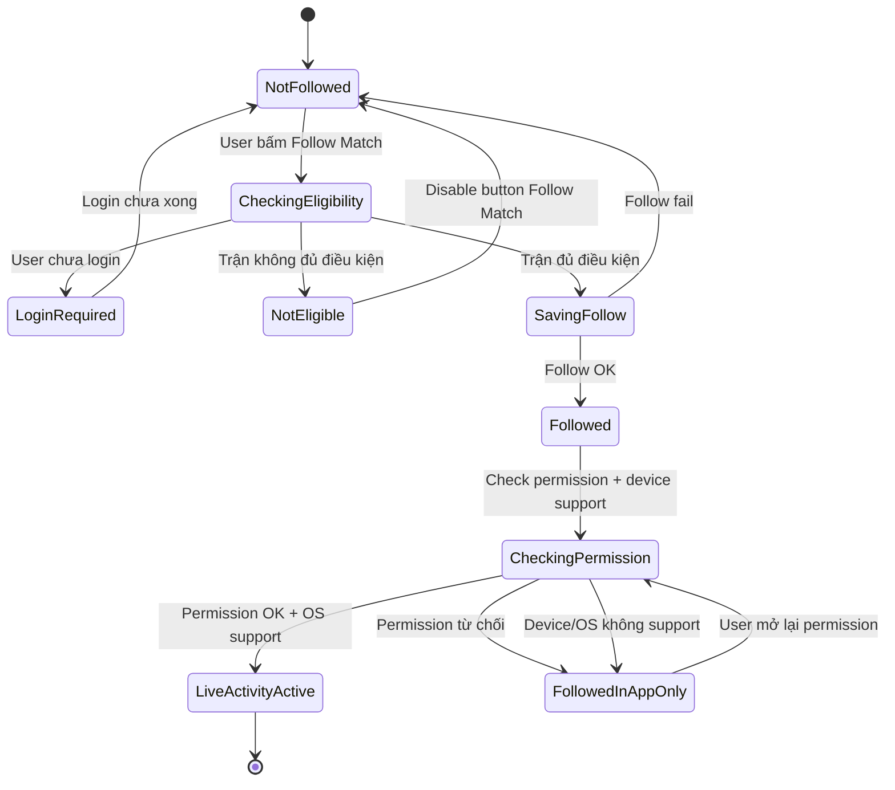
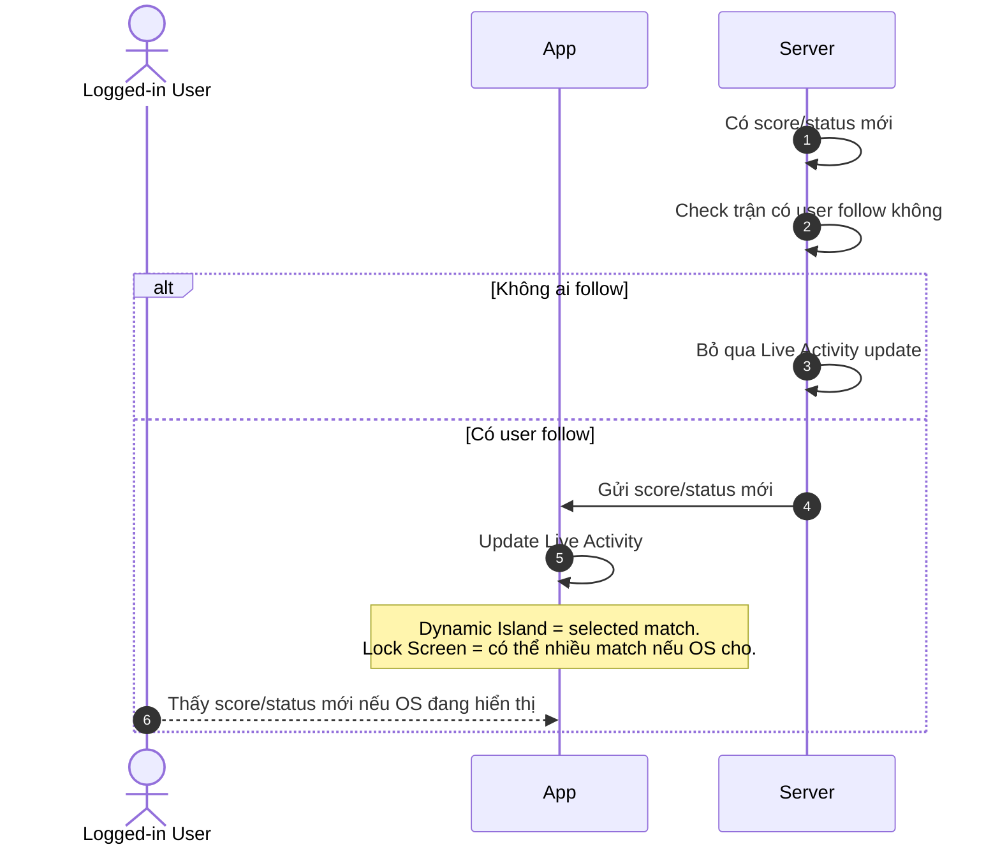
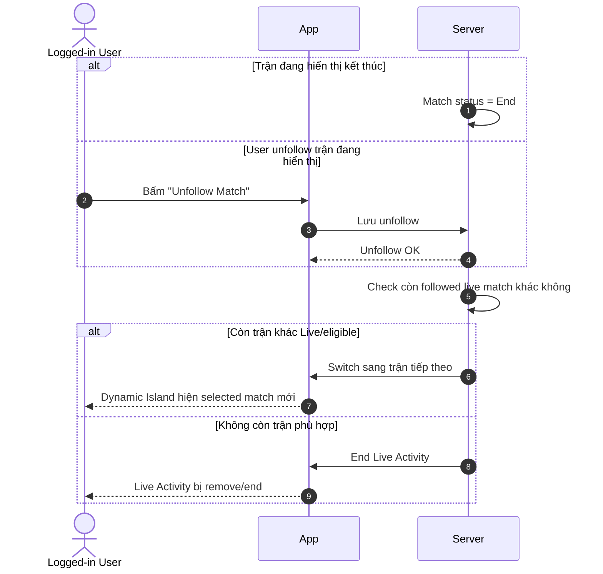
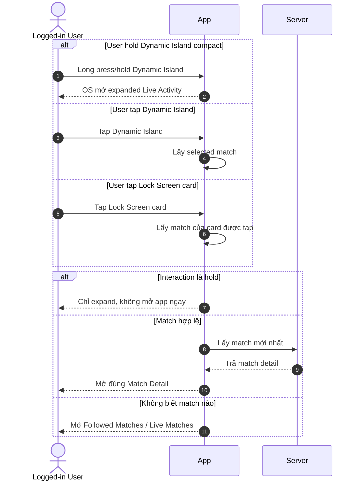

# LA-FR — Live Activity User Flows / Functional Requirements

> Project: FPTPlay
> Epic: Sport Zone
> Feature: Live Activity
> Audience: Product, BA, FE, BE, QA, iOS, Android
> Status: Final implementation handoff
> Source: Rewritten from `live-activity-user-flows.md` following Notion Functional Requirements / Usecase template
> Writing style: Caveman Vietnam — ít chữ, dễ đọc, đúng ý, không low-level
> Last updated: 2026-06-05

---

## 1. Description

Live Activity giúp user theo dõi trận đang live ngay trên **Lock Screen**, **Dynamic Island** và **Android ongoing/live notification**.

User chỉ cần bấm **Follow Match**. App lưu trận đó. Nếu device/OS hỗ trợ, Live Activity / Live Update bật và cập nhật score/status theo trận.

- Epic: Sport Zone
- Feature: Live Activity
- Main user: Logged-in User
- Main platform: Mobile iOS, Mobile Android
- Main surfaces: iOS Dynamic Island, iOS Lock Screen, Android Lock Screen / Notification Shade / ongoing notification
- Main intent: follow trận để xem live score/status nhanh

---

## 2. Document History

| Version | Date | Updated By | Notes | Approved By |
|---|---|---|---|---|
| v1.0 | 2026-06-04 | Dylan | Created from `live-activity-user-flows.md` using Functional Requirements / Usecase format. | Pending |
| v1.1 | 2026-06-05 | Dylan | Reworded to Caveman Vietnam. Simplified wording. Removed `Priority` and `Status` fields. Actor changed to Logged-in User. | Pending |
| v1.2 | 2026-06-05 | Dylan | Added template sections: Description, Document History, Overview, Non-functional Requirements, Design Specifications, References. | Pending |
| v1.3 | 2026-06-05 | Dylan | Clarified mobile iOS + mobile Android scope and minimum OS versions. | Pending |
| v1.4 | 2026-06-05 | Dylan | Mapped Global Business Rules into each Use Case using Caveman Vietnam wording. | Pending |
| v1.5 | 2026-06-05 | Dylan | Clarified Android Live Updates apply only to Samsung devices with Dynamic Island-like support. | Pending |
| v1.6 | 2026-06-05 | Dylan | Shortened Platform scope and removed Website/TV rows. | Pending |
| v1.7 | 2026-06-05 | Dylan | Shortened In scope list. | Pending |
| v1.8 | 2026-06-05 | Dylan | Shortened Out of scope list. | Pending |
| v1.9 | 2026-06-05 | Dylan | Added permission cases: allow, deny, re-enable. | Pending |
| v2.0 | 2026-06-05 | Dylan | Added UI organization rules for text, score, logo, state, and event priority. | Pending |
| v2.1 | 2026-06-05 | Dylan | Changed Flow 1 diagram to Mermaid stateDiagram-v2. | Pending |
| v2.2 | 2026-06-07 | Dylan | Shortened Business Rules Applied in each Use Case to flow-specific rules only. Kept shared rules in Global Business Rules. | Pending |

---

## 3. Overview

### Goal

User follow trận. App hiển thị live score/status ngoài app. User xem nhanh. User không cần mở app liên tục.

### Scope & Limitation

#### Platform

- **iOS:** apply từ **iOS 16.1+**.
  - Dynamic Island: chỉ iPhone có Dynamic Island.
  - Lock Screen Live Activity: iPhone hỗ trợ Live Activity.
- **Android:** apply từ **Android 8.0+ / API 26+** bằng ongoing notification.
  - Android 13+ / API 33+: cần user cho phép notification.
  - Android Live Updates: **only Samsung** có Dynamic Island / Now Bar-like support.
  - Non-Samsung hoặc Samsung không support: fallback ongoing notification.

#### Platform behavior

- iOS dùng tên **Live Activity**.
- Android dùng tên **Live Update / ongoing notification**. Live Updates chỉ apply cho Samsung có Dynamic Island-like support.
- Product intent giống nhau: user xem score/status ngoài app.
- UI surface khác nhau theo OS. App không ép OS hiển thị giống nhau.
- Android Live Updates không apply đại trà toàn Android. Chỉ apply Samsung có Dynamic Island / Now Bar-like support.

#### Permission behavior

- **Permission đồng ý:** App bật Live Activity / notification nếu match eligible và OS support.
- **Permission từ chối:** User vẫn follow match trong app. Ngoài app không hiện Live Activity / notification. App hiện hướng dẫn bật lại.
- **Mở lại permission:** User vào OS Settings bật lại. App sync lại permission. Nếu còn followed live match eligible, App bật lại Live Activity / notification.
- **iOS:** user có thể tắt Live Activities cho app trong Settings. Nếu tắt, fallback trong app.
- **Android 13+ / API 33+:** cần `POST_NOTIFICATIONS`. Nếu deny, fallback trong app.

#### User

- Logged-in User: in scope.
- Guest: phải login trước khi follow match.
- User follow 1 trận: in scope.
- User follow nhiều trận: in scope.
- Admin/CMS user: out of scope.

#### In scope

- Follow / Unfollow match.
- Hiển thị score/status ngoài app trên iOS Live Activity hoặc Android notification.
- Update score/status cho followed live match.
- Tap để mở đúng Match Detail.
- Hold iOS Dynamic Island để xem expanded view.
- Match End/Unfollow thì switch hoặc end.
- PiP có thể chạy song song nếu OS cho phép.

#### Out of scope

- App ép OS hiện Live Activity theo layout riêng.
- Multi-match list trong iOS Dynamic Island expanded.
- Fake Dynamic Island trên Android.
- Normal push notification copy/rules.
- Payment/entitlement logic.
- Full Match Detail implementation.

### Accessibility Requirements

- Text trên Live Activity phải ngắn, rõ, dễ đọc.
- Không chỉ dùng màu để truyền trạng thái trận.
- Score/status phải đọc được khi màn hình nhỏ.
- Tap target trong app phải đủ lớn theo mobile guideline.
- Error/fallback message phải dễ hiểu.
- Deeplink fail thì có fallback screen, không để user kẹt.

---

## 4. Functional Requirements

### LA-US-001 — User follow trận để bật Live Activity

- User muốn follow trận đang live.
- User muốn xem tỉ số/trạng thái ngoài Lock Screen / Dynamic Island.
- User không muốn mở app liên tục.

**Description:**
User bấm **Follow Match**. App lưu trận user muốn theo dõi. Nếu máy/OS hỗ trợ, Live Activity bật. Nếu không hỗ trợ, user vẫn follow được trận trong app.

#### Usecase

#### LA-UC-001 — Follow Match → Start Live Activity

**Activity Flows:**



| Field | Details |
|---|---|
| Description | User follow 1 trận hợp lệ. App bật Live Activity nếu có thể. |
| Actor | Logged-in User, App, Server |
| Triggers | User bấm **Follow Match** ở Match Detail hoặc Sport Zone match card. |
| Pre-condition | User đang xem trận có thể follow. Trận đang Live/eligible. button đang enabled. |
| Basic Path | 1. User bấm **Follow Match**.<br>2. App check login.<br>3. App check trận có đủ điều kiện không.<br>4. Server lưu trận vào followed matches.<br>5. App đổi button thành **Following**.<br>6. App check permission + device/OS support.<br>7. Permission OK → bật Live Activity / notification.<br>8. Permission bị từ chối → vẫn follow, nhưng không hiện ngoài app. |
| Post-condition | Trận nằm trong followed matches. button là **Following**. Live Activity / notification hiện nếu permission OK và OS cho phép. |
| Alternative Path | 1. Chưa login → App bắt login trước.<br>2. Permission đồng ý → bật Live Activity / notification nếu OS support.<br>3. Permission từ chối → vẫn follow được, nhưng không hiện ngoài app. App hướng dẫn bật lại.<br>4. User mở lại permission trong Settings → App sync lại. Nếu match còn Live/eligible thì bật lại.<br>5. Device không hỗ trợ → vẫn follow được, nhưng không có Live Activity / notification surface đó.<br>6. User follow nhiều trận → Server vẫn lưu đủ. Dynamic Island chỉ chọn 1 trận. Lock Screen có thể hiện nhiều nếu OS cho. |
| Exception Handling | 1. Trận không hợp lệ → disable button, user không bấm được.<br>2. Follow fail → giữ button **Follow Match**, cho thử lại.<br>3. Permission check fail → giữ **Following**, hiện hướng dẫn retry/settings nếu cần.<br>4. Live Activity bật fail → vẫn giữ **Following** nếu follow đã OK.<br>5. User bấm lặp → không tạo follow trùng. App giữ trạng thái đúng cuối cùng. |
| Business Rules Applied | 1. Follow thành công thì phải lưu followed match trước, rồi mới check permission/device để bật ngoài app.<br>2. Permission từ chối không được làm mất followed match.<br>3. Mở lại permission thì App bật lại Live Activity / notification nếu match còn Live/eligible.<br>4. Follow fail thì không đổi sang **Following**.<br>5. User bấm lặp thì không tạo follow trùng. |

---

### LA-US-002 — Score/status đổi thì Live Activity đổi theo

- User đã follow trận.
- Trận có score/status mới.
- User muốn thấy thông tin mới mà không mở app.

**Description:**
Khi trận có tỉ số, phút, trạng thái hoặc event mới, Live Activity cần update. User thấy bản mới nếu OS đang cho activity hiển thị.

#### Usecase

#### LA-UC-002 — Live Score Event → Update Live Activity

**Activity Flows:**



| Field | Details |
|---|---|
| Description | Followed match có thông tin mới. Live Activity cập nhật theo. |
| Actor | Logged-in User, App, Server |
| Triggers | Trận đổi score, minute, status hoặc có event quan trọng. |
| Pre-condition | Trận đang Live/eligible. User đã follow. Device/OS có thể hiển thị Live Activity. |
| Basic Path | 1. Server nhận thông tin mới của trận.<br>2. Server check trận có user follow không.<br>3. Server gửi update cho activity cần đổi.<br>4. App/OS cập nhật Live Activity.<br>5. User thấy score/status mới nếu OS đang hiển thị.<br>6. Dynamic Island chỉ update selected match. Lock Screen có thể update nhiều trận. |
| Post-condition | Live Activity hiển thị thông tin mới nhất nếu update OK và OS cho hiện. |
| Alternative Path | 1. Không ai follow → không update Live Activity.<br>2. Trận được follow nhưng không phải selected match → Dynamic Island không đổi; Lock Screen vẫn có thể update.<br>3. Lock Screen có nhiều activity → mỗi card update theo match của nó; OS quyết định card nào visible/collapsed/expanded.<br>4. Thay đổi nhỏ/không đáng kể → Server có thể bỏ qua để tránh spam update. |
| Exception Handling | 1. Event trùng → bỏ qua.<br>2. Event cũ hơn trạng thái hiện tại → bỏ qua.<br>3. Gửi update fail → retry trong giới hạn. Nếu vẫn fail, UI giữ trạng thái tốt gần nhất.<br>4. User vừa unfollow → không update tiếp cho trận đó.<br>5. Device không hỗ trợ → user không nhận Live Activity update trên máy đó. |
| Business Rules Applied | 1. Server chỉ gửi update khi followed match còn Live/eligible.<br>2. Event trùng hoặc cũ hơn trạng thái hiện tại thì bỏ qua.<br>3. Thay đổi nhỏ/không đáng kể có thể bỏ qua để tránh spam update.<br>4. Update fail thì giữ trạng thái tốt gần nhất, không rollback data cũ.<br>5. User vừa unfollow thì dừng update cho match đó. |

---

### LA-US-003 — Trận end hoặc unfollow thì switch/end Live Activity

- Trận đang hiển thị có thể kết thúc.
- User có thể unfollow trận.
- App không được để Live Activity hiện stale data.

**Description:**
Nếu trận đang hiển thị đã End hoặc user unfollow, App dừng activity của trận đó. Nếu còn trận followed khác đang live, Dynamic Island chuyển sang trận tiếp theo. Nếu không còn trận hợp lệ, Live Activity kết thúc.

#### Usecase

#### LA-UC-003 — Match End / Unfollow → Switch or End Live Activity

**Activity Flows:**



| Field | Details |
|---|---|
| Description | Match End hoặc user unfollow. App switch sang trận khác hoặc end Live Activity. |
| Actor | Logged-in User, App, Server |
| Triggers | Match chuyển End; hoặc user bấm **Unfollow Match**. |
| Pre-condition | User đang follow ít nhất 1 trận. Dynamic Island hoặc Lock Screen đang có Live Activity. |
| Basic Path | 1. Trận đang hiển thị End hoặc bị unfollow.<br>2. App/Server dừng activity của trận đó.<br>3. Hệ thống check còn followed live match hợp lệ không.<br>4. Còn trận hợp lệ → Dynamic Island switch sang trận tiếp theo theo priority.<br>5. Không còn trận hợp lệ → Live Activity kết thúc.<br>6. Lock Screen vẫn có thể giữ các activity hợp lệ khác nếu OS cho. |
| Post-condition | Không còn hiện trận đã End/Unfollow. Dynamic Island hiện trận hợp lệ tiếp theo hoặc kết thúc. |
| Alternative Path | 1. Match End nhưng còn trận live khác → switch sang trận user follow sớm nhất còn eligible.<br>2. Match End và không còn trận live → end Live Activity.<br>3. Lock Screen có nhiều card → card của trận End/Unfollow bị remove; card khác vẫn chạy.<br>4. User unfollow trận không phải selected match → Dynamic Island không đổi.<br>5. User unfollow Lock Screen card không phải selected match → chỉ remove card đó. |
| Exception Handling | 1. Trận tiếp theo chưa Live/eligible → không switch sang trận đó.<br>2. Switch fail → retry trong giới hạn. Nếu vẫn fail, giữ trạng thái tốt gần nhất hoặc end để tránh sai.<br>3. End fail → retry end để tránh activity treo.<br>4. User unfollow trong lúc switch → dùng followed state mới nhất.<br>5. Không xác định được trận tiếp theo → end Live Activity để tránh hiện sai trận. |
| Business Rules Applied | 1. Chỉ switch khi selected match End, bị Unfollow, hoặc không còn eligible.<br>2. Trận End/Unfollow thì không được tiếp tục hiện stale data.<br>3. Nếu còn trận followed Live/eligible khác → switch theo priority.<br>4. Nếu không còn trận phù hợp → end Live Activity / notification của trận đó.<br>5. Không xác định được trận tiếp theo → end để tránh hiện sai. |

---

### LA-US-004 — User tap/hold Live Activity để expand hoặc mở trận

- User thấy Live Activity.
- User có thể tap để mở đúng Match Detail.
- User có thể hold Dynamic Island để xem expanded view.

**Description:**
Live Activity phải phản hồi đúng theo nơi user tương tác. Tap Dynamic Island mở selected match. Hold Dynamic Island mở expanded view. Tap Lock Screen card mở đúng match của card đó. Nếu không biết match nào, App mở fallback screen.

#### Usecase

#### LA-UC-004 — Interact with Live Activity → Expand or Deeplink

**Activity Flows:**



| Field | Details |
|---|---|
| Description | User tap/hold Live Activity. App expand hoặc deeplink đúng màn. |
| Actor | Logged-in User, App, Server |
| Triggers | User tap Dynamic Island; hold Dynamic Island; tap Lock Screen card. |
| Pre-condition | Live Activity đang hiển thị. Activity/card có match id hợp lệ, trừ fallback case. |
| Basic Path | 1. User tương tác Live Activity.<br>2. Hold Dynamic Island compact → OS mở expanded Live Activity, không deeplink ngay.<br>3. Tap Dynamic Island → App mở Match Detail của selected match.<br>4. Tap Lock Screen card → App mở Match Detail của match trên card đó.<br>5. App lấy data mới nhất trước khi hiện Match Detail.<br>6. Không xác định được match → mở **Followed Matches / Live Matches**. |
| Post-condition | User thấy expanded view hoặc vào đúng Match Detail. |
| Alternative Path | 1. Lock Screen có nhiều card → tap card nào mở đúng match card đó.<br>2. PiP đang chạy song song → tap Live Activity vẫn mở đúng match; PiP tiếp tục nếu OS cho.<br>3. Match đã End trước khi tap → vẫn mở Match Detail với trạng thái mới nhất.<br>4. User đã unfollow trước khi tap → vẫn có thể mở Match Detail; button trở lại **Follow Match**.<br>5. App cold start → mở app rồi đi đến Match Detail hoặc fallback screen.<br>6. App đang mở màn khác → điều hướng sang màn đích, không stack trùng vô ích. |
| Exception Handling | 1. Deeplink thiếu/sai match → mở **Followed Matches / Live Matches**.<br>2. Match bị xóa/không khả dụng → báo không tìm thấy, rồi fallback.<br>3. User chưa login/session hết hạn → yêu cầu login, sau đó quay lại match nếu còn hợp lệ.<br>4. Không lấy được match mới nhất → hiện lỗi/retry, không để màn trắng.<br>5. PiP bị OS đóng khi mở app → vẫn mở đúng màn; không tính là lỗi Live Activity. |
| Business Rules Applied | 1. Hold Dynamic Island = expand, không deeplink ngay.<br>2. Tap Dynamic Island = mở Match Detail của current selected match.<br>3. Tap Lock Screen card / Android notification = mở match của card/notification đó.<br>4. Không biết match nào → fallback **Followed Matches / Live Matches**.<br>5. App cold start thì vẫn phải route về đúng Match Detail hoặc fallback screen. |

---

## Global Business Rules

### Live Activity display rules

1. User phải chủ động bấm **Follow Match** thì mới bật Live Activity.
2. User có thể follow 1 hoặc nhiều trận.
3. **Dynamic Island** chỉ hiện **1 selected followed match**.
4. **Lock Screen** có thể hiện nhiều followed live matches nếu OS cho.
5. Server update các followed live matches còn eligible.
6. App/Product quyết định nội dung hiển thị cho từng match.
7. OS quyết định cách hiện thật: số lượng activity, thứ tự, collapse, expand, stack.
8. Dynamic Island compact có 2 interaction chính: tap mở Match Detail; hold mở expanded Live Activity.
9. Expanded Dynamic Island vẫn chỉ hiện selected match. MVP không làm app-controlled multi-match list trong expanded view.
10. PiP và Live Activity là 2 surface khác nhau: PiP = video playback; Live Activity = live score/status.
11. Nếu PiP và Live Activity cùng hiện, tap Live Activity vẫn mở đúng màn đích. PiP tiếp tục nếu OS cho; chỉ đóng khi user đóng hoặc OS bắt buộc.
12. Trận không đủ điều kiện follow/Live Activity thì App disable button **Follow Match**.
13. Follow thành công khác với hiển thị ngoài app: follow vẫn OK dù device/OS không hỗ trợ.
14. Permission từ chối không được làm mất followed match.
15. Mở lại permission thì App sync lại và bật lại nếu match còn Live/eligible.
16. App không ép iOS/Android hiển thị giống nhau.
17. Android Live Updates chỉ apply Samsung có Dynamic Island / Now Bar-like support; device khác fallback ongoing notification.
18. Update fail thì giữ trạng thái tốt gần nhất, không rollback data cũ.
19. Event trùng/cũ thì bỏ qua.

### Dynamic Island Priority Rule

1. Dynamic Island chỉ có 1 selected match tại 1 thời điểm.
2. Chọn trận user follow sớm nhất và đang Live/eligible.
3. Selected match End / Unfollow / không eligible → chuyển sang followed match tiếp theo đang Live/eligible.
4. Không còn followed match Live/eligible → end Dynamic Island Live Activity.
5. Không tự nhảy match vì trận khác có goal/key event. Tránh làm user rối.

---

## 5. Non-functional Requirements

### LA-NFR-001 — Update speed

Live Activity nên update nhanh sau khi score/status đổi.

- Score/status mới tới Server → App/OS nhận update trong thời gian hợp lý.
- Nếu update chậm/fail, UI giữ trạng thái tốt gần nhất.
- Không rollback về score/status cũ.

### LA-NFR-002 — Reliability

Live Activity không được tạo duplicate hoặc bị treo lâu.

- Follow lặp không tạo duplicate subscription.
- Event trùng phải bị bỏ qua.
- End fail thì retry trong giới hạn.
- Không xác định được match thì end/fallback để tránh hiện sai.

### LA-NFR-003 — OS constraint

App phải tôn trọng rule của iOS/Android OS.

- OS quyết định visible/collapsed/stacked/expanded.
- App không assume Lock Screen luôn hiện nhiều activity.
- iOS Dynamic Island chỉ dùng selected match cho MVP.
- PiP + Live Activity / ongoing notification layout do OS quyết định.

### LA-NFR-004 — Security & privacy

Live Activity chỉ hiển thị thông tin trận, không lộ dữ liệu nhạy cảm.

- Không hiện token, user id, device id.
- Deeplink phải validate match id.
- User chưa login/session expired thì yêu cầu login trước khi mở dữ liệu cần auth.
- Permission denied thì không spam prompt. App chỉ hướng dẫn user mở lại trong Settings.

### LA-NFR-005 — Observability

Cần log đủ để debug lifecycle.

- Follow/register result.
- Start/update/end result.
- Selected match id.
- Update latency.
- Deeplink success/failure.
- Unsupported device/platform.

---

## 6. Design Specifications

### Description

Design cần phục vụ 2 việc: xem nhanh score/status và mở đúng trận khi user cần chi tiết.

### Figma

- Figma final: Pending.
- Current source: `live-activity-user-flows.md` wireframes.

### Information Architecture

```text
Sport Zone
└── Match Card / Match Detail
    ├── Follow Match button
    ├── Following state
    └── Live Activity / Live Update
        ├── iOS Dynamic Island compact
        ├── iOS Dynamic Island expanded
        ├── iOS Lock Screen card
        └── Android Lock Screen / Notification Shade / ongoing notification
```

### Wireframes

Wireframe source nằm trong:

```text
features/final-docs/Sport-Zone/Live-Activity/product/live-activity-user-flows.md
```

Key screens/states:

- Match eligible chưa follow → button **Follow Match**.
- Match không eligible → button **Follow Match** disabled.
- Match đã follow → button **Following**.
- iOS Dynamic Island compact → score/status ngắn.
- iOS Dynamic Island expanded → selected match detail ngắn.
- iOS Lock Screen card → match card theo OS layout.
- Android ongoing/live notification → score/status ngắn trên Lock Screen / Notification Shade.
- Fallback screen → **Followed Matches / Live Matches**.

### Design

#### iOS Dynamic Island compact

- Hiển thị team short name, score, minute/status.
- Không nhồi nhiều thông tin.
- Tap mở Match Detail selected match.
- Hold mở expanded view.

#### iOS Dynamic Island expanded

- Vẫn chỉ hiện selected match.
- Hiển thị đội, score, status/minute, latest event nếu có.
- Tap mở Match Detail.

#### Lock Screen / Notification Shade

- iOS có thể hiện 1 hoặc nhiều Live Activities nếu OS cho.
- Android có thể hiện ongoing/live notification nếu notification permission và OS cho.
- Mỗi card/notification map với 1 match.
- Tap card/notification nào mở đúng match đó.

#### Android Live Updates / ongoing notification

- Samsung có Dynamic Island / Now Bar-like support → dùng Android Live Updates nếu OS support.
- Android khác → dùng ongoing notification fallback.
- Hiển thị team short name, score, minute/status.
- Android 8.0+ cần notification channel.
- Android 13+ cần notification permission.
- Android Live Updates chỉ dùng cho Samsung có Dynamic Island / Now Bar-like surface và OS support.
- Android non-Samsung hoặc Samsung không có Dynamic Island-like support dùng ongoing notification fallback.
- Tap notification mở đúng Match Detail.


### UI Organization Rules

#### Text

- Text thường dùng font system/app. Không monospace toàn dòng.
- Text luôn single line.
- Dài quá thì truncate bằng `…`.
- Compact/minimal không wrap text.
- Score/time dùng tabular numbers / monospace digits nếu platform support.

#### Dynamic Island Compact

Format:

```text
[Home Logo] home_score - away_score [Away Logo]
```

Rules:

- Chỉ show logo + score.
- Không show team name.
- Không show event.
- Logo missing → show placeholder.
- Score có latest verified score → show latest score.
- Score chưa có data → `0 - 0`.
- Score dùng tabular numbers / monospace digits.

#### Minimal

Format:

```text
home_score - away_score
```

Rules:

- Chỉ show score.
- Score có latest verified score → show latest score.
- Score chưa có data → `0 - 0`.
- Score dùng tabular numbers / monospace digits.

#### Expanded Dynamic Island & Lock Screen

Format:

```text
Competition
[Home Logo] HOME_SHORT home_score - away_score AWAY_SHORT [Away Logo]
State
Latest Event
```

Rules:

- Competition single line.
- Team short name single line.
- Text dài → truncate bằng `…`.
- Logo missing → show placeholder.
- Show tối đa 1 event.
- Event text single line.
- Event dài → truncate.

#### State

- Live → `{minute}’`, ví dụ `78’`.
- Extra time → `45+2’`, `90+3’`.
- Half-time → `HT`.
- Full-time → `FT`.
- Penalty → `PEN`.
- Postponed → `Hoãn`.
- Cancelled → `Hủy`.
- Fallback / unknown state → ẩn state. Không tự đoán state.

#### Event priority

1. Goal alert.
2. Red card alert.
3. Match result / final score.
4. Penalty alert.
5. Match start alert.
6. Second-half start alert.
7. Half-time alert.
8. Match reminder.

Rules:

- Show event priority cao nhất.
- Nếu cùng priority, show event mới nhất.
- Compact/minimal không show event.
- Expanded/Lock Screen mới show event.

#### PiP song song

- PiP phục vụ video.
- Live Activity / ongoing notification phục vụ score/status.
- Nếu cùng hiện, OS quyết định layout.
- Tap Live Activity / notification vẫn mở đúng match.
- PiP tiếp tục nếu OS cho, không coi PiP close là lỗi Live Activity / notification.

---

## 7. References

### Required Documents

- `features/final-docs/Sport-Zone/Live-Activity/product/live-activity-user-flows.md`
- `features/final-docs/Sport-Zone/Live-Activity/api/technical-contract.md`
- `features/final-docs/Sport-Zone/Live-Activity/design/design-contract.md`
- `features/final-docs/Sport-Zone/Live-Activity/README.md`

### Source lightweight docs

- `features/lightweight/Sport-Zone/Live-Activity/product/SRS-live-activity.md`
- `features/lightweight/Sport-Zone/Live-Activity/product/ba-report-live-activity.md`
- `features/lightweight/Sport-Zone/Live-Activity/design/wireframe-suggestion-live-activity.md`
- `features/lightweight/Sport-Zone/Live-Activity/api/API-live-activity.md`

### Template source

- Notion template: `https://well-dingo-eb4.notion.site/Template-375147f97d2380d7bda9dd9f6a75637e?pvs=74`

### Notes

- Functional Requirements dùng Caveman Vietnam: câu ngắn, ít chữ, dễ đọc.
- Mermaid giữ trong từng Use Case để Product/BA/QA đọc flow nhanh.
- Requirement tập trung vào: user làm gì, app hiện gì, fallback gì.
- Technical API details nằm trong `api/technical-contract.md`.
