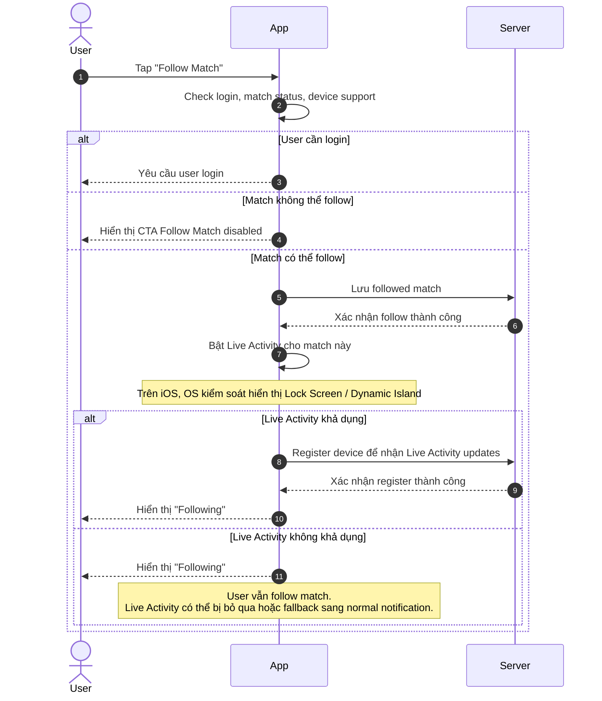
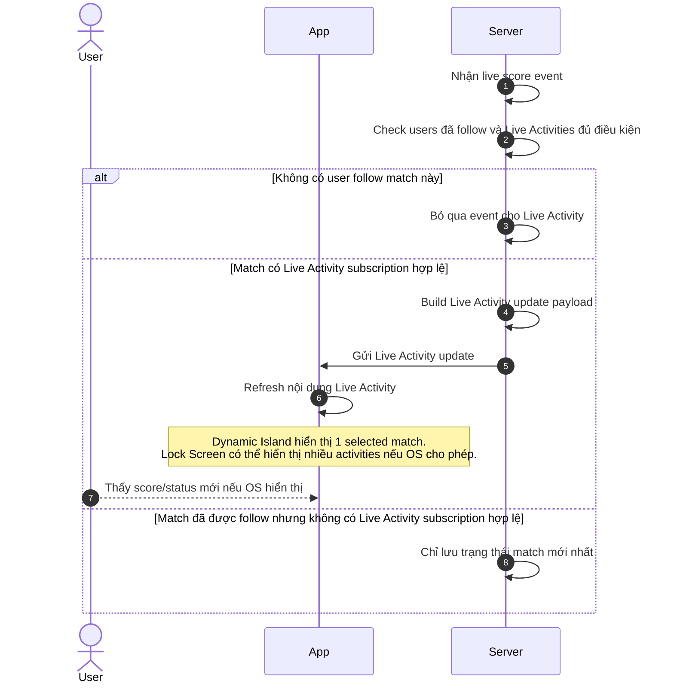
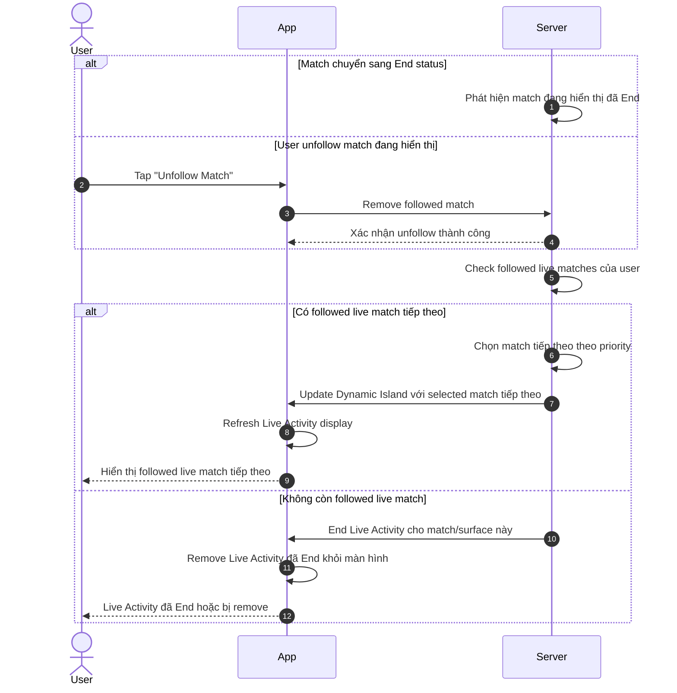
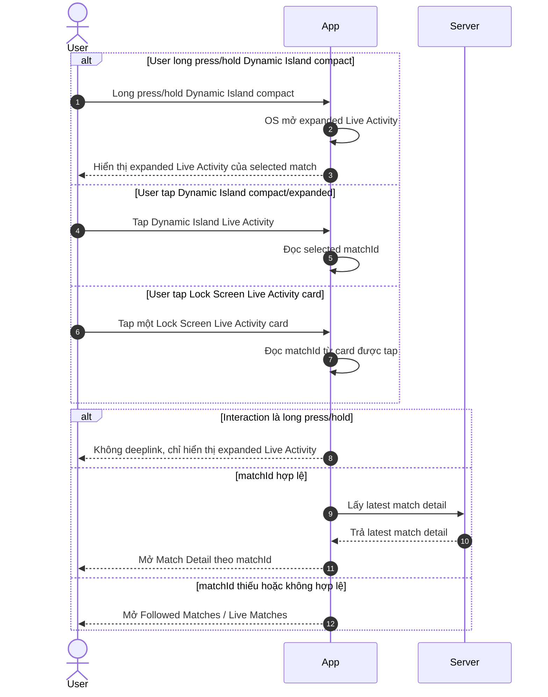

# Live Activity User Flows — Functional Requirements Template

> Project: FPTPlay  
> Feature: Sport Zone / Live Activity  
> Audience: Product, BA, FE, BE, QA, iOS  
> Status: Final implementation handoff  
> Source: Rewritten from `live-activity-user-flows.md` following Functional Requirements / Usecase template  
> Last updated: 2026-06-04

---

## 4. Functional Requirements

### LA-US-001 — Follow match để bật Live Activity

- Example: As a FPTPlay user, I want to follow a live match, so that I can view live score/status on Lock Screen / Dynamic Island without opening the App.

**Description:**  
Cho phép user follow một match trong Sport Zone. Sau khi follow thành công, App lưu trạng thái followed, bật Live Activity nếu device/platform hỗ trợ, và register device/subscription để nhận Live Activity updates từ Server.

#### Usecase

#### LA-UC-001 — Follow Match → Start Live Activity / Register Subscription

**Activity Flows / User Flows:**

| Field | Details |
|---|---|
| Description | User tap CTA **Follow Match** trên một match hợp lệ để lưu followed match và bật Live Activity nếu device/platform hỗ trợ. |
| Actor | User, App, Server |
| Priority | HIGH |
| Status | FINAL |
| Triggers | User tap CTA **Follow Match** trên Match Detail / Sport Zone match card. |
| Pre-condition | User truy cập match đủ điều kiện follow. Match đang Live/eligible. CTA **Follow Match** enabled. |
| Basic Path | 1. User tap **Follow Match**. 2. App check login, match status và device/platform support. 3. App gửi request lưu followed match lên Server. 4. Server lưu followed match thành công. 5. App bật Live Activity cho match nếu device/platform hỗ trợ. 6. App register device/subscription với Server để nhận Live Activity updates. 7. CTA đổi thành **Following**. 8. Dynamic Island áp dụng selected match priority; Lock Screen có thể hiển thị match này cùng các followed live matches khác nếu OS cho phép. |
| Post-condition | Match được lưu vào followed matches. User thấy trạng thái **Following**. Live Activity được bật/register nếu device/platform hỗ trợ. |
| Alternative Path | 1. User chưa login: App yêu cầu login trước khi follow match. 2. Device/platform không hỗ trợ Live Activity: User vẫn follow được match, nhưng Live Activity không được bật trên device đó. 3. User follow nhiều trận đủ điều kiện live: Server lưu/register các match hợp lệ; Dynamic Island chỉ ưu tiên 1 match, Lock Screen có thể hiển thị nhiều Live Activities nếu OS cho phép. |
| Exception Handling | 1. Match không hợp lệ: App disable CTA **Follow Match** và không cho user tap follow. 2. Server lưu follow thất bại: App giữ CTA là **Follow Match** và cho user thử lại. 3. Bật Live Activity thất bại: App vẫn giữ trạng thái **Following** nếu follow đã lưu thành công. 4. Register device thất bại: App retry register device và tránh tạo duplicate follow. |
| Business Rules (Optional) | 1. Live Activity được kích hoạt từ hành động chủ động **Follow Match** của user. 2. Nếu match không đủ điều kiện follow/Live Activity, CTA **Follow Match** phải disabled. 3. User vẫn follow được match nếu Live Activity không khả dụng trên device, miễn là match đủ điều kiện follow. 4. Dynamic Island chỉ hiển thị 1 selected followed match. 5. Lock Screen có thể hiển thị nhiều Live Activities nếu OS cho phép. |

---

### LA-US-002 — Update Live Activity khi score/status thay đổi

- Example: As a FPTPlay user, I want followed live matches to update automatically, so that I can track match score/status from Live Activity.

**Description:**  
Khi Server nhận live score/status event, Server xác định các users/devices có followed match và Live Activity subscription hợp lệ, sau đó gửi Live Activity update payload tương ứng.

#### Usecase

#### LA-UC-002 — Live Score Event → Update Live Activity

**Activity Flows / User Flows:**

| Field | Details |
|---|---|
| Description | Server gửi Live Activity updates cho những followed live matches đủ điều kiện khi score/status thay đổi. |
| Actor | User, App, Server |
| Priority | HIGH |
| Status | FINAL |
| Triggers | Server nhận live score event, status event, minute update hoặc match lifecycle event. |
| Pre-condition | Match đang Live/eligible. User đã follow match. Device/subscription hợp lệ nếu cần gửi Live Activity update. |
| Basic Path | 1. Server nhận live score/status event. 2. Server check match có user follow hay không. 3. Server check match/device có Live Activity subscription hợp lệ hay không. 4. Server build update payload gồm team, score, minute/status và deeplink data. 5. Server gửi Live Activity update đến App/OS. 6. App/OS refresh nội dung Live Activity. 7. Dynamic Island update selected match; Lock Screen có thể update nhiều followed match activities đủ điều kiện nếu OS cho phép. |
| Post-condition | Live Activity hiển thị score/status mới nhất nếu update thành công và OS cho phép hiển thị. |
| Alternative Path | 1. Không có user nào follow match này: Server bỏ qua event và không gửi update Live Activity. 2. Match được follow nhưng không phải selected match trên Dynamic Island: Server vẫn có thể update Live Activity cho Lock Screen nếu subscription hợp lệ; Dynamic Island không đổi selected match. 3. Lock Screen đang hiển thị nhiều Live Activities: OS quyết định activity nào được hiển thị/expand, Server vẫn gửi update cho các match hợp lệ. 4. Score/status không thay đổi đáng kể: Server có thể bỏ qua update để tránh gửi quá nhiều lần. |
| Exception Handling | 1. Event bị trùng: Server bỏ qua event trùng để tránh update lặp. 2. Event đến chậm hơn trạng thái hiện tại: Server bỏ qua event cũ để tránh rollback score/status. 3. Gửi update Live Activity thất bại: Server thử gửi lại trong giới hạn cho phép; nếu vẫn thất bại, UI giữ trạng thái hiển thị thành công gần nhất. 4. Token/device Live Activity không hợp lệ: Server đánh dấu subscription/device không hợp lệ và ngừng gửi update cho device đó. 5. User unfollow match trong lúc event đang xử lý: Server check lại trạng thái follow trước khi gửi; nếu đã unfollow thì không gửi update. 6. Device/platform không hỗ trợ Live Activity: Server không gửi Live Activity update cho device đó. |
| Business Rules (Optional) | 1. Dynamic Island chỉ update selected match. 2. Lock Screen có thể update nhiều followed match activities đủ điều kiện nếu OS cho phép. 3. Server update các subscriptions hợp lệ theo từng match/device. 4. OS quyết định activities nào visible, collapsed, stacked hoặc expanded. 5. Nếu update thất bại, UI giữ trạng thái hiển thị thành công gần nhất. |

---

### LA-US-003 — Switch hoặc End Live Activity khi Match End / Unfollow

- Example: As a FPTPlay user, I want Live Activity to switch or end correctly when a followed match ends or is unfollowed, so that Dynamic Island / Lock Screen never show stale match state.

**Description:**  
Khi selected match trên Dynamic Island kết thúc hoặc user unfollow match đó, hệ thống chọn followed live match tiếp theo theo priority nếu có. Nếu không còn match hợp lệ, Live Activity tương ứng kết thúc. Với Lock Screen, activity của match đã End/Unfollow bị remove, các activities hợp lệ khác vẫn tiếp tục nếu OS cho phép.

#### Usecase

#### LA-UC-003 — Match End / Unfollow → Switch to Next Followed Live Match or End

**Activity Flows / User Flows:**

| Field | Details |
|---|---|
| Description | Server/App xử lý switch Dynamic Island sang followed live match tiếp theo hoặc end Live Activity khi match kết thúc / user unfollow. |
| Actor | User, App, Server |
| Priority | HIGH |
| Status | FINAL |
| Triggers | Match chuyển sang End status; hoặc user tap **Unfollow Match**. |
| Pre-condition | User đang follow ít nhất 1 match. Dynamic Island đang hiển thị 1 selected followed match hoặc Lock Screen đang có Live Activity hợp lệ. |
| Basic Path | 1. Match đang hiển thị kết thúc hoặc user unfollow match đó. 2. Server remove/end Live Activity của match đó. 3. Server check user còn followed live matches đủ điều kiện khác hay không. 4. Nếu có match hợp lệ, Dynamic Island chuyển sang selected match tiếp theo theo priority. 5. Nếu không còn followed live match cho Dynamic Island, Dynamic Island Live Activity kết thúc. 6. Lock Screen có thể tiếp tục hiển thị các followed live match activities hợp lệ khác nếu OS cho phép. |
| Post-condition | Dynamic Island không giữ stale match. Live Activity của match End/Unfollow được remove/end. Các activities hợp lệ khác vẫn tiếp tục theo OS. |
| Alternative Path | 1. Match End nhưng còn followed match khác đang Live: Server chuyển Dynamic Island sang followed live match tiếp theo, ưu tiên match được follow sớm nhất trong danh sách còn Live/eligible. 2. Match End và không còn followed match nào đang Live: Server kết thúc Live Activity tương ứng. 3. Match End nhưng Lock Screen còn nhiều Live Activities khác: Server end activity của match đã End; các Live Activity hợp lệ khác vẫn tiếp tục update/hiển thị theo OS. 4. User unfollow match không phải selected match của Dynamic Island: Server chỉ update danh sách followed và Dynamic Island hiện tại không đổi. 5. User unfollow một match đang hiển thị trên Lock Screen nhưng không phải selected match của Dynamic Island: Server end/remove Live Activity của match đó, Dynamic Island selected match không đổi. |
| Exception Handling | 1. Match tiếp theo đang follow nhưng chưa Live: Server không chuyển sang match đó cho đến khi match đủ điều kiện hiển thị. 2. Update sang match tiếp theo thất bại: Server thử gửi lại trong giới hạn cho phép; nếu vẫn thất bại, Live Activity giữ trạng thái hiển thị thành công gần nhất. 3. End Live Activity thất bại: Server thử end lại trong giới hạn cho phép để tránh Live Activity bị treo. 4. User unfollow trong lúc Server đang switch match: Server check lại trạng thái followed mới nhất trước khi gửi update. 5. Subscription/device không hợp lệ: Server đánh dấu subscription/device không hợp lệ và ngừng gửi update cho device đó. |
| Business Rules (Optional) | 1. Dynamic Island chỉ hiển thị 1 selected followed match tại một thời điểm. 2. Dynamic Island Priority Rule: chọn match user follow sớm nhất và đang Live/eligible. 3. Nếu selected match hiện tại End, bị Unfollow, hoặc không còn eligible, chuyển sang followed match tiếp theo đang Live/eligible. 4. Không tự động đổi selected match chỉ vì match khác có goal/key event. 5. Nếu không còn followed match nào đang Live/eligible, kết thúc Dynamic Island Live Activity. |

---

### LA-US-004 — Interact với Live Activity để expand hoặc deeplink

- Example: As a FPTPlay user, I want to interact with Live Activity from Dynamic Island or Lock Screen, so that I can expand the activity or open the correct Match Detail.

**Description:**  
User có thể tap hoặc long press/hold Live Activity. Dynamic Island compact hỗ trợ long press/hold để OS mở expanded Live Activity. Tap Dynamic Island compact/expanded mở selected match. Tap Lock Screen card mở đúng match gắn với `matchId` của card đó.

#### Usecase

#### LA-UC-004 — Interact with Live Activity → Expand or Deeplink

**Activity Flows / User Flows:**

| Field | Details |
|---|---|
| Description | App xử lý đúng hành vi khi user tap hoặc long press/hold Live Activity từ Dynamic Island / Lock Screen. |
| Actor | User, App, Server |
| Priority | HIGH |
| Status | FINAL |
| Triggers | User tap Dynamic Island compact/expanded; user long press/hold Dynamic Island compact; user tap một Lock Screen Live Activity card. |
| Pre-condition | Live Activity đang hiển thị trên Dynamic Island hoặc Lock Screen. Live Activity/card có `matchId` hợp lệ, trừ trường hợp fallback. |
| Basic Path | 1. User tương tác với Live Activity. 2. Nếu user long press/hold Dynamic Island compact, OS mở expanded Live Activity của selected match và App không deeplink ngay. 3. Nếu user tap Dynamic Island compact/expanded, App đọc selected `matchId`. 4. Nếu user tap Lock Screen card, App đọc `matchId` từ card được tap. 5. Nếu `matchId` hợp lệ, App fetch latest match detail từ Server. 6. Server trả latest match detail. 7. App mở Match Detail theo `matchId`. |
| Post-condition | User thấy expanded Live Activity nếu long press/hold, hoặc được điều hướng đến đúng Match Detail nếu tap. |
| Alternative Path | 1. User tap một card trên Lock Screen multi-match: App mở Match Detail của đúng match gắn với card được tap. 2. PiP đang hiển thị song song với Live Activity: Tap Live Activity mở màn đích theo `matchId`; PiP tiếp tục phát nếu OS cho phép, chỉ đóng khi user chủ động đóng hoặc OS bắt buộc. 3. Match đã kết thúc trước khi user tap: App vẫn mở Match Detail và hiển thị trạng thái mới nhất của match. 4. User đã unfollow match trước khi tap: App vẫn có thể mở Match Detail, nhưng CTA hiển thị lại là **Follow Match**. 5. User tap Live Activity khi App chưa được mở sẵn: App được mở và điều hướng đến Match Detail / Followed Matches theo deeplink. 6. App đã mở sẵn ở màn khác: App điều hướng sang màn đích theo deeplink, không tạo duplicate screen không cần thiết. |
| Exception Handling | 1. Deeplink thiếu `matchId`: App mở màn Followed Matches / Live Matches. 2. Deeplink có `matchId` không hợp lệ: App fallback về màn Followed Matches / Live Matches. 3. Match đã bị xóa/không còn khả dụng: App hiển thị thông báo không tìm thấy match và fallback về Followed Matches / Live Matches. 4. User chưa login hoặc session hết hạn: App yêu cầu login trước, sau đó điều hướng lại theo deeplink nếu còn hợp lệ. 5. Server lấy match detail thất bại: App hiển thị màn lỗi/retry thay vì đứng ở màn trắng. |
| Business Rules (Optional) | 1. Long press/hold Dynamic Island mở expanded Live Activity, không deeplink ngay. 2. Expanded Dynamic Island vẫn chỉ hiển thị selected match. 3. Tap Dynamic Island compact/expanded mở current selected match. 4. Tap Lock Screen card mở match gắn với card đó. 5. Mỗi Live Activity card phải có `matchId` hợp lệ. 6. Nếu deeplink không hợp lệ, fallback là **Followed Matches / Live Matches**. 7. PiP không thay thế Live Activity; PiP phục vụ video playback, Live Activity phục vụ live score/status. 8. Khi PiP và Live Activity cùng hiển thị, OS quyết định vị trí/lớp hiển thị; App không tự kiểm soát toàn bộ layout song song. |

---

## Global Business Rules

### Live Activity display rules

1. Live Activity được kích hoạt từ hành động chủ động **Follow Match** của user.
2. User có thể follow một hoặc nhiều match.
3. **Dynamic Island** chỉ hiển thị **1 selected followed match** theo priority.
4. **Lock Screen** có thể hiển thị nhiều followed live matches / nhiều Live Activities nếu OS cho phép.
5. Server vẫn update các Live Activity subscriptions hợp lệ cho những followed live matches đủ điều kiện.
6. App/Product định nghĩa template và data hiển thị theo từng match.
7. OS quyết định cách hiển thị thực tế trên Lock Screen: một hay nhiều activities, thứ tự, collapse/expand.
8. Dynamic Island compact hỗ trợ 2 interaction chính: tap để mở Match Detail của selected match, long press/hold để OS mở expanded Live Activity.
9. Expanded Dynamic Island vẫn hiển thị selected match hiện tại; MVP không dùng expanded Dynamic Island để hiển thị app-controlled multi-match list.
10. PiP và Live Activity là 2 OS surfaces độc lập: PiP phục vụ video playback, Live Activity phục vụ live score/status của followed match.
11. Nếu PiP đang hiển thị song song với Live Activity, tap Live Activity mở màn đích theo `matchId`; PiP tiếp tục phát nếu OS cho phép, chỉ đóng khi user chủ động đóng hoặc OS bắt buộc.
12. Nếu match không đủ điều kiện follow/Live Activity, App disable CTA **Follow Match**.

### Dynamic Island Priority Rule

1. Dynamic Island chỉ hiển thị 1 selected followed match tại một thời điểm.
2. Chọn match user follow sớm nhất và đang Live/eligible.
3. Nếu selected match hiện tại End, bị Unfollow, hoặc không còn eligible, chuyển sang followed match tiếp theo đang Live/eligible.
4. Nếu không còn followed match nào đang Live/eligible, kết thúc Dynamic Island Live Activity.
5. Không tự động đổi selected match chỉ vì match khác có goal/key event, để tránh Dynamic Island nhảy qua lại gây rối user.

---

## Reference Sequence Diagrams

### LA-UC-001 — Follow Match → Start Live Activity / Register Subscription

### LA-UC-002 — Live Score Event → Update Live Activity

### LA-UC-003 — Match End / Unfollow → Switch to Next Followed Live Match or End

### LA-UC-004 — Interact with Live Activity → Expand or Deeplink

