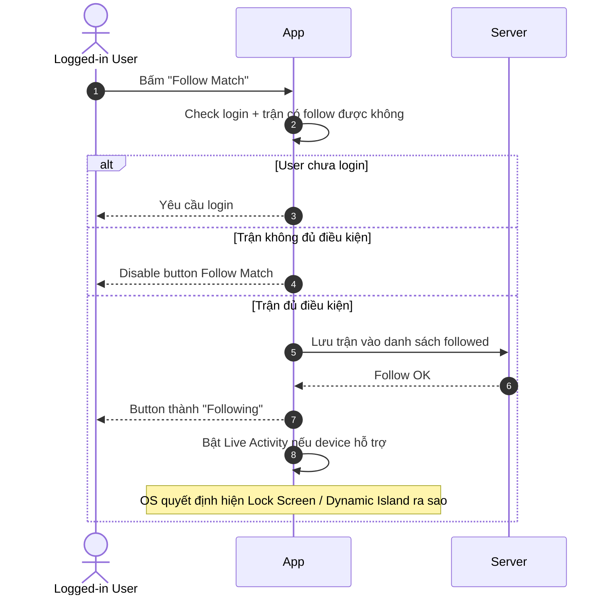
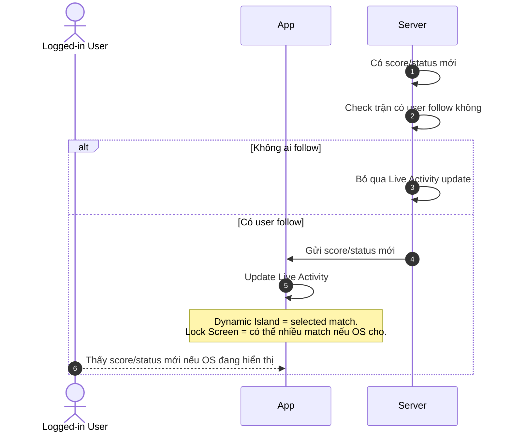
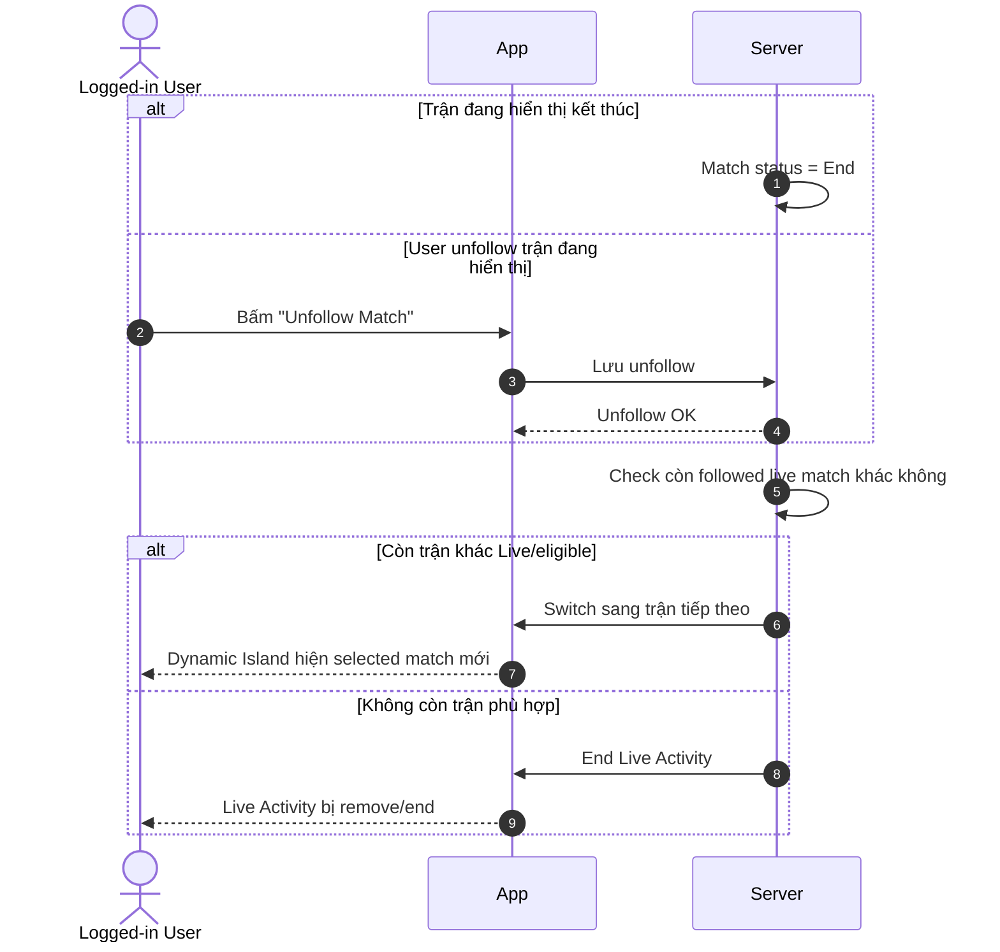
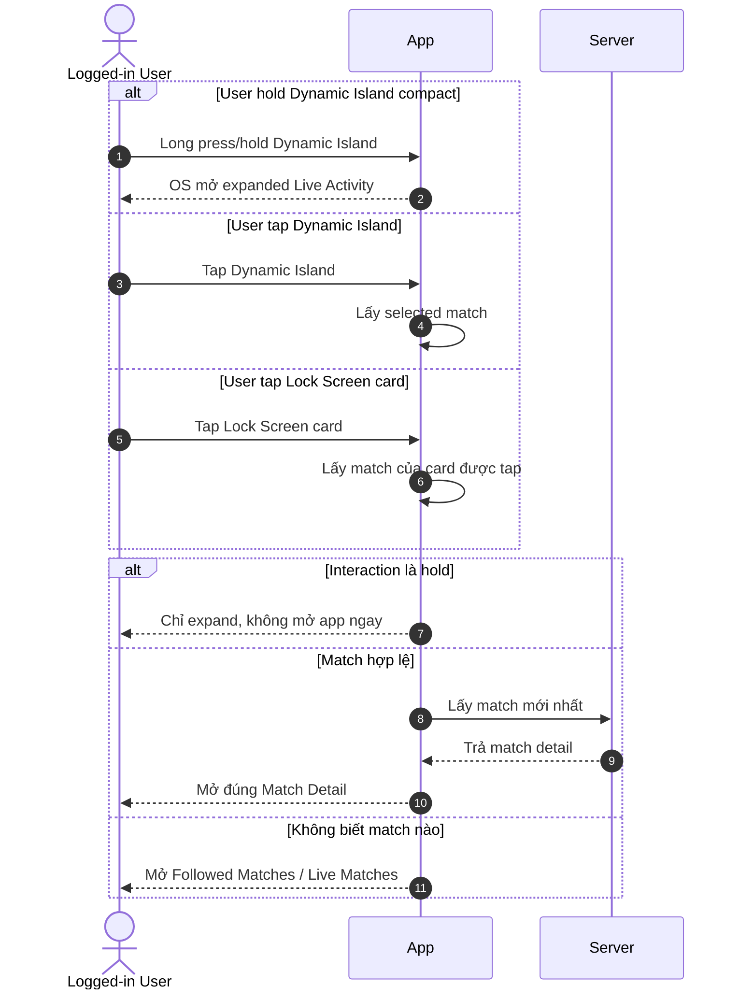

# Live Activity User Flows — Functional Requirements

> Project: FPTPlay
> Feature: Sport Zone / Live Activity
> Audience: Product, BA, FE, BE, QA, iOS
> Status: Final implementation handoff
> Source: Rewritten from `live-activity-user-flows.md` following Functional Requirements / Usecase template
> Writing style: Caveman Vietnam — ít chữ, dễ đọc, đúng ý, không low-level
> Last updated: 2026-06-05

---

## 4. Functional Requirements

### LA-US-001 — User follow trận để bật Live Activity

- User muốn follow trận đang live.
- User muốn xem tỉ số/trạng thái ngoài Lock Screen / Dynamic Island.
- User không muốn mở app liên tục.

**Description:**
User bấm **Follow Match**. App lưu trận user muốn theo dõi. Nếu máy/OS hỗ trợ, Live Activity bật. Nếu không hỗ trợ, user vẫn follow được trận trong app.

#### Usecase

#### LA-UC-001 — Follow Match → Start Live Activity

**Activity Flows:**

| Field | Details |
|---|---|
| Description | User follow 1 trận hợp lệ. App bật Live Activity nếu có thể. |
| Actor | Logged-in User, App, Server |
| Triggers | User bấm **Follow Match** ở Match Detail hoặc Sport Zone match card. |
| Pre-condition | User đang xem trận có thể follow. Trận đang Live/eligible. button đang enabled. |
| Basic Path | 1. User bấm **Follow Match**. 2. App check login. 3. App check trận có đủ điều kiện không. 4. Server lưu trận vào followed matches. 5. App đổi button thành **Following**. 6. App bật Live Activity nếu device/OS hỗ trợ. 7. User thấy Live Activity nếu OS cho hiện. |
| Post-condition | Trận nằm trong followed matches. button là **Following**. Live Activity hiện nếu OS cho phép. |
| Alternative Path | 1. Chưa login → App bắt login trước. 2. Device không hỗ trợ Live Activity → vẫn follow được, nhưng không có Live Activity trên máy đó. 3. User follow nhiều trận → Server vẫn lưu đủ. Dynamic Island chỉ chọn 1 trận. Lock Screen có thể hiện nhiều nếu OS cho. |
| Exception Handling | 1. Trận không hợp lệ → disable button, user không bấm được. 2. Follow fail → giữ button **Follow Match**, cho thử lại. 3. Live Activity bật fail → vẫn giữ **Following** nếu follow đã OK. 4. User bấm lặp → không tạo follow trùng. App giữ trạng thái đúng cuối cùng. |
| Business Rules Applied | 1. Live Activity chỉ bật sau khi user chủ động follow. 2. Trận không đủ điều kiện thì disable button. 3. Follow match khác với hiển thị Live Activity: follow vẫn OK dù device không hỗ trợ. 4. Dynamic Island chỉ hiện 1 selected match. 5. Lock Screen có thể hiện nhiều trận nếu OS cho phép. |

---

### LA-US-002 — Score/status đổi thì Live Activity đổi theo

- User đã follow trận.
- Trận có score/status mới.
- User muốn thấy thông tin mới mà không mở app.

**Description:**
Khi trận có tỉ số, phút, trạng thái hoặc event mới, Live Activity cần update. User thấy bản mới nếu OS đang cho activity hiển thị.

#### Usecase

#### LA-UC-002 — Live Score Event → Update Live Activity

**Activity Flows:**

| Field | Details |
|---|---|
| Description | Followed match có thông tin mới. Live Activity cập nhật theo. |
| Actor | Logged-in User, App, Server |
| Triggers | Trận đổi score, minute, status hoặc có event quan trọng. |
| Pre-condition | Trận đang Live/eligible. User đã follow. Device/OS có thể hiển thị Live Activity. |
| Basic Path | 1. Server nhận thông tin mới của trận. 2. Server check trận có user follow không. 3. Server gửi update cho activity cần đổi. 4. App/OS cập nhật Live Activity. 5. User thấy score/status mới nếu OS đang hiển thị. 6. Dynamic Island chỉ update selected match. Lock Screen có thể update nhiều trận. |
| Post-condition | Live Activity hiển thị thông tin mới nhất nếu update OK và OS cho hiện. |
| Alternative Path | 1. Không ai follow → không update Live Activity. 2. Trận được follow nhưng không phải selected match → Dynamic Island không đổi; Lock Screen vẫn có thể update. 3. Lock Screen có nhiều activity → mỗi card update theo match của nó; OS quyết định card nào visible/collapsed/expanded. 4. Thay đổi nhỏ/không đáng kể → Server có thể bỏ qua để tránh spam update. |
| Exception Handling | 1. Event trùng → bỏ qua. 2. Event cũ hơn trạng thái hiện tại → bỏ qua. 3. Gửi update fail → retry trong giới hạn. Nếu vẫn fail, UI giữ trạng thái tốt gần nhất. 4. User vừa unfollow → không update tiếp cho trận đó. 5. Device không hỗ trợ → user không nhận Live Activity update trên máy đó. |
| Business Rules Applied | 1. Nội dung Live Activity phải ngắn: đội, tỉ số, phút/trạng thái. 2. Dynamic Island chỉ hiện selected match. 3. Lock Screen có thể hiện/update nhiều trận nếu OS cho. 4. OS quyết định visible/collapsed/stacked/expanded. 5. Update fail thì giữ trạng thái tốt gần nhất. |

---

### LA-US-003 — Trận end hoặc unfollow thì switch/end Live Activity

- Trận đang hiển thị có thể kết thúc.
- User có thể unfollow trận.
- App không được để Live Activity hiện stale data.

**Description:**
Nếu trận đang hiển thị đã End hoặc user unfollow, App dừng activity của trận đó. Nếu còn trận followed khác đang live, Dynamic Island chuyển sang trận tiếp theo. Nếu không còn trận hợp lệ, Live Activity kết thúc.

#### Usecase

#### LA-UC-003 — Match End / Unfollow → Switch or End Live Activity

**Activity Flows:**

| Field | Details |
|---|---|
| Description | Match End hoặc user unfollow. App switch sang trận khác hoặc end Live Activity. |
| Actor | Logged-in User, App, Server |
| Triggers | Match chuyển End; hoặc user bấm **Unfollow Match**. |
| Pre-condition | User đang follow ít nhất 1 trận. Dynamic Island hoặc Lock Screen đang có Live Activity. |
| Basic Path | 1. Trận đang hiển thị End hoặc bị unfollow. 2. App/Server dừng activity của trận đó. 3. Hệ thống check còn followed live match hợp lệ không. 4. Còn trận hợp lệ → Dynamic Island switch sang trận tiếp theo theo priority. 5. Không còn trận hợp lệ → Live Activity kết thúc. 6. Lock Screen vẫn có thể giữ các activity hợp lệ khác nếu OS cho. |
| Post-condition | Không còn hiện trận đã End/Unfollow. Dynamic Island hiện trận hợp lệ tiếp theo hoặc kết thúc. |
| Alternative Path | 1. Match End nhưng còn trận live khác → switch sang trận user follow sớm nhất còn eligible. 2. Match End và không còn trận live → end Live Activity. 3. Lock Screen có nhiều card → card của trận End/Unfollow bị remove; card khác vẫn chạy. 4. User unfollow trận không phải selected match → Dynamic Island không đổi. 5. User unfollow Lock Screen card không phải selected match → chỉ remove card đó. |
| Exception Handling | 1. Trận tiếp theo chưa Live/eligible → không switch sang trận đó. 2. Switch fail → retry trong giới hạn. Nếu vẫn fail, giữ trạng thái tốt gần nhất hoặc end để tránh sai. 3. End fail → retry end để tránh activity treo. 4. User unfollow trong lúc switch → dùng followed state mới nhất. 5. Không xác định được trận tiếp theo → end Live Activity để tránh hiện sai trận. |
| Business Rules Applied | 1. Dynamic Island chỉ hiện 1 selected followed match. 2. Priority: trận user follow sớm nhất và đang Live/eligible. 3. Chỉ switch khi selected match End, bị Unfollow, hoặc không còn eligible. 4. Không tự nhảy sang trận khác chỉ vì goal/key event. 5. Không còn followed live match hợp lệ → end Dynamic Island Live Activity. |

---

### LA-US-004 — User tap/hold Live Activity để expand hoặc mở trận

- User thấy Live Activity.
- User có thể tap để mở đúng Match Detail.
- User có thể hold Dynamic Island để xem expanded view.

**Description:**
Live Activity phải phản hồi đúng theo nơi user tương tác. Tap Dynamic Island mở selected match. Hold Dynamic Island mở expanded view. Tap Lock Screen card mở đúng match của card đó. Nếu không biết match nào, App mở fallback screen.

#### Usecase

#### LA-UC-004 — Interact with Live Activity → Expand or Deeplink

**Activity Flows:**

| Field | Details |
|---|---|
| Description | User tap/hold Live Activity. App expand hoặc deeplink đúng màn. |
| Actor | Logged-in User, App, Server |
| Triggers | User tap Dynamic Island; hold Dynamic Island; tap Lock Screen card. |
| Pre-condition | Live Activity đang hiển thị. Activity/card có match id hợp lệ, trừ fallback case. |
| Basic Path | 1. User tương tác Live Activity. 2. Hold Dynamic Island compact → OS mở expanded Live Activity, không deeplink ngay. 3. Tap Dynamic Island → App mở Match Detail của selected match. 4. Tap Lock Screen card → App mở Match Detail của match trên card đó. 5. App lấy data mới nhất trước khi hiện Match Detail. 6. Không xác định được match → mở **Followed Matches / Live Matches**. |
| Post-condition | User thấy expanded view hoặc vào đúng Match Detail. |
| Alternative Path | 1. Lock Screen có nhiều card → tap card nào mở đúng match card đó. 2. PiP đang chạy song song → tap Live Activity vẫn mở đúng match; PiP tiếp tục nếu OS cho. 3. Match đã End trước khi tap → vẫn mở Match Detail với trạng thái mới nhất. 4. User đã unfollow trước khi tap → vẫn có thể mở Match Detail; button trở lại **Follow Match**. 5. App cold start → mở app rồi đi đến Match Detail hoặc fallback screen. 6. App đang mở màn khác → điều hướng sang màn đích, không stack trùng vô ích. |
| Exception Handling | 1. Deeplink thiếu/sai match → mở **Followed Matches / Live Matches**. 2. Match bị xóa/không khả dụng → báo không tìm thấy, rồi fallback. 3. User chưa login/session hết hạn → yêu cầu login, sau đó quay lại match nếu còn hợp lệ. 4. Không lấy được match mới nhất → hiện lỗi/retry, không để màn trắng. 5. PiP bị OS đóng khi mở app → vẫn mở đúng màn; không tính là lỗi Live Activity. |
| Business Rules Applied | 1. Hold Dynamic Island = expand, không deeplink ngay. 2. Expanded Dynamic Island vẫn chỉ hiện selected match. 3. Tap Dynamic Island = mở current selected match. 4. Tap Lock Screen card = mở match của card đó. 5. Không biết match nào → fallback **Followed Matches / Live Matches**. 6. PiP không thay Live Activity: PiP cho video, Live Activity cho score/status. 7. PiP và Live Activity cùng hiện thì OS quyết định layout/layer. App không control hết. |

---

## Global Business Rules

### Live Activity display rules

1. User phải chủ động bấm **Follow Match** thì mới bật Live Activity.
2. User có thể follow 1 hoặc nhiều trận.
3. **Dynamic Island** chỉ hiện **1 selected followed match**.
4. **Lock Screen** có thể hiện nhiều followed live matches nếu OS cho.
5. Server update các followed live matches còn eligible.
6. App/Product quyết định nội dung hiển thị cho từng match.
7. OS quyết định cách hiện thật: số lượng activity, thứ tự, collapse, expand, stack.
8. Dynamic Island compact có 2 interaction chính: tap mở Match Detail; hold mở expanded Live Activity.
9. Expanded Dynamic Island vẫn chỉ hiện selected match. MVP không làm app-controlled multi-match list trong expanded view.
10. PiP và Live Activity là 2 surface khác nhau: PiP = video playback; Live Activity = live score/status.
11. Nếu PiP và Live Activity cùng hiện, tap Live Activity vẫn mở đúng màn đích. PiP tiếp tục nếu OS cho; chỉ đóng khi user đóng hoặc OS bắt buộc.
12. Trận không đủ điều kiện follow/Live Activity thì App disable button **Follow Match**.

### Dynamic Island Priority Rule

1. Dynamic Island chỉ có 1 selected match tại 1 thời điểm.
2. Chọn trận user follow sớm nhất và đang Live/eligible.
3. Selected match End / Unfollow / không eligible → chuyển sang followed match tiếp theo đang Live/eligible.
4. Không còn followed match Live/eligible → end Dynamic Island Live Activity.
5. Không tự nhảy match vì trận khác có goal/key event. Tránh làm user rối.

---

## Notes

- Bản này dùng **Caveman Vietnam**: câu ngắn, ít chữ, dễ đọc, không low-level.
- Mermaid giữ trong từng Use Case để Product/BA/QA đọc flow nhanh.
- Functional Requirements tập trung vào: user làm gì, app hiện gì, khi nào fallback.
- Wireframe chi tiết vẫn nằm trong `live-activity-user-flows.md`.
