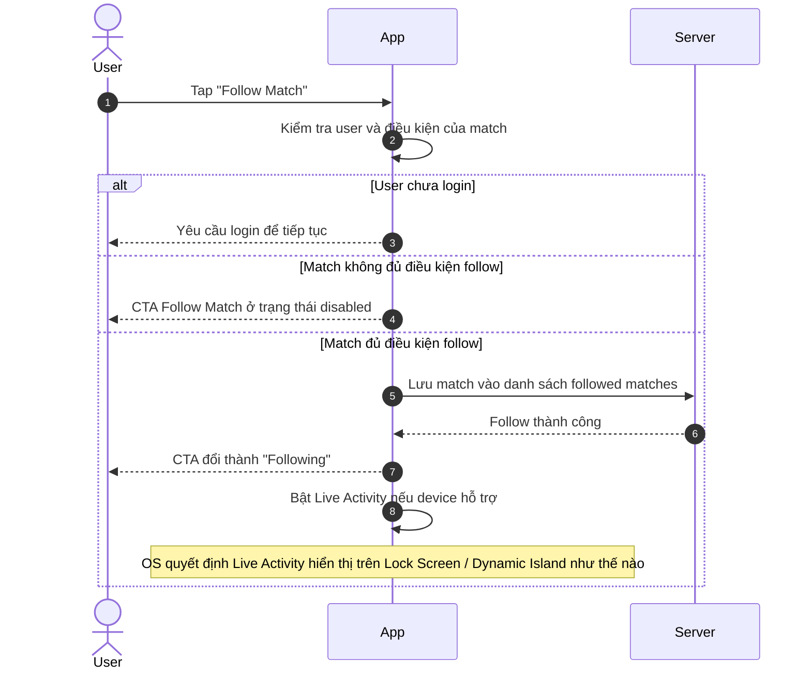
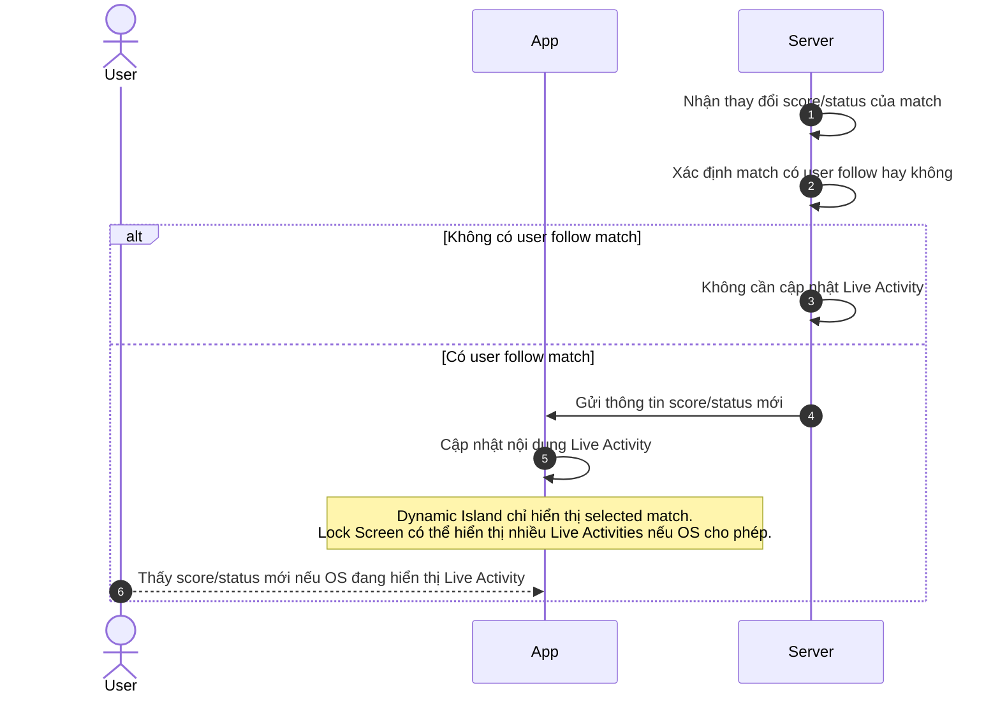
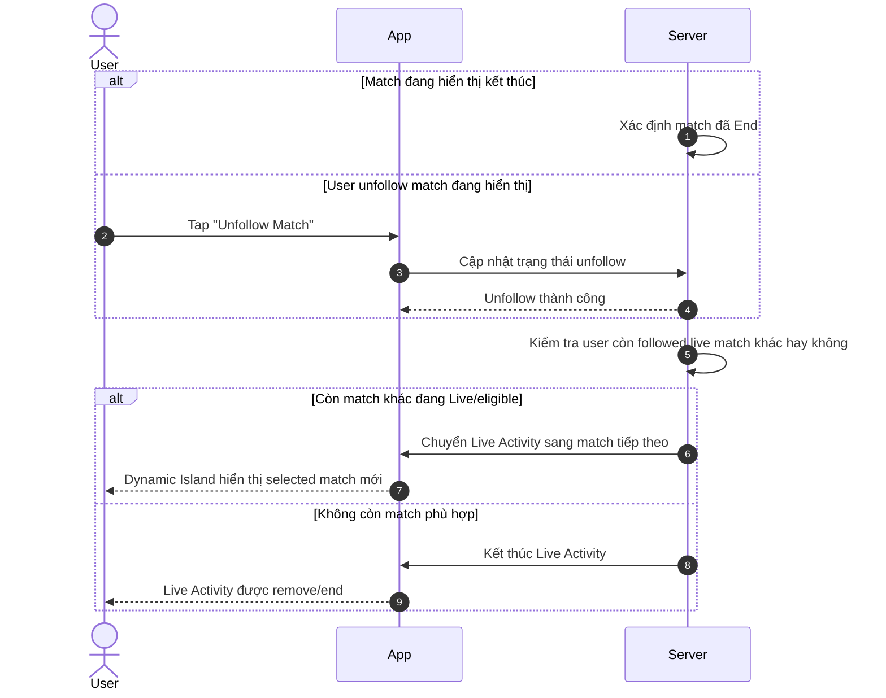
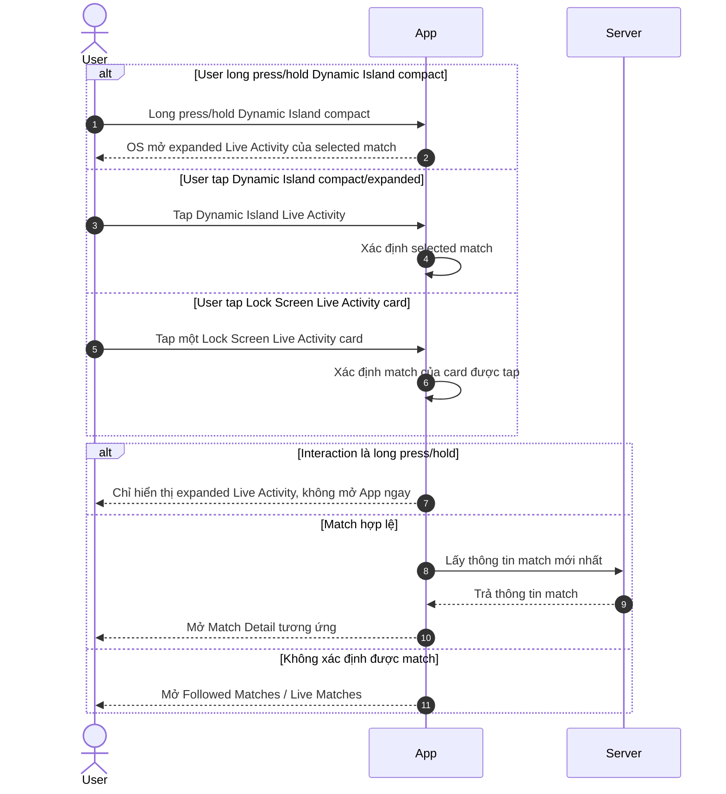

# Live Activity User Flows — Functional Requirements Template

> Project: FPTPlay  
> Feature: Sport Zone / Live Activity  
> Audience: Product, BA, FE, BE, QA, iOS  
> Status: Final implementation handoff  
> Source: Rewritten from `live-activity-user-flows.md` following Functional Requirements / Usecase template  
> Last updated: 2026-06-04

---

## 4. Functional Requirements

### LA-US-001 — Follow match để bật Live Activity

- Example: As a FPTPlay user, I want to follow a live match, so that I can view live score/status on Lock Screen / Dynamic Island without opening the App.

**Description:**  
Cho phép user follow một match đang Live để nhận live score/status trên Live Activity. Sau khi follow thành công, App hiển thị trạng thái **Following** và Live Activity được bật nếu device/platform hỗ trợ.

#### Usecase

#### LA-UC-001 — Follow Match → Start Live Activity

**Activity Flows / User Flows:**

| Field | Details |
|---|---|
| Description | User follow một match hợp lệ để xem live score/status trên Live Activity. |
| Actor | User, App, Server |
| Priority | HIGH |
| Status | FINAL |
| Triggers | User tap CTA **Follow Match** trên Match Detail hoặc Sport Zone match card. |
| Pre-condition | User đang xem một match có thể follow. Match đang Live/eligible. CTA **Follow Match** enabled. |
| Basic Path | 1. User tap **Follow Match**. 2. App kiểm tra user đã login và match có đủ điều kiện follow hay không. 3. Server lưu match vào danh sách followed matches của user. 4. App hiển thị trạng thái **Following**. 5. Nếu device/platform hỗ trợ, App bật Live Activity cho match này. 6. User có thể thấy Live Activity trên Lock Screen / Dynamic Island theo cách OS cho phép. |
| Post-condition | Match nằm trong danh sách followed matches. User thấy CTA **Following**. Live Activity hiển thị nếu device/platform hỗ trợ và OS cho phép. |
| Alternative Path | 1. User chưa login: App yêu cầu login trước khi follow match. 2. Device/platform không hỗ trợ Live Activity: User vẫn follow được match, nhưng không thấy Live Activity trên device đó. 3. User follow nhiều trận đang Live: App/Server vẫn ghi nhận các trận được follow; Dynamic Island chỉ hiển thị 1 selected match, Lock Screen có thể hiển thị nhiều match nếu OS cho phép. |
| Exception Handling | 1. Match không hợp lệ: CTA **Follow Match** phải disabled, user không tap được. 2. Follow thất bại: App giữ CTA là **Follow Match** và cho user thử lại. 3. Live Activity không bật được: App vẫn giữ **Following** nếu follow đã thành công. 4. Trạng thái hiển thị chưa cập nhật kịp: App không ghi nhận follow lặp, user vẫn thấy trạng thái cuối cùng hợp lệ. |
| Business Rules (Optional) | 1. Live Activity chỉ được bật sau khi user chủ động follow match. 2. Match không đủ điều kiện phải disable CTA **Follow Match**. 3. Follow match và hiển thị Live Activity là 2 việc khác nhau: user vẫn có thể follow nếu device không hỗ trợ Live Activity. 4. Dynamic Island chỉ hiển thị 1 selected match. 5. Lock Screen có thể hiển thị nhiều Live Activities nếu OS cho phép. |

---

### LA-US-002 — Cập nhật Live Activity khi score/status thay đổi

- Example: As a FPTPlay user, I want followed live matches to update automatically, so that I can track match score/status from Live Activity.

**Description:**  
Khi một followed match có thay đổi về score/status, Live Activity cần cập nhật nội dung để user thấy thông tin mới nhất nếu OS đang hiển thị activity đó.

#### Usecase

#### LA-UC-002 — Live Score Event → Update Live Activity

**Activity Flows / User Flows:**

| Field | Details |
|---|---|
| Description | Cập nhật Live Activity khi followed match có thay đổi score/status. |
| Actor | User, App, Server |
| Priority | HIGH |
| Status | FINAL |
| Triggers | Match có thay đổi score, minute, status hoặc sự kiện quan trọng trong trận. |
| Pre-condition | Match đang Live/eligible. User đã follow match. Live Activity có thể được hiển thị nếu device/platform và OS cho phép. |
| Basic Path | 1. Server nhận thay đổi mới của match. 2. Server xác định match này có user follow hay không. 3. Server gửi thông tin mới nhất cho các Live Activities cần cập nhật. 4. App/OS cập nhật nội dung Live Activity. 5. User thấy score/status mới nếu Live Activity đang được OS hiển thị. 6. Dynamic Island chỉ cập nhật selected match; Lock Screen có thể cập nhật nhiều followed matches nếu OS cho phép. |
| Post-condition | Live Activity hiển thị trạng thái mới nhất của match nếu cập nhật thành công và OS cho phép hiển thị. |
| Alternative Path | 1. Không có user follow match: Server bỏ qua, không cập nhật Live Activity. 2. Match được follow nhưng không phải selected match trên Dynamic Island: Dynamic Island không đổi selected match; Lock Screen vẫn có thể được cập nhật nếu OS cho phép. 3. Lock Screen đang có nhiều Live Activities: mỗi activity cập nhật theo match tương ứng; OS quyết định activity nào visible/collapsed/expanded. 4. Thay đổi không đáng kể: Server có thể bỏ qua để tránh cập nhật quá nhiều lần. |
| Exception Handling | 1. Event bị trùng: Server bỏ qua để tránh update lặp. 2. Thông tin đến muộn hơn trạng thái hiện tại: Server bỏ qua để tránh hiển thị lại score/status cũ. 3. Gửi update thất bại: Server thử gửi lại trong giới hạn cho phép; nếu vẫn thất bại, UI giữ trạng thái hiển thị thành công gần nhất. 4. User vừa unfollow match: Server/App không tiếp tục cập nhật Live Activity cho match đó. 5. Device/platform không hỗ trợ Live Activity: User không nhận Live Activity update trên device đó. |
| Business Rules (Optional) | 1. Live Activity phải ưu tiên hiển thị thông tin ngắn gọn: team, score, minute/status. 2. Dynamic Island chỉ hiển thị selected match hiện tại. 3. Lock Screen có thể hiển thị/cập nhật nhiều followed matches nếu OS cho phép. 4. OS quyết định activity nào visible, collapsed, stacked hoặc expanded. 5. Nếu update thất bại, UI giữ trạng thái hiển thị thành công gần nhất. |

---

### LA-US-003 — Switch hoặc End Live Activity khi Match End / Unfollow

- Example: As a FPTPlay user, I want Live Activity to switch or end correctly when a followed match ends or is unfollowed, so that Dynamic Island / Lock Screen never show stale match state.

**Description:**  
Khi match đang hiển thị kết thúc hoặc bị user unfollow, Live Activity cần dừng hiển thị match đó. Nếu user còn follow match khác đang Live/eligible, Dynamic Island chuyển sang match tiếp theo theo priority. Nếu không còn match phù hợp, Live Activity kết thúc.

#### Usecase

#### LA-UC-003 — Match End / Unfollow → Switch or End Live Activity

**Activity Flows / User Flows:**

| Field | Details |
|---|---|
| Description | Khi match kết thúc hoặc user unfollow, hệ thống chuyển Dynamic Island sang match phù hợp tiếp theo hoặc kết thúc Live Activity. |
| Actor | User, App, Server |
| Priority | HIGH |
| Status | FINAL |
| Triggers | Match chuyển sang End status; hoặc user tap **Unfollow Match**. |
| Pre-condition | User đang follow ít nhất 1 match. Dynamic Island hoặc Lock Screen đang có Live Activity liên quan đến followed match. |
| Basic Path | 1. Match đang hiển thị kết thúc hoặc user unfollow match đó. 2. Hệ thống dừng hiển thị Live Activity của match đó. 3. Hệ thống kiểm tra user còn followed live match nào đủ điều kiện hay không. 4. Nếu còn match phù hợp, Dynamic Island chuyển sang selected match tiếp theo theo priority. 5. Nếu không còn match phù hợp, Live Activity kết thúc. 6. Lock Screen vẫn có thể tiếp tục hiển thị các followed live match khác nếu OS cho phép. |
| Post-condition | Live Activity không còn hiển thị match đã End/Unfollow. Dynamic Island hiển thị match phù hợp tiếp theo hoặc kết thúc nếu không còn match. |
| Alternative Path | 1. Match End nhưng còn followed match khác đang Live: Dynamic Island chuyển sang match được follow sớm nhất trong danh sách còn Live/eligible. 2. Match End và không còn followed match đang Live: Live Activity kết thúc. 3. Lock Screen còn nhiều Live Activities khác: activity của match đã End/Unfollow được remove/end; các activity hợp lệ khác vẫn tiếp tục theo OS. 4. User unfollow match không phải selected match của Dynamic Island: Dynamic Island hiện tại không đổi. 5. User unfollow một Lock Screen card không phải selected match: card đó được remove/end, Dynamic Island selected match không đổi. |
| Exception Handling | 1. Match tiếp theo chưa Live/eligible: Không chuyển sang match đó cho đến khi match đủ điều kiện hiển thị. 2. Chuyển sang match tiếp theo thất bại: Server thử gửi lại trong giới hạn cho phép; nếu vẫn thất bại, Live Activity giữ trạng thái hiển thị thành công gần nhất. 3. End Live Activity thất bại: Server thử end lại trong giới hạn cho phép để tránh Live Activity bị treo. 4. User unfollow trong lúc đang switch: Hệ thống dùng trạng thái followed mới nhất để quyết định match tiếp theo. 5. Không xác định được match tiếp theo: Live Activity kết thúc để tránh hiển thị sai match. |
| Business Rules (Optional) | 1. Dynamic Island chỉ hiển thị 1 selected followed match tại một thời điểm. 2. Priority của Dynamic Island: ưu tiên match user follow sớm nhất và đang Live/eligible. 3. Chỉ switch khi selected match End, bị Unfollow, hoặc không còn eligible. 4. Không tự động đổi selected match chỉ vì match khác có goal/key event. 5. Nếu không còn followed match nào đang Live/eligible, kết thúc Dynamic Island Live Activity. |

---

### LA-US-004 — Interact với Live Activity để expand hoặc deeplink

- Example: As a FPTPlay user, I want to interact with Live Activity from Dynamic Island or Lock Screen, so that I can expand the activity or open the correct Match Detail.

**Description:**  
User có thể tap hoặc long press/hold Live Activity. Long press/hold Dynamic Island compact mở expanded Live Activity. Tap Dynamic Island compact/expanded mở selected match. Tap Lock Screen card mở đúng Match Detail của card được tap.

#### Usecase

#### LA-UC-004 — Interact with Live Activity → Expand or Deeplink

**Activity Flows / User Flows:**

| Field | Details |
|---|---|
| Description | Xử lý đúng hành vi khi user tap hoặc long press/hold Live Activity từ Dynamic Island / Lock Screen. |
| Actor | User, App, Server |
| Priority | HIGH |
| Status | FINAL |
| Triggers | User tap Dynamic Island compact/expanded; user long press/hold Dynamic Island compact; user tap một Lock Screen Live Activity card. |
| Pre-condition | Live Activity đang hiển thị trên Dynamic Island hoặc Lock Screen. Activity/card có thể xác định được match tương ứng, trừ trường hợp fallback. |
| Basic Path | 1. User tương tác với Live Activity. 2. Nếu user long press/hold Dynamic Island compact, OS mở expanded Live Activity của selected match và App không deeplink ngay. 3. Nếu user tap Dynamic Island compact/expanded, App mở Match Detail của selected match. 4. Nếu user tap Lock Screen card, App mở Match Detail của match gắn với card đó. 5. App lấy thông tin match mới nhất trước khi hiển thị màn Match Detail. 6. Nếu không xác định được match, App mở **Followed Matches / Live Matches**. |
| Post-condition | User thấy expanded Live Activity nếu long press/hold, hoặc được điều hướng đến đúng Match Detail nếu tap. |
| Alternative Path | 1. User tap một card trên Lock Screen multi-match: App mở Match Detail của đúng match gắn với card được tap. 2. PiP đang hiển thị song song với Live Activity: Tap Live Activity mở màn đích theo match tương ứng; PiP tiếp tục phát nếu OS cho phép, chỉ đóng khi user chủ động đóng hoặc OS bắt buộc. 3. Match đã kết thúc trước khi user tap: App vẫn mở Match Detail và hiển thị trạng thái mới nhất của match. 4. User đã unfollow match trước khi tap: App vẫn có thể mở Match Detail, nhưng CTA hiển thị lại là **Follow Match**. 5. User tap Live Activity khi App đang cold start: App mở lên và điều hướng đến Match Detail / Followed Matches theo trạng thái hợp lệ. 6. App đã mở sẵn ở màn khác: App điều hướng sang màn đích, không mở lặp nhiều màn giống nhau. |
| Exception Handling | 1. Deeplink thiếu hoặc sai match: App mở màn **Followed Matches / Live Matches**. 2. Match đã bị xóa/không còn khả dụng: App hiển thị thông báo không tìm thấy match và fallback về **Followed Matches / Live Matches**. 3. User chưa login hoặc session hết hạn: App yêu cầu login trước, sau đó điều hướng lại theo match nếu còn hợp lệ. 4. Không lấy được thông tin match mới nhất: App hiển thị lỗi/retry thay vì đứng ở màn trắng. 5. PiP bị OS đóng khi mở App: App vẫn mở đúng màn đích, không coi đây là lỗi Live Activity. |
| Business Rules (Optional) | 1. Long press/hold Dynamic Island mở expanded Live Activity, không deeplink ngay. 2. Expanded Dynamic Island vẫn chỉ hiển thị selected match. 3. Tap Dynamic Island compact/expanded mở current selected match. 4. Tap Lock Screen card mở match gắn với card đó. 5. Nếu không xác định được match từ Live Activity, fallback là **Followed Matches / Live Matches**. 6. PiP không thay thế Live Activity; PiP phục vụ video playback, Live Activity phục vụ live score/status. 7. Khi PiP và Live Activity cùng hiển thị, OS quyết định vị trí/lớp hiển thị; App không tự kiểm soát toàn bộ layout song song. |

---

## Global Business Rules

### Live Activity display rules

1. Live Activity được kích hoạt từ hành động chủ động **Follow Match** của user.
2. User có thể follow một hoặc nhiều match.
3. **Dynamic Island** chỉ hiển thị **1 selected followed match** theo priority.
4. **Lock Screen** có thể hiển thị nhiều followed live matches / nhiều Live Activities nếu OS cho phép.
5. Server vẫn update những followed live matches đủ điều kiện.
6. App/Product định nghĩa nội dung hiển thị theo từng match.
7. OS quyết định cách hiển thị thực tế trên Lock Screen: một hay nhiều activities, thứ tự, collapse/expand.
8. Dynamic Island compact hỗ trợ 2 interaction chính: tap để mở Match Detail của selected match, long press/hold để OS mở expanded Live Activity.
9. Expanded Dynamic Island vẫn hiển thị selected match hiện tại; MVP không dùng expanded Dynamic Island để hiển thị app-controlled multi-match list.
10. PiP và Live Activity là 2 OS surfaces độc lập: PiP phục vụ video playback, Live Activity phục vụ live score/status của followed match.
11. Nếu PiP đang hiển thị song song với Live Activity, tap Live Activity mở màn đích theo match tương ứng; PiP tiếp tục phát nếu OS cho phép, chỉ đóng khi user chủ động đóng hoặc OS bắt buộc.
12. Nếu match không đủ điều kiện follow/Live Activity, App disable CTA **Follow Match**.

### Dynamic Island Priority Rule

1. Dynamic Island chỉ hiển thị 1 selected followed match tại một thời điểm.
2. Chọn match user follow sớm nhất và đang Live/eligible.
3. Nếu selected match hiện tại End, bị Unfollow, hoặc không còn eligible, chuyển sang followed match tiếp theo đang Live/eligible.
4. Nếu không còn followed match nào đang Live/eligible, kết thúc Dynamic Island Live Activity.
5. Không tự động đổi selected match chỉ vì match khác có goal/key event, để tránh Dynamic Island nhảy qua lại gây rối user.

---

## Notes

- Mermaid sequence diagram đã được đặt trực tiếp trong từng **Activity Flows / User Flows** để QA/BA/Product đọc theo từng Functional Requirement.
- Bản này dùng ngôn ngữ high-level cho Product/BA/QC, tập trung vào hành vi user nhìn thấy và kết quả mong đợi của từng flow.
- Wireframe chi tiết nằm trong bản gốc `live-activity-user-flows.md`.
