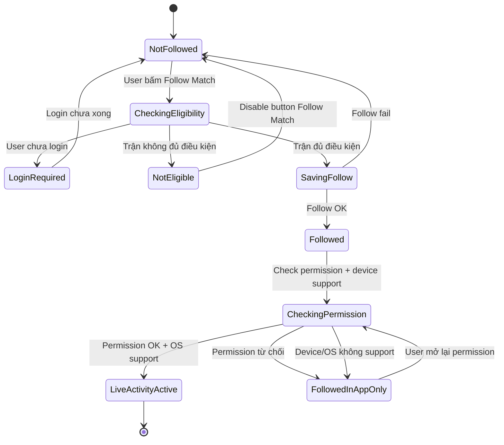
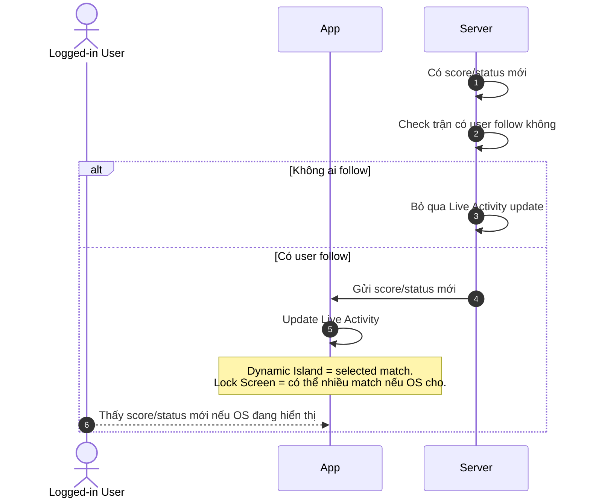
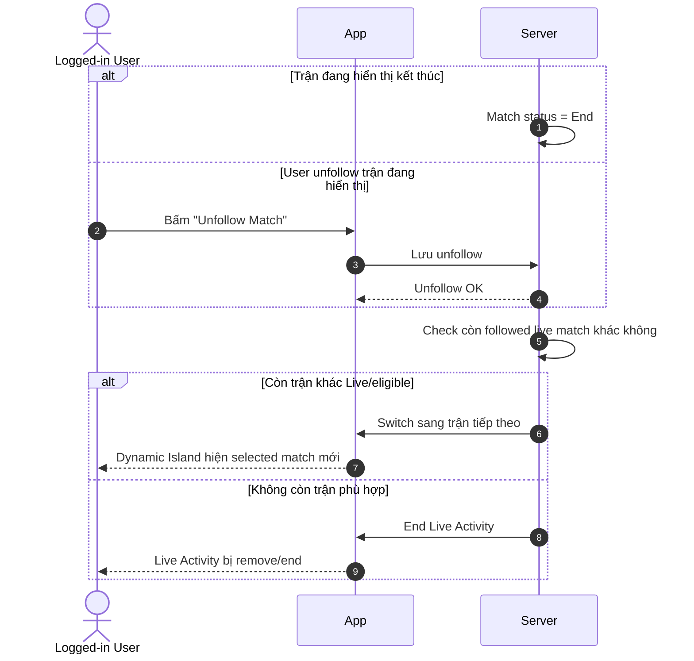
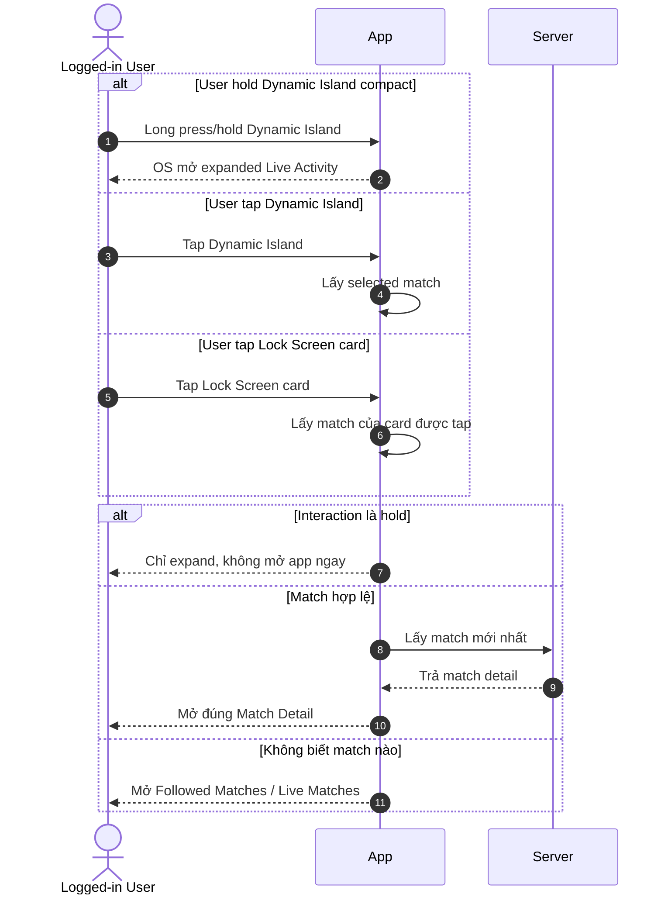

# LA-FR — Live Activity User Flows / Functional Requirements

> Project: FPTPlay
> Epic: Sport Zone
> Feature: Live Activity
> Audience: Product, BA, FE, BE, QA, iOS, Android
> Status: Final implementation handoff
> Source: Rewritten from `live-activity-user-flows.md` following Functional Requirements / Use Case format
> Writing style: Caveman Vietnam — ít chữ, dễ đọc, đúng ý, không low-level
> Last updated: 2026-06-08

---

## 1. Description

Live Activity giúp user theo dõi trận đang live ngay trên **Lock Screen**, **Dynamic Island** và **Android ongoing/live notification**.

User chỉ cần bấm **Follow Match**. App lưu trận đó. Nếu device/OS hỗ trợ, Live Activity / Live Update bật và cập nhật score/status theo trận.

- Epic: Sport Zone
- Feature: Live Activity
- Main user: Logged-in User
- Main platform: Mobile iOS, Mobile Android
- Main surfaces: iOS Dynamic Island, iOS Lock Screen, Android Lock Screen / Notification Shade / ongoing notification
- Main intent: follow trận để xem live score/status nhanh

---

## 2. Document History

| Version | Date | Updated By | Notes | Approved By |
|---|---|---|---|---|
| v1.0 | 2026-06-04 | Dylan | Created from `live-activity-user-flows.md` using Functional Requirements / Use Case format. | Pending |
| v1.1 | 2026-06-05 | Dylan | Reworded to Caveman Vietnam. Simplified wording. Removed `Priority` and `Status` fields. Actor changed to Logged-in User. | Pending |
| v1.2 | 2026-06-05 | Dylan | Added template sections: Description, Document History, Overview, Non-functional Requirements, Design Specifications, References. | Pending |
| v1.3 | 2026-06-05 | Dylan | Clarified mobile iOS + mobile Android scope and minimum OS versions. | Pending |
| v1.4 | 2026-06-05 | Dylan | Mapped Global Business Rules into each Use Case using Caveman Vietnam wording. | Pending |
| v1.5 | 2026-06-05 | Dylan | Clarified Android Live Updates apply only to Samsung devices with Dynamic Island-like support. | Pending |
| v1.6 | 2026-06-05 | Dylan | Shortened Platform scope and removed Website/TV rows. | Pending |
| v1.7 | 2026-06-05 | Dylan | Shortened In scope list. | Pending |
| v1.8 | 2026-06-05 | Dylan | Shortened Out of scope list. | Pending |
| v1.9 | 2026-06-05 | Dylan | Added permission cases: allow, deny, re-enable. | Pending |
| v2.0 | 2026-06-05 | Dylan | Added UI organization rules for text, score, logo, state, and event priority. | Pending |
| v2.1 | 2026-06-05 | Dylan | Changed Flow 1 diagram to Mermaid stateDiagram-v2. | Pending |
| v2.2 | 2026-06-07 | Dylan | Shortened Business Rules Applied in each Use Case to flow-specific rules only. Kept shared rules in Global Business Rules. | Pending |
| v2.3 | 2026-06-08 | Dylan | Restructured document into 9-section functional requirements outline. Moved UI Organization Rules into Screen Element Specification. Added error/message table. | Pending |
| v2.4 | 2026-06-08 | Dylan | Changed Business Rules back from table format to list format. | Pending |
| v2.5 | 2026-06-08 | Dylan | Restored Business Rules to table format. | Pending |
| v2.6 | 2026-06-08 | Dylan | Rewrote Business Rules into numbered list style with subheadings. | Pending |

---

## 3. Overview

### 3.1 Goal

User follow trận. App hiển thị live score/status ngoài app. User xem nhanh. User không cần mở app liên tục.

### 3.2 Platform scope

| Platform | Scope | Requirement / Limitation |
|---|---|---|
| iOS | In scope | Apply từ **iOS 16.1+**. |
| iOS Dynamic Island | In scope | Chỉ iPhone có Dynamic Island. |
| iOS Lock Screen Live Activity | In scope | Chỉ iPhone hỗ trợ Live Activity. |
| Android ongoing notification | In scope | Apply từ **Android 8.0+ / API 26+**. |
| Android notification permission | In scope | Android 13+ / API 33+ cần user cho phép notification. |
| Android Live Updates | Limited scope | Chỉ Samsung có Dynamic Island / Now Bar-like support. |
| Non-Samsung Android | Fallback | Dùng ongoing notification, không dùng fake Dynamic Island. |
| Website / TV | Out of scope | Không apply Live Activity trong scope này. |

### 3.3 Platform behavior

- iOS dùng tên **Live Activity**.
- Android dùng tên **Live Update / ongoing notification**.
- Product intent giống nhau: user xem score/status ngoài app.
- UI surface khác nhau theo OS. App không ép OS hiển thị giống nhau.
- Android Live Updates không apply đại trà toàn Android. Chỉ apply Samsung có Dynamic Island / Now Bar-like support.

### 3.4 Permission behavior

| Case | Expected behavior |
|---|---|
| Permission đồng ý | App bật Live Activity / notification nếu match eligible và OS support. |
| Permission từ chối | User vẫn follow match trong app. Ngoài app không hiện Live Activity / notification. App hiện hướng dẫn bật lại. |
| Mở lại permission | User vào OS Settings bật lại. App sync lại permission. Nếu còn followed live match eligible, App bật lại Live Activity / notification. |
| iOS Live Activities bị tắt | Fallback trong app. Không làm mất followed match. |
| Android 13+ notification bị deny | Fallback trong app. Không spam permission prompt. |

### 3.5 User scope

| User type | Scope | Notes |
|---|---|---|
| Logged-in User | In scope | Main actor. |
| Guest | Limited | Phải login trước khi follow match. |
| User follow 1 trận | In scope | Dynamic Island hiển thị selected match đó. |
| User follow nhiều trận | In scope | Dynamic Island chọn 1 selected match; Lock Screen có thể hiện nhiều nếu OS cho. |
| Admin/CMS user | Out of scope | Không thuộc feature này. |

### 3.6 In scope

- Follow / Unfollow match.
- Hiển thị score/status ngoài app trên iOS Live Activity hoặc Android notification.
- Update score/status cho followed live match.
- Tap để mở đúng Match Detail.
- Hold iOS Dynamic Island để xem expanded view.
- Match End/Unfollow thì switch hoặc end.
- PiP có thể chạy song song nếu OS cho phép.

### 3.7 Out of scope

- App ép OS hiện Live Activity theo layout riêng.
- Multi-match list trong iOS Dynamic Island expanded.
- Fake Dynamic Island trên Android.
- Normal push notification copy/rules.
- Payment/entitlement logic.
- Full Match Detail implementation.

### 3.8 Non-functional requirements

| ID | Requirement | Notes |
|---|---|---|
| LA-NFR-001 | Update speed | Score/status mới tới Server thì App/OS nhận update trong thời gian hợp lý. Nếu update fail/chậm, UI giữ trạng thái tốt gần nhất. |
| LA-NFR-002 | Reliability | Không tạo duplicate follow/subscription. Event trùng bị bỏ qua. End fail thì retry trong giới hạn. |
| LA-NFR-003 | OS constraint | OS quyết định visible/collapsed/stacked/expanded. App không assume Lock Screen luôn hiện nhiều activity. |
| LA-NFR-004 | Security & privacy | Chỉ hiển thị thông tin trận. Không hiện token, user id, device id. Deeplink phải validate match id. |
| LA-NFR-005 | Observability | Log đủ follow/register/start/update/end/deeplink/unsupported device để debug lifecycle. |

---

## 4. Entry Points

| # | Entry Point | User action / System trigger | Surface | Expected result |
|---:|---|---|---|---|
| 1 | Sport Zone match card | User bấm **Follow Match** | In-app | App check login/eligibility, lưu followed match, bật Live Activity nếu có thể. |
| 2 | Match Detail | User bấm **Follow Match** | In-app | App check login/eligibility, lưu followed match, bật Live Activity nếu có thể. |
| 3 | Following button | User bấm **Unfollow Match** | In-app | App lưu unfollow, remove/switch/end Live Activity theo trạng thái còn lại. |
| 4 | Live score/status feed | Server nhận score/status/event mới | Server/App/OS | Server gửi update cho followed live matches còn eligible. |
| 5 | iOS Dynamic Island compact | User tap | Dynamic Island | Mở Match Detail của selected match. |
| 6 | iOS Dynamic Island compact | User hold/long press | Dynamic Island | OS mở expanded Live Activity. Không deeplink ngay. |
| 7 | iOS Dynamic Island expanded | User tap | Dynamic Island expanded | Mở Match Detail của selected match nếu platform cho tap target. |
| 8 | iOS Lock Screen card | User tap card | Lock Screen | Mở Match Detail của match trên card đó. |
| 9 | Android ongoing/live notification | User tap notification | Lock Screen / Notification Shade | Mở Match Detail của match trên notification đó. |
| 10 | OS Settings permission | User bật lại permission | OS Settings / App resume | App sync permission. Nếu còn followed live match eligible thì bật lại Live Activity / notification. |

---

## 5. Use Case Summary

| Use Case ID | Use Case | Primary Actor | Trigger | Outcome |
|---|---|---|---|---|
| LA-UC-001 | Follow Match → Start Live Activity | Logged-in User | User bấm **Follow Match** | Match được lưu vào followed matches. Live Activity / notification bật nếu permission và OS support. |
| LA-UC-002 | Live Score Event → Update Live Activity | Server, App | Score/status/event mới | Live Activity / notification hiển thị thông tin mới nhất nếu update OK và OS cho hiện. |
| LA-UC-003 | Match End / Unfollow → Switch or End Live Activity | Logged-in User, Server | Match End hoặc user bấm **Unfollow Match** | Activity của trận đó bị remove/end. Dynamic Island switch sang trận khác nếu còn eligible. |
| LA-UC-004 | Interact with Live Activity → Expand or Deeplink | Logged-in User | User tap/hold Live Activity | User thấy expanded view hoặc vào đúng Match Detail/fallback screen. |

---

## 6. Business Rules

### Global Business Rules

#### Live Activity display rules

1. User phải chủ động bấm Follow Match thì mới bật Live Activity.
2. User có thể follow 1 hoặc nhiều trận.
3. Dynamic Island chỉ hiện 1 selected followed match.
4. Lock Screen có thể hiện nhiều followed live matches nếu OS cho.
5. Server update các followed live matches còn eligible.
6. App/Product quyết định nội dung hiển thị cho từng match.
7. OS quyết định cách hiện thật: số lượng activity, thứ tự, collapse, expand, stack.
8. Dynamic Island compact có 2 interaction chính: tap mở Match Detail; hold mở expanded Live Activity.
9. Expanded Dynamic Island vẫn chỉ hiện selected match. MVP không làm app-controlled multi-match list trong expanded view.
10. PiP và Live Activity là 2 surface khác nhau: PiP = video playback; Live Activity = live score/status.
11. Nếu PiP và Live Activity cùng hiện, tap Live Activity vẫn mở đúng màn đích. PiP tiếp tục nếu OS cho; chỉ đóng khi user đóng hoặc OS bắt buộc.
12. Trận không đủ điều kiện follow/Live Activity thì App disable button Follow Match.
13. Follow thành công khác với hiển thị ngoài app.
14. Permission từ chối không được làm mất followed match.
15. Mở lại permission thì App sync lại và bật lại nếu match còn Live/eligible.
16. App không ép iOS/Android hiển thị giống nhau.
17. Android Live Updates chỉ apply Samsung có Dynamic Island / Now Bar-like support.
18. Update fail thì giữ trạng thái tốt gần nhất.
19. Event trùng/cũ thì bỏ qua.

#### Dynamic Island Priority Rule

1. Dynamic Island chỉ có 1 selected match tại 1 thời điểm.
2. Chọn trận user follow sớm nhất và đang Live/eligible.
3. Selected match End / Unfollow / không eligible → chuyển sang followed match tiếp theo đang Live/eligible.
4. Không còn followed match Live/eligible → end Dynamic Island Live Activity.
5. Không tự nhảy match vì trận khác có goal/key event. Tránh làm user rối.

---

## 7. Functional Requirements

### LA-US-001 — User follow trận để bật Live Activity

- User muốn follow trận đang live.
- User muốn xem tỉ số/trạng thái ngoài Lock Screen / Dynamic Island.
- User không muốn mở app liên tục.

**Description:**
User bấm **Follow Match**. App lưu trận user muốn theo dõi. Nếu máy/OS hỗ trợ, Live Activity bật. Nếu không hỗ trợ, user vẫn follow được trận trong app.

#### LA-UC-001 — Follow Match → Start Live Activity

**Activity Flows:**



| Field | Details |
|---|---|
| Description | User follow 1 trận hợp lệ. App bật Live Activity nếu có thể. |
| Actor | Logged-in User, App, Server |
| Triggers | User bấm **Follow Match** ở Match Detail hoặc Sport Zone match card. |
| Pre-condition | User đang xem trận có thể follow. Trận đang Live/eligible. Button đang enabled. |
| Basic Path | 1. User bấm **Follow Match**.<br>2. App check login.<br>3. App check trận có đủ điều kiện không.<br>4. Server lưu trận vào followed matches.<br>5. App đổi button thành **Following**.<br>6. App check permission + device/OS support.<br>7. Permission OK → bật Live Activity / notification.<br>8. Permission bị từ chối → vẫn follow, nhưng không hiện ngoài app. |
| Post-condition | Trận nằm trong followed matches. Button là **Following**. Live Activity / notification hiện nếu permission OK và OS cho phép. |
| Alternative Path | 1. Chưa login → App bắt login trước.<br>2. Permission đồng ý → bật Live Activity / notification nếu OS support.<br>3. Permission từ chối → vẫn follow được, nhưng không hiện ngoài app. App hướng dẫn bật lại.<br>4. User mở lại permission trong Settings → App sync lại. Nếu match còn Live/eligible thì bật lại.<br>5. Device không hỗ trợ → vẫn follow được, nhưng không có Live Activity / notification surface đó.<br>6. User follow nhiều trận → Server vẫn lưu đủ. Dynamic Island chỉ chọn 1 trận. Lock Screen có thể hiện nhiều nếu OS cho. |
| Exception Handling | 1. Trận không hợp lệ → disable button, user không bấm được.<br>2. Follow fail → giữ button **Follow Match**, cho thử lại.<br>3. Permission check fail → giữ **Following**, hiện hướng dẫn retry/settings nếu cần.<br>4. Live Activity bật fail → vẫn giữ **Following** nếu follow đã OK.<br>5. User bấm lặp → không tạo follow trùng. App giữ trạng thái đúng cuối cùng. |
| Business Rules Applied | 1. Follow thành công thì phải lưu followed match trước, rồi mới check permission/device để bật ngoài app.<br>2. Permission từ chối không được làm mất followed match.<br>3. Mở lại permission thì App bật lại Live Activity / notification nếu match còn Live/eligible.<br>4. Follow fail thì không đổi sang **Following**.<br>5. User bấm lặp thì không tạo follow trùng. |

---

### LA-US-002 — Score/status đổi thì Live Activity đổi theo

- User đã follow trận.
- Trận có score/status mới.
- User muốn thấy thông tin mới mà không mở app.

**Description:**
Khi trận có tỉ số, phút, trạng thái hoặc event mới, Live Activity cần update. User thấy bản mới nếu OS đang cho activity hiển thị.

#### LA-UC-002 — Live Score Event → Update Live Activity

**Activity Flows:**



| Field | Details |
|---|---|
| Description | Followed match có thông tin mới. Live Activity cập nhật theo. |
| Actor | Logged-in User, App, Server |
| Triggers | Trận đổi score, minute, status hoặc có event quan trọng. |
| Pre-condition | Trận đang Live/eligible. User đã follow. Device/OS có thể hiển thị Live Activity. |
| Basic Path | 1. Server nhận thông tin mới của trận.<br>2. Server check trận có user follow không.<br>3. Server gửi update cho activity cần đổi.<br>4. App/OS cập nhật Live Activity.<br>5. User thấy score/status mới nếu OS đang hiển thị.<br>6. Dynamic Island chỉ update selected match. Lock Screen có thể update nhiều trận. |
| Post-condition | Live Activity hiển thị thông tin mới nhất nếu update OK và OS cho hiện. |
| Alternative Path | 1. Không ai follow → không update Live Activity.<br>2. Trận được follow nhưng không phải selected match → Dynamic Island không đổi; Lock Screen vẫn có thể update.<br>3. Lock Screen có nhiều activity → mỗi card update theo match của nó; OS quyết định card nào visible/collapsed/expanded.<br>4. Thay đổi nhỏ/không đáng kể → Server có thể bỏ qua để tránh spam update. |
| Exception Handling | 1. Event trùng → bỏ qua.<br>2. Event cũ hơn trạng thái hiện tại → bỏ qua.<br>3. Gửi update fail → retry trong giới hạn. Nếu vẫn fail, UI giữ trạng thái tốt gần nhất.<br>4. User vừa unfollow → không update tiếp cho trận đó.<br>5. Device không hỗ trợ → user không nhận Live Activity update trên máy đó. |
| Business Rules Applied | 1. Server chỉ gửi update khi followed match còn Live/eligible.<br>2. Event trùng hoặc cũ hơn trạng thái hiện tại thì bỏ qua.<br>3. Thay đổi nhỏ/không đáng kể có thể bỏ qua để tránh spam update.<br>4. Update fail thì giữ trạng thái tốt gần nhất, không rollback data cũ.<br>5. User vừa unfollow thì dừng update cho match đó. |

---

### LA-US-003 — Trận end hoặc unfollow thì switch/end Live Activity

- Trận đang hiển thị có thể kết thúc.
- User có thể unfollow trận.
- App không được để Live Activity hiện stale data.

**Description:**
Nếu trận đang hiển thị đã End hoặc user unfollow, App dừng activity của trận đó. Nếu còn trận followed khác đang live, Dynamic Island chuyển sang trận tiếp theo. Nếu không còn trận hợp lệ, Live Activity kết thúc.

#### LA-UC-003 — Match End / Unfollow → Switch or End Live Activity

**Activity Flows:**



| Field | Details |
|---|---|
| Description | Match End hoặc user unfollow. App switch sang trận khác hoặc end Live Activity. |
| Actor | Logged-in User, App, Server |
| Triggers | Match chuyển End; hoặc user bấm **Unfollow Match**. |
| Pre-condition | User đang follow ít nhất 1 trận. Dynamic Island hoặc Lock Screen đang có Live Activity. |
| Basic Path | 1. Trận đang hiển thị End hoặc bị unfollow.<br>2. App/Server dừng activity của trận đó.<br>3. Hệ thống check còn followed live match hợp lệ không.<br>4. Còn trận hợp lệ → Dynamic Island switch sang trận tiếp theo theo priority.<br>5. Không còn trận hợp lệ → Live Activity kết thúc.<br>6. Lock Screen vẫn có thể giữ các activity hợp lệ khác nếu OS cho. |
| Post-condition | Không còn hiện trận đã End/Unfollow. Dynamic Island hiện trận hợp lệ tiếp theo hoặc kết thúc. |
| Alternative Path | 1. Match End nhưng còn trận live khác → switch sang trận user follow sớm nhất còn eligible.<br>2. Match End và không còn trận live → end Live Activity.<br>3. Lock Screen có nhiều card → card của trận End/Unfollow bị remove; card khác vẫn chạy.<br>4. User unfollow trận không phải selected match → Dynamic Island không đổi.<br>5. User unfollow Lock Screen card không phải selected match → chỉ remove card đó. |
| Exception Handling | 1. Trận tiếp theo chưa Live/eligible → không switch sang trận đó.<br>2. Switch fail → retry trong giới hạn. Nếu vẫn fail, giữ trạng thái tốt gần nhất hoặc end để tránh sai.<br>3. End fail → retry end để tránh activity treo.<br>4. User unfollow trong lúc switch → dùng followed state mới nhất.<br>5. Không xác định được trận tiếp theo → end Live Activity để tránh hiện sai trận. |
| Business Rules Applied | 1. Chỉ switch khi selected match End, bị Unfollow, hoặc không còn eligible.<br>2. Trận End/Unfollow thì không được tiếp tục hiện stale data.<br>3. Nếu còn trận followed Live/eligible khác → switch theo priority.<br>4. Nếu không còn trận phù hợp → end Live Activity / notification của trận đó.<br>5. Không xác định được trận tiếp theo → end để tránh hiện sai. |

---

### LA-US-004 — User tap/hold Live Activity để expand hoặc mở trận

- User thấy Live Activity.
- User có thể tap để mở đúng Match Detail.
- User có thể hold Dynamic Island để xem expanded view.

**Description:**
Live Activity phải phản hồi đúng theo nơi user tương tác. Tap Dynamic Island mở selected match. Hold Dynamic Island mở expanded view. Tap Lock Screen card mở đúng match của card đó. Nếu không biết match nào, App mở fallback screen.

#### LA-UC-004 — Interact with Live Activity → Expand or Deeplink

**Activity Flows:**



| Field | Details |
|---|---|
| Description | User tap/hold Live Activity. App expand hoặc deeplink đúng màn. |
| Actor | Logged-in User, App, Server |
| Triggers | User tap Dynamic Island; hold Dynamic Island; tap Lock Screen card. |
| Pre-condition | Live Activity đang hiển thị. Activity/card có match id hợp lệ, trừ fallback case. |
| Basic Path | 1. User tương tác Live Activity.<br>2. Hold Dynamic Island compact → OS mở expanded Live Activity, không deeplink ngay.<br>3. Tap Dynamic Island → App mở Match Detail của selected match.<br>4. Tap Lock Screen card → App mở Match Detail của match trên card đó.<br>5. App lấy data mới nhất trước khi hiện Match Detail.<br>6. Không xác định được match → mở **Followed Matches / Live Matches**. |
| Post-condition | User thấy expanded view hoặc vào đúng Match Detail. |
| Alternative Path | 1. Lock Screen có nhiều card → tap card nào mở đúng match card đó.<br>2. PiP đang chạy song song → tap Live Activity vẫn mở đúng match; PiP tiếp tục nếu OS cho.<br>3. Match đã End trước khi tap → vẫn mở Match Detail với trạng thái mới nhất.<br>4. User đã unfollow trước khi tap → vẫn có thể mở Match Detail; button trở lại **Follow Match**.<br>5. App cold start → mở app rồi đi đến Match Detail hoặc fallback screen.<br>6. App đang mở màn khác → điều hướng sang màn đích, không stack trùng vô ích. |
| Exception Handling | 1. Deeplink thiếu/sai match → mở **Followed Matches / Live Matches**.<br>2. Match bị xóa/không khả dụng → báo không tìm thấy, rồi fallback.<br>3. User chưa login/session hết hạn → yêu cầu login, sau đó quay lại match nếu còn hợp lệ.<br>4. Không lấy được match mới nhất → hiện lỗi/retry, không để màn trắng.<br>5. PiP bị OS đóng khi mở app → vẫn mở đúng màn; không tính là lỗi Live Activity. |
| Business Rules Applied | 1. Hold Dynamic Island = expand, không deeplink ngay.<br>2. Tap Dynamic Island = mở Match Detail của current selected match.<br>3. Tap Lock Screen card / Android notification = mở match của card/notification đó.<br>4. Không biết match nào → fallback **Followed Matches / Live Matches**.<br>5. App cold start thì vẫn phải route về đúng Match Detail hoặc fallback screen. |

---

## 8. Screen Element Specification

### 8.1 UI Organization Rules

| Area | Rule | Notes |
|---|---|---|
| Text | Text thường dùng font system/app. Không monospace toàn dòng. | Chỉ score/time nên dùng tabular numbers / monospace digits nếu platform support. |
| Text | Text luôn single line. | Không wrap trên compact/minimal. |
| Text | Text dài thì truncate bằng `…`. | Apply cho team name, competition, event. |
| Score | Score có latest verified score thì show latest score. | Không rollback về score cũ. |
| Score | Score chưa có data thì show `0 - 0`. | Default safe state. |
| Logo | Logo missing thì show placeholder. | Không để layout vỡ. |
| State | Fallback / unknown state thì ẩn state. | Client không tự đoán state. |
| Event | Compact/minimal không show event. | Chỉ expanded/Lock Screen mới show event. |
| Event | Expanded/Lock Screen show tối đa 1 event. | Chọn event theo priority. |
| Accessibility | Không chỉ dùng màu để truyền trạng thái. | Dùng text token/icon ngắn: `LIVE`, `HT`, `FT`. Màu chỉ là hỗ trợ phụ. |

### 8.2 Surface elements

| Surface | # | Element | States | Logic / Notes |
|---|---:|---|---|---|
| Dynamic Island Compact | 1 | Home logo | default, placeholder | Show home team logo. Logo missing → placeholder. |
| Dynamic Island Compact | 2 | Score | default, score_updated, selected_match_changed | Primary content, e.g. `0 - 0`. Represents selected followed match only. `selected_match_changed` means score belongs to newly selected followed match; not a separate visual style requirement. |
| Dynamic Island Compact | 3 | Away logo | default, placeholder | Show away team logo. Logo missing → placeholder. |
| Dynamic Island Compact | 4 | Status token | live, half-time, ended | Use compact token/icon in addition to color: `LIVE`, `HT`, `FT`. Do not rely on color alone; color is secondary emphasis only. |
| Dynamic Island Compact | 5 | Tap area | default | Tap opens selected match deeplink. Hold/long press expands Live Activity. |
| Dynamic Island Expanded | 1 | Header/brand | default | `FPT Play · Sport Zone`. |
| Dynamic Island Expanded | 2 | Team names/logos | default, truncated, selected_match_changed | Selected followed match only. Short names single line. |
| Dynamic Island Expanded | 3 | Score | default, score_updated | Main visual emphasis. |
| Dynamic Island Expanded | 4 | Match clock/period | live, half-time, ended | E.g. `12' · 1H`, `HT`, `FT`. |
| Dynamic Island Expanded | 5 | Status | live, ended, unavailable | User-readable. Example: `Đang diễn ra`, `Hiệp 1`, `Kết thúc`. |
| Dynamic Island Expanded | 6 | Latest key event | optional, truncated | One short line for goal/red card/status event if available. |
| Dynamic Island Expanded | 7 | Deeplink hint | default | `Tap để xem trận đấu` or equivalent. |
| Lock Screen Expanded | 1 | App name/brand | default | FPT Play. |
| Lock Screen Expanded | 2 | Match title | default, truncated, selected_match_changed | `{home_team} vs {away_team}` for the card's match. |
| Lock Screen Expanded | 3 | Score | default, score_updated | Main visual emphasis. |
| Lock Screen Expanded | 4 | Match status | live, half-time, ended, unavailable | User-readable. Must not rely only on color. |
| Lock Screen Expanded | 5 | Latest key event | optional, truncated | Use only if concise and useful. |
| Lock Screen Expanded | 6 | Tap target | default | Tap opens selected match/card match deeplink. |
| Android ongoing/live notification | 1 | App name/brand | default | FPT Play / Sport Zone. |
| Android ongoing/live notification | 2 | Match title | default, truncated | Match represented by this notification. |
| Android ongoing/live notification | 3 | Score | default, score_updated | Main visual emphasis. |
| Android ongoing/live notification | 4 | Match status | live, half-time, ended, unavailable | Use text token/status. Do not rely only on notification color. |
| Android ongoing/live notification | 5 | Tap target | default | Tap opens Match Detail for that notification's match. |

### 8.3 Surface formats

#### Dynamic Island Compact

```text
[Home Logo] home_score - away_score [Away Logo] [Status Token]
```

Rules:

- Chỉ show logo + score + status token nếu surface còn đủ chỗ.
- Không show team name.
- Không show event.
- Status token dùng `LIVE`, `HT`, `FT` hoặc icon/text tương đương.
- Color chỉ là secondary emphasis, không phải cách phân biệt duy nhất.

#### Minimal

```text
home_score - away_score
```

Rules:

- Chỉ show score.
- Không show logo/team name/event.
- Dùng khi surface quá hẹp.

#### Expanded Dynamic Island & Lock Screen

```text
Competition
[Home Logo] HOME_SHORT home_score - away_score AWAY_SHORT [Away Logo]
State
Latest Event
```

Rules:

- Competition single line.
- Team short name single line.
- Text dài → truncate bằng `…`.
- Logo missing → show placeholder.
- Show tối đa 1 event.
- Event text single line.
- Event dài → truncate.

### 8.4 State mapping

| Match state | Display value | Notes |
|---|---|---|
| Live | `{minute}’` | Example: `78’`. |
| Extra time | `{minute}+{extra}’` | Example: `45+2’`, `90+3’`. |
| Half-time | `HT` | Half-time token. |
| Full-time | `FT` | Ended token. |
| Penalty | `PEN` | Penalty token. |
| Postponed | `Hoãn` | Vietnamese label. |
| Cancelled | `Hủy` | Vietnamese label. |
| Fallback / unknown | Hidden | Không tự đoán state. |

### 8.5 Event priority

| Priority | Event |
|---:|---|
| 1 | Goal alert |
| 2 | Red card alert |
| 3 | Match result / final score |
| 4 | Penalty alert |
| 5 | Match start alert |
| 6 | Second-half start alert |
| 7 | Half-time alert |
| 8 | Match reminder |

Rules:

- Show event priority cao nhất.
- Nếu cùng priority, show event mới nhất.
- Compact/minimal không show event.
- Expanded/Lock Screen mới show event.

### 8.6 PiP behavior on screen surfaces

| Rule | Expected behavior |
|---|---|
| PiP purpose | PiP phục vụ video. Live Activity / ongoing notification phục vụ score/status. |
| Layout control | Nếu cùng hiện, OS quyết định layout. |
| Tap behavior | Tap Live Activity / notification vẫn mở đúng match. |
| PiP continuity | PiP tiếp tục nếu OS cho. Không coi PiP close là lỗi Live Activity / notification. |

---

## 9. Error Handling & User-Facing Messages

| Case ID | Scenario | System behavior | User-facing message |
|---|---|---|---|
| LA-ERR-001 | User chưa login khi bấm Follow Match | App yêu cầu login trước. Sau login quay lại match nếu còn hợp lệ. | `Vui lòng đăng nhập để theo dõi trận đấu.` |
| LA-ERR-002 | Trận không eligible để follow | Disable button **Follow Match**. Không tạo follow request. | `Trận đấu hiện chưa hỗ trợ theo dõi.` |
| LA-ERR-003 | Follow request fail | Giữ button **Follow Match**. Cho user thử lại. | `Chưa thể theo dõi trận này. Vui lòng thử lại.` |
| LA-ERR-004 | User bấm Follow lặp | Không tạo duplicate. Giữ trạng thái cuối cùng đúng. | Không cần message nếu state đã đúng. |
| LA-ERR-005 | Permission bị từ chối | Vẫn lưu followed match. Không hiện Live Activity / notification ngoài app. | `Đã theo dõi trận. Bật thông báo trong Cài đặt để xem ngoài màn hình khóa.` |
| LA-ERR-006 | Device/OS không support Live Activity | Vẫn lưu followed match. Fallback trong app hoặc ongoing notification nếu Android support. | `Thiết bị này chưa hỗ trợ Live Activity. Bạn vẫn có thể theo dõi trận trong ứng dụng.` |
| LA-ERR-007 | Live Activity start fail | Giữ **Following** nếu follow đã OK. Retry nếu phù hợp. | `Đã theo dõi trận. Live Activity hiện chưa bật được.` |
| LA-ERR-008 | Score/status update fail | Retry trong giới hạn. UI giữ trạng thái tốt gần nhất. | Không cần message ngoài app. |
| LA-ERR-009 | Event trùng hoặc cũ | Bỏ qua event. Không update UI. | Không cần message. |
| LA-ERR-010 | User vừa unfollow nhưng update tới | Không update tiếp cho match đó. | Không cần message. |
| LA-ERR-011 | Switch selected match fail | Retry trong giới hạn. Nếu vẫn fail, giữ trạng thái tốt gần nhất hoặc end để tránh sai. | Không cần message ngoài app. |
| LA-ERR-012 | End Live Activity fail | Retry end để tránh activity treo. | Không cần message ngoài app. |
| LA-ERR-013 | Không xác định được trận tiếp theo | End Live Activity để tránh hiện sai. | Không cần message ngoài app. |
| LA-ERR-014 | Deeplink thiếu/sai match id | Mở **Followed Matches / Live Matches** fallback. | `Không mở được trận đấu. Đã chuyển đến danh sách trận đang theo dõi.` |
| LA-ERR-015 | Match bị xóa/không khả dụng | Báo không tìm thấy, rồi fallback. | `Không tìm thấy trận đấu này.` |
| LA-ERR-016 | Session expired khi tap deeplink | Yêu cầu login, sau đó route lại nếu còn hợp lệ. | `Phiên đăng nhập đã hết hạn. Vui lòng đăng nhập lại.` |
| LA-ERR-017 | Không lấy được match mới nhất | Hiện lỗi/retry, không để màn trắng. | `Chưa tải được thông tin trận đấu. Vui lòng thử lại.` |
| LA-ERR-018 | Android notification permission deny | Vẫn follow trong app. Không spam prompt. Hướng dẫn vào Settings. | `Đã theo dõi trận. Bật thông báo để xem cập nhật ngoài màn hình khóa.` |
| LA-ERR-019 | PiP bị OS đóng khi mở app từ Live Activity | Vẫn mở đúng Match Detail. Không tính là lỗi Live Activity. | Không cần message Live Activity. |

---

## References

- `features/final-docs/Sport-Zone/Live-Activity/product/live-activity-user-flows.md`
- `features/final-docs/Sport-Zone/Live-Activity/api/technical-contract.md`
- `features/final-docs/Sport-Zone/Live-Activity/design/design-contract.md`
- `features/final-docs/Sport-Zone/Live-Activity/README.md`
- `features/lightweight/Sport-Zone/Live-Activity/product/SRS-live-activity.md`
- `features/lightweight/Sport-Zone/Live-Activity/product/ba-report-live-activity.md`
- `features/lightweight/Sport-Zone/Live-Activity/design/wireframe-suggestion-live-activity.md`
- `features/lightweight/Sport-Zone/Live-Activity/api/API-live-activity.md`
