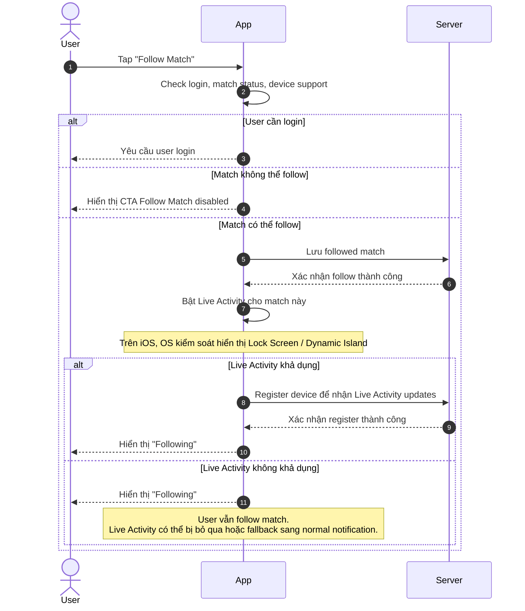
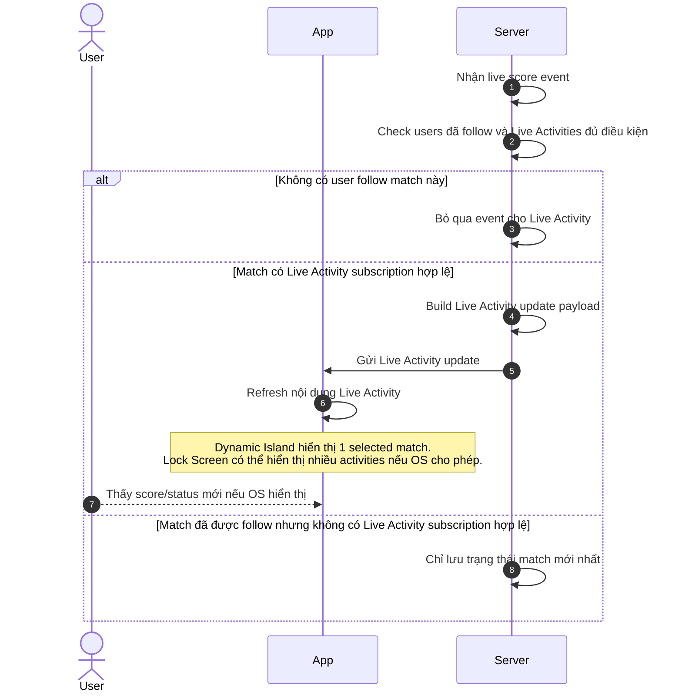
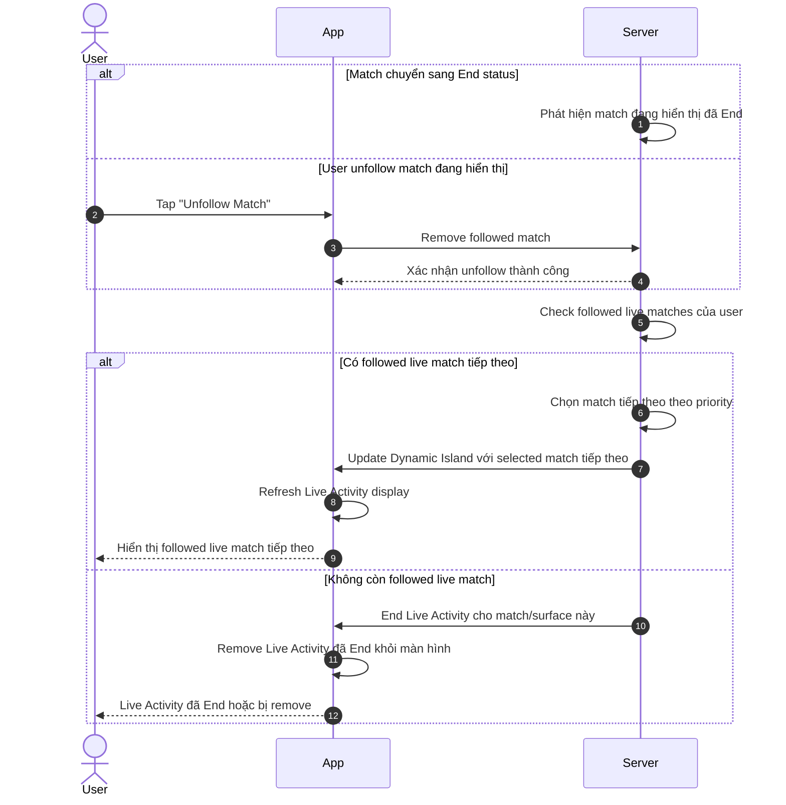
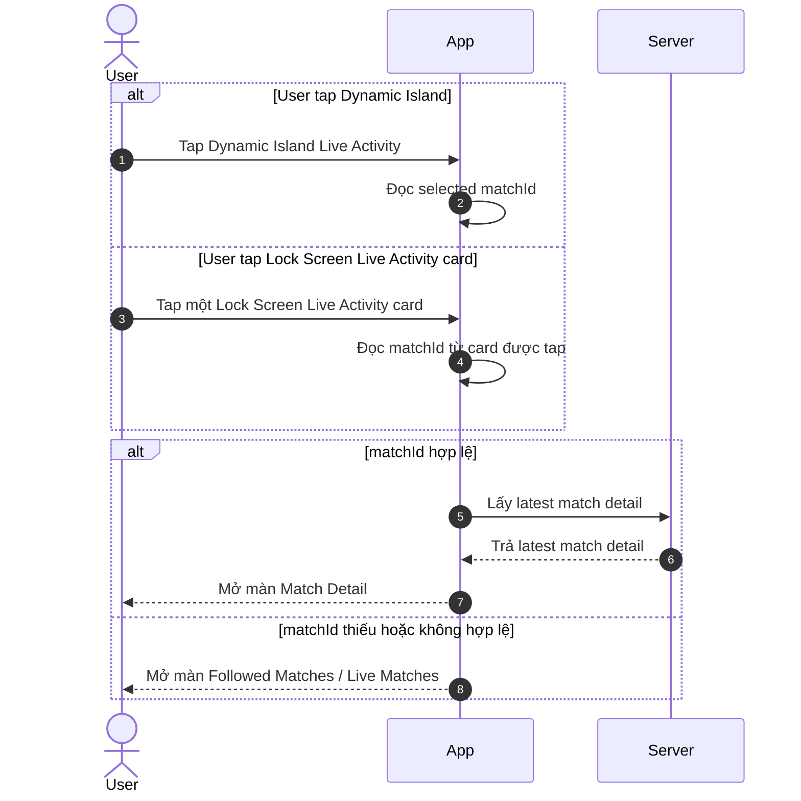

# Live Activity User Flows — Product/QC Handoff

> Project: FPTPlay
> Feature: Sport Zone / Live Activity
> Audience: Product, BA, FE, BE, QA, iOS
> Status: Final implementation handoff
> Last updated: 2026-06-04

## 0. Quy tắc hiển thị

- Live Activity được kích hoạt từ hành động chủ động **Follow Match** của user.
- User có thể follow một hoặc nhiều match.
- **Dynamic Island** chỉ hiển thị **1 selected followed match** theo priority.
- **Lock Screen** có thể hiển thị nhiều followed live matches / nhiều Live Activities nếu OS cho phép.
- Server vẫn update các Live Activity subscriptions hợp lệ cho những followed live matches đủ điều kiện.
- App/Product định nghĩa template và data hiển thị theo từng match.
- OS quyết định cách hiển thị thực tế trên Lock Screen: một hay nhiều activities, thứ tự, collapse/expand.
- Nếu match không đủ điều kiện follow/Live Activity, App disable CTA **Follow Match**.

---

# Flow 01 — Follow Match → Start Live Activity / Register Subscription

## Mục đích

User follow một match để App lưu trạng thái followed và bật Live Activity nếu device/platform hỗ trợ.

## Sequence Diagram



## Tóm tắt main flow

- User tap CTA **Follow Match** trên một match.
- App check login, trạng thái match và khả năng hỗ trợ của device/platform.
- Nếu match không đủ điều kiện, App disable CTA **Follow Match**.
- Server lưu match vào danh sách followed matches của user.
- App bật Live Activity nếu device/platform hỗ trợ.
- App register device với Server để nhận Live Activity updates.
- Sau khi follow thành công, CTA đổi thành **Following**.
- Dynamic Island áp dụng selected match priority; Lock Screen có thể hiển thị match này cùng các followed live matches khác nếu OS cho phép.

## Alternate / Error paths

- **User chưa login**
  Hành vi mong đợi: App yêu cầu user login trước khi follow match.

- **Match không hợp lệ**
  Hành vi mong đợi: App disable CTA **Follow Match** và không cho user tap follow.

- **Server lưu follow thất bại**
  Hành vi mong đợi: App giữ CTA là **Follow Match** và cho user thử lại.

- **Device/platform không hỗ trợ Live Activity**
  Hành vi mong đợi: User vẫn follow được match, nhưng Live Activity không được bật trên device đó.

- **Bật Live Activity thất bại**
  Hành vi mong đợi: App vẫn giữ trạng thái **Following** nếu follow đã lưu thành công.

- **Register device thất bại**
  Hành vi mong đợi: App retry register device và tránh tạo duplicate follow.

- **User follow nhiều trận đủ điều kiện live**
  Hành vi mong đợi: Server lưu/register các match hợp lệ; Dynamic Island chỉ ưu tiên 1 match, Lock Screen có thể hiển thị nhiều Live Activities nếu OS cho phép.

## Wireframe

### Trước khi follow — match hợp lệ

```text
┌─────────────────────────────────────┐
│ Match Detail                         │
├─────────────────────────────────────┤
│ Arsenal              0 - 0 Chelsea   │
│ 35' · Live                           │
│                                     │
│ ┌─────────────────────────────────┐ │
│ │ + Follow Match                  │ │
│ └─────────────────────────────────┘ │
│                                     │
│ Follow để xem live score trên        │
│ Lock Screen / Dynamic Island.        │
└─────────────────────────────────────┘
```

### Trước khi follow — match không hợp lệ

```text
┌─────────────────────────────────────┐
│ Match Detail                         │
├─────────────────────────────────────┤
│ Arsenal              0 - 0 Chelsea   │
│ FT · Match ended                     │
│                                     │
│ ┌─────────────────────────────────┐ │
│ │ Follow Match                    │ │
│ └─────────────────────────────────┘ │
│ Disabled                            │
│ Match không hỗ trợ Live Activity.    │
└─────────────────────────────────────┘
```

### Sau khi follow

```text
┌─────────────────────────────────────┐
│ Match Detail                         │
├─────────────────────────────────────┤
│ Arsenal              0 - 0 Chelsea   │
│ 35' · Live                           │
│                                     │
│ ┌─────────────────────────────────┐ │
│ │ ✓ Following                     │ │
│ └─────────────────────────────────┘ │
│                                     │
│ Live Activity đã bật nếu device      │
│ của user hỗ trợ.                     │
└─────────────────────────────────────┘
```

### Preview trên Dynamic Island

```text
┌───────────────────────────────┐
│ ARS 0 - 0 CHE        35' LIVE │
└───────────────────────────────┘
```

## Ghi chú wireframe

- CTA chính là **Follow Match / Following**.
- Match không hợp lệ phải disable CTA **Follow Match**.
- User vẫn follow được match nếu Live Activity không khả dụng trên device, miễn là match đủ điều kiện follow.
- Dynamic Island chỉ hiển thị **1 selected match**.
- Lock Screen có thể hiển thị nhiều matches/activities nếu OS cho phép.
- Tap vào Live Activity mở đúng Match Detail theo `matchId`.

---

# Flow 02 — Live Score Event → Update Live Activity

## Mục đích

Khi score/status thay đổi, Server gửi Live Activity updates cho những followed live matches đủ điều kiện.

## Sequence Diagram



## Tóm tắt main flow

- Server nhận live score/status event.
- Server check match này có user follow hay không.
- Server check match/device có Live Activity subscription hợp lệ hay không.
- Server build update payload gồm score, minute/status, team info và deeplink data.
- App/OS refresh nội dung Live Activity.
- Dynamic Island chỉ update selected match.
- Lock Screen có thể update nhiều followed match activities đủ điều kiện nếu OS cho phép hiển thị.

## Alternate / Error paths

- **Không có user nào follow match này**
  Hành vi mong đợi: Server bỏ qua event và không gửi update Live Activity.

- **Match được follow nhưng không phải selected match trên Dynamic Island**
  Hành vi mong đợi: Server vẫn có thể update Live Activity cho Lock Screen nếu subscription hợp lệ; Dynamic Island không đổi selected match.

- **Lock Screen đang hiển thị nhiều Live Activities**
  Hành vi mong đợi: OS quyết định activity nào được hiển thị/expand, Server vẫn gửi update cho các match hợp lệ.

- **Event bị trùng**
  Hành vi mong đợi: Server bỏ qua event trùng để tránh update lặp.

- **Event đến chậm hơn trạng thái hiện tại**
  Hành vi mong đợi: Server bỏ qua event cũ để tránh rollback score/status.

- **Score/status không thay đổi đáng kể**
  Hành vi mong đợi: Server có thể bỏ qua update để tránh gửi quá nhiều lần.

- **Gửi update Live Activity thất bại**
  Hành vi mong đợi: Server retry theo retry rule, UI giữ trạng thái hiển thị gần nhất.

- **Token/device Live Activity không hợp lệ**
  Hành vi mong đợi: Server đánh dấu subscription/device không hợp lệ và ngừng gửi update cho device đó.

- **User unfollow match trong lúc event đang xử lý**
  Hành vi mong đợi: Server check lại trạng thái follow trước khi gửi; nếu đã unfollow thì không gửi update.

- **Match chuyển sang trạng thái End**
  Hành vi mong đợi: Server chuyển sang flow **Match End / Unfollow → Switch to Next Followed Live Match or End**.

- **Device/platform không hỗ trợ Live Activity**
  Hành vi mong đợi: Server không gửi Live Activity update cho device đó.

- **App offline hoặc user không mở App**
  Hành vi mong đợi: Live Activity vẫn được update từ xa nếu subscription hợp lệ; nếu không update được thì giữ trạng thái gần nhất.

## Wireframe

### Dynamic Island — trước khi update

```text
┌───────────────────────────────┐
│ ARS 0 - 0 CHE        35' LIVE │
└───────────────────────────────┘
```

### Dynamic Island — sau khi score update

```text
┌───────────────────────────────┐
│ ARS 1 - 0 CHE        39' LIVE │
└───────────────────────────────┘
```

### Lock Screen — một match

```text
┌─────────────────────────────────────┐
│ Live Match                           │
├─────────────────────────────────────┤
│ Arsenal                         1   │
│ Chelsea                         0   │
│                                     │
│ 39' · Goal                           │
└─────────────────────────────────────┘
```

### Lock Screen — nhiều followed live matches nếu OS cho phép

```text
┌─────────────────────────────────────┐
│ Arsenal 1 - 0 Chelsea        39'    │
└─────────────────────────────────────┘
┌─────────────────────────────────────┐
│ Man City 0 - 0 Liverpool     12'    │
└─────────────────────────────────────┘
```

## Ghi chú wireframe

- Dynamic Island chỉ hiển thị 1 selected match theo priority.
- Lock Screen có thể hiển thị nhiều followed live match activities nếu OS cho phép.
- Server update các subscriptions hợp lệ theo từng match/device.
- OS quyết định activities nào được visible, collapsed, stacked hoặc expanded.
- UI cần ngắn gọn: team, score, minute/status.
- Nếu update thất bại, UI giữ trạng thái hiển thị thành công gần nhất.

---

# Flow 03 — Match End / Unfollow → Switch to Next Followed Live Match or End

## Mục đích

Khi selected match trên Dynamic Island kết thúc hoặc user unfollow match đó, hệ thống chuyển Dynamic Island sang followed live match tiếp theo; với Lock Screen, activity của match đã End/Unfollow sẽ bị remove, các activities hợp lệ khác vẫn có thể tiếp tục.

## Sequence Diagram



## Tóm tắt main flow

- Flow được kích hoạt khi match đang hiển thị kết thúc hoặc user unfollow match đó.
- Server remove/end Live Activity của match đó.
- Server check user còn followed live matches đủ điều kiện khác hay không.
- Dynamic Island chuyển sang selected match tiếp theo theo priority nếu có.
- Nếu không còn followed live match cho Dynamic Island, Dynamic Island Live Activity kết thúc.
- Lock Screen có thể tiếp tục hiển thị các followed live match activities hợp lệ khác nếu OS cho phép.

## Alternate / Error paths

- **Match End nhưng còn followed match khác đang Live**
  Hành vi mong đợi: Server chuyển Dynamic Island sang followed live match tiếp theo theo priority.

- **Match End và không còn followed match nào đang Live**
  Hành vi mong đợi: Server kết thúc Live Activity tương ứng.

- **Match End nhưng Lock Screen còn nhiều Live Activities khác**
  Hành vi mong đợi: Server end activity của match đã End; các Live Activity hợp lệ khác vẫn tiếp tục update/hiển thị theo OS.

- **User unfollow match đang hiển thị trên Dynamic Island**
  Hành vi mong đợi: Server bỏ match đó khỏi danh sách followed và chọn live match tiếp theo nếu có.

- **User unfollow match không phải selected match của Dynamic Island**
  Hành vi mong đợi: Server chỉ update danh sách followed và Dynamic Island hiện tại không đổi.

- **User unfollow một match đang hiển thị trên Lock Screen nhưng không phải selected match của Dynamic Island**
  Hành vi mong đợi: Server end/remove Live Activity của match đó, Dynamic Island selected match không đổi.

- **Match tiếp theo đang follow nhưng chưa Live**
  Hành vi mong đợi: Server không chuyển sang match đó cho đến khi match đủ điều kiện hiển thị.

- **Có nhiều followed matches đang Live**
  Hành vi mong đợi: Server chọn match cho Dynamic Island theo priority đã định nghĩa, mặc định là match được follow sớm nhất.

- **Update sang match tiếp theo thất bại**
  Hành vi mong đợi: Server retry theo retry rule, Live Activity giữ trạng thái gần nhất.

- **End Live Activity thất bại**
  Hành vi mong đợi: Server retry/end lại theo retry rule để tránh Live Activity bị treo.

- **User unfollow trong lúc Server đang switch match**
  Hành vi mong đợi: Server check lại trạng thái followed mới nhất trước khi gửi update.

- **Subscription/device không hợp lệ**
  Hành vi mong đợi: Server đánh dấu subscription/device không hợp lệ và ngừng gửi update cho device đó.

## Wireframe

### Match hiện tại End, Dynamic Island chuyển sang live match tiếp theo

```text
Trước
┌───────────────────────────────┐
│ ARS 2 - 1 CHE        FT       │
└───────────────────────────────┘

Sau
┌───────────────────────────────┐
│ MCI 0 - 0 LIV        12' LIVE │
└───────────────────────────────┘
```

### User unfollow match đang hiển thị

```text
┌─────────────────────────────────────┐
│ Match Detail                         │
├─────────────────────────────────────┤
│ Arsenal              2 - 1 Chelsea   │
│ 78' · Live                           │
│                                     │
│ ┌─────────────────────────────────┐ │
│ │ ✓ Following                     │ │
│ └─────────────────────────────────┘ │
│                                     │
│ User tap CTA                        │
│                                     │
│ ┌─────────────────────────────────┐ │
│ │ + Follow Match                  │ │
│ └─────────────────────────────────┘ │
└─────────────────────────────────────┘
```

### Lock Screen sau khi một match End, activity khác vẫn còn

```text
Đã remove
┌─────────────────────────────────────┐
│ Arsenal 2 - 1 Chelsea        FT     │
└─────────────────────────────────────┘

Vẫn active nếu OS cho phép
┌─────────────────────────────────────┐
│ Man City 0 - 0 Liverpool     12'    │
└─────────────────────────────────────┘
```

## Ghi chú wireframe

- Nếu selected match kết thúc, Dynamic Island không được giữ trạng thái match cũ.
- Nếu còn followed live match khác, Dynamic Island chuyển match theo priority.
- Nếu không còn followed live match, Dynamic Island Live Activity kết thúc.
- Lock Screen vẫn có thể hiển thị các Live Activities hợp lệ khác.
- Khi user unfollow match, CTA đổi về **Follow Match**.
- Dynamic Island chỉ hiển thị 1 selected match tại một thời điểm.

---

# Flow 04 — Tap Live Activity → Deeplink

## Mục đích

Khi user tap Live Activity từ Dynamic Island hoặc Lock Screen, App mở đúng màn Match Detail tương ứng.

## Sequence Diagram



## Tóm tắt main flow

- User tap Live Activity trên Dynamic Island hoặc Lock Screen.
- Nếu user tap Dynamic Island, App mở selected match.
- Nếu Lock Screen hiển thị nhiều Live Activities, App mở match gắn với card được tap.
- Mỗi Live Activity card phải có đúng `matchId`.
- App fetch latest match detail trước khi render màn hình.
- Nếu deeplink data thiếu/không hợp lệ, App mở **Followed Matches / Live Matches** làm fallback.

## Alternate / Error paths

- **User tap Dynamic Island**
  Hành vi mong đợi: App mở Match Detail của selected match hiện tại.

- **User tap một card trên Lock Screen multi-match**
  Hành vi mong đợi: App mở Match Detail của đúng match gắn với card được tap.

- **Deeplink có matchId hợp lệ**
  Hành vi mong đợi: App mở màn Match Detail của match tương ứng.

- **Deeplink thiếu matchId**
  Hành vi mong đợi: App mở màn Followed Matches / Live Matches.

- **Deeplink có matchId không hợp lệ**
  Hành vi mong đợi: App fallback về màn Followed Matches / Live Matches.

- **Match đã kết thúc trước khi user tap**
  Hành vi mong đợi: App vẫn mở Match Detail và hiển thị trạng thái mới nhất của match.

- **Match đã bị xóa/không còn khả dụng**
  Hành vi mong đợi: App hiển thị thông báo không tìm thấy match và fallback về Followed Matches / Live Matches.

- **User đã unfollow match trước khi tap**
  Hành vi mong đợi: App vẫn có thể mở Match Detail, nhưng CTA hiển thị lại là **Follow Match**.

- **User chưa login hoặc session hết hạn**
  Hành vi mong đợi: App yêu cầu login trước, sau đó điều hướng lại theo deeplink nếu còn hợp lệ.

- **Server lấy match detail thất bại**
  Hành vi mong đợi: App hiển thị màn lỗi/retry thay vì đứng ở màn trắng.

- **User tap Live Activity khi App chưa được mở sẵn**
  Hành vi mong đợi: App được mở và điều hướng đến Match Detail / Followed Matches theo deeplink.

- **App đã mở sẵn ở màn khác**
  Hành vi mong đợi: App điều hướng sang màn đích theo deeplink, không tạo duplicate screen không cần thiết.

## Wireframe

### Tap Dynamic Island

```text
Live Activity
┌───────────────────────────────┐
│ ARS 1 - 0 CHE        39' LIVE │
└───────────────────────────────┘

User tap
      ↓

App mở
┌─────────────────────────────────────┐
│ Match Detail                         │
├─────────────────────────────────────┤
│ Premier League                       │
│                                     │
│ Arsenal                         1   │
│ Chelsea                         0   │
│                                     │
│ 39' · Live                           │
│                                     │
│ ┌─────────────────────────────────┐ │
│ │ ✓ Following                     │ │
│ └─────────────────────────────────┘ │
│                                     │
│ Timeline                            │
│ Stats                               │
│ Lineups                             │
└─────────────────────────────────────┘
```

### Tap card Lock Screen multi-match

```text
Lock Screen
┌─────────────────────────────────────┐
│ Arsenal 1 - 0 Chelsea        39'    │
└─────────────────────────────────────┘
┌─────────────────────────────────────┐
│ Man City 0 - 0 Liverpool     12'    │
└─────────────────────────────────────┘

User tap card Man City
      ↓

App mở Match Detail Man City vs Liverpool
```

### Deeplink thiếu/không hợp lệ — fallback

```text
Live Activity
┌───────────────────────────────┐
│ ARS 1 - 0 CHE        39' LIVE │
└───────────────────────────────┘

User tap
      ↓

App mở fallback
┌─────────────────────────────────────┐
│ Followed Live Matches                │
├─────────────────────────────────────┤
│ Live                                 │
│                                     │
│ Arsenal 1 - 0 Chelsea        39'    │
│ Man City 0 - 0 Liverpool     12'    │
│                                     │
│ Upcoming                             │
│                                     │
│ Barcelona vs Real Madrid     02:00  │
└─────────────────────────────────────┘
```

## Ghi chú wireframe

- Tap Dynamic Island mở current selected match.
- Tap Lock Screen card mở match gắn với card đó.
- Mỗi Live Activity card phải có `matchId` hợp lệ.
- Nếu deeplink không hợp lệ, fallback là **Followed Matches / Live Matches**.
- App cần fetch latest match detail trước khi render.
- Nếu user đã unfollow, Match Detail vẫn mở nhưng CTA phải phản ánh follow state mới nhất.
- Không hiển thị lỗi kỹ thuật như deeplink/token error cho user.
