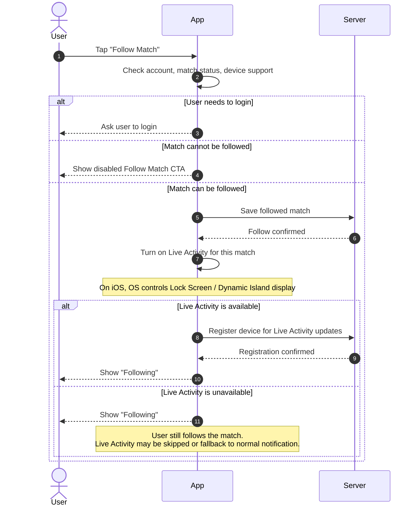
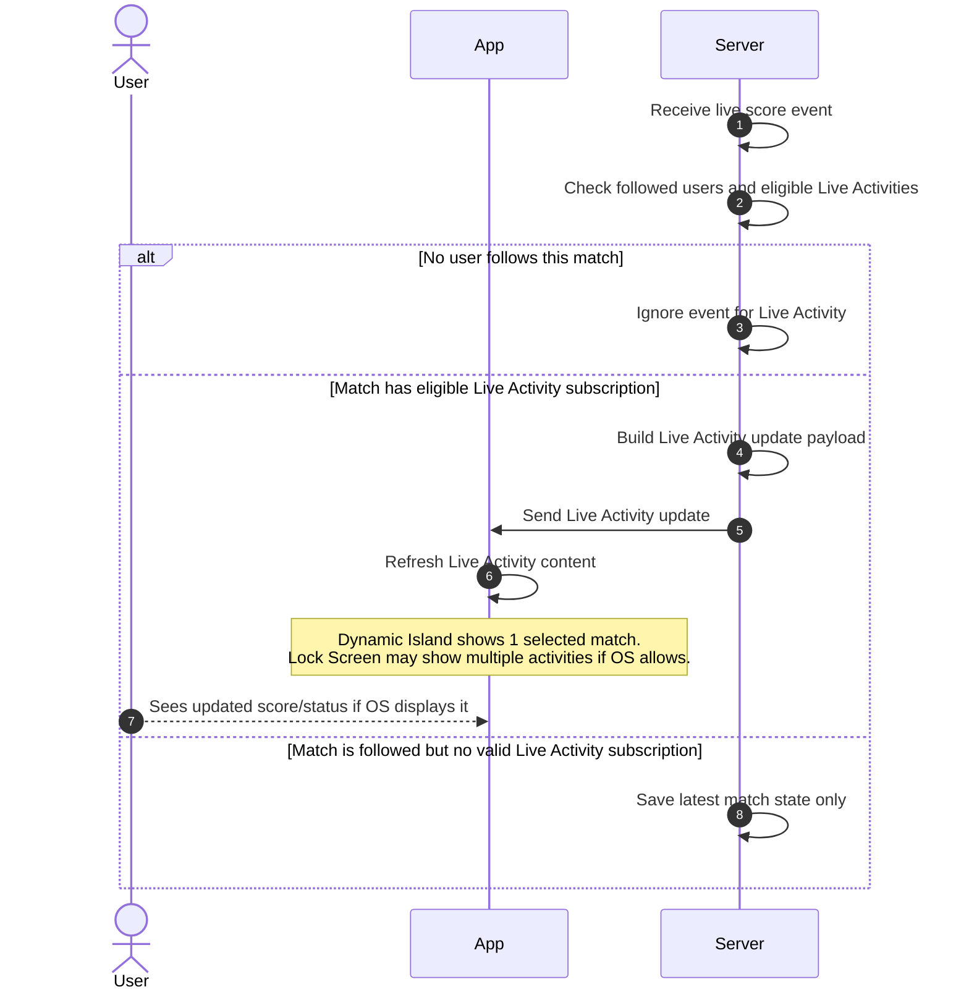
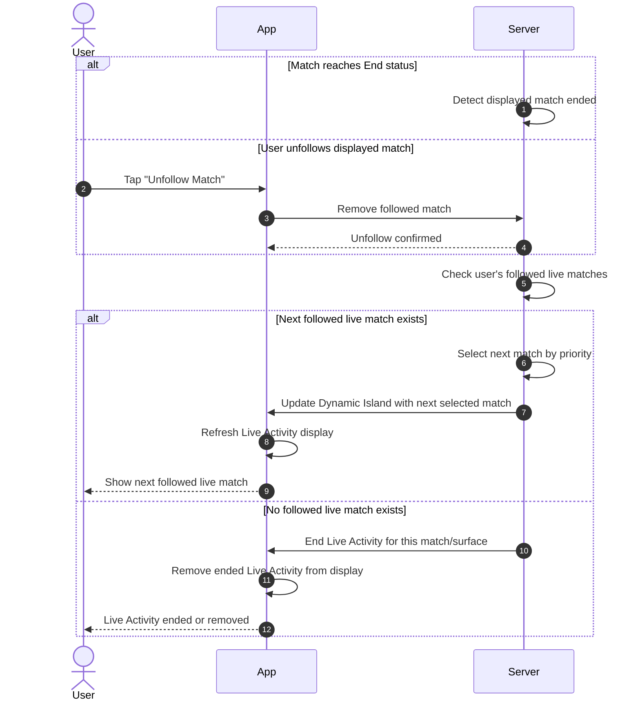
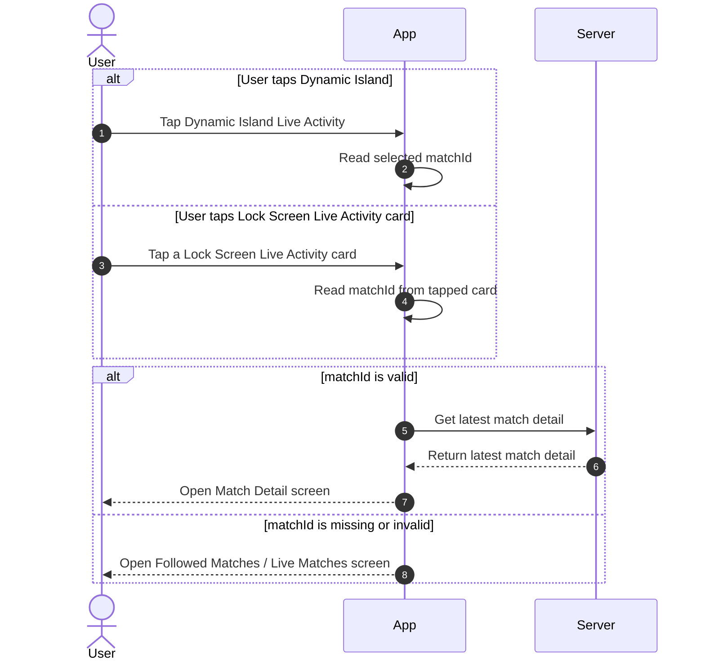

# Live Activity User Flows — Product/QC Handoff

> Project: FPTPlay  
> Feature: Sport Zone / Live Activity  
> Audience: Product, BA, FE, BE, QA, iOS  
> Status: Final implementation handoff  
> Last updated: 2026-06-04

## 0. Display Rule

- Live Activity is triggered by explicit **Follow Match** intent.
- User can follow one or multiple matches.
- **Dynamic Island** displays only **1 selected followed match** by priority.
- **Lock Screen** may display multiple followed live matches / multiple Live Activities if OS allows.
- Server still updates valid Live Activity subscriptions for eligible followed live matches.
- App/Product defines template and data per match.
- OS controls actual Lock Screen presentation: one or multiple activities, order, expansion/collapse.
- If a match is not eligible for following/Live Activity, App disables the **Follow Match** CTA.

---

# Flow 01 — Follow Match → Start Live Activity / Register Subscription

## Purpose

User follows a match so App saves the followed state and turns on Live Activity if the device/platform supports it.

## Sequence Diagram



## Main flow summary

- User taps **Follow Match** on a match.
- App checks login, match status, and device/platform support.
- If match is not eligible, App disables **Follow Match** CTA.
- Server saves the match into user's followed matches.
- App turns on Live Activity if available.
- App registers the device with Server for Live Activity updates.
- CTA changes to **Following** after follow succeeds.
- Dynamic Island uses selected match priority; Lock Screen may show this match with other eligible followed live matches if OS allows.

## Alternate / Error paths

- **User chưa login**  
  Expected behavior: App yêu cầu user login trước khi follow match.

- **Match không hợp lệ**  
  Expected behavior: App disable CTA **Follow Match** và không cho user tap follow.

- **Server lưu follow thất bại**  
  Expected behavior: App giữ CTA là **Follow Match** và cho user thử lại.

- **Device/platform không hỗ trợ Live Activity**  
  Expected behavior: User vẫn follow được match, nhưng Live Activity không được bật trên device đó.

- **Live Activity bật thất bại**  
  Expected behavior: App vẫn giữ trạng thái **Following** nếu follow đã lưu thành công.

- **Register device thất bại**  
  Expected behavior: App retry đăng ký device và tránh tạo duplicate follow.

- **User follow nhiều trận đủ điều kiện live**  
  Expected behavior: Server lưu/register các match hợp lệ; Dynamic Island chỉ ưu tiên 1 trận, Lock Screen có thể hiển thị nhiều Live Activities nếu OS cho phép.

## Wireframe

### Before follow — eligible match

```text
┌─────────────────────────────────────┐
│ Match Detail                         │
├─────────────────────────────────────┤
│ Arsenal              0 - 0 Chelsea   │
│ 35' · Live                           │
│                                     │
│ ┌─────────────────────────────────┐ │
│ │ + Follow Match                  │ │
│ └─────────────────────────────────┘ │
│                                     │
│ Follow to see live score on          │
│ Lock Screen / Dynamic Island.        │
└─────────────────────────────────────┘
```

### Before follow — ineligible match

```text
┌─────────────────────────────────────┐
│ Match Detail                         │
├─────────────────────────────────────┤
│ Arsenal              0 - 0 Chelsea   │
│ FT · Match ended                     │
│                                     │
│ ┌─────────────────────────────────┐ │
│ │ Follow Match                    │ │
│ └─────────────────────────────────┘ │
│ Disabled                            │
│ Match is not available for Live      │
│ Activity.                            │
└─────────────────────────────────────┘
```

### After follow

```text
┌─────────────────────────────────────┐
│ Match Detail                         │
├─────────────────────────────────────┤
│ Arsenal              0 - 0 Chelsea   │
│ 35' · Live                           │
│                                     │
│ ┌─────────────────────────────────┐ │
│ │ ✓ Following                     │ │
│ └─────────────────────────────────┘ │
│                                     │
│ Live Activity is on if supported     │
│ by your device.                      │
└─────────────────────────────────────┘
```

### Dynamic Island preview

```text
┌───────────────────────────────┐
│ ARS 0 - 0 CHE        35' LIVE │
└───────────────────────────────┘
```

## Wireframe notes

- CTA chính là **Follow Match / Following**.
- Match không hợp lệ phải disable CTA **Follow Match**.
- User vẫn follow được trận nếu Live Activity không khả dụng trên device, miễn là match eligible để follow.
- Dynamic Island chỉ hiển thị **1 selected match**.
- Lock Screen có thể hiển thị nhiều match/activities nếu OS cho phép.
- Tap vào Live Activity mở đúng Match Detail theo matchId.

---

# Flow 02 — Live Score Event → Update Live Activity

## Purpose

When score/status changes, Server sends Live Activity updates for eligible followed live matches.

## Sequence Diagram



## Main flow summary

- Server receives a live score/status event.
- Server checks whether the match is followed by users.
- Server checks whether there is a valid Live Activity subscription for the match/device.
- Server builds an update payload with score, minute/status, team information, and deeplink data.
- App/OS refreshes the Live Activity content.
- Dynamic Island updates only the selected match.
- Lock Screen may update multiple eligible followed match activities if OS allows them to be visible.

## Alternate / Error paths

- **Không có user nào follow trận này**  
  Expected behavior: Server bỏ qua event và không gửi update Live Activity.

- **Trận được follow nhưng không phải selected match trên Dynamic Island**  
  Expected behavior: Server vẫn có thể update Live Activity cho Lock Screen nếu subscription hợp lệ; Dynamic Island không đổi selected match.

- **Lock Screen đang hiển thị nhiều Live Activities**  
  Expected behavior: OS quyết định activity nào được hiển thị/expand, Server vẫn gửi update cho các match hợp lệ.

- **Event bị trùng**  
  Expected behavior: Server bỏ qua event trùng để tránh update lặp.

- **Event đến chậm hơn trạng thái hiện tại**  
  Expected behavior: Server bỏ qua event cũ để tránh rollback tỷ số/trạng thái.

- **Tỷ số/trạng thái không thay đổi đáng kể**  
  Expected behavior: Server có thể bỏ qua update để tránh gửi quá nhiều lần.

- **Gửi update Live Activity thất bại**  
  Expected behavior: Server retry theo rule kỹ thuật, UI giữ trạng thái hiển thị gần nhất.

- **Token/device Live Activity không hợp lệ**  
  Expected behavior: Server đánh dấu subscription/device không hợp lệ và ngừng gửi update cho device đó.

- **User unfollow trận trong lúc event đang xử lý**  
  Expected behavior: Server kiểm tra lại trạng thái follow trước khi gửi; nếu đã unfollow thì không gửi update.

- **Trận chuyển sang trạng thái End**  
  Expected behavior: Server chuyển sang flow **Match End / Unfollow → Switch to Next Followed Live Match or End**.

- **Device/platform không hỗ trợ Live Activity**  
  Expected behavior: Server không gửi Live Activity update cho device đó.

- **App đang offline hoặc user không mở app**  
  Expected behavior: Live Activity vẫn được update từ xa nếu subscription hợp lệ; nếu không update được thì giữ trạng thái gần nhất.

## Wireframe

### Dynamic Island — before update

```text
┌───────────────────────────────┐
│ ARS 0 - 0 CHE        35' LIVE │
└───────────────────────────────┘
```

### Dynamic Island — after score update

```text
┌───────────────────────────────┐
│ ARS 1 - 0 CHE        39' LIVE │
└───────────────────────────────┘
```

### Lock Screen — one match

```text
┌─────────────────────────────────────┐
│ Live Match                           │
├─────────────────────────────────────┤
│ Arsenal                         1   │
│ Chelsea                         0   │
│                                     │
│ 39' · Goal                           │
└─────────────────────────────────────┘
```

### Lock Screen — multiple followed live matches if OS allows

```text
┌─────────────────────────────────────┐
│ Arsenal 1 - 0 Chelsea        39'    │
└─────────────────────────────────────┘
┌─────────────────────────────────────┐
│ Man City 0 - 0 Liverpool     12'    │
└─────────────────────────────────────┘
```

## Wireframe notes

- Dynamic Island only displays 1 selected match by priority.
- Lock Screen may display multiple followed live match activities if OS allows.
- Server updates valid subscriptions per match/device.
- OS decides which activities are visible, collapsed, stacked, or expanded.
- UI should stay concise: team, score, minute/status.
- If update fails, UI keeps the last successfully displayed state.

---

# Flow 03 — Match End / Unfollow → Switch to Next Followed Live Match or End

## Purpose

When the Dynamic Island selected match ends or user unfollows it, system switches Dynamic Island to the next followed live match; for Lock Screen, the ended/unfollowed match activity is removed while other valid activities may continue.

## Sequence Diagram



## Main flow summary

- Flow is triggered when the current displayed match ends or user unfollows it.
- Server removes or ends the Live Activity for that match.
- Server checks whether user still has other followed live/eligible matches.
- Dynamic Island switches to the next selected match by priority if available.
- If no followed live match remains for Dynamic Island, Dynamic Island Live Activity ends.
- Lock Screen may continue showing other valid followed live match activities if OS allows.

## Alternate / Error paths

- **Trận End nhưng còn trận followed khác đang Live**  
  Expected behavior: Server chuyển Dynamic Island sang trận followed live tiếp theo theo priority.

- **Trận End và không còn trận followed nào đang Live**  
  Expected behavior: Server kết thúc Live Activity tương ứng.

- **Trận End nhưng Lock Screen còn nhiều Live Activities khác**  
  Expected behavior: Server end activity của trận đã End; các Live Activity hợp lệ khác vẫn tiếp tục update/hiển thị theo OS.

- **User unfollow trận đang hiển thị trên Dynamic Island**  
  Expected behavior: Server bỏ trận đó khỏi danh sách followed và chọn trận live tiếp theo nếu có.

- **User unfollow trận không phải selected match của Dynamic Island**  
  Expected behavior: Server chỉ cập nhật danh sách followed và Dynamic Island hiện tại không đổi.

- **User unfollow một trận đang hiển thị trên Lock Screen nhưng không phải selected match của Dynamic Island**  
  Expected behavior: Server end/remove Live Activity của trận đó, Dynamic Island selected match không đổi.

- **Trận tiếp theo đang follow nhưng chưa Live**  
  Expected behavior: Server không chuyển sang trận đó cho đến khi trận đủ điều kiện hiển thị.

- **Có nhiều trận followed đang Live**  
  Expected behavior: Server chọn trận cho Dynamic Island theo priority đã định nghĩa, mặc định là trận được follow sớm nhất.

- **Update sang trận tiếp theo thất bại**  
  Expected behavior: Server retry theo rule kỹ thuật, Live Activity giữ trạng thái gần nhất.

- **End Live Activity thất bại**  
  Expected behavior: Server retry/end lại theo rule kỹ thuật để tránh Live Activity bị treo.

- **User unfollow trong lúc Server đang switch trận**  
  Expected behavior: Server kiểm tra lại trạng thái followed mới nhất trước khi gửi update.

- **Subscription/device không hợp lệ**  
  Expected behavior: Server đánh dấu subscription/device không hợp lệ và ngừng gửi update cho device đó.

## Wireframe

### Current match ended, switch Dynamic Island to next live match

```text
Before
┌───────────────────────────────┐
│ ARS 2 - 1 CHE        FT       │
└───────────────────────────────┘

After
┌───────────────────────────────┐
│ MCI 0 - 0 LIV        12' LIVE │
└───────────────────────────────┘
```

### User unfollows displayed match

```text
┌─────────────────────────────────────┐
│ Match Detail                         │
├─────────────────────────────────────┤
│ Arsenal              2 - 1 Chelsea   │
│ 78' · Live                           │
│                                     │
│ ┌─────────────────────────────────┐ │
│ │ ✓ Following                     │ │
│ └─────────────────────────────────┘ │
│                                     │
│ User taps button                     │
│                                     │
│ ┌─────────────────────────────────┐ │
│ │ + Follow Match                  │ │
│ └─────────────────────────────────┘ │
└─────────────────────────────────────┘
```

### Lock Screen after one match ends, other activity remains

```text
Removed
┌─────────────────────────────────────┐
│ Arsenal 2 - 1 Chelsea        FT     │
└─────────────────────────────────────┘

Still active if OS allows
┌─────────────────────────────────────┐
│ Man City 0 - 0 Liverpool     12'    │
└─────────────────────────────────────┘
```

## Wireframe notes

- If selected match ends, Dynamic Island should not keep stale match state.
- If another followed live match exists, Dynamic Island switches by priority.
- If no followed live match exists, Dynamic Island Live Activity ends.
- Lock Screen may still show other valid Live Activities.
- User unfollowing a match changes CTA back to **Follow Match**.
- Dynamic Island remains one selected match at a time.

---

# Flow 04 — Tap Live Activity → Deeplink

## Purpose

When user taps a Live Activity from Dynamic Island or Lock Screen, App opens the correct match detail screen.

## Sequence Diagram



## Main flow summary

- User taps a Live Activity on Dynamic Island or Lock Screen.
- If user taps Dynamic Island, App opens the selected match.
- If Lock Screen shows multiple Live Activities, App opens the match linked to the tapped card.
- Each Live Activity card must contain the correct matchId.
- App fetches latest match detail before rendering.
- If deeplink data is missing/invalid, App opens **Followed Matches / Live Matches** as fallback.

## Alternate / Error paths

- **User tap Dynamic Island**  
  Expected behavior: App mở Match Detail của selected match hiện tại.

- **User tap một card trên Lock Screen multi-match**  
  Expected behavior: App mở Match Detail của đúng match gắn với card được tap.

- **Deeplink có matchId hợp lệ**  
  Expected behavior: App mở màn Match Detail của trận tương ứng.

- **Deeplink thiếu matchId**  
  Expected behavior: App mở màn Followed Matches / Live Matches.

- **Deeplink có matchId không hợp lệ**  
  Expected behavior: App fallback về màn Followed Matches / Live Matches.

- **Match đã kết thúc trước khi user tap**  
  Expected behavior: App vẫn mở Match Detail và hiển thị trạng thái mới nhất của trận.

- **Match đã bị xóa/không còn khả dụng**  
  Expected behavior: App hiển thị thông báo không tìm thấy trận và fallback về Followed Matches / Live Matches.

- **User đã unfollow match trước khi tap**  
  Expected behavior: App vẫn có thể mở Match Detail, nhưng CTA hiển thị lại là **Follow Match**.

- **User chưa login hoặc session hết hạn**  
  Expected behavior: App yêu cầu login trước, sau đó điều hướng lại theo deeplink nếu còn hợp lệ.

- **Server lấy match detail thất bại**  
  Expected behavior: App hiển thị màn lỗi/retry thay vì đứng ở màn trắng.

- **User tap Live Activity khi App chưa được mở sẵn**  
  Expected behavior: App được mở và điều hướng đến Match Detail / Followed Matches theo deeplink.

- **App đã mở sẵn ở màn khác**  
  Expected behavior: App điều hướng sang màn đích theo deeplink, không tạo duplicate screen không cần thiết.

## Wireframe

### Tap Dynamic Island

```text
Live Activity
┌───────────────────────────────┐
│ ARS 1 - 0 CHE        39' LIVE │
└───────────────────────────────┘

User taps
      ↓

App opens
┌─────────────────────────────────────┐
│ Match Detail                         │
├─────────────────────────────────────┤
│ Premier League                       │
│                                     │
│ Arsenal                         1   │
│ Chelsea                         0   │
│                                     │
│ 39' · Live                           │
│                                     │
│ ┌─────────────────────────────────┐ │
│ │ ✓ Following                     │ │
│ └─────────────────────────────────┘ │
│                                     │
│ Timeline                            │
│ Stats                               │
│ Lineups                             │
└─────────────────────────────────────┘
```

### Tap Lock Screen multi-match card

```text
Lock Screen
┌─────────────────────────────────────┐
│ Arsenal 1 - 0 Chelsea        39'    │
└─────────────────────────────────────┘
┌─────────────────────────────────────┐
│ Man City 0 - 0 Liverpool     12'    │
└─────────────────────────────────────┘

User taps Man City card
      ↓

App opens Man City vs Liverpool Match Detail
```

### Invalid/missing deeplink fallback

```text
Live Activity
┌───────────────────────────────┐
│ ARS 1 - 0 CHE        39' LIVE │
└───────────────────────────────┘

User taps
      ↓

App opens fallback
┌─────────────────────────────────────┐
│ Followed Live Matches                │
├─────────────────────────────────────┤
│ Live                                 │
│                                     │
│ Arsenal 1 - 0 Chelsea        39'    │
│ Man City 0 - 0 Liverpool     12'    │
│                                     │
│ Upcoming                             │
│                                     │
│ Barcelona vs Real Madrid     02:00  │
└─────────────────────────────────────┘
```

## Wireframe notes

- Tap Dynamic Island opens current selected match.
- Tap Lock Screen card opens the match linked to that specific card.
- Each Live Activity card must carry a valid matchId.
- If deeplink is invalid, fallback should be **Followed Matches / Live Matches**.
- App should fetch latest match detail before rendering.
- If user already unfollowed, Match Detail still opens but CTA must reflect latest follow state.
- Do not show technical deeplink/token errors to user.
