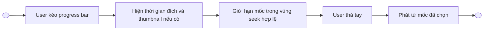
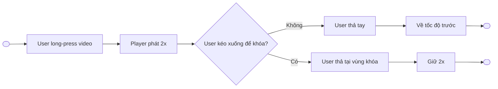
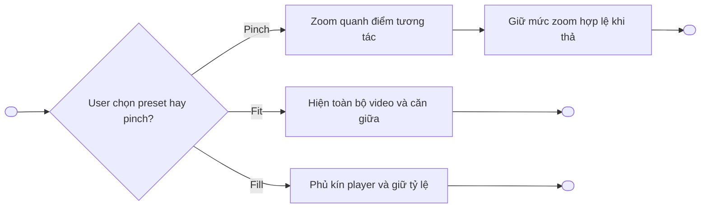
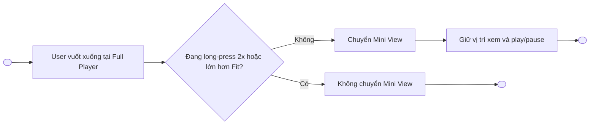

# Gesture Video Player — Functional Requirements

> Project: FPTPlay
> Epic: Video Player
> Feature: Gesture Video Player
> Audience: Product, BA, Designer, FE, QA
> Status: Review draft — có các mục cần Product xác nhận
> Source: `Gesture_Video_Player.pdf`, bản đặc tả v0.2 và các quyết định trao đổi sau v0.2
> Writing style: Caveman Vietnam — ít chữ, dễ đọc, đúng ý, không low-level
> Last updated: 2026-10-05

---

## 1. Description

Gesture Video Player bổ sung thao tác chạm, vuốt, giữ và pinch trên **Full Player** để user điều khiển video nhanh hơn.

- Áp dụng chung cho: **VOD, Live Channel, Event, Timeshift (TS), Playlist**.
- Tua và tăng tốc chỉ hoạt động khi nội dung, quyền xem và player hiện tại cho phép.
- Không ghi đè gesture hệ thống.
- Không làm custom volume hoặc brightness; dùng điều khiển hệ thống.
- Player trong Detail và hành vi bên trong Mini View không thuộc feature này.

---

## 2. Document History

| Version | Date | Updated By | Notes | Approved By |
|---|---|---|---|---|
| v0.2 | 2026-10-02 | Product / Dylan | Bản gần nhất trước các trao đổi về double-tap, khóa 2x và Fit / Fill / Zoom. | Pending |
| v0.3 | 2026-10-05 | Dylan | Bỏ cộng dồn double-tap; bổ sung long-press 2x, khóa tốc độ, Fit / Fill / Zoom; phân biệt rõ requirement đã chốt và đề xuất cần xác nhận. | Pending |

---

## 3. Overview

### 3.1 Goal

- User điều khiển Full Player nhanh bằng gesture quen thuộc.
- Giảm phụ thuộc vào control overlay cho các thao tác thường dùng.
- Giữ hành vi nhất quán giữa các loại nội dung, nhưng vẫn tuân theo quyền và khả năng phát của từng nội dung.
- Tránh xung đột giữa gesture video, gesture chuyển Mini View, đổi kênh và gesture hệ thống.

### 3.2 Platform scope

| Platform | Scope | Notes |
|---|---|---|
| iOS | In scope | Áp dụng trên Full Player cảm ứng; không ghi đè gesture hệ thống. |
| Android | In scope | Áp dụng trên Full Player cảm ứng; không ghi đè gesture hệ thống. |
| Web | Out of scope | Không thuộc bộ mobile touch gesture trong tài liệu này. |
| SmartTV / Box | Out of scope | Tiếp tục dùng remote/D-pad và control hiện tại. |

> **Cần xác nhận:** phạm vi release thực tế có triển khai đồng thời iOS và Android hay chia theo phase.

### 3.3 Content scope

| Loại nội dung | Scope | Rule chính |
|---|---|---|
| VOD | In scope | Cho tua/tăng tốc nếu nội dung và player cho phép. |
| Live Channel | In scope | Có thể vuốt ngang đổi kênh; tua/tăng tốc phụ thuộc stream/TS và quyền nội dung. |
| Event | In scope | Không áp dụng vuốt ngang đổi kênh. |
| Timeshift (TS) | In scope | Tua/tăng tốc chỉ trong vùng TS hợp lệ; đến live edge phải kết thúc 2x theo rule được chốt. |
| Playlist | In scope | Có control chuyển mục/tập tiếp theo; không tạo gesture mới. |

**Định nghĩa:** trong tài liệu này, **Live TV = Live Channel**.

### 3.4 User scope

| User type | Scope | Notes |
|---|---|---|
| User đang xem Full Player | In scope | Actor chính. |
| User đang xem player trong Detail | Out of scope | Không áp dụng bộ gesture này. |
| User đang ở Mini View | Out of scope | Chỉ gesture chuyển từ Full Player sang Mini View nằm trong scope. |

### 3.5 In scope

- Tap video để hiện/ẩn control.
- Double-tap trái/phải để tua độc lập 10 giây.
- Kéo progress bar để seek.
- Long-press để phát 2x tạm thời.
- Long-press rồi kéo xuống để khóa 2x.
- Pinch để zoom tự do.
- Kéo một ngón để di chuyển vùng hình khi video lớn hơn Fit.
- Vuốt xuống từ Full Player sang Mini View.
- Vuốt ngang đổi kênh chỉ trên Live Channel.
- Control chuyển tập/mục tiếp theo.
- Fit / Fill / Zoom và control đưa video về kích thước gốc.

### 3.6 Out of scope

- Gesture trên player trong Detail.
- Kéo, neo góc, resize, đóng hoặc mở lại Full Player từ Mini View.
- Custom volume gesture.
- Custom brightness gesture.
- Ghi đè gesture hệ thống.
- Vuốt ngang đổi Event.
- Tạo gesture riêng cho chuyển tập/mục tiếp theo.
- Chốt một mức zoom tối đa là “chuẩn Apple/Android”.

---

## 4. Entry Points

| # | Entry Point | User action / System trigger | Surface | Expected result |
|---:|---|---|---|---|
| 1 | Full Player | User mở nội dung ở Full Player | Video area | Bộ gesture được bật theo loại nội dung và trạng thái player. |
| 2 | Video area | User tap, double-tap, long-press, pinch hoặc swipe | Full Player | Hệ thống thực hiện gesture hợp lệ có độ ưu tiên cao nhất. |
| 3 | Progress bar | User kéo thumb/progress bar | Full Player controls | Hệ thống seek tới mốc hợp lệ và hiện preview nếu có. |
| 4 | Next item control | User bấm tập/mục tiếp theo | Full Player controls | Hệ thống chuyển mục theo logic playlist hiện tại. |

---

## 5. Use Case Summary

| Use Case ID | Use Case | Primary Actor | Trigger | Outcome |
|---|---|---|---|---|
| GVP-UC-001 | Hiện hoặc ẩn player controls | User | Tap video | Control đổi trạng thái visible/hidden. |
| GVP-UC-002 | Tua bằng double-tap | User | Double-tap nửa trái/phải video | Nội dung lùi/tiến tối đa 10 giây trong vùng được phép. |
| GVP-UC-003 | Seek bằng progress bar | User | Kéo progress bar | Player phát từ mốc hợp lệ đã chọn. |
| GVP-UC-004 | Phát 2x tạm thời hoặc khóa 2x | User | Long-press; có thể kéo xuống | Player phát 2x trong lúc giữ hoặc duy trì 2x sau khi khóa. |
| GVP-UC-005 | Thay đổi chế độ hiển thị video | User | Chọn Fit/Fill hoặc pinch | Video hiển thị đúng tỷ lệ, giữ mức zoom hợp lệ. |
| GVP-UC-006 | Di chuyển vùng hình đang zoom | User | Kéo một ngón khi lớn hơn Fit | Vùng hình di chuyển trong biên hợp lệ. |
| GVP-UC-007 | Chuyển Full Player sang Mini View | User | Vuốt xuống tại trạng thái cho phép | Player chuyển Mini View, giữ vị trí xem và play/pause. |
| GVP-UC-008 | Đổi Live Channel | User | Vuốt ngang tại trạng thái cho phép | Player chuyển kênh theo hướng vuốt. |
| GVP-UC-009 | Chuyển tập/mục tiếp theo | User | Bấm control next item | Playlist chuyển sang mục tiếp theo theo logic hiện tại. |

---

## 6. Business Rules

### 6.1 Global gesture rules — Đã chốt

1. Gesture chỉ áp dụng trên **Full Player**.
2. Tua và tăng tốc chỉ chạy khi nội dung, quyền xem và player cho phép.
3. Không ghi đè gesture điều hướng hoặc gesture hệ thống.
4. Vùng control, progress bar và vùng gesture hệ thống không được coi là vùng gesture video tương ứng.
5. Không custom volume và brightness; user dùng điều khiển hệ thống.
6. Khi một gesture đã được nhận, hệ thống không đồng thời thực hiện gesture có ý nghĩa khác trong cùng chuỗi chạm.
7. Tap video chỉ hiện/ẩn control khi chuỗi chạm không được nhận là double-tap, long-press, pinch hoặc swipe hợp lệ.
8. Nút tập/mục tiếp theo là control, không phải gesture mới.

### 6.2 Tap video — Đã chốt

1. Tap vào vùng video để hiện hoặc ẩn control.
2. Tap trên control, progress bar hoặc vùng hệ thống không làm toggle control video.
3. Khi hệ thống nhận double-tap, không đồng thời xử lý tap để hiện/ẩn control.

### 6.3 Double-tap tua 10 giây — Đã chốt

1. Chỉ áp dụng trên Full Player và nội dung cho phép tua.
2. Nửa trái video dùng để tua lùi; nửa phải dùng để tua tiến.
3. Double-tap trái: lùi tối đa 10 giây.
4. Double-tap phải: tiến tối đa 10 giây.
5. Mỗi double-tap là một thao tác độc lập.
6. Muốn tua tiếp, user phải thực hiện double-tap mới.
7. Không có tap đơn nối chuỗi, không cộng dồn và không dùng ngưỡng 0,5 giây để nối chuỗi.
8. Hệ thống hiển thị hướng và số giây thực tế đã tua cho từng lần.
9. Nếu đích tua vượt vùng được phép, hệ thống dừng tại mốc đầu/cuối hợp lệ.
10. Nếu player đã ở giới hạn, hệ thống không tua thêm và không hiển thị như đã tua thành công.
11. Tua giữ nguyên trạng thái play/pause trước thao tác.
12. Loại trừ control, progress bar và vùng gesture hệ thống.

### 6.4 Seek bằng progress bar — Đã chốt

1. User có thể kéo progress bar để seek khi nội dung cho phép.
2. Trong lúc kéo, hệ thống hiển thị thời gian đích.
3. Hiển thị thumbnail nếu nguồn/player hiện tại có thumbnail.
4. Mốc đích phải được giới hạn trong vùng seek hợp lệ.
5. Seek không tự thay đổi trạng thái play/pause nếu không có rule riêng của player.

### 6.5 Long-press 2x và khóa tốc độ

#### 6.5.1 Đã chốt

1. Long-press trên video để phát 2x.
2. Nếu user thả khi chưa khóa, player trở về **tốc độ trước khi long-press**, không mặc định về 1x.
3. User có thể giữ rồi kéo xuống để khóa tốc độ 2x.
4. Khi long-press 2x đã kích hoạt, kéo xuống được ưu tiên cho ý định khóa tốc độ; không đồng thời chuyển Mini View.

#### 6.5.2 Đề xuất cần Product/Designer/Dev/QA xác nhận

1. Giữ **0,5 giây** để kích hoạt 2x.
2. Nếu user bắt đầu kéo trước khi đủ thời gian giữ, không kích hoạt 2x.
3. Sau khi kích hoạt, hiển thị: **“2x · Kéo xuống để giữ”**.
4. User kéo xuống tối thiểu **48pt trên iOS / 48dp trên Android**, tính từ điểm bắt đầu giữ.
5. Khi đạt ngưỡng, hiển thị: **“Thả để giữ 2x”**.
6. Thả khi vẫn đạt ngưỡng: khóa 2x.
7. Kéo ngược lên dưới ngưỡng rồi thả: hủy ý định khóa và trở về tốc độ trước.
8. Ngưỡng tính theo quãng kéo; không yêu cầu kéo trúng icon.
9. Nhãn đặt giữa phía trên video và tránh vùng phụ đề.
10. Khi đã khóa, hiển thị **“2x · Trở lại {tốc độ trước}”**, kể cả khi control ẩn.
11. Tap **“Trở lại”** để bỏ khóa và khôi phục tốc độ trước.

> `0,5 giây` và `48pt/dp` là giá trị prototype đề xuất, chưa phải chuẩn Apple/Android và chưa phải requirement đã chốt.

#### 6.5.3 Ma trận hành vi khóa 2x — Đề xuất cần xác nhận

| Tình huống | Hành vi đề xuất |
|---|---|
| Player đang pause | Không kích hoạt long-press 2x. |
| Tốc độ hiện tại từ 2x trở lên | Không kích hoạt long-press 2x. |
| Đang khóa 2x, user long-press tiếp | Giữ trạng thái khóa hiện tại. |
| User pause khi đang khóa | Bỏ khóa, về tốc độ trước và giữ pause. |
| User seek khi đang khóa | Giữ 2x nếu mốc đích vẫn hỗ trợ. |
| User chọn tốc độ khác trong menu | Bỏ khóa và áp dụng tốc độ mới. |
| Chuyển Mini View | Bỏ khóa và về tốc độ trước. |
| Chuyển video/tập/kênh | Kết thúc khóa của nội dung cũ. |
| TS đến live edge | Kết thúc 2x và phát trực tiếp ở 1x. |
| Hệ thống ngắt thao tác đang giữ | Hủy thao tác và về tốc độ trước. |
| Buffering trong lúc giữ/khóa | Giữ trạng thái tốc độ; thao tác thả tay vẫn được xử lý. |

### 6.6 Fit / Fill / Zoom

#### 6.6.1 Đã chốt

1. Tên nhóm chức năng: **Chế độ hiển thị video: Fit / Fill / Zoom**.
2. Video luôn giữ tỷ lệ gốc; không kéo méo hình.
3. **Fit:** hiển thị toàn bộ video trong khung player; có thể có viền trống; là mức nhỏ nhất.
4. **Fill:** phóng video vừa phủ kín khung player; phần hình vượt khung bị cắt.
5. **Zoom:** user pinch để phóng/thu liên tục; thả tay giữ mức vừa chọn.
6. Khi video lớn hơn Fit, user kéo một ngón để di chuyển vùng hình.
7. Không cho kéo video vượt biên hợp lệ.
8. Có control **“Về kích thước gốc”** để đưa video về Fit và căn giữa.
9. Khi video lớn hơn Fit, một ngón ưu tiên di chuyển hình; không nhận vuốt ngang đổi kênh hoặc vuốt xuống Mini View.
10. Khi trở về Fit, khôi phục hai gesture trên nếu loại nội dung cho phép.
11. Zoom không làm thay đổi thời điểm xem, tốc độ hoặc trạng thái play/pause.
12. Giới hạn zoom tối đa chưa chốt; không mặc định 3x.

#### 6.6.2 Giới hạn zoom — Cần xác nhận

1. Spec tạm thời:

   > Cho phép zoom tự do từ mức Fit đến giới hạn tối đa do sản phẩm cấu hình. Mức tối đa cần được xác nhận qua thử nghiệm trên các tỷ lệ video và màn hình hỗ trợ.

2. `3x` nếu được thử nghiệm thì được hiểu là chiều rộng và chiều cao gấp 3 so với Fit; không phải diện tích gấp 3.
3. Chưa có nguồn Apple/Android quy định `3x` là mức zoom tối đa chuẩn cho video.
4. Không mặc định một mức cố định luôn đủ để đạt Fill với mọi tỷ lệ video/màn hình.
5. Cần prototype ít nhất trên các nhóm tỷ lệ video: 16:9, 4:3, 21:9, 9:16 và tỷ lệ bất thường.
6. Product cần chốt một trong các cách:
   - Giới hạn cấu hình cố định sau thử nghiệm.
   - Giới hạn hiệu lực luôn đủ đạt Fill và không thấp hơn ngưỡng cấu hình.
   - Giới hạn khác theo platform/device nếu có bằng chứng cần thiết.

#### 6.6.3 Interaction đơn giản hóa — Đề xuất cần xác nhận

1. Control chỉ có hai preset:
   - **Vừa khung — Fit**.
   - **Lấp đầy — Fill**.
2. Không tạo nút Zoom riêng.
3. Khi user pinch từ Fit hoặc Fill, player tự chuyển sang trạng thái **Zoom tùy chỉnh**.
4. Khi đang lớn hơn Fit, hiển thị control **“Về kích thước gốc”**.
5. Bản đầu chưa cần hiển thị liên tục con số zoom; ưu tiên cho user thấy cách reset.
6. Nếu cần feedback trong lúc pinch, dùng copy tạm thời dạng **“Zoom 1.6x”**, phân biệt với **“Tốc độ 2x”**.

#### 6.6.4 Điểm neo, phụ đề và reset — Đề xuất cần xác nhận

1. Zoom quanh điểm giữa hai ngón tay.
2. Chỉ phóng và di chuyển lớp hình video.
3. Control player giữ nguyên kích thước và vị trí.
4. Phụ đề rời do player render giữ nguyên kích thước và nằm trong safe area.
5. Phụ đề burn-in phóng/cắt cùng hình video.
6. Reset về Fit khi:
   - Đổi video/tập/kênh.
   - Chuyển sang Mini View.
   - Mở lại Full Player từ Mini View.
   - Xoay màn hình.
7. Giữ zoom khi tap control, play/pause, seek, buffering, đổi tốc độ hoặc đổi chất lượng trong cùng nội dung.

### 6.7 Vuốt xuống chuyển Mini View — Đã chốt

1. Vuốt xuống từ Full Player để chuyển sang Mini View trong ứng dụng.
2. Giữ vị trí xem hiện tại.
3. Giữ trạng thái play/pause hiện tại.
4. Chỉ gesture chuyển sang Mini View nằm trong scope.
5. Khi long-press 2x đã kích hoạt, kéo xuống không được đồng thời chuyển Mini View.
6. Khi video lớn hơn Fit, kéo một ngón ưu tiên pan; không chuyển Mini View.
7. Gesture phải tránh xung đột và không ghi đè gesture hệ thống.

### 6.8 Vuốt ngang đổi Live Channel — Đã chốt

1. Chỉ áp dụng cho **Live Channel**.
2. Không áp dụng cho Event.
3. Khi video lớn hơn Fit, kéo một ngón ưu tiên pan; không đổi kênh.
4. Khi trở về Fit, vuốt ngang đổi kênh hoạt động lại.
5. Việc xác định kênh trước/sau đi theo danh sách kênh hiện tại của player.
6. Chuyển kênh phải kết thúc trạng thái khóa 2x của kênh cũ nếu rule này được Product xác nhận.

### 6.9 Thứ tự ưu tiên gesture — Đề xuất cần xác nhận

1. Pinch hai ngón → Zoom.
2. Một ngón khi video lớn hơn Fit → Pan vùng hình.
3. Long-press đã kích hoạt → Điều khiển 2x/khóa 2x.
4. Double-tap trái/phải → Tua.
5. Swipe ngang/dọc tại Fit → Đổi Live Channel hoặc chuyển Mini View.
6. Tap → Hiện/ẩn control.
7. Khi một gesture được nhận, không xử lý gesture khác trong cùng chuỗi chạm.

---

## 7. Functional Requirements

### GVP-US-001 — User điều khiển playback bằng tap và double-tap

- User muốn hiện/ẩn control mà không rời màn hình xem.
- User muốn tua nhanh 10 giây bằng double-tap.
- Mỗi double-tap phải độc lập và phản ánh đúng số giây thực tế.

#### GVP-UC-001 — Tap để hiện/ẩn control

**Activity Flows:**


| Field | Details |
|---|---|
| Actor | User, hệ thống |
| Triggers | User tap vùng video trên Full Player. |
| Pre-condition | Tap không nằm trên control, progress bar hoặc vùng gesture hệ thống. |
| Basic Path | 1. User tap video.<br>2. Hệ thống xác định đây là tap đơn.<br>3. Hệ thống hiện hoặc ẩn control. |
| Post-condition | Playback không đổi vị trí, tốc độ hoặc play/pause. |
| Alternative Path | Nếu chuỗi chạm trở thành double-tap, long-press, pinch hoặc swipe, hệ thống xử lý gesture tương ứng. |
| Exception Handling | Nếu thao tác nằm trong vùng hệ thống/control, hệ thống không toggle control video. |

#### GVP-UC-002 — Double-tap để tua 10 giây

**Activity Flows:**


| Field | Details |
|---|---|
| Actor | User, hệ thống |
| Triggers | User double-tap nửa trái hoặc nửa phải video. |
| Pre-condition | Full Player; nội dung cho phép tua; điểm chạm không nằm trên control/progress/system area. |
| Basic Path | 1. Hệ thống nhận một double-tap độc lập.<br>2. Xác định hướng tua.<br>3. Tính mốc hợp lệ tối đa 10 giây.<br>4. Seek và hiện feedback của lần đó. |
| Post-condition | Player giữ play/pause trước thao tác; vị trí xem thay đổi trong vùng hợp lệ. |
| Alternative Path | Nếu còn ít hơn 10 giây tới biên, chỉ tua số giây thực tế còn lại. |
| Exception Handling | Nếu đã ở biên hoặc không được tua, không hiển thị như đã tua thành công. |

### GVP-US-002 — User seek bằng progress bar

#### GVP-UC-003 — Kéo progress bar tới mốc xem mới

**Activity Flows:**



| Field | Details |
|---|---|
| Actor | User, hệ thống |
| Triggers | User kéo progress bar. |
| Pre-condition | Nội dung/player cho phép seek. |
| Basic Path | 1. User kéo thumb.<br>2. Hệ thống hiện thời gian đích và thumbnail nếu có.<br>3. Hệ thống giới hạn mốc hợp lệ.<br>4. User thả tay.<br>5. Player seek. |
| Post-condition | Player ở mốc mới; play/pause giữ theo trạng thái trước thao tác. |
| Alternative Path | Nếu không có thumbnail, chỉ hiện thời gian đích. |
| Exception Handling | Nếu mốc nằm ngoài vùng cho phép, hệ thống chặn tại biên hợp lệ. |

### GVP-US-003 — User phát nhanh 2x

#### GVP-UC-004 — Long-press để phát 2x và khóa tốc độ

**Activity Flows:**



| Field | Details |
|---|---|
| Actor | User, hệ thống |
| Triggers | User long-press vùng video. |
| Pre-condition | Full Player; nội dung/player cho phép 2x. Điều kiện pause/tốc độ hiện tại cần Product xác nhận. |
| Basic Path | 1. User long-press.<br>2. Hệ thống phát 2x.<br>3. User thả khi chưa khóa.<br>4. Hệ thống về tốc độ trước. |
| Post-condition | Nếu không khóa: tốc độ cũ được khôi phục. Nếu khóa: player tiếp tục 2x. |
| Alternative Path | User kéo xuống và thả tại vùng khóa để duy trì 2x. |
| Exception Handling | Khi thao tác bị hệ thống ngắt hoặc nội dung không hỗ trợ, hủy 2x và về trạng thái an toàn; rule chi tiết cần xác nhận. |

### GVP-US-004 — User thay đổi vùng hiển thị video

#### GVP-UC-005 — Chọn Fit/Fill hoặc pinch để zoom

**Activity Flows:**



| Field | Details |
|---|---|
| Actor | User, hệ thống |
| Triggers | User chọn Fit/Fill hoặc thực hiện pinch. |
| Pre-condition | Full Player; không nằm trong chuỗi gesture hệ thống. |
| Basic Path | 1. User thực hiện thao tác.<br>2. Hệ thống scale video và giữ tỷ lệ gốc.<br>3. Hệ thống giới hạn mức zoom.<br>4. Thả tay, hệ thống giữ mức hợp lệ. |
| Post-condition | Vị trí xem, tốc độ và play/pause không đổi. |
| Alternative Path | User bấm “Về kích thước gốc” để trở về Fit và căn giữa. |
| Exception Handling | Nếu mức zoom vượt giới hạn chưa chốt, hệ thống chặn tại mức tối đa được Product cấu hình. |

#### GVP-UC-006 — Pan vùng hình khi đang zoom

**Activity Flows:**


| Field | Details |
|---|---|
| Actor | User, hệ thống |
| Triggers | User kéo một ngón khi video lớn hơn Fit. |
| Pre-condition | Mức hiển thị lớn hơn Fit. |
| Basic Path | 1. User kéo video.<br>2. Hệ thống di chuyển vùng hình.<br>3. Hệ thống chặn tại biên hợp lệ. |
| Post-condition | Video giữ mức zoom; vùng nhìn thay đổi. |
| Alternative Path | Khi về Fit, video căn giữa và swipe đổi kênh/Mini View hoạt động lại. |
| Exception Handling | Không để lộ vùng trống phía sau video. |

### GVP-US-005 — User chuyển surface hoặc nội dung

#### GVP-UC-007 — Vuốt xuống chuyển Full Player sang Mini View

**Activity Flows:**



| Field | Details |
|---|---|
| Actor | User, hệ thống |
| Triggers | User vuốt xuống trên Full Player. |
| Pre-condition | Không bị gesture hệ thống chiếm; không đang pan/khóa 2x. |
| Basic Path | 1. User vuốt xuống.<br>2. Hệ thống chuyển Mini View.<br>3. Giữ vị trí xem và play/pause. |
| Post-condition | Player ở Mini View. |
| Alternative Path | Không có trong scope. |
| Exception Handling | Khi đang zoom lớn hơn Fit hoặc long-press đã kích hoạt, xử lý gesture hiện tại và không chuyển Mini View. |

#### GVP-UC-008 — Vuốt ngang đổi Live Channel

**Activity Flows:**


| Field | Details |
|---|---|
| Actor | User, hệ thống |
| Triggers | User vuốt ngang trên Full Player. |
| Pre-condition | Nội dung là Live Channel; video đang ở Fit; không xung đột gesture hệ thống. |
| Basic Path | 1. User vuốt ngang.<br>2. Hệ thống xác định hướng.<br>3. Chuyển kênh trước/sau theo danh sách hiện tại. |
| Post-condition | Player phát Live Channel mới. |
| Alternative Path | Event và loại nội dung khác không đổi nội dung bằng gesture này. |
| Exception Handling | Khi video lớn hơn Fit, thao tác được dùng để pan và không đổi kênh. |

#### GVP-UC-009 — Bấm control chuyển tập/mục tiếp theo

**Activity Flows:**


| Field | Details |
|---|---|
| Actor | User, hệ thống |
| Triggers | User bấm nút tập/mục tiếp theo. |
| Pre-condition | Playlist/nội dung có mục tiếp theo hợp lệ. |
| Basic Path | 1. User bấm control.<br>2. Hệ thống chuyển mục theo logic hiện tại. |
| Post-condition | Player phát mục mới. |
| Alternative Path | Nếu không có mục tiếp theo, không tạo gesture thay thế. |
| Exception Handling | Hành vi unavailable/disabled đi theo control hiện tại. |

---

## 8. Screen Element Specification

### 8.1 Figma / Design Reference

| Item | Link / Note |
|---|---|
| Final Figma | TBD — Designer cập nhật sau khi chốt interaction. |
| Source document | `Gesture_Video_Player.pdf` — Library ID `libfile_aa2d4615b4188191b2ddcdfeb830ccf7`. |
| Previous spec | `Gesture-Video-Player-Spec.md` v0.2 — Library ID `libfile_5acb673767ac81918a65bcea69db54c1`. |
| Wireframe | Chưa dựng trong repo; cần dựng từ SURF-001 sau khi chốt các mục mở. |

### 8.2 Information Architecture

```text
Full Player
├── Video viewport
│   ├── Tap / Double-tap zones
│   ├── Long-press 2x feedback
│   ├── Pinch Zoom / Pan
│   └── Swipe Full → Mini / Live Channel switch
├── Player controls overlay
│   ├── Progress bar
│   ├── Next item control
│   └── Fit / Fill / Reset display control
└── System-owned areas
    ├── System navigation gestures
    ├── System volume
    └── System brightness
```

### 8.4 Surface Details by Surface

#### SURF-001 — Full Player Gesture Layer

**Surface details:**

| Field | Details |
|---|---|
| Surface / Location | Full Player — video viewport và controls overlay. |
| Platform | iOS, Android. |
| When shown | Khi user mở VOD, Live Channel, Event, TS hoặc Playlist ở Full Player. |
| Related UC / Flow | GVP-UC-001 đến GVP-UC-009. |
| Placement notes | Gesture video không chiếm control, progress bar hoặc vùng gesture hệ thống. |

**Sketching wireframe / Text-Based Wireframing:**

```text
Full Player
┌──────────────────────────────────────────────────┐
│         [Long-press / Zoom feedback]             │
│                                                  │
│   Double-tap ←        VIDEO        → Double-tap  │
│                                                  │
│        Pinch Zoom / one-finger Pan               │
│                                                  │
│                  [↙ Vuốt xuống]                  │
│                                                  │
│ [Fit/Fill/Reset]      [Next item]                │
│ ───────────── Progress bar ─────────────         │
└──────────────────────────────────────────────────┘

System gesture areas nằm ngoài vùng gesture video ưu tiên.
```

**Surface elements:**

| # | Element | States | Format / Copy | Rules / Notes |
|---:|---|---|---|---|
| 1 | Tap gesture layer | enabled, blocked | Không có copy | Toggle control khi không bị gesture khác nhận. |
| 2 | Double-tap feedback | backward, forward, boundary | Hướng + số giây thực tế | Mỗi lần độc lập; không cộng dồn. |
| 3 | Progress preview | dragging, unavailable | Thời gian đích; thumbnail nếu có | Không bịa thumbnail khi nguồn không hỗ trợ. |
| 4 | Long-press 2x label | temporary, lock-ready, locked | Copy chi tiết cần xác nhận | Không che phụ đề. |
| 5 | Display mode control | Fit, Fill, Custom Zoom | `Vừa khung`, `Lấp đầy` | Có/không có nút Zoom riêng cần xác nhận. |
| 6 | Reset display control | visible, hidden | `Về kích thước gốc` | Hiện khi lớn hơn Fit; đưa về Fit và căn giữa. |
| 7 | Zoom feedback | pinching, hidden | Đề xuất `Zoom {n}x` | Có thể bỏ ở bản đầu. |
| 8 | Next item control | visible, disabled, hidden | Theo control hiện tại | Không tạo gesture mới. |

**Surface behavior notes:**

- **Fit:** video căn giữa; có thể đổi Live Channel và chuyển Mini View.
- **Fill/Custom Zoom:** một ngón pan; chặn swipe đổi kênh và Mini View.
- **Pinching:** ưu tiên scale; không xử lý gesture khác trong cùng chuỗi chạm.
- **Long-press active:** kéo xuống dành cho lock 2x; không chuyển Mini View.
- **Control hidden:** trạng thái khóa 2x có thể vẫn cần label “Trở lại”; cần Product xác nhận.

**Surface-specific notes:**

- Không thêm custom volume/brightness layer.
- Không ghi đè vùng điều hướng hệ thống.
- Phụ đề rời và phụ đề burn-in cần xử lý khác nhau như mục 6.6.4.

---

## 9. Error Handling & User-Facing Messages

| Case | User-facing message / Feedback | Behavior |
|---|---|---|
| Double-tap khi đã ở biên seek | Không hiển thị như tua thành công | Giữ vị trí hiện tại. |
| Double-tap vượt biên | Hiện số giây thực tế đã tua | Dừng ở mốc đầu/cuối hợp lệ. |
| Nội dung không cho tua | Không hiện feedback thành công | Giữ playback hiện tại; copy unavailable nếu Product yêu cầu. |
| Long-press không đủ điều kiện | Chưa chốt copy | Không kích hoạt 2x. |
| Long-press bị hệ thống ngắt | Không cần báo lỗi | Hủy thao tác và về tốc độ trước. |
| Zoom đạt mức tối đa | Feedback trực quan tại biên; copy không bắt buộc | Không scale vượt mức cấu hình. |
| Pan tới biên | Không cần báo lỗi | Chặn tại biên; không để lộ vùng trống. |
| Swipe ngang trên Event | Không báo đổi kênh | Không đổi nội dung. |
| Swipe khi video lớn hơn Fit | Không báo đổi kênh/Mini View | Xử lý thành pan nếu hợp lệ. |
| Next item không khả dụng | Theo control hiện tại | Ẩn hoặc disable control; không tạo gesture thay thế. |

---

## 10. References

| Item | Link / Note |
|---|---|
| Apple — Create a great video playback experience | <https://developer.apple.com/videos/play/wwdc2022/10147/> — tham khảo Fit/Fill và pinch phủ kín màn hình; không quy định zoom tối đa 3x. |
| Apple — Gestures | <https://developer.apple.com/design/human-interface-guidelines/gestures> — custom gesture cần dễ khám phá và có cách thao tác thay thế. |
| Android — Drag and scale | <https://developer.android.com/develop/ui/views/touch-and-input/gestures/scale> — hướng dẫn triển khai pinch/scale; thông số code mẫu không phải chuẩn UX video. |
| Android — Media3 1.11 | <https://developer.android.com/blog/posts/media3-1-11-whats-new> — ví dụ long-press phát nhanh; không quy định kéo xuống khóa tốc độ. |
| Android — Audio output | <https://developer.android.com/media/platform/output> — media volume dùng điều khiển hệ thống. |

### 10.1 Source interpretation rules

- Không gọi `0,5 giây`, `48pt/dp`, `2x/2.5x/3x` là chuẩn Apple hoặc Android.
- Không dùng code sample của nền tảng làm quyết định UX mặc định.
- Các thông số trên chỉ được đưa vào requirement sau khi Product xác nhận và prototype/QA kiểm chứng.

---

## 11. Open Decisions & Handoff Checklist

### 11.1 Cần Product/Designer/Dev/QA xác nhận

- [ ] Ngưỡng giữ để kích hoạt 2x: đề xuất `0,5 giây`.
- [ ] Ngưỡng kéo để khóa 2x: đề xuất `48pt iOS / 48dp Android`.
- [ ] Copy và vị trí label long-press/locked 2x.
- [ ] Toàn bộ ma trận edge case khóa 2x tại mục 6.5.3.
- [ ] Có giữ hai preset Fit/Fill hay chỉ Fit mặc định + pinch + reset.
- [ ] Có hiển thị con số `Zoom {n}x` trong lúc pinch hay không.
- [ ] Công thức và giá trị zoom tối đa; `3x` chưa chốt.
- [ ] Mức zoom tối đa có bắt buộc luôn đạt được Fill với mọi tỷ lệ hay không.
- [ ] Reset Fit khi đổi nội dung, đổi kênh, chuyển Mini View và xoay màn hình.
- [ ] Zoom quanh điểm giữa hai ngón và behavior phụ đề rời/burn-in.
- [ ] Thứ tự ưu tiên gesture tại mục 6.9.
- [ ] Cách nhận diện swipe ngang/dọc đủ điều kiện, tránh nhầm với tap/pan/system gesture.
- [ ] iOS và Android release cùng lúc hay theo phase.

### 11.2 Handoff checklist

- [x] Chỉ Full Player nằm trong scope.
- [x] Content scope gồm VOD, Live Channel, Event, TS và Playlist.
- [x] Double-tap không còn logic cộng dồn.
- [x] Long-press trả về tốc độ trước, không mặc định 1x.
- [x] Vuốt ngang chỉ đổi Live Channel, không đổi Event.
- [x] Full → Mini giữ vị trí xem và play/pause.
- [x] Pan khi zoom chặn đổi kênh và chuyển Mini View.
- [x] Bỏ custom volume/brightness.
- [x] Không ghi đè gesture hệ thống.
- [x] Các thông số chưa chốt được ghi rõ là đề xuất.
- [x] `3x` không được gọi là chuẩn Apple/Android.
- [ ] Designer dựng wireframe/prototype cho Full Player.
- [ ] Product chốt các mục 11.1.
- [ ] Dev xác nhận khả năng theo content/player/platform.
- [ ] QA lập test matrix theo content type, player state và gesture priority.
- [ ] Approved By được cập nhật trước implementation handoff cuối.
