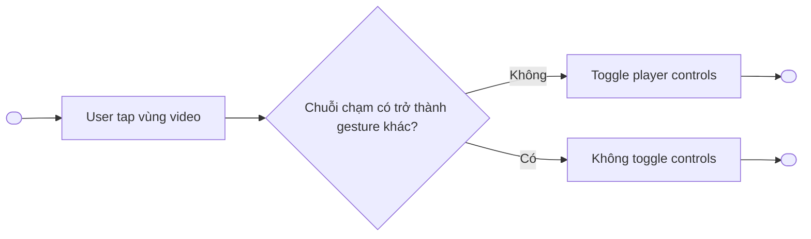
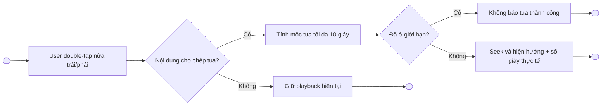
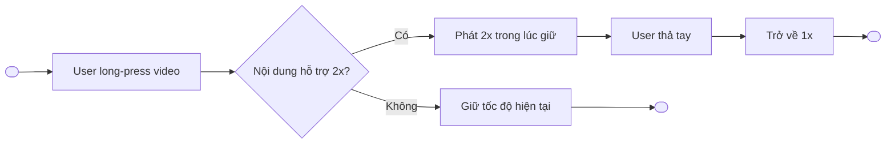
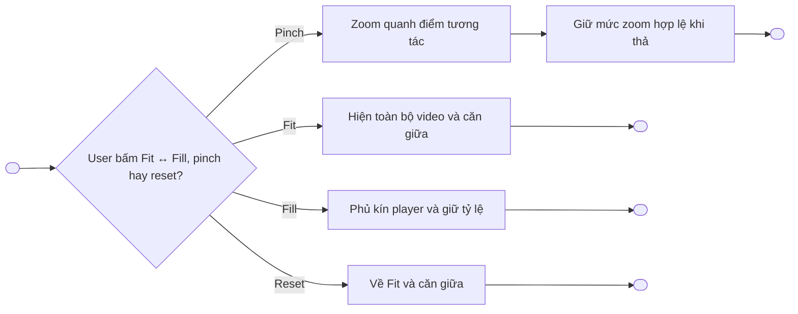
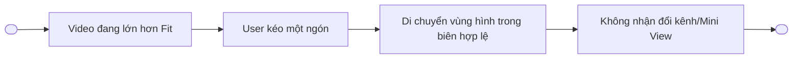
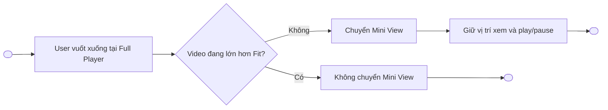
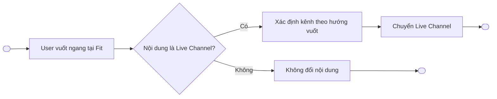
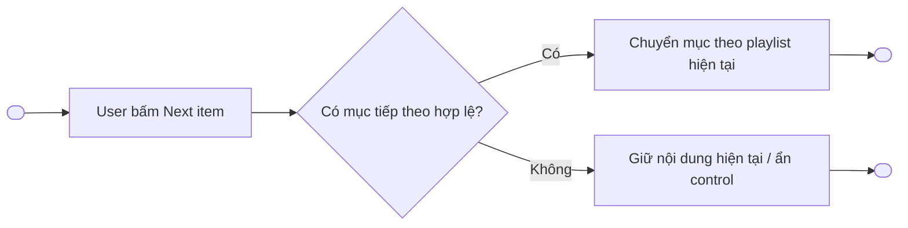

# Gesture Video Player — Functional Requirements

> Project: FPTPlay
> Epic: Video Player
> Feature: Gesture Video Player
> Audience: Product, BA, Designer, FE, QA
> Status: Review draft — có các mục cần Product xác nhận
> Source: `Gesture_Video_Player.pdf`, bản đặc tả v0.2 và các quyết định trao đổi sau v0.2
> Writing style: Caveman Vietnam — ít chữ, dễ đọc, đúng ý, không low-level
> Last updated: 2026-10-05

---

## 1. Description

Gesture Video Player bổ sung thao tác chạm, vuốt, giữ và pinch trên **Full Player** để user điều khiển video nhanh hơn.

- Áp dụng chung cho: **VOD, Live Channel, Event, Timeshift (TS), Playlist**.
- Tua và tăng tốc chỉ hoạt động với loại nội dung được hỗ trợ; **Live Channel không hỗ trợ tua hoặc tăng tốc**.
- Không ghi đè gesture hệ thống.
- Không làm custom volume hoặc brightness; dùng điều khiển hệ thống.
- Player trong Detail ngoài scope. Các thao tác bên trong Mini View thuộc phạm vi sản phẩm nhưng được đặc tả ở tài liệu riêng; tài liệu này chừa vị trí để Product bổ sung manual.

---

## 2. Document History

| Version | Date | Updated By | Notes | Approved By |
|---|---|---|---|---|
| v0.2 | 2026-10-02 | Product / Dylan | Bản gần nhất trước các trao đổi về double-tap, khóa 2x và Fit / Fill / Zoom. | Pending |
| v0.3 | 2026-10-05 | Dylan | Bỏ cộng dồn double-tap; bổ sung long-press 2x, khóa tốc độ, Fit / Fill / Zoom; phân biệt rõ requirement đã chốt và đề xuất cần xác nhận. | Pending |
| v0.4 | 2026-10-05 | Dylan | Chốt release đồng thời iOS/Android; Live Channel không tua/tăng tốc; 2x chỉ hoạt động trong lúc long-press và thả về 1x; chốt zoom tối đa 8x. | Pending |
| v0.5 | 2026-10-05 | Dylan | Chốt Fit/Fill toggle, Custom Zoom, feedback zoom, điểm neo/phụ đề/reset, thứ tự ưu tiên gesture và nguyên tắc nhận diện swipe. | Pending |

---

## 3. Overview

### 3.1 Goal

- User điều khiển Full Player nhanh bằng gesture quen thuộc.
- Giảm phụ thuộc vào control overlay cho các thao tác thường dùng.
- Giữ hành vi nhất quán giữa các loại nội dung, nhưng vẫn tuân theo quyền và khả năng phát của từng nội dung.
- Tránh xung đột giữa gesture video, gesture chuyển Mini View, đổi kênh và gesture hệ thống.

### 3.2 Platform scope

| Platform | Scope | Notes |
|---|---|---|
| iOS | In scope | Áp dụng trên Full Player cảm ứng; không ghi đè gesture hệ thống. |
| Android | In scope | Áp dụng trên Full Player cảm ứng; không ghi đè gesture hệ thống. |
| Web | Out of scope | Không thuộc bộ mobile touch gesture trong tài liệu này. |
| SmartTV / Box | Out of scope | Tiếp tục dùng remote/D-pad và control hiện tại. |

> **Đã chốt:** triển khai đồng thời trên iOS và Android.

### 3.3 Content scope

| Loại nội dung | Scope | Rule chính |
|---|---|---|
| VOD | In scope | Cho tua và long-press 2x nếu nội dung/player cho phép. |
| Live Channel | In scope | Cho vuốt ngang đổi kênh; **không hỗ trợ tua hoặc long-press 2x**. |
| Event | In scope | Không áp dụng vuốt ngang đổi kênh; tua/2x phụ thuộc khả năng và quyền của nội dung. |
| Timeshift (TS) | In scope | Tua/2x chỉ trong vùng TS hợp lệ; đến live edge dừng 2x và phát 1x. |
| Playlist | In scope | Có control chuyển mục/tập tiếp theo; tua/2x phụ thuộc nội dung hiện tại. |

### 3.4 User scope

| User type | Scope | Notes |
|---|---|---|
| User đang xem Full Player | In scope | Actor chính. |
| User đang xem player trong Detail | Out of scope | Không áp dụng bộ gesture này. |
| User đang ở Mini View | In scope — tài liệu riêng | Các thao tác trong Mini View được đặc tả ở tài liệu khác; Product bổ sung manual tại mục 3.5. |

### 3.5 In scope

- Tap video để hiện/ẩn control.
- Double-tap trái/phải để tua độc lập 10 giây.
- Kéo progress bar để seek.
- Long-press để phát 2x tạm thời.
- Pinch để zoom tự do.
- Kéo một ngón để di chuyển vùng hình khi video lớn hơn Fit.
- Vuốt xuống từ Full Player sang Mini View.
- **Phạm vi Mini View bổ sung manual:** [Product bổ sung tại đây].
- Vuốt ngang đổi kênh chỉ trên Live Channel.
- Control chuyển tập/mục tiếp theo.
- Fit / Fill / Zoom, một control chuyển đổi Fit ↔ Fill và action **“Về vừa khung”**.

### 3.6 Out of scope

- Gesture trên player trong Detail.
- Custom volume gesture.
- Custom brightness gesture.
- Ghi đè gesture hệ thống.
- Vuốt ngang đổi Event.
- Tạo gesture riêng cho chuyển tập/mục tiếp theo.

---

## 4. Entry Points

| # | Entry Point | User action / System trigger | Surface | Expected result |
|---:|---|---|---|---|
| 1 | Full Player | User mở nội dung ở Full Player | Video area | Bộ gesture được bật theo loại nội dung và trạng thái player. |
| 2 | Video area | User tap, double-tap, long-press, pinch hoặc swipe | Full Player | Hệ thống thực hiện gesture hợp lệ có độ ưu tiên cao nhất. |
| 3 | Progress bar | User kéo thumb/progress bar | Full Player controls | Hệ thống seek tới mốc hợp lệ và hiện preview nếu có. |
| 4 | Next item control | User bấm tập/mục tiếp theo | Full Player controls | Hệ thống chuyển mục theo logic playlist hiện tại. |

---

## 5. Use Case Summary

| Use Case ID | Use Case | Primary Actor | Trigger | Outcome |
|---|---|---|---|---|
| GVP-UC-001 | Hiện hoặc ẩn player controls | User | Tap video | Control đổi trạng thái visible/hidden. |
| GVP-UC-002 | Tua bằng double-tap | User | Double-tap nửa trái/phải video | Nội dung lùi/tiến tối đa 10 giây trong vùng được phép. |
| GVP-UC-003 | Seek bằng progress bar | User | Kéo progress bar | Player phát từ mốc hợp lệ đã chọn. |
| GVP-UC-004 | Phát 2x tạm thời | User | Long-press video | Player phát 2x trong lúc giữ; thả tay trở về tốc độ bình thường 1x. |
| GVP-UC-005 | Thay đổi chế độ hiển thị video | User | Bấm control Fit ↔ Fill, pinch hoặc reset | Video hiển thị đúng tỷ lệ, giữ mức zoom hợp lệ. |
| GVP-UC-006 | Di chuyển vùng hình đang zoom | User | Kéo một ngón khi lớn hơn Fit | Vùng hình di chuyển trong biên hợp lệ. |
| GVP-UC-007 | Chuyển Full Player sang Mini View | User | Vuốt xuống tại trạng thái cho phép | Player chuyển Mini View, giữ vị trí xem và play/pause. |
| GVP-UC-008 | Đổi Live Channel | User | Vuốt ngang tại trạng thái cho phép | Player chuyển kênh theo hướng vuốt. |
| GVP-UC-009 | Chuyển tập/mục tiếp theo | User | Bấm control next item | Playlist chuyển sang mục tiếp theo theo logic hiện tại. |

---

## 6. Business Rules

### 6.1 Global gesture rules — Đã chốt

1. Gesture chỉ áp dụng trên **Full Player**.
2. Tua và tăng tốc chỉ chạy với loại nội dung được hỗ trợ; **Live Channel không hỗ trợ tua hoặc tăng tốc**.
3. Không ghi đè gesture điều hướng hoặc gesture hệ thống.
4. Vùng control, progress bar và vùng gesture hệ thống không được coi là vùng gesture video tương ứng.
5. Không custom volume và brightness; user dùng điều khiển hệ thống.
6. Khi một gesture đã được nhận, hệ thống không đồng thời thực hiện gesture có ý nghĩa khác trong cùng chuỗi chạm.
7. Tap video chỉ hiện/ẩn control khi chuỗi chạm không được nhận là double-tap, long-press, pinch hoặc swipe hợp lệ.
8. Nút tập/mục tiếp theo là control, không phải gesture mới.

### 6.2 Tap video — Đã chốt

1. Tap vào vùng video để hiện hoặc ẩn control.
2. Tap trên control, progress bar hoặc vùng hệ thống không làm toggle control video.
3. Khi hệ thống nhận double-tap, không đồng thời xử lý tap để hiện/ẩn control.

### 6.3 Double-tap tua 10 giây — Đã chốt

1. Chỉ áp dụng trên Full Player, với nội dung cho phép tua; **không áp dụng cho Live Channel**.
2. Nửa trái video dùng để tua lùi; nửa phải dùng để tua tiến.
3. Double-tap trái: lùi tối đa 10 giây.
4. Double-tap phải: tiến tối đa 10 giây.
5. Mỗi double-tap là một thao tác độc lập.
6. Muốn tua tiếp, user phải thực hiện double-tap mới.
7. Không có tap đơn nối chuỗi, không cộng dồn và không dùng ngưỡng 0,5 giây để nối chuỗi.
8. Hệ thống hiển thị hướng và số giây thực tế đã tua cho từng lần.
9. Nếu đích tua vượt vùng được phép, hệ thống dừng tại mốc đầu/cuối hợp lệ.
10. Nếu player đã ở giới hạn, hệ thống không tua thêm và không hiển thị như đã tua thành công.
11. Tua giữ nguyên trạng thái play/pause trước thao tác.
12. Double-tap tua chỉ được nhận khi user chạm trực tiếp vào vùng hình video. Nếu user chạm vào nút điều khiển, progress bar hoặc vùng điều hướng hệ thống, hệ thống xử lý theo chức năng của vùng đó và không thực hiện tua.

### 6.4 Seek bằng progress bar — Đã chốt

1. User có thể kéo progress bar để seek khi nội dung cho phép; **Live Channel không hỗ trợ seek**.
2. Trong lúc kéo, hệ thống hiển thị thời gian đích.
3. Hiển thị thumbnail nếu nguồn/player hiện tại có thumbnail.
4. Mốc đích phải được giới hạn trong vùng seek hợp lệ.
5. Seek không tự thay đổi trạng thái play/pause nếu không có rule riêng của player.

### 6.5 Long-press phát 2x tạm thời — Đã chốt

1. Long-press trực tiếp trên vùng hình video để phát 2x tạm thời.
2. Chỉ áp dụng với nội dung hỗ trợ tăng tốc; **không áp dụng cho Live Channel**.
3. Trong lúc user còn giữ tay, player tiếp tục phát 2x.
4. Khi user thả tay, player trở về tốc độ phát bình thường **1x**.
5. 2x chỉ duy trì trong lúc user giữ tay.
6. Sau khi user thả tay, hệ thống không tiếp tục duy trì 2x.
7. Khi player đang pause, long-press không kích hoạt 2x.
8. Nếu hệ thống ngắt chuỗi chạm, player dừng 2x và trở về 1x.
9. Nếu buffering xảy ra trong lúc user đang giữ, khi playback tiếp tục thì tốc độ tuân theo trạng thái giữ tay hiện tại; khi user đã thả tay thì phát 1x.
10. Feedback trong lúc giữ dùng nhãn **“Tốc độ 2x”** và tránh che phụ đề.

### 6.6 Fit / Fill / Zoom

#### 6.6.1 Đã chốt

1. Tên nhóm chức năng: **Chế độ hiển thị video: Fit / Fill / Zoom**.
2. Video luôn giữ tỷ lệ gốc; không kéo méo hình.
3. **Fit:** hiển thị toàn bộ video trong khung player; có thể có viền trống; là mức nhỏ nhất.
4. **Fill:** phóng video vừa phủ kín khung player; phần hình vượt khung bị cắt.
5. **Zoom:** user pinch để phóng/thu liên tục; thả tay giữ mức vừa chọn.
6. Mức zoom tối đa là **8x so với Fit**, tính theo chiều rộng và chiều cao; không tính theo diện tích.
7. Khi video lớn hơn Fit, user kéo một ngón để di chuyển vùng hình.
8. Không cho kéo video vượt biên hợp lệ.
9. Có action **“Về vừa khung”** để đưa video về Fit và căn giữa.
10. Khi video lớn hơn Fit, một ngón ưu tiên di chuyển hình; không nhận vuốt ngang đổi kênh hoặc vuốt xuống Mini View.
11. Khi trở về Fit, khôi phục hai gesture trên nếu loại nội dung cho phép.
12. Zoom không làm thay đổi thời điểm xem, tốc độ hoặc trạng thái play/pause.

#### 6.6.2 Giới hạn zoom 8x — Đã chốt

1. User được zoom tự do trong khoảng từ Fit đến tối đa **8x**.
2. 8x được tính theo tỷ lệ tuyến tính so với Fit:
   - Chiều rộng tối đa bằng 8 lần chiều rộng ở Fit.
   - Chiều cao tối đa bằng 8 lần chiều cao ở Fit.
3. Khi pinch vượt 8x, hệ thống giữ video tại 8x; không scale thêm.
4. Fill là preset nằm trong khoảng Fit–8x. Với tỷ lệ video bất thường cần scale lớn hơn 8x mới phủ kín khung, hệ thống dừng ở 8x.
5. Mức 8x là quyết định sản phẩm để align trải nghiệm tham chiếu YouTube; không gọi đây là chuẩn Apple hoặc Android.

#### 6.6.3 Interaction Fit / Fill / Custom Zoom — Đã chốt

1. Player sử dụng **một control chuyển đổi Fit ↔ Fill**, không hiển thị hai control riêng.
2. Trạng thái mặc định khi mở nội dung là **Vừa khung — Fit**.
3. Khi đang Fit, bấm control chuyển sang **Lấp đầy — Fill**.
4. Khi đang Fill, bấm control trở lại Fit.
5. UI có thể dùng icon; accessibility label hoặc tooltip phải mô tả hành động đích là **“Lấp đầy màn hình”** hoặc **“Vừa khung”**.
6. Không tạo nút Zoom riêng.
7. Khi user pinch từ Fit hoặc Fill, player chuyển sang trạng thái **Zoom tùy chỉnh**.
8. Khi đang ở Zoom tùy chỉnh, hiển thị action **“Về vừa khung”**.
9. Chọn “Về vừa khung” đưa video về Fit, căn giữa hình và khôi phục các gesture bị chặn khi video lớn hơn Fit.
10. Trong lúc pinch, hiển thị tạm thời mức zoom theo định dạng **“Zoom {n}x”**; feedback biến mất sau khi kết thúc thao tác.
11. Feedback zoom phải phân biệt với feedback tốc độ:
    - Zoom: **“Zoom 1.6x”**.
    - Long-press tăng tốc: **“Tốc độ 2x”**.

#### 6.6.4 Điểm neo, phụ đề và reset — Đã chốt

1. Pinch zoom quanh điểm giữa hai ngón tay.
2. Trong lúc zoom, hệ thống giữ vùng hình tại điểm tương tác ở vị trí tương đối ổn định.
3. Nếu vị trí sau zoom vượt biên hợp lệ, hệ thống điều chỉnh video về biên gần nhất.
4. Chỉ lớp hình video được zoom và pan.
5. Player controls, progress bar và feedback gesture giữ nguyên kích thước và vị trí.
6. Phụ đề rời do player render:
   - Giữ nguyên kích thước.
   - Nằm trong safe area của player.
   - Không zoom hoặc di chuyển theo vùng hình.
7. Phụ đề burn-in zoom, pan và bị cắt cùng hình video.
8. Reset video về Fit và căn giữa khi:
   - Đổi video, tập hoặc Live Channel.
   - Chuyển sang Mini View.
   - Mở lại Full Player từ Mini View.
   - Xoay màn hình.
9. Giữ mức zoom hiện tại trong cùng nội dung và cùng phiên Full Player khi:
   - Tap hiện/ẩn control.
   - Play hoặc pause.
   - Seek.
   - Buffering.
   - Đổi chất lượng.
   - Đổi audio track hoặc phụ đề.
   - Long-press phát 2x tạm thời.
10. Khi reset về Fit, khôi phục gesture đổi Live Channel và chuyển Mini View nếu loại nội dung cho phép.

### 6.7 Vuốt xuống chuyển Mini View — Đã chốt

1. Vuốt xuống từ Full Player để chuyển sang Mini View trong ứng dụng.
2. Giữ vị trí xem hiện tại.
3. Giữ trạng thái play/pause hiện tại.
4. Mục này chỉ đặc tả gesture chuyển từ Full Player sang Mini View. Các thao tác trong Mini View thuộc scope của tài liệu riêng và được chừa vị trí manual tại mục 3.5.
5. Khi video lớn hơn Fit, kéo một ngón ưu tiên pan; không chuyển Mini View.
6. Gesture phải tránh xung đột và không ghi đè gesture hệ thống.

### 6.8 Vuốt ngang đổi Live Channel — Đã chốt

1. Chỉ áp dụng cho **Live Channel**.
2. Không áp dụng cho Event.
3. Khi video lớn hơn Fit, kéo một ngón ưu tiên pan; không đổi kênh.
4. Khi trở về Fit, vuốt ngang đổi kênh hoạt động lại.
5. Việc xác định kênh trước/sau đi theo danh sách kênh hiện tại của player.

### 6.9 Thứ tự ưu tiên gesture — Đã chốt

1. Vùng gesture hệ thống, control và progress bar xử lý theo chức năng sở hữu; gesture video không được nhận tại các vùng này.
2. Pinch hai ngón → Zoom.
3. Một ngón khi video lớn hơn Fit → Pan vùng hình.
4. Long-press đã được nhận → Phát 2x tạm thời trong lúc giữ.
5. Double-tap trái/phải → Tua nếu nội dung không phải Live Channel và cho phép tua.
6. Swipe ngang/dọc tại Fit → Đổi Live Channel hoặc chuyển Mini View.
7. Tap → Hiện/ẩn control khi chuỗi chạm không được nhận là gesture khác.
8. Khi một gesture được nhận, khóa gesture đó đến hết chuỗi chạm; không đồng thời xử lý gesture khác.

### 6.10 Nhận diện swipe ngang/dọc — Đã chốt

1. Chỉ xét swipe khi thao tác bắt đầu trực tiếp trên vùng hình video, ngoài control, progress bar và vùng gesture hệ thống.
2. Chỉ xét swipe đổi kênh hoặc chuyển Mini View khi video đang ở Fit. Khi video lớn hơn Fit, một ngón được xử lý là pan.
3. Trong lúc hướng thao tác chưa rõ, hệ thống tiếp tục theo dõi và chưa kích hoạt tap, đổi kênh hoặc chuyển Mini View.
4. Khi độ dịch chuyển ngang là hướng chủ đạo, hệ thống nhận swipe ngang:
   - Chỉ đổi kênh nếu nội dung là Live Channel.
   - Không đổi nội dung đối với Event, VOD, TS hoặc Playlist.
5. Khi độ dịch chuyển dọc xuống là hướng chủ đạo, hệ thống nhận swipe xuống để chuyển Mini View.
6. Vuốt dọc lên không kích hoạt chuyển Mini View và không được suy diễn thành gesture khác.
7. Với thao tác chéo chưa thể hiện rõ hướng chủ đạo, hệ thống tiếp tục theo dõi; nếu kết thúc mà không đủ điều kiện nhận swipe thì không đổi kênh hoặc chuyển Mini View.
8. Sau khi một hướng swipe được nhận, khóa trục đó đến hết chuỗi chạm để tránh đổi hành vi giữa chừng.
9. Ngưỡng bắt đầu di chuyển và vận tốc dùng gesture recognizer/touch slop phù hợp của từng nền tảng; không hard-code một giá trị pixel hoặc thời gian chung cho iOS và Android.
10. Dev có thể tinh chỉnh ngưỡng theo nền tảng nhưng không được làm thay đổi các rule về vùng bắt đầu, hướng chủ đạo, trạng thái Fit và thứ tự ưu tiên tại mục 6.9.

---

## 7. Functional Requirements

### GVP-US-001 — User điều khiển playback bằng tap và double-tap

- User muốn hiện/ẩn control mà không rời màn hình xem.
- User muốn tua nhanh 10 giây bằng double-tap.
- Mỗi double-tap phải độc lập và phản ánh đúng số giây thực tế.

#### GVP-UC-001 — Tap để hiện/ẩn control

**Activity Flows:**



| Field | Details |
|---|---|
| Actor | User, hệ thống |
| Triggers | User tap vùng video trên Full Player. |
| Pre-condition | Tap không nằm trên control, progress bar hoặc vùng gesture hệ thống. |
| Basic Path | 1. User tap video.<br>2. Hệ thống xác định đây là tap đơn.<br>3. Hệ thống hiện hoặc ẩn control. |
| Post-condition | Playback không đổi vị trí, tốc độ hoặc play/pause. |
| Alternative Path | Nếu chuỗi chạm trở thành double-tap, long-press, pinch hoặc swipe, hệ thống xử lý gesture tương ứng. |
| Exception Handling | Nếu thao tác nằm trong vùng hệ thống/control, hệ thống không toggle control video. |

#### GVP-UC-002 — Double-tap để tua 10 giây

**Activity Flows:**



| Field | Details |
|---|---|
| Actor | User, hệ thống |
| Triggers | User double-tap nửa trái hoặc nửa phải video. |
| Pre-condition | Full Player; nội dung cho phép tua; không phải Live Channel; user double-tap trực tiếp vào vùng hình video. |
| Basic Path | 1. Hệ thống nhận một double-tap độc lập.<br>2. Xác định hướng tua.<br>3. Tính mốc hợp lệ tối đa 10 giây.<br>4. Seek và hiện feedback của lần đó. |
| Post-condition | Player giữ play/pause trước thao tác; vị trí xem thay đổi trong vùng hợp lệ. |
| Alternative Path | Nếu còn ít hơn 10 giây tới biên, chỉ tua số giây thực tế còn lại. |
| Exception Handling | Nếu đã ở biên hoặc không được tua, không hiển thị như đã tua thành công. |

### GVP-US-002 — User seek bằng progress bar

#### GVP-UC-003 — Kéo progress bar tới mốc xem mới

**Activity Flows:**


| Field | Details |
|---|---|
| Actor | User, hệ thống |
| Triggers | User kéo progress bar. |
| Pre-condition | Nội dung/player cho phép seek; không phải Live Channel. |
| Basic Path | 1. User kéo thumb.<br>2. Hệ thống hiện thời gian đích và thumbnail nếu có.<br>3. Hệ thống giới hạn mốc hợp lệ.<br>4. User thả tay.<br>5. Player seek. |
| Post-condition | Player ở mốc mới; play/pause giữ theo trạng thái trước thao tác. |
| Alternative Path | Nếu không có thumbnail, chỉ hiện thời gian đích. |
| Exception Handling | Nếu mốc nằm ngoài vùng cho phép, hệ thống chặn tại biên hợp lệ. |

### GVP-US-003 — User phát nhanh 2x

#### GVP-UC-004 — Long-press để phát 2x tạm thời

**Activity Flows:**



| Field | Details |
|---|---|
| Actor | User, hệ thống |
| Triggers | User long-press vùng video. |
| Pre-condition | Full Player; player đang phát; nội dung hỗ trợ 2x; không phải Live Channel. |
| Basic Path | 1. User long-press vùng video.<br>2. Hệ thống phát 2x trong lúc user giữ tay.<br>3. User thả tay.<br>4. Hệ thống trở về 1x. |
| Post-condition | Playback tiếp tục ở tốc độ bình thường 1x. |
| Alternative Path | Nếu nội dung không hỗ trợ 2x hoặc là Live Channel, hệ thống giữ tốc độ hiện tại. |
| Exception Handling | Nếu chuỗi chạm bị hệ thống ngắt, hủy 2x và trở về 1x. |

### GVP-US-004 — User thay đổi vùng hiển thị video

#### GVP-UC-005 — Chọn Fit/Fill hoặc pinch để zoom

**Activity Flows:**



| Field | Details |
|---|---|
| Actor | User, hệ thống |
| Triggers | User bấm control Fit ↔ Fill, thực hiện pinch hoặc chọn “Về vừa khung”. |
| Pre-condition | Full Player; không nằm trong chuỗi gesture hệ thống. |
| Basic Path | 1. User bấm control để chuyển Fit ↔ Fill hoặc pinch để vào Custom Zoom.<br>2. Hệ thống scale video quanh điểm tương tác và giữ tỷ lệ gốc.<br>3. Hệ thống giới hạn mức zoom trong khoảng Fit–8x.<br>4. Trong lúc pinch, hiện tạm `Zoom {n}x`.<br>5. Thả tay, hệ thống giữ mức hợp lệ. |
| Post-condition | Vị trí xem, tốc độ và play/pause không đổi. |
| Alternative Path | User bấm “Về vừa khung” để trở về Fit và căn giữa. |
| Exception Handling | Nếu pinch vượt 8x, hệ thống giữ video tại mức tối đa 8x. |

#### GVP-UC-006 — Pan vùng hình khi đang zoom

**Activity Flows:**



| Field | Details |
|---|---|
| Actor | User, hệ thống |
| Triggers | User kéo một ngón khi video lớn hơn Fit. |
| Pre-condition | Mức hiển thị lớn hơn Fit. |
| Basic Path | 1. User kéo video.<br>2. Hệ thống di chuyển vùng hình.<br>3. Hệ thống chặn tại biên hợp lệ. |
| Post-condition | Video giữ mức zoom; vùng nhìn thay đổi. |
| Alternative Path | Khi về Fit, video căn giữa và swipe đổi kênh/Mini View hoạt động lại. |
| Exception Handling | Không để lộ vùng trống phía sau video. |

### GVP-US-005 — User chuyển surface hoặc nội dung

#### GVP-UC-007 — Vuốt xuống chuyển Full Player sang Mini View

**Activity Flows:**



| Field | Details |
|---|---|
| Actor | User, hệ thống |
| Triggers | User vuốt xuống trên Full Player. |
| Pre-condition | Không bị gesture hệ thống chiếm; video đang ở Fit và không đang pan. |
| Basic Path | 1. User vuốt xuống.<br>2. Hệ thống chuyển Mini View.<br>3. Giữ vị trí xem và play/pause. |
| Post-condition | Player ở Mini View. |
| Alternative Path | Không có trong scope. |
| Exception Handling | Khi đang zoom lớn hơn Fit, xử lý thao tác thành pan và không chuyển Mini View. |

#### GVP-UC-008 — Vuốt ngang đổi Live Channel

**Activity Flows:**



| Field | Details |
|---|---|
| Actor | User, hệ thống |
| Triggers | User vuốt ngang trên Full Player. |
| Pre-condition | Nội dung là Live Channel; video đang ở Fit; không xung đột gesture hệ thống. |
| Basic Path | 1. User vuốt ngang.<br>2. Hệ thống xác định hướng.<br>3. Chuyển kênh trước/sau theo danh sách hiện tại. |
| Post-condition | Player phát Live Channel mới. |
| Alternative Path | Event và loại nội dung khác không đổi nội dung bằng gesture này. |
| Exception Handling | Khi video lớn hơn Fit, thao tác được dùng để pan và không đổi kênh. |

#### GVP-UC-009 — Bấm control chuyển tập/mục tiếp theo

**Activity Flows:**



| Field | Details |
|---|---|
| Actor | User, hệ thống |
| Triggers | User bấm nút tập/mục tiếp theo. |
| Pre-condition | Playlist/nội dung có mục tiếp theo hợp lệ. |
| Basic Path | 1. User bấm control.<br>2. Hệ thống chuyển mục theo logic hiện tại. |
| Post-condition | Player phát mục mới. |
| Alternative Path | Nếu không có mục tiếp theo, không tạo gesture thay thế. |
| Exception Handling | Hành vi unavailable/disabled đi theo control hiện tại. |

---

## 8. Screen Element Specification

### 8.1 Figma / Design Reference

| Item | Link / Note |
|---|---|
| Final Figma | TBD — Designer cập nhật sau khi chốt interaction. |
| Source document | `Gesture_Video_Player.pdf` — Library ID `libfile_aa2d4615b4188191b2ddcdfeb830ccf7`. |
| Previous spec | `Gesture-Video-Player-Spec.md` v0.2 — Library ID `libfile_5acb673767ac81918a65bcea69db54c1`. |
| Wireframe | Chưa dựng trong repo; Designer dựng từ SURF-001 và các interaction đã chốt. |

### 8.2 Information Architecture

```text
Full Player
├── Video viewport
│   ├── Tap / Double-tap zones
│   ├── Long-press 2x feedback
│   ├── Pinch Zoom / Pan
│   └── Swipe Full → Mini / Live Channel switch
├── Player controls overlay
│   ├── Progress bar
│   ├── Next item control
│   └── Fit ↔ Fill control / Về vừa khung
└── System-owned areas
    ├── System navigation gestures
    ├── System volume
    └── System brightness
```

### 8.4 Surface Details by Surface

#### SURF-001 — Full Player Gesture Layer

**Surface details:**

| Field | Details |
|---|---|
| Surface / Location | Full Player — video viewport và controls overlay. |
| Platform | iOS, Android. |
| When shown | Khi user mở VOD, Live Channel, Event, TS hoặc Playlist ở Full Player. |
| Related UC / Flow | GVP-UC-001 đến GVP-UC-009. |
| Placement notes | Gesture video không chiếm control, progress bar hoặc vùng gesture hệ thống. |

**Sketching wireframe / Text-Based Wireframing:**

```text
Full Player
┌──────────────────────────────────────────────────┐
│         [Long-press / Zoom feedback]             │
│                                                  │
│   Double-tap ←        VIDEO        → Double-tap  │
│                                                  │
│        Pinch Zoom / one-finger Pan               │
│                                                  │
│                  [↙ Vuốt xuống]                  │
│                                                  │
│ [Fit ↔ Fill / Về vừa khung] [Next item]          │
│ ───────────── Progress bar ─────────────         │
└──────────────────────────────────────────────────┘

System gesture areas nằm ngoài vùng gesture video ưu tiên.
```

**Surface elements:**

| # | Element | States | Format / Copy | Rules / Notes |
|---:|---|---|---|---|
| 1 | Tap gesture layer | enabled, blocked | Không có copy | Toggle control khi không bị gesture khác nhận. |
| 2 | Double-tap feedback | backward, forward, boundary, unavailable | Hướng + số giây thực tế | Mỗi lần độc lập; không cộng dồn; không áp dụng Live Channel. |
| 3 | Progress preview | dragging, unavailable | Thời gian đích; thumbnail nếu có | Không áp dụng seek trên Live Channel; không bịa thumbnail khi nguồn không hỗ trợ. |
| 4 | Long-press 2x label | visible while pressing, hidden | `Tốc độ 2x` | Chỉ hiện trong lúc giữ; không che phụ đề. |
| 5 | Display mode control | Fit, Fill, Custom Zoom | `Vừa khung`, `Lấp đầy` | Một control chuyển đổi Fit ↔ Fill; không có nút Zoom riêng. |
| 6 | Reset display control | visible, hidden | `Về vừa khung` | Hiện ở Custom Zoom; đưa về Fit, căn giữa và khôi phục gesture phù hợp. |
| 7 | Zoom feedback | pinching, hidden | `Zoom {n}x` | Hiện tạm trong lúc pinch; ẩn sau khi kết thúc thao tác. |
| 8 | Next item control | visible, disabled, hidden | Theo control hiện tại | Không tạo gesture mới. |

**Surface behavior notes:**

- **Fit:** video căn giữa; có thể đổi Live Channel và chuyển Mini View.
- **Fill/Custom Zoom:** một ngón pan; chặn swipe đổi kênh và Mini View.
- **Pinching:** ưu tiên scale; không xử lý gesture khác trong cùng chuỗi chạm.
- **Long-press active:** player phát 2x trong lúc user giữ tay; thả tay trở về 1x.

**Surface-specific notes:**

- Không thêm custom volume/brightness layer.
- Không ghi đè vùng điều hướng hệ thống.
- Phụ đề rời giữ nguyên trong safe area; phụ đề burn-in zoom/pan/crop cùng hình như mục 6.6.4.

---

## 9. Error Handling & User-Facing Messages

| Case | User-facing message / Feedback | Behavior |
|---|---|---|
| Double-tap khi đã ở biên seek | Không hiển thị như tua thành công | Giữ vị trí hiện tại. |
| Double-tap vượt biên | Hiện số giây thực tế đã tua | Dừng ở mốc đầu/cuối hợp lệ. |
| Live Channel hoặc nội dung không cho tua | Không hiện feedback thành công | Giữ playback hiện tại; không thực hiện double-tap seek hoặc progress-bar seek. |
| Long-press trên Live Channel hoặc nội dung không hỗ trợ 2x | Không hiển thị `Tốc độ 2x` | Giữ tốc độ hiện tại. |
| Long-press bị hệ thống ngắt | Không cần báo lỗi | Hủy 2x và trở về 1x. |
| Zoom đạt mức tối đa | Feedback trực quan tại biên; copy không bắt buộc | Giữ mức 8x, không scale thêm. |
| Pan tới biên | Không cần báo lỗi | Chặn tại biên; không để lộ vùng trống. |
| Swipe ngang trên Event | Không báo đổi kênh | Không đổi nội dung. |
| Swipe khi video lớn hơn Fit | Không báo đổi kênh/Mini View | Xử lý thành pan nếu hợp lệ. |
| Next item không khả dụng | Theo control hiện tại | Ẩn hoặc disable control; không tạo gesture thay thế. |

---

## 10. References

| Item | Link / Note |
|---|---|
| Apple — Create a great video playback experience | <https://developer.apple.com/videos/play/wwdc2022/10147/> — tham khảo Fit/Fill và pinch phủ kín màn hình; không dùng làm nguồn cho giới hạn 8x. |
| Apple — Gestures | <https://developer.apple.com/design/human-interface-guidelines/gestures> — custom gesture cần dễ khám phá và có cách thao tác thay thế. |
| Android — Drag and scale | <https://developer.android.com/develop/ui/views/touch-and-input/gestures/scale> — hướng dẫn triển khai pinch/scale; thông số code mẫu không phải chuẩn UX video. |
| Android — Media3 1.11 | <https://developer.android.com/blog/posts/media3-1-11-whats-new> — tham khảo long-press phát nhanh; sản phẩm chỉ giữ hành vi 2x tạm thời. |
| Android — Audio output | <https://developer.android.com/media/platform/output> — media volume dùng điều khiển hệ thống. |

### 10.1 Source interpretation rules

- Mức zoom tối đa `8x` là quyết định sản phẩm để align trải nghiệm tham chiếu YouTube; không gọi là chuẩn Apple hoặc Android.
- Không dùng code sample của nền tảng làm quyết định UX mặc định.
- Các nguồn Apple/Android được dùng để tham khảo gesture và playback behavior, không phải để chứng minh giới hạn 8x.

---

## 11. Open Decisions & Handoff Checklist

### 11.1 Nội dung còn cần bổ sung

- [ ] Product bổ sung manual phạm vi kéo, neo góc, resize, đóng và mở lại Full Player từ Mini View tại mục 3.5.

Các quyết định về Fit/Fill, feedback zoom, reset Fit, điểm neo/phụ đề, thứ tự ưu tiên gesture và nhận diện swipe đã được chốt tại mục 6.6, 6.9 và 6.10.

### 11.2 Handoff checklist

- [x] Chỉ Full Player nằm trong scope.
- [x] Content scope gồm VOD, Live Channel, Event, TS và Playlist.
- [x] Double-tap không còn logic cộng dồn.
- [x] Long-press chỉ phát 2x tạm thời; thả tay trở về 1x; không duy trì 2x sau khi thả.
- [x] Vuốt ngang chỉ đổi Live Channel, không đổi Event.
- [x] Full → Mini giữ vị trí xem và play/pause.
- [x] Pan khi zoom chặn đổi kênh và chuyển Mini View.
- [x] Bỏ custom volume/brightness.
- [x] Không ghi đè gesture hệ thống.
- [x] Live Channel không hỗ trợ tua hoặc tăng tốc.
- [x] Zoom tối đa 8x so với Fit; đây là quyết định sản phẩm, không phải chuẩn Apple/Android.
- [x] Một control chuyển đổi Fit ↔ Fill; pinch chuyển Custom Zoom; không có nút Zoom riêng.
- [x] Hiển thị tạm `Zoom {n}x` trong lúc pinch; action reset là “Về vừa khung”.
- [x] Reset Fit khi đổi nội dung/kênh, chuyển Mini View, mở lại Full Player và xoay màn hình.
- [x] Đã chốt điểm neo zoom, behavior phụ đề rời/burn-in, gesture priority và nguyên tắc nhận diện swipe.
- [x] iOS và Android triển khai đồng thời.
- [ ] Designer dựng wireframe/prototype cho Full Player.
- [x] Product đã chốt Fit/Fill/Zoom, reset, phụ đề, gesture priority và swipe recognition.
- [ ] Product bổ sung phần Mini View manual tại mục 3.5.
- [ ] Dev xác nhận khả năng theo content/player/platform.
- [ ] QA lập test matrix theo content type, player state và gesture priority.
- [ ] Approved By được cập nhật trước implementation handoff cuối.
